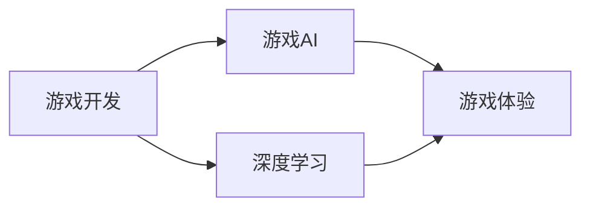

## 1.背景介绍

游戏开发一直是计算机科学的一大应用领域，近年来，人工智能（AI）的快速发展为游戏开发带来了革命性的影响。AI技术的引入，使得游戏角色能够具备更高级的认知能力，为玩家提供更具挑战性和沉浸感的游戏体验。

## 2.核心概念与联系

在人工智能在游戏开发中的应用，我们主要关注两个核心概念：游戏AI和深度学习。游戏AI是指在游戏中模拟智能行为的技术，包括路径规划、决策树、状态机等。深度学习则是AI的一个子领域，它通过模拟人脑的工作方式，让计算机从大量数据中学习和推理。



## 3.核心算法原理具体操作步骤

在游戏开发中，我们通常使用一种称为强化学习的深度学习方法。强化学习是一种让AI通过与环境的交互学习最优行为的方法。在游戏中，环境就是游戏世界，AI的行为就是游戏角色的行动，AI的目标就是获取最高的游戏得分。

强化学习的基本步骤如下：

1. 初始化：AI开始在游戏中随机行动，探索游戏环境。
2. 观察：AI观察其行动的结果，包括游戏得分和游戏状态的变化。
3. 学习：AI根据观察到的结果调整其行为策略，以期获得更高的游戏得分。
4. 重复：AI重复上述步骤，不断在游戏中学习和进步。

## 4.数学模型和公式详细讲解举例说明

在强化学习中，我们使用一个称为Q-learning的算法来实现AI的学习过程。Q-learning的基本思想是使用一个函数Q(s,a)来评估在状态s下执行行动a的期望回报。Q函数的更新公式如下：

$$
Q(s,a) \leftarrow Q(s,a) + \alpha [r + \gamma \max_{a'} Q(s',a') - Q(s,a)]
$$

其中，$\alpha$是学习率，决定AI学习新知识的速度；$\gamma$是折扣因子，决定AI对未来回报的重视程度；$r$是AI执行行动a后获得的即时回报；$s'$是执行行动a后的新状态；$a'$是在状态$s'$下可能的行动。

## 5.项目实践：代码实例和详细解释说明

下面是一个使用Python和OpenAI Gym库实现的Q-learning游戏AI的简单示例：

```python
import gym
import numpy as np

# 创建游戏环境
env = gym.make('MountainCar-v0')

# 初始化Q表
Q = np.zeros([env.observation_space.n, env.action_space.n])

# 设置学习参数
alpha = 0.5
gamma = 0.95
episodes = 5000

for episode in range(episodes):
    # 初始化状态
    s = env.reset()
    done = False
    while not done:
        # 选择行动
        a = np.argmax(Q[s])
        # 执行行动
        s_, r, done, info = env.step(a)
        # 更新Q表
        Q[s,a] = Q[s,a] + alpha * (r + gamma * np.max(Q[s_]) - Q[s,a])
        # 更新状态
        s = s_
```

## 6.实际应用场景

人工智能在游戏开发中的应用非常广泛，包括角色行为控制、游戏测试、内容生成等。例如，AI可以控制游戏角色自动寻路、战斗；AI可以自动玩游戏进行测试，发现游戏中的bug和平衡问题；AI还可以生成新的游戏关卡和故事，提供无限的游戏内容。

## 7.工具和资源推荐

如果你对人工智能在游戏开发中的应用感兴趣，我推荐你使用以下工具和资源进行学习和实践：

- Python：一种简单易学的编程语言，有丰富的AI和游戏开发库。
- OpenAI Gym：一个提供各种游戏环境的库，可以用来训练和测试你的游戏AI。
- TensorFlow：一个强大的深度学习框架，可以用来实现复杂的AI算法。

## 8.总结：未来发展趋势与挑战

人工智能在游戏开发中的应用仍然面临许多挑战，例如如何创建具有真实情感和个性的游戏角色，如何生成高质量的游戏内容等。然而，随着AI技术的不断发展，我相信这些挑战都会被逐渐克服。在未来，我们将会看到更多富有创新和惊喜的游戏出现。

## 9.附录：常见问题与解答

Q: 游戏AI和真实AI有什么区别？
A: 游戏AI主要是为了提供有趣和挑战性的游戏体验，而不一定需要真实的智能。真实AI则是为了解决实际问题，需要真实的学习和推理能力。

Q: 如何学习游戏AI开发？
A: 你可以通过学习编程、人工智能和游戏开发的相关知识，然后在实际项目中进行实践。

作者：禅与计算机程序设计艺术 / Zen and the Art of Computer Programming