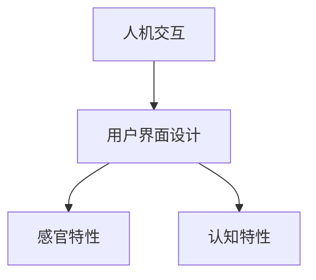

## 1.背景介绍

在我们日常生活中，人机交互和用户界面设计已经无处不在。无论是我们使用的手机，电脑，甚至是汽车，电视等等，人机交互和用户界面设计都在其中起着至关重要的作用。它们决定了我们如何与这些设备交互，以及我们使用这些设备的体验如何。因此，对于任何希望创建出优秀产品的开发者来说，理解和掌握人机交互和用户界面设计的原理是非常重要的。

## 2.核心概念与联系

人机交互（Human-Computer Interaction，HCI）是计算机科学的一个重要分支，它研究的是人和计算机之间的交互方式。用户界面（User Interface，UI）设计则是人机交互的一个重要组成部分，它主要关注的是如何设计出既美观又易用的界面，以便用户能够更好地使用计算机。

人机交互和用户界面设计之间的联系主要体现在以下几个方面：

- 用户界面设计是人机交互的一个重要部分。一个好的用户界面设计可以使得用户更容易地使用计算机，从而提高用户的满意度和工作效率。
- 用户界面设计需要考虑到人的心理和生理特性。例如，设计者需要考虑到人的视觉、听觉、触觉等感官的特性，以便设计出既美观又易用的界面。
- 用户界面设计也需要考虑到人的认知特性。例如，设计者需要考虑到人的记忆、学习、思考等能力的特性，以便设计出能够帮助用户更好地理解和使用计算机的界面。



## 3.核心算法原理具体操作步骤

在进行用户界面设计时，我们通常会遵循以下几个步骤：

1. **需求分析**：首先，我们需要了解用户的需求。这包括用户希望通过计算机完成什么任务，用户的技能和经验如何，以及用户的偏好和期望等等。
2. **设计**：在了解了用户的需求之后，我们就可以开始设计用户界面了。在这个过程中，我们需要考虑到用户的心理和生理特性，以及用户的认知特性，以便设计出既美观又易用的界面。
3. **实现**：在设计完成之后，我们需要利用编程语言和工具来实现我们的设计。在这个过程中，我们需要考虑到计算机的特性，例如计算机的处理能力，存储能力，以及显示能力等等。
4. **测试**：在实现完成之后，我们需要进行测试，以确保我们的设计能够满足用户的需求，同时也能够在各种条件下正常工作。
5. **评估**：在测试完成之后，我们需要对我们的设计进行评估。在这个过程中，我们需要收集用户的反馈，以便了解我们的设计是否能够满足用户的需求，以及我们的设计是否有任何需要改进的地方。


## 4.数学模型和公式详细讲解举例说明

在用户界面设计中，我们经常需要使用到一些数学模型和公式。例如，我们可能需要使用到颜色模型来表示和处理颜色，我们可能需要使用到布局模型来表示和处理界面的布局，我们可能需要使用到交互模型来表示和处理用户的交互，等等。

为了方便理解，我们以颜色模型为例进行详细讲解。在计算机中，我们通常使用RGB颜色模型来表示和处理颜色。在RGB颜色模型中，任何一种颜色都可以通过三种基本颜色（红色，绿色，蓝色）的组合来表示。具体来说，我们可以使用一个三维向量 $(R, G, B)$ 来表示一种颜色，其中 $R$ 表示红色的强度，$G$ 表示绿色的强度，$B$ 表示蓝色的强度。例如，红色可以表示为 $(255, 0, 0)$，绿色可以表示为 $(0, 255, 0)$，蓝色可以表示为 $(0, 0, 255)$，黑色可以表示为 $(0, 0, 0)$，白色可以表示为 $(255, 255, 255)$，等等。

## 5.项目实践：代码实例和详细解释说明

为了更好地理解和掌握用户界面设计，我们以一个简单的项目实践为例进行详细讲解。在这个项目中，我们将使用HTML和CSS来创建一个简单的网页界面。

首先，我们需要创建一个HTML文件，如下所示：

```html
<!DOCTYPE html>
<html>
<head>
    <title>我的网页</title>
    <link rel="stylesheet" type="text/css" href="style.css">
</head>
<body>
    <div class="header">
        <h1>欢迎来到我的网页！</h1>
    </div>
    <div class="content">
        <p>这是一个简单的网页界面。</p>
    </div>
</body>
</html>
```

然后，我们需要创建一个CSS文件，如下所示：

```css
body {
    font-family: Arial, sans-serif;
    margin: 0;
    padding: 0;
    background-color: #F0F0F0;
}

.header {
    background-color: #333;
    color: #FFF;
    padding: 10px 0;
    text-align: center;
}

.content {
    margin: 20px;
}
```

在这个项目中，我们使用HTML来创建网页的结构，使用CSS来创建网页的样式。通过这个项目，我们可以看到，用户界面设计不仅仅是关于美观，更是关于如何使得用户能够更好地使用我们的产品。

## 6.实际应用场景

人机交互和用户界面设计在各种场景中都有着广泛的应用。例如，在软件开发中，我们需要设计出既美观又易用的用户界面；在网页开发中，我们需要设计出既美观又易用的网页界面；在游戏开发中，我们需要设计出既美观又易用的游戏界面，等等。

此外，人机交互和用户界面设计也在各种新的领域中发挥着越来越重要的作用。例如，在虚拟现实（Virtual Reality，VR）和增强现实（Augmented Reality，AR）中，我们需要设计出既美观又易用的虚拟界面；在人工智能（Artificial Intelligence，AI）和机器学习（Machine Learning，ML）中，我们需要设计出既美观又易用的可视化界面，等等。

## 7.工具和资源推荐

在进行用户界面设计时，我们可以使用各种工具和资源来帮助我们。以下是一些我推荐的工具和资源：

- **设计工具**：例如Sketch，Adobe XD，Figma等等。这些工具提供了丰富的设计功能，可以帮助我们更好地设计用户界面。
- **编程语言和框架**：例如HTML，CSS，JavaScript，React，Vue等等。这些编程语言和框架提供了丰富的编程功能，可以帮助我们更好地实现用户界面。
- **设计资源**：例如Dribbble，Behance，Pinterest等等。这些网站提供了丰富的设计资源，可以帮助我们找到设计灵感。
- **设计指南**：例如Google的Material Design，Apple的Human Interface Guidelines等等。这些设计指南提供了丰富的设计原则和规范，可以帮助我们更好地设计用户界面。

## 8.总结：未来发展趋势与挑战

随着科技的发展，人机交互和用户界面设计将面临许多新的发展趋势和挑战。以下是一些我认为的未来发展趋势和挑战：

- **多模态交互**：随着科技的发展，我们将不再仅仅通过触摸屏和键盘与计算机交互，而是将通过语音，手势，眼神，甚至是思维等多种方式与计算机交互。这将对人机交互和用户界面设计提出新的挑战。
- **普适计算**：随着科技的发展，计算机将越来越融入我们的日常生活，我们将在任何地方，任何时间，通过任何设备与计算机交互。这将对人机交互和用户界面设计提出新的挑战。
- **人工智能**：随着科技的发展，人工智能将越来越多地应用于人机交互和用户界面设计中。例如，我们可以使用人工智能来预测用户的需求，自动化设计用户界面，等等。

## 9.附录：常见问题与解答

**问题1：为什么用户界面设计很重要？**

答：用户界面设计是人机交互的一个重要部分。一个好的用户界面设计可以使得用户更容易地使用计算机，从而提高用户的满意度和工作效率。

**问题2：如何进行用户界面设计？**

答：在进行用户界面设计时，我们通常会遵循以下几个步骤：需求分析，设计，实现，测试，评估。

**问题3：如何学习用户界面设计？**

答：在学习用户界面设计时，我们可以通过阅读书籍，观看教程，实践项目等方式来学习。同时，我们也可以通过使用各种工具和资源来帮助我们学习。

作者：禅与计算机程序设计艺术 / Zen and the Art of Computer Programming