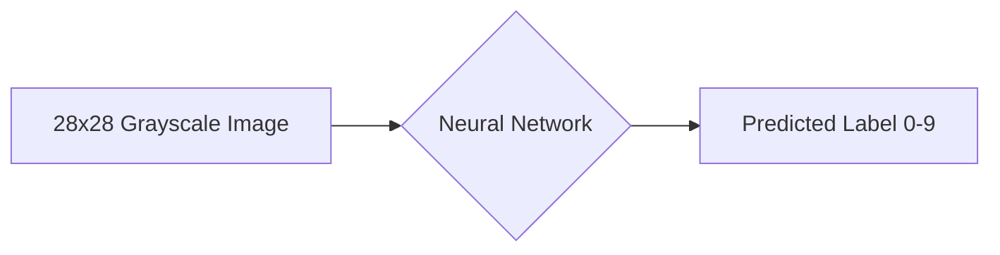

# 从零开始大模型开发与微调：MNIST数据集的特征和标签介绍

## 1.背景介绍

### 1.1 大模型开发的重要性

随着人工智能技术的飞速发展,大规模预训练模型(Pretrained Large Models,PLMs)已经成为自然语言处理、计算机视觉等领域的研究热点。这些大模型在下游任务上表现出色,极大地推动了人工智能的进步。然而,对于很多研究者和开发者来说,从零开始开发和微调一个大模型仍然是一个具有挑战性的任务。

### 1.2 MNIST数据集的地位

在大模型开发过程中,选择合适的数据集至关重要。而在计算机视觉领域,MNIST手写数字识别数据集可以说是最经典和广泛使用的数据集之一。自1998年发布以来,MNIST数据集已经成为衡量机器学习算法性能的基准,被广泛应用于模式识别、机器学习、深度学习等研究领域。

### 1.3 本文的目的和意义

本文将以MNIST数据集为例,详细介绍如何从零开始开发和微调一个大模型。我们将重点分析MNIST数据集的特征和标签,并给出相应的数学模型和代码实现。通过本文的学习,读者将掌握大模型开发的基本流程和技巧,为进一步开展人工智能研究打下坚实基础。

## 2.核心概念与联系

### 2.1 MNIST数据集概述

MNIST(Modified National Institute of Standards and Technology)数据集由美国国家标准与技术研究所收集整理,包含60,000个训练样本和10,000个测试样本。每个样本都是一个28x28像素的灰度图像,其中包含了0~9的手写数字。MNIST的目标是根据这些图像正确识别出对应的数字标签。

### 2.2 特征与标签

在MNIST数据集中,每个样本由两部分组成:

- 特征(Feature):代表输入的28x28像素手写数字灰度图像,可以用一个784维的向量表示。
- 标签(Label):代表该手写数字图像对应的真实数字,取值范围为0~9。

特征和标签的关系可以用下面的 Mermaid 图表示:



### 2.3 监督学习

MNIST数据集是一个典型的监督学习任务。监督学习是机器学习的一个分支,其目标是学习一个模型,使其能够对新的未知数据做出正确的预测。在监督学习中,训练数据由特征-标签对组成,模型通过学习特征与标签之间的映射关系,从而具备对新数据进行分类或回归的能力。

## 3.核心算法原理具体操作步骤

### 3.1 数据预处理

在将MNIST数据输入模型之前,我们需要对其进行一些预处理操作:

1. 将图像像素值归一化到[0,1]区间,加速模型收敛。
2. 将标签进行 one-hot 编码,转换为10维的二进制向量。
3. 划分训练集和验证集,用于模型训练和评估。

### 3.2 模型构建

针对MNIST手写数字识别任务,我们可以构建一个简单的卷积神经网络(CNN)模型:

1. 输入层:接收28x28的图像数据
2. 卷积层:提取图像的局部特征
3. 池化层:降低特征图的空间维度 
4. 全连接层:将提取到的特征映射到10个输出节点上
5. 输出层:使用 softmax 激活,得到每个类别的概率

### 3.3 模型训练

使用训练数据对模型进行训练,主要步骤如下:

1. 定义损失函数,如交叉熵损失
2. 定义优化算法,如随机梯度下降(SGD)
3. 迭代地将训练数据输入模型,计算损失函数
4. 反向传播梯度,更新模型参数
5. 定期在验证集上评估模型性能,避免过拟合

### 3.4 模型评估与微调

在测试集上评估训练好的模型性能,主要指标有:

1. 准确率:正确分类的样本数占总样本数的比例
2. 精确率:对每个类别,预测正确的样本数占预测为该类的样本数的比例 
3. 召回率:对每个类别,预测正确的样本数占实际为该类的样本数的比例
4. F1分数:精确率和召回率的调和平均数

如果模型性能不够理想,可以通过以下方式进行微调:

1. 调整超参数,如学习率、批量大小、正则化系数等
2. 修改模型结构,如增加/减少层数,改变激活函数等
3. 数据增强,如旋转、平移、缩放等变换增加训练样本
4. 迁移学习,在更大的数据集上预训练,然后在MNIST上微调

## 4.数学模型和公式详细讲解举例说明

### 4.1 交叉熵损失函数

针对多分类问题,交叉熵损失函数是最常用的损失函数之一。对于第 $i$ 个样本,其交叉熵损失定义为:

$$
L_i = -\sum_{j=1}^{C} y_{ij} \log(p_{ij})
$$

其中 $C$ 是类别数,$y_{ij}$ 是真实标签的 one-hot 表示,$p_{ij}$ 是模型预测的第 $j$ 个类别的概率。

假设有一个样本,真实标签为2,模型预测概率为 $[0.1, 0.2, 0.5, 0.2]$,则其交叉熵损失为:

$$
L = - (0 \log 0.1 + 0 \log 0.2 + 1 \log 0.5 + 0 \log 0.2) \approx 0.693
$$

### 4.2 反向传播算法

反向传播是训练神经网络的核心算法,其目的是计算损失函数对每个参数的梯度,从而通过梯度下降等优化算法更新参数。对于第 $l$ 层第 $i$ 个神经元,其反向传播的梯度计算公式为:

$$
\delta_i^{(l)} = \begin{cases} 
\nabla_{a} C \odot \sigma'(z_i^{(l)}), & \text{if } l \text{ is output layer} \\
(\sum_{j=1}^{n_{l+1}} W_{ji}^{(l+1)} \delta_j^{(l+1)}) \odot \sigma'(z_i^{(l)}), & \text{if } l \text{ is hidden layer}
\end{cases}
$$

其中 $\nabla_{a} C$ 是损失函数对输出层激活值的梯度,$\sigma'$ 是激活函数的导数,$W_{ji}^{(l+1)}$ 是第 $l+1$ 层第 $j$ 个神经元到第 $l$ 层第 $i$ 个神经元的连接权重。

通过反向传播算法,我们可以高效地计算出每个参数的梯度,并使用梯度下降等优化算法更新参数,最小化损失函数。

## 5.项目实践:代码实例和详细解释说明

下面我们使用 Python 和 TensorFlow 库来实现一个简单的 CNN 模型,对 MNIST 数据集进行分类:

```python
import tensorflow as tf

# 加载 MNIST 数据集
mnist = tf.keras.datasets.mnist
(x_train, y_train), (x_test, y_test) = mnist.load_data()

# 数据预处理
x_train, x_test = x_train / 255.0, x_test / 255.0
y_train = tf.keras.utils.to_categorical(y_train)
y_test = tf.keras.utils.to_categorical(y_test)

# 构建 CNN 模型
model = tf.keras.models.Sequential([
    tf.keras.layers.Conv2D(32, (3,3), activation='relu', input_shape=(28, 28, 1)), 
    tf.keras.layers.MaxPooling2D((2,2)),
    tf.keras.layers.Conv2D(64, (3,3), activation='relu'),
    tf.keras.layers.MaxPooling2D((2,2)),
    tf.keras.layers.Conv2D(64, (3,3), activation='relu'),
    tf.keras.layers.Flatten(),
    tf.keras.layers.Dense(64, activation='relu'),
    tf.keras.layers.Dense(10, activation='softmax')
])

# 编译模型
model.compile(optimizer='adam',
              loss='categorical_crossentropy',
              metrics=['accuracy'])

# 训练模型
model.fit(x_train, y_train, epochs=5, validation_data=(x_test, y_test))

# 评估模型
model.evaluate(x_test, y_test)
```

代码解释:

1. 首先加载 MNIST 数据集,并将像素值归一化到 [0,1] 区间,标签进行 one-hot 编码。
2. 然后使用 Keras 的 Sequential API 构建 CNN 模型,包含两个卷积层、两个池化层和两个全连接层。
3. 使用 Adam 优化器和交叉熵损失函数编译模型。
4. 在训练集上训练模型5个 epoch,并在测试集上进行验证。
5. 最后在测试集上评估模型的性能。

运行该代码,我们可以得到模型在测试集上的准确率超过了98%,说明这个简单的 CNN 模型已经能够很好地完成 MNIST 手写数字识别任务。

## 6.实际应用场景

MNIST手写数字识别模型在实际生活中有广泛的应用,例如:

### 6.1 邮政编码识别

将手写的邮政编码转化为计算机可读的数字,提高邮件分拣效率。

### 6.2 银行支票识别

识别支票上手写的金额数字,加快支票处理速度,降低人工录入错误率。

### 6.3 表单数据录入

自动识别表单中手写的数字,如问卷调查、考试答题卡等,节省人力成本。

### 6.4 车牌号码识别

识别车牌号码中的数字,实现车辆信息自动录入和管理。

### 6.5 验证码识别

用于破解基于手写数字的验证码,提高自动化测试效率。

通过将 MNIST 模型与其他技术(如图像分割、文本检测等)相结合,我们可以开发出更加智能和高效的手写数字识别应用,为各行各业提供便利。

## 7.工具和资源推荐

对于初学者来说,想要入门 MNIST 手写数字识别,可以利用以下工具和资源:

### 7.1 TensorFlow 和 Keras

TensorFlow 是由 Google 开发的开源机器学习框架,Keras 是基于 TensorFlow 的高层次深度学习库。它们提供了丰富的 API 和预置模型,使得构建、训练和部署神经网络变得非常简单。

官网:https://www.tensorflow.org/

### 7.2 PyTorch

PyTorch 是由 Facebook 开发的开源机器学习库,其动态计算图和命令式编程风格深受研究者和开发者欢迎。PyTorch 提供了与 NumPy 类似的张量运算 API,使得 debug 和编写自定义层非常方便。

官网:https://pytorch.org/

### 7.3 OpenCV

OpenCV 是一个开源的计算机视觉库,提供了大量图像处理和机器视觉算法。在 MNIST 手写数字识别任务中,我们可以使用 OpenCV 进行图像读取、缩放、阈值化等预处理操作。

官网:https://opencv.org/

### 7.4 Kaggle

Kaggle 是一个数据科学竞赛平台,提供了大量高质量的数据集和示例代码。通过参加 Kaggle 上的 MNIST 竞赛,你可以与来自全球的选手一较高下,学习并实践最新的深度学习技术。

地址:https://www.kaggle.com/c/digit-recognizer

## 8.总结:未来发展趋势与挑战

MNIST 手写数字识别任务虽然是一个相对简单的计算机视觉问题,但其背后蕴含的思想和方法却对深度学习的发展产生了深远影响。展望未来,手写数字识别技术还有以下几个发展趋势和挑战:

### 8.1 模型压缩与加速

为了在资源受限的嵌入式设备上实现实时的手写数字识别,我们需要探索模型压缩和加速技术,如剪枝、量化、知识蒸馏等,在保证性能的同时降低模型的存储和计算开销。

### 8.2 小样本学习

目前的深度学习模