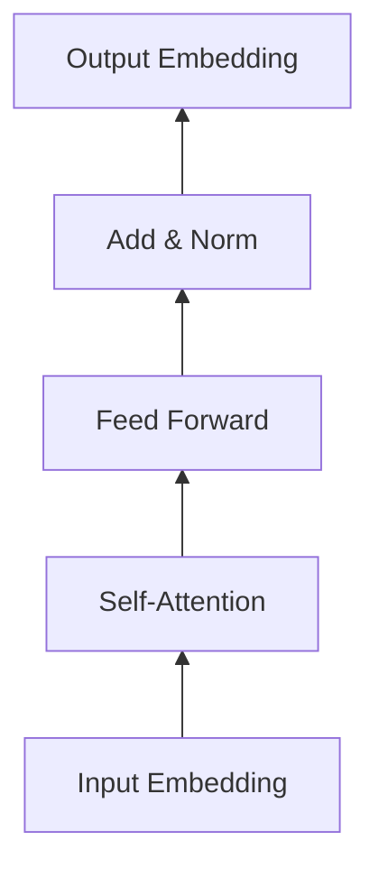

# 从零开始大模型开发与微调：PyTorch 2.0深度学习环境搭建

## 1. 背景介绍

### 1.1 大模型的兴起与应用

近年来,随着深度学习技术的飞速发展,大规模预训练语言模型(Large Language Models, LLMs)在自然语言处理领域取得了突破性进展。从GPT、BERT到ChatGPT,这些大模型展现出了令人惊叹的语言理解与生成能力,在问答、对话、翻译、摘要等任务上都取得了接近甚至超越人类的表现。大模型正在深刻改变我们与计算机交互的方式,为人工智能走进我们的日常生活铺平了道路。

### 1.2 PyTorch的优势与发展

PyTorch作为一个灵活、高效的深度学习框架,凭借其动态计算图、命令式编程等特点,受到了学术界和工业界的广泛青睐。特别是在2022年发布的PyTorch 2.0版本,进一步提升了性能和开发效率,为大模型的训练和部署提供了更好的支持。PyTorch 2.0引入了一系列新特性,如torch.compile编译优化、DynamicQuantization动态量化、torch.distributed分布式训练等,使得PyTorch成为大模型开发的利器。

### 1.3 环境搭建的重要性

要开启大模型开发之旅,首先需要搭建一个高效、稳定的深度学习环境。环境搭建虽然看似简单,但其实暗藏玄机。不同版本的框架、库之间可能存在兼容性问题,稍有不慎就会陷入依赖冲突的泥潭。而且大模型对计算资源要求很高,需要配置GPU环境,这对初学者来说也是一大挑战。因此,本文将手把手教你如何基于PyTorch 2.0搭建深度学习环境,为你的大模型开发之旅扫清障碍。

## 2. 核心概念与联系

### 2.1 大模型的核心概念

- 预训练(Pre-training):在大规模无标注语料上进行自监督学习,让模型学习到语言的基本规律和知识。
- 微调(Fine-tuning):在下游任务的标注数据上对预训练模型进行监督学习,使其适应特定任务。
- Transformer结构:大模型的核心组件,通过自注意力机制实现长距离依赖建模。
- 梯度检查点(Gradient Checkpointing):通过重新计算中间激活值,降低训练过程的显存占用。
- 模型并行:将模型参数分布到多个设备上,突破单卡显存限制。
- 数据并行:将数据分片到多个设备上,加速训练过程。

### 2.2 PyTorch 2.0的核心特性

- torch.compile:使用即时编译技术,优化模型推理和训练性能。 
- DynamicQuantization:在推理阶段动态量化模型,加速推理并减小模型体积。
- torch.distributed:原生支持分布式训练,简化多机多卡训练流程。
- TorchDynamo:使用Python函数转换和编译技术,自动优化PyTorch程序。
- functorch:提供函数式编程范式,简化模型的定义和操作。

### 2.3 环境搭建的核心要素

- Python环境:选择合适的Python版本,并配置虚拟环境。
- PyTorch安装:根据CUDA版本选择对应的PyTorch版本进行安装。
- 依赖库安装:安装必要的科学计算库如NumPy,以及可视化库如Matplotlib。
- 开发工具配置:选择高效的IDE如PyCharm或VS Code,配置远程开发环境。
- 硬件环境准备:配置CUDA、cuDNN等GPU环境,选择合适的硬件如显卡、内存。

## 3. 核心算法原理与具体操作步骤

### 3.1 Transformer结构详解

Transformer是大模型的核心组件,其基本结构如下:



- 输入嵌入(Input Embedding):将离散的token映射为连续的向量表示。
- 自注意力(Self-Attention):通过计算query、key、value,建模token之间的依赖关系。
$$Attention(Q,K,V) = softmax(\frac{QK^T}{\sqrt{d_k}})V$$
- 前馈网络(Feed Forward):通过两层全连接网络,增强模型的表达能力。
$$FFN(x) = max(0, xW_1 + b_1)W_2 + b_2$$
- 残差连接与层归一化(Add & Norm):通过跳连和归一化,缓解梯度消失和稳定训练。
$$x = LayerNorm(x + Sublayer(x))$$

### 3.2 预训练与微调流程

预训练与微调是大模型训练的两个关键步骤,具体流程如下:


- 预训练阶段:在大规模无标注语料上,通过自监督学习任务如MLM、NSP等,让模型学习通用语言知识。
- 微调阶段:在下游任务的标注数据上,通过监督学习任务如分类、序列标注等,让模型适应特定任务。

### 3.3 分布式训练方案

为了加速大模型的训练过程,需要采用分布式训练方案,常见的方案有:

- 数据并行:将数据分片到多个设备上,每个设备保存一份完整的模型参数。
- 模型并行:将模型参数分布到多个设备上,每个设备只保存部分模型参数。
- 流水线并行:将模型切分为多个阶段,不同设备负责不同阶段的计算。

在PyTorch中,可以使用torch.distributed进行分布式训练,示例代码如下:

```python
import torch
import torch.distributed as dist

dist.init_process_group(backend='nccl')
model = MyModel()
model = torch.nn.parallel.DistributedDataParallel(model)

optimizer = torch.optim.Adam(model.parameters())
dist.barrier() 
```

## 4. 数学模型与公式详解

### 4.1 Transformer的数学表示

Transformer的核心是自注意力机制,其数学表示为:

$$Attention(Q,K,V) = softmax(\frac{QK^T}{\sqrt{d_k}})V$$

其中,$Q$、$K$、$V$分别表示query、key、value矩阵,$d_k$为键向量的维度。

自注意力的计算过程可以分解为以下步骤:

1. 计算query、key、value矩阵:
$$Q = XW_Q, K = XW_K, V = XW_V$$
其中,$X$为输入序列,$W_Q$、$W_K$、$W_V$为可学习的参数矩阵。

2. 计算注意力权重:
$$A = softmax(\frac{QK^T}{\sqrt{d_k}})$$
其中,$A$为注意力权重矩阵,表示每个query与每个key的相似度。

3. 计算注意力输出:
$$Z = AV$$
其中,$Z$为注意力输出,是value的加权和。

### 4.2 前馈网络的数学表示

前馈网络由两层全连接网络组成,其数学表示为:

$$FFN(x) = max(0, xW_1 + b_1)W_2 + b_2$$

其中,$W_1$、$W_2$为可学习的权重矩阵,$b_1$、$b_2$为偏置项。

前馈网络可以增强模型的非线性表达能力,捕捉更复杂的特征。

### 4.3 残差连接与层归一化的数学表示

残差连接与层归一化是Transformer的重要组成部分,其数学表示为:

$$x = LayerNorm(x + Sublayer(x))$$

其中,$Sublayer(x)$表示子层(如自注意力层或前馈层)的输出,$LayerNorm$表示层归一化操作。

层归一化的计算公式为:

$$\mu = \frac{1}{n}\sum_{i=1}^n x_i$$
$$\sigma = \sqrt{\frac{1}{n}\sum_{i=1}^n (x_i - \mu)^2}$$
$$y_i = \frac{x_i - \mu}{\sigma + \epsilon} * \gamma + \beta$$

其中,$\mu$和$\sigma$分别表示均值和标准差,$\epsilon$为平滑项(避免分母为0),$\gamma$和$\beta$为可学习的缩放和偏移参数。

残差连接可以缓解深层网络的梯度消失问题,而层归一化可以加速收敛、提高泛化能力。

## 5. 项目实践:代码实例与详细解释

下面我们通过一个完整的项目实例,演示如何使用PyTorch 2.0进行大模型的开发与微调。

### 5.1 环境准备

首先,我们需要安装PyTorch 2.0及相关依赖库。可以使用以下命令:

```bash
pip install torch torchvision torchaudio --index-url https://download.pytorch.org/whl/cu117
pip install transformers datasets
```

这里我们选择CUDA 11.7版本的PyTorch,并安装huggingface的transformers和datasets库。

### 5.2 数据准备

我们以情感分类任务为例,使用IMDb电影评论数据集。可以使用以下代码加载数据:

```python
from datasets import load_dataset

imdb = load_dataset("imdb")
```

### 5.3 模型定义

接下来,我们使用transformers库中的BertForSequenceClassification模型,并进行必要的配置:

```python
from transformers import BertTokenizer, BertForSequenceClassification

model_name = "bert-base-uncased"
tokenizer = BertTokenizer.from_pretrained(model_name)
model = BertForSequenceClassification.from_pretrained(model_name, num_labels=2)
```

这里我们使用预训练的bert-base-uncased模型,并指定分类标签数为2(正面/负面)。

### 5.4 数据预处理

在训练模型之前,我们需要对数据进行预处理,主要包括以下步骤:

1. 将文本转换为token ID序列:

```python
def preprocess_function(examples):
    return tokenizer(examples["text"], truncation=True, padding="max_length", max_length=512)

tokenized_imdb = imdb.map(preprocess_function, batched=True)
```

2. 将数据集划分为训练集和测试集:

```python
from datasets import DatasetDict

tokenized_imdb = DatasetDict(
    {"train": tokenized_imdb["train"], "test": tokenized_imdb["test"]}
)
```

3. 定义数据加载器:

```python
from torch.utils.data import DataLoader

train_dataloader = DataLoader(tokenized_imdb["train"], shuffle=True, batch_size=8)
test_dataloader = DataLoader(tokenized_imdb["test"], batch_size=8)
```

### 5.5 模型微调

现在,我们可以开始对模型进行微调了。微调的过程主要包括以下步骤:

1. 定义优化器和学习率调度器:

```python
from transformers import AdamW, get_scheduler

optimizer = AdamW(model.parameters(), lr=5e-5)
num_epochs = 3
num_training_steps = num_epochs * len(train_dataloader)
lr_scheduler = get_scheduler(
    name="linear", optimizer=optimizer, num_warmup_steps=0, num_training_steps=num_training_steps
)
```

2. 定义训练循环:

```python
import torch
from tqdm.auto import tqdm

device = torch.device("cuda") if torch.cuda.is_available() else torch.device("cpu")
model.to(device)

progress_bar = tqdm(range(num_training_steps))

model.train()
for epoch in range(num_epochs):
    for batch in train_dataloader:
        batch = {k: v.to(device) for k, v in batch.items()}
        outputs = model(**batch)
        loss = outputs.loss
        loss.backward()

        optimizer.step()
        lr_scheduler.step()
        optimizer.zero_grad()
        progress_bar.update(1)
```

3. 定义评估函数:

```python
import evaluate

metric = evaluate.load("accuracy")

def compute_metrics(eval_pred):
    logits, labels = eval_pred
    predictions = np.argmax(logits, axis=-1)
    return metric.compute(predictions=predictions, references=labels)
```

4. 在测试集上评估模型性能:

```python
from transformers import DataCollatorWithPadding

data_collator = DataCollatorWithPadding(tokenizer=tokenizer)

model.eval()
for batch in test_dataloader:
    batch = {k: v.to(device) for k, v in batch.items()}
    with torch.no_grad():
        outputs = model(**batch)

    logits = outputs.logits
    predictions = torch.argmax(logits, dim=-1)
    metric.add_batch(predictions=predictions, references=batch["labels"])

print(metric.compute())