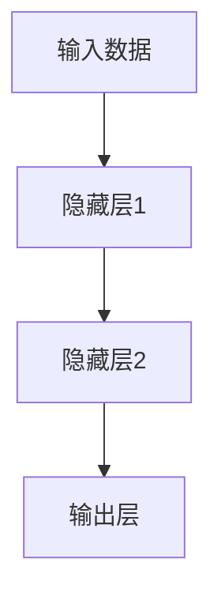
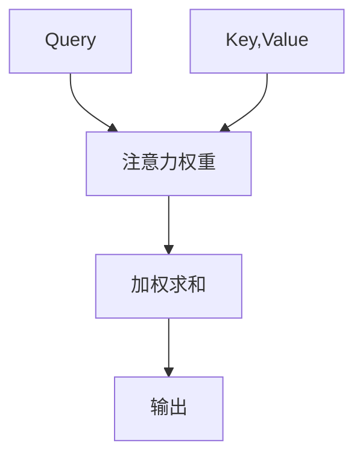
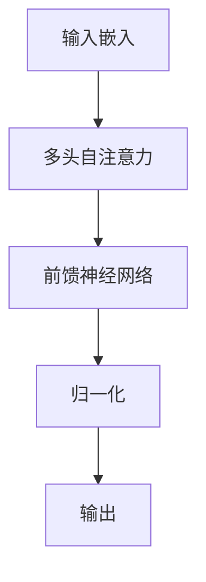
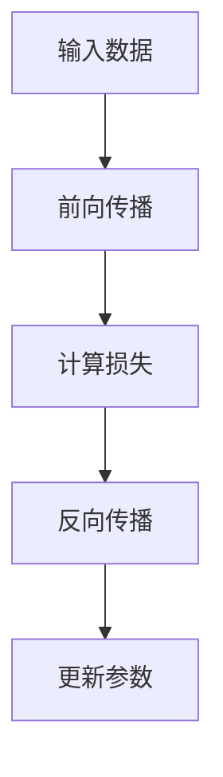

# 从零开始大模型开发与微调：一学就会的深度学习基础算法详解

## 1.背景介绍

### 1.1 人工智能的兴起

人工智能(AI)已经成为当代科技发展的核心驱动力之一。从语音识别到自动驾驶,从医疗诊断到金融分析,AI技术正在渗透到我们生活的方方面面。在这场技术革命的浪潮中,深度学习作为AI的核心技术,正在推动着各个领域的创新和突破。

### 1.2 深度学习的重要性

深度学习是一种基于人工神经网络的机器学习技术,它能够从大量数据中自动学习特征表示,并对复杂模式进行建模。凭借其强大的模式识别和预测能力,深度学习已经在计算机视觉、自然语言处理、推荐系统等领域取得了卓越的成就。

### 1.3 大模型时代的到来

随着计算能力的不断提升和数据量的激增,深度学习模型也在不断变大。大模型(Large Model)凭借其庞大的参数量和丰富的知识,能够处理更加复杂的任务,并展现出惊人的泛化能力。例如,GPT-3、DALL-E等大模型在自然语言处理、图像生成等领域取得了突破性的进展。

### 1.4 微调技术的重要性

虽然训练大模型需要巨大的计算资源,但是通过微调(Fine-tuning)技术,我们可以在有限的资源下,快速地将预训练好的大模型应用于特定的任务和领域。微调技术不仅提高了模型的性能,也大大降低了开发成本,因此成为了大模型应用的关键技术。

## 2.核心概念与联系

### 2.1 神经网络

神经网络是深度学习的基础,它由多层神经元组成,每一层都对输入数据进行特征提取和转换。神经网络通过反向传播算法进行训练,使得输出结果逐步逼近期望值。

### 2.2 卷积神经网络

卷积神经网络(CNN)是处理图像等高维数据的有效模型。它通过卷积操作提取局部特征,并通过池化操作降低特征维度,最终形成对输入数据的高层次表示。

### 2.3 循环神经网络

循环神经网络(RNN)是处理序列数据(如文本、语音等)的有效模型。它能够捕捉序列中的长期依赖关系,并生成相应的输出序列。长短期记忆网络(LSTM)和门控循环单元(GRU)是RNN的两种常用变体。

### 2.4 注意力机制

注意力机制是深度学习中的一种关键技术,它允许模型在处理输入时,动态地关注与当前任务相关的部分信息。注意力机制在机器翻译、阅读理解等任务中发挥着重要作用。

### 2.5 Transformer

Transformer是一种全新的基于注意力机制的神经网络架构,它完全摒弃了RNN的结构,使用多头自注意力层来捕捉输入序列中的长程依赖关系。Transformer在机器翻译、语言模型等任务中表现出色,成为了当前最先进的序列建模架构。

### 2.6 预训练与微调

预训练(Pre-training)是指在大规模无标注数据上训练模型,使其学习到通用的表示能力。微调(Fine-tuning)则是在有标注数据上,基于预训练模型进行进一步的训练,使其适应特定的任务。预训练与微调的组合使得我们能够快速开发出高质量的模型,是大模型应用的关键技术。

## 3.核心算法原理具体操作步骤

### 3.1 反向传播算法

反向传播算法是训练神经网络的核心算法,它通过计算损失函数对网络参数的梯度,并沿着梯度的反方向更新参数,从而最小化损失函数。具体步骤如下:

1. 前向传播,计算网络输出
2. 计算损失函数
3. 反向传播,计算每个参数的梯度
4. 根据梯度更新参数

### 3.2 优化算法

为了加速训练过程,我们需要使用优化算法来更新网络参数。常用的优化算法包括:

1. **随机梯度下降(SGD)**: 每次使用一个小批量数据计算梯度,并沿梯度方向更新参数。
2. **动量优化**: 在SGD的基础上,引入动量项来加速收敛。
3. **AdaGrad**: 根据历史梯度自适应地调整每个参数的学习率。
4. **RMSProp**: 对AdaGrad进行改进,使用指数加权移动平均来计算梯度。
5. **Adam**: 结合动量优化和RMSProp,是目前最常用的优化算法之一。

### 3.3 正则化技术

为了防止过拟合,我们需要使用正则化技术来控制模型的复杂度。常用的正则化技术包括:

1. **L1/L2正则化**: 在损失函数中加入参数的L1或L2范数,使得参数趋向于稀疏或接近0。
2. **Dropout**: 在训练时随机将一部分神经元的输出设置为0,相当于集成了多个子网络。
3. **批归一化(BatchNorm)**: 通过归一化输入数据的分布,加速收敛并提高泛化能力。
4. **数据增广**: 通过对训练数据进行变换(如旋转、缩放等)来增加数据量,提高模型的鲁棒性。

### 3.4 迁移学习

迁移学习是一种将在源域学习到的知识迁移到目标域的技术。在深度学习中,我们通常会在大规模数据集上预训练一个基础模型,然后将其迁移到目标任务上进行微调。这种方式能够大幅提高模型的性能,并降低训练成本。

### 3.5 模型压缩

由于大模型通常包含数十亿甚至上千亿的参数,因此部署和推理成本很高。为了解决这个问题,我们需要使用模型压缩技术来减小模型的大小,常用的技术包括:

1. **量化**: 将浮点数参数量化为低比特整数,从而减小模型大小。
2. **剪枝**: 移除对模型性能影响较小的参数和神经元,从而压缩模型。
3. **知识蒸馏**: 使用一个小模型来学习大模型的行为,从而获得类似的性能。
4. **模型分片**: 将大模型分割成多个小模型,在推理时协同工作。

## 4.数学模型和公式详细讲解举例说明

### 4.1 神经网络模型

神经网络是深度学习的基础模型,它由多层神经元组成,每一层对输入数据进行特征转换。设第l层的输入为 $a^{(l-1)}$,权重矩阵为 $W^{(l)}$,偏置向量为 $b^{(l)}$,则第l层的输出 $a^{(l)}$ 可以表示为:

$$a^{(l)} = g(W^{(l)}a^{(l-1)} + b^{(l)})$$

其中,g(·)是激活函数,常用的有Sigmoid、ReLU等。

在训练过程中,我们需要最小化损失函数 $J(\theta)$,其中 $\theta$ 表示所有可训练参数。通过反向传播算法,我们可以计算每个参数的梯度 $\frac{\partial J}{\partial \theta}$,然后使用优化算法(如SGD)沿梯度方向更新参数:

$$\theta \leftarrow \theta - \alpha \frac{\partial J}{\partial \theta}$$

其中,α是学习率。

### 4.2 卷积神经网络

卷积神经网络(CNN)在图像分类、目标检测等计算机视觉任务中表现出色。CNN的核心操作是卷积,它通过滤波器(也称为卷积核)在输入特征图上滑动,提取局部特征。

设输入特征图为 $X$,卷积核为 $K$,则卷积操作可以表示为:

$$S(i,j) = (X*K)(i,j) = \sum_{m}\sum_{n}X(i+m,j+n)K(m,n)$$

其中,$(i,j)$是输出特征图的坐标,$(m,n)$是卷积核的坐标。

池化操作则用于降低特征维度,常用的池化方式有最大池化和平均池化。设输入特征图为 $X$,池化窗口大小为 $f \times f$,步长为 $s$,则最大池化的输出 $P$ 可以表示为:

$$P(i,j) = \max_{(m,n)\in R_{ij}}X(s \cdot i + m, s \cdot j + n)$$

其中,$ R_{ij} = \{(m,n)|0 \leq m,n < f\} $是以$(i,j)$为中心的池化窗口。

### 4.3 循环神经网络

循环神经网络(RNN)是处理序列数据的有效模型,它能够捕捉序列中的长期依赖关系。设输入序列为 $X = (x_1, x_2, \dots, x_T)$,隐藏状态序列为 $H = (h_1, h_2, \dots, h_T)$,则RNN的状态转移方程可以表示为:

$$h_t = f_W(x_t, h_{t-1})$$

其中,$ f_W $是一个非线性函数(如tanh或ReLU),参数化by W。

基于隐藏状态序列 $H$,我们可以计算输出序列 $Y = (y_1, y_2, \dots, y_T)$:

$$y_t = g_V(h_t)$$

其中,$ g_V $是另一个非线性函数,参数化by V。

在训练过程中,我们需要最小化输出序列与标签序列之间的差异,即最小化损失函数 $J(W, V)$。通过反向传播算法,我们可以计算参数的梯度,并使用优化算法进行更新。

### 4.4 注意力机制

注意力机制是深度学习中的一种关键技术,它允许模型在处理输入时,动态地关注与当前任务相关的部分信息。

设查询向量(Query)为 $q$,键值对(Key-Value)为 $(k_1, v_1), (k_2, v_2), \dots, (k_n, v_n)$,则注意力权重 $\alpha_i$ 可以计算为:

$$\alpha_i = \frac{e^{s(q, k_i)}}{\sum_{j=1}^n e^{s(q, k_j)}}$$

其中,$ s(q, k_i) $是一个评分函数,常用的有点积或多层感知机。

基于注意力权重,我们可以计算加权和作为注意力输出:

$$\text{Attention}(q, (k_1, v_1), \dots, (k_n, v_n)) = \sum_{i=1}^n \alpha_i v_i$$

注意力机制在机器翻译、阅读理解等任务中发挥着重要作用,它能够有效地捕捉输入序列中与当前任务相关的信息。

### 4.5 Transformer

Transformer是一种全新的基于注意力机制的神经网络架构,它完全摒弃了RNN的结构,使用多头自注意力层来捕捉输入序列中的长程依赖关系。

在Transformer的编码器中,输入序列首先被映射为嵌入向量,然后经过多个编码器层。每个