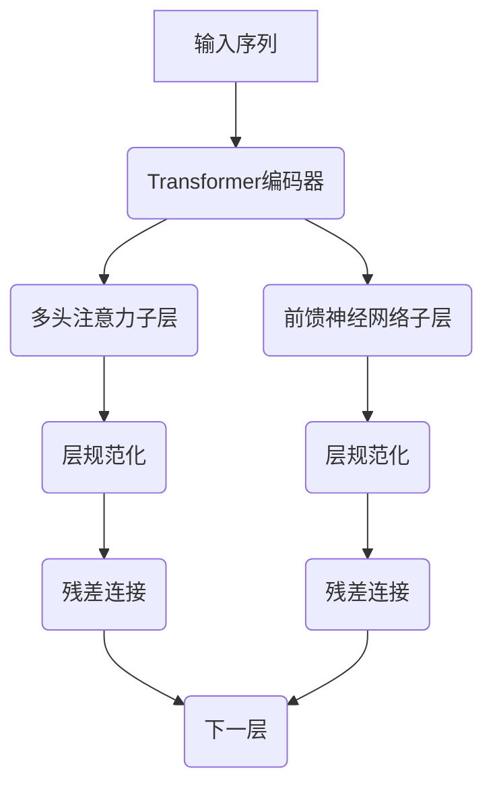

# 从零开始大模型开发与微调：使用Hugging Face获取BERT预训练模型

## 1.背景介绍

### 1.1 自然语言处理的重要性

在当今数字时代,自然语言处理(NLP)已成为人工智能领域中最重要和最具挑战性的研究方向之一。随着大数据和计算能力的不断发展,NLP技术在各个领域得到了广泛应用,如智能助手、机器翻译、情感分析、文本摘要等。然而,构建高质量的NLP模型需要大量标注数据和计算资源,这对于大多数组织来说是一个巨大挑战。

### 1.2 转移学习的兴起

为了解决上述问题,转移学习(Transfer Learning)应运而生。转移学习的核心思想是利用在大型数据集上预先训练的模型,将其知识转移到新的下游任务中,从而减少从头开始训练模型所需的数据和计算资源。这种方法已被证明在NLP任务中非常有效,尤其是在数据量有限的情况下。

### 1.3 BERT:自然语言处理的里程碑式进展

2018年,谷歌发布了BERT(Bidirectional Encoder Representations from Transformers),这是NLP领域的一个里程碑式进展。BERT是一种基于Transformer的双向编码器模型,能够有效地捕捉句子中单词的上下文信息,从而显著提高了广泛的NLP任务的性能。BERT的出现引发了NLP领域的新浪潮,催生了一系列基于BERT的语言模型,如XLNet、RoBERTa、ALBERT等。

## 2.核心概念与联系

### 2.1 预训练语言模型

预训练语言模型(Pre-trained Language Model,PLM)是指在大规模无标注语料库上预先训练的模型,旨在捕捉自然语言的一般模式和语义信息。这些模型可以被视为一种知识库,其中蕴含了丰富的语言知识。通过在下游任务上进行微调(Fine-tuning),可以将这些知识迁移到特定的NLP任务中,从而提高模型的性能。

BERT就是一种典型的预训练语言模型,它采用了两个预训练任务:掩码语言模型(Masked Language Modeling,MLM)和下一句预测(Next Sentence Prediction,NSP)。MLM任务要求模型预测被掩码的单词,而NSP任务则要求模型判断两个句子是否相关。通过这两个任务,BERT能够同时学习单词级别和句子级别的语义表示。

### 2.2 Transformer架构

Transformer是BERT的核心架构,它完全基于注意力机制(Attention Mechanism)构建,不依赖于循环神经网络(RNN)或卷积神经网络(CNN)。Transformer由编码器(Encoder)和解码器(Decoder)组成,编码器用于处理输入序列,解码器则生成输出序列。

在BERT中,只使用了Transformer的编码器部分,因为它主要用于生成上下文语义表示,而不需要生成输出序列。Transformer编码器由多个相同的层组成,每一层包含两个子层:多头注意力(Multi-Head Attention)和前馈神经网络(Feed-Forward Neural Network)。多头注意力机制允许模型关注输入序列中的不同位置,从而捕捉长距离依赖关系。



### 2.3 Hugging Face Transformers库

Hugging Face Transformers是一个开源的Python库,提供了各种预训练语言模型(如BERT、GPT、XLNet等)的实现和工具。它支持多种NLP任务,如文本分类、命名实体识别、问答系统等。Transformers库的主要优点包括:

- 提供了大量预训练模型,可直接下载使用
- 统一的API接口,简化了模型的加载、微调和评估过程
- 支持PyTorch和TensorFlow两种深度学习框架
- 良好的文档和社区支持

通过使用Hugging Face Transformers库,研究人员和开发人员可以轻松地访问和利用最新的NLP模型,加快模型开发和部署的过程。

## 3.核心算法原理具体操作步骤

### 3.1 BERT的预训练过程

BERT的预训练过程包括两个主要任务:掩码语言模型(MLM)和下一句预测(NSP)。

#### 3.1.1 掩码语言模型(MLM)

MLM任务的目标是根据上下文预测被掩码的单词。具体操作步骤如下:

1. 从语料库中随机选择一些句子作为输入序列
2. 在每个序列中随机掩码15%的单词token
3. 将掩码的token替换为特殊的[MASK]标记
4. 使用BERT模型对掩码的token进行预测
5. 计算预测结果与实际单词之间的交叉熵损失,并反向传播更新模型参数

通过MLM任务,BERT能够学习到单词的上下文语义表示,从而捕捉单词在不同上下文中的含义。

#### 3.1.2 下一句预测(NSP)

NSP任务的目标是判断两个句子是否相关。具体操作步骤如下:

1. 从语料库中随机选择一对句子作为输入序列
2. 将两个句子用特殊的[SEP]标记分隔开
3. 在50%的情况下,交换两个句子的顺序
4. 使用BERT模型预测这两个句子是否相关
5. 计算二分类损失,并反向传播更新模型参数

通过NSP任务,BERT能够学习到句子级别的语义表示,从而捕捉句子之间的关系和连贯性。

在预训练过程中,BERT同时优化MLM和NSP两个任务的损失函数,使模型能够同时捕捉单词级别和句子级别的语义信息。

### 3.2 BERT的微调过程

虽然BERT在大规模语料库上进行了预训练,但它并不直接用于特定的下游任务。相反,我们需要在目标任务的数据集上对BERT进行微调(Fine-tuning),以使其适应特定任务的需求。

微调过程的具体步骤如下:

1. 加载预训练好的BERT模型权重
2. 根据下游任务的需求,添加一个新的输出层(如分类层或回归层)
3. 在目标任务的训练数据上对整个模型(包括BERT和新添加的输出层)进行端到端的微调
4. 使用验证集监控模型性能,并在性能不再提升时停止训练
5. 在测试集上评估最终模型的性能

在微调过程中,BERT的大部分参数都会被更新以适应目标任务,但由于已经在大规模语料库上进行了预训练,因此只需要相对较少的训练数据和计算资源即可获得良好的性能。

需要注意的是,不同的下游任务可能需要对输入数据进行不同的预处理和特征工程。例如,对于文本分类任务,我们可能需要将输入文本转换为BERT所需的token序列;而对于命名实体识别任务,我们可能需要将输入文本进行词性标注等预处理。

## 4.数学模型和公式详细讲解举例说明

### 4.1 Transformer的注意力机制

注意力机制(Attention Mechanism)是Transformer架构的核心,它允许模型在编码输入序列时关注不同位置的信息。在BERT中,使用了多头注意力(Multi-Head Attention)机制。

多头注意力的计算过程如下:

1. 将输入序列$X$映射到查询(Query)、键(Key)和值(Value)向量:

$$
Q = XW^Q, K = XW^K, V = XW^V
$$

其中$W^Q, W^K, W^V$分别是查询、键和值的权重矩阵。

2. 计算查询和键之间的点积注意力分数:

$$
\text{Attention}(Q, K, V) = \text{softmax}\left(\frac{QK^T}{\sqrt{d_k}}\right)V
$$

其中$d_k$是缩放因子,用于防止点积值过大导致梯度消失。

3. 对多个注意力头的结果进行拼接和线性投影:

$$
\text{MultiHead}(Q, K, V) = \text{Concat}(head_1, \dots, head_h)W^O
$$

其中$head_i = \text{Attention}(QW_i^Q, KW_i^K, VW_i^V)$,表示第$i$个注意力头的计算结果,$W_i^Q, W_i^K, W_i^V$是对应的权重矩阵,$W^O$是输出的线性投影矩阵。

通过多头注意力机制,Transformer能够同时关注输入序列中的不同位置,并捕捉长距离依赖关系。这种并行计算的方式也提高了模型的计算效率。

### 4.2 BERT的掩码语言模型损失函数

在BERT的MLM任务中,我们需要预测被掩码的单词token。假设输入序列为$X = (x_1, x_2, \dots, x_n)$,其中$x_m$是被掩码的token。我们使用BERT模型计算出$x_m$的预测概率分布$P(x_m | X)$,然后将其与实际单词$x_m$的one-hot编码向量$y_m$进行比较,计算交叉熵损失:

$$
\mathcal{L}_\text{MLM} = -\sum_{m \in \text{MASK}} \log P(x_m | X)
$$

其中$\text{MASK}$表示被掩码token的索引集合。

在实际实现中,我们通常将交叉熵损失转换为负对数似然损失:

$$
\mathcal{L}_\text{MLM} = -\sum_{m \in \text{MASK}} y_m^\top \log P(x_m | X)
$$

通过最小化MLM损失函数,BERT模型可以学习到单词在不同上下文中的语义表示,从而提高对自然语言的理解能力。

## 5.项目实践:代码实例和详细解释说明

在这一部分,我们将使用Hugging Face Transformers库加载BERT预训练模型,并在一个简单的文本分类任务上进行微调。

### 5.1 安装依赖库

首先,我们需要安装所需的Python库:

```bash
pip install transformers
```

### 5.2 加载BERT预训练模型

我们使用`BertForSequenceClassification`模型,它在BERT的基础上添加了一个用于序列分类的输出层。

```python
from transformers import BertForSequenceClassification

model = BertForSequenceClassification.from_pretrained('bert-base-uncased')
```

### 5.3 数据预处理

我们需要将文本数据转换为BERT所需的输入格式。这里我们使用Hugging Face的`BertTokenizer`进行文本tokenization和编码。

```python
from transformers import BertTokenizer

tokenizer = BertTokenizer.from_pretrained('bert-base-uncased')

def encode_data(text, max_length=512):
    encoded = tokenizer.encode_plus(
        text,
        add_special_tokens=True,
        max_length=max_length,
        padding='max_length',
        truncation=True,
        return_tensors='pt'
    )
    return encoded
```

### 5.4 定义数据集和数据加载器

我们将数据集封装为PyTorch的`Dataset`和`DataLoader`对象,以便于模型训练。

```python
from torch.utils.data import Dataset, DataLoader

class TextDataset(Dataset):
    def __init__(self, texts, labels):
        self.texts = texts
        self.labels = labels

    def __len__(self):
        return len(self.texts)

    def __getitem__(self, idx):
        text = self.texts[idx]
        label = self.labels[idx]
        encoded = encode_data(text)
        return encoded, label

# 准备训练和验证数据
train_texts, train_labels = load_data('train.csv')
val_texts, val_labels = load_data('val.csv')

train_dataset = TextDataset(train_texts, train_labels)
val_dataset = TextDataset(val_texts, val_labels)

train_loader = DataLoader(train_dataset, batch_size=16, shuffle=True)
val_loader = DataLoader(val_dataset, batch_size=16)
```

### 5.5 模型训练

我们定义一个训练函数来进行模型微调。

```python
import torch
from tqdm import tqdm

device = torch.device('cuda' if torch.cuda.is_available() else 'cpu')
model.to(device)

optimizer = torch.optim.Adam(model.parameters(), lr=2e-5)

def train_epoch(model, loader, optimizer):