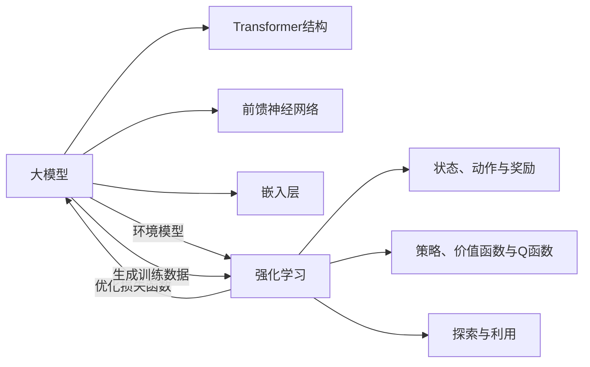

# 从零开始大模型开发与微调：基于PyTorch 2.0的强化学习实战

## 1. 背景介绍

### 1.1 大模型与强化学习概述
- 1.1.1 大模型的定义与特点
- 1.1.2 强化学习的基本原理
- 1.1.3 大模型与强化学习的结合

### 1.2 PyTorch 2.0的新特性与优势
- 1.2.1 PyTorch 2.0的主要更新
- 1.2.2 PyTorch 2.0在大模型开发中的优势
- 1.2.3 PyTorch 2.0对强化学习的支持

### 1.3 大模型开发与微调的意义
- 1.3.1 大模型在实际应用中的价值
- 1.3.2 微调技术对大模型性能的提升
- 1.3.3 强化学习在大模型优化中的作用

## 2. 核心概念与联系

### 2.1 大模型的架构与组成
- 2.1.1 Transformer结构与自注意力机制
- 2.1.2 前馈神经网络与残差连接
- 2.1.3 嵌入层与位置编码

### 2.2 强化学习的关键要素
- 2.2.1 状态、动作与奖励
- 2.2.2 策略、价值函数与Q函数
- 2.2.3 探索与利用的平衡

### 2.3 大模型与强化学习的交互
- 2.3.1 大模型作为强化学习的环境模型
- 2.3.2 强化学习优化大模型的损失函数
- 2.3.3 大模型生成强化学习的训练数据



## 3. 核心算法原理具体操作步骤

### 3.1 深度Q学习(DQN)算法
- 3.1.1 Q函数的定义与更新
- 3.1.2 经验回放与目标网络
- 3.1.3 ε-贪婪策略与探索

### 3.2 近端策略优化(PPO)算法  
- 3.2.1 策略梯度与重要性采样
- 3.2.2 代理目标函数与裁剪
- 3.2.3 价值函数估计与优势函数

### 3.3 软性演员-评论家(SAC)算法
- 3.3.1 最大熵强化学习与软Q值
- 3.3.2 策略网络与熵正则化
- 3.3.3 双Q网络与延迟策略更新

## 4. 数学模型和公式详细讲解举例说明

### 4.1 Bellman方程与最优值函数
- 4.1.1 状态值函数与动作值函数
- 4.1.2 Bellman最优方程的推导
- 4.1.3 值迭代与策略迭代算法

### 4.2 策略梯度定理与REINFORCE算法
- 4.2.1 策略梯度定理的证明
- 4.2.2 REINFORCE算法的推导
- 4.2.3 基线技巧与方差减少

### 4.3 软Q学习与最大熵原理
- 4.3.1 软Q值的定义与性质
- 4.3.2 最大熵原理与KL散度
- 4.3.3 软Q学习算法的收敛性分析

策略梯度定理：
$$
\nabla_\theta J(\theta) = \mathbb{E}_{\tau \sim p_\theta(\tau)}\left[\sum_{t=0}^T \nabla_\theta \log \pi_\theta(a_t|s_t) Q^{\pi_\theta}(s_t,a_t)\right]
$$

软Q值的定义：
$$
Q^{\pi_\theta}_\alpha(s_t,a_t) = r_t + \gamma \mathbb{E}_{s_{t+1} \sim p(s_{t+1}|s_t,a_t)}\left[V^{\pi_\theta}_\alpha(s_{t+1})\right]
$$
其中，
$$
V^{\pi_\theta}_\alpha(s_t) = \alpha \log \int_\mathcal{A} \exp\left(\frac{1}{\alpha}Q^{\pi_\theta}_\alpha(s_t,a)\right)da
$$

## 5. 项目实践：代码实例和详细解释说明

### 5.1 基于PyTorch 2.0实现DQN算法
- 5.1.1 环境设置与超参数选择
- 5.1.2 Q网络的设计与初始化
- 5.1.3 训练循环与测试评估

### 5.2 基于PyTorch 2.0实现PPO算法
- 5.2.1 并行环境与数据采样
- 5.2.2 演员-评论家网络的设计
- 5.2.3 代理目标函数的优化

### 5.3 基于PyTorch 2.0实现SAC算法
- 5.3.1 重参数化技巧与策略网络设计
- 5.3.2 双Q网络与软Q值估计
- 5.3.3 自动调整温度参数的方法

```python
import torch
import torch.nn as nn
import torch.optim as optim

class DQN(nn.Module):
    def __init__(self, state_dim, action_dim):
        super(DQN, self).__init__()
        self.fc1 = nn.Linear(state_dim, 64)
        self.fc2 = nn.Linear(64, 64)
        self.fc3 = nn.Linear(64, action_dim)
        
    def forward(self, x):
        x = torch.relu(self.fc1(x))
        x = torch.relu(self.fc2(x))
        x = self.fc3(x)
        return x

def train(model, target_model, optimizer, replay_buffer, batch_size, gamma):
    states, actions, rewards, next_states, dones = replay_buffer.sample(batch_size)
    
    q_values = model(states).gather(1, actions.unsqueeze(1)).squeeze(1)
    next_q_values = target_model(next_states).max(1)[0]
    expected_q_values = rewards + (1 - dones) * gamma * next_q_values
    
    loss = nn.MSELoss()(q_values, expected_q_values.detach())
    optimizer.zero_grad()
    loss.backward()
    optimizer.step()
```

## 6. 实际应用场景

### 6.1 游戏AI的开发
- 6.1.1 基于DQN的Atari游戏智能体
- 6.1.2 基于PPO的星际争霸II微操作
- 6.1.3 基于SAC的自动驾驶汽车控制

### 6.2 推荐系统的优化
- 6.2.1 基于强化学习的在线推荐
- 6.2.2 用户反馈作为奖励信号
- 6.2.3 个性化推荐策略的生成

### 6.3 自然语言处理的增强
- 6.3.1 基于强化学习的对话生成
- 6.3.2 奖励函数设计与语言评估指标
- 6.3.3 大模型微调与强化学习结合

## 7. 工具和资源推荐

### 7.1 PyTorch生态系统
- 7.1.1 PyTorch官方文档与教程
- 7.1.2 PyTorch Lightning框架
- 7.1.3 PyTorch Hub预训练模型库

### 7.2 强化学习工具包
- 7.2.1 OpenAI Gym环境库
- 7.2.2 Stable Baselines 3算法实现
- 7.2.3 RLlib分布式训练框架

### 7.3 大模型开源项目
- 7.3.1 GPT-Neo与GPT-J模型
- 7.3.2 BERT与RoBERTa模型
- 7.3.3 T5与BART模型

## 8. 总结：未来发展趋势与挑战

### 8.1 大模型与强化学习的进一步融合
- 8.1.1 大模型作为强化学习的环境模拟器
- 8.1.2 强化学习指导大模型的知识蒸馏
- 8.1.3 元强化学习与大模型的结合

### 8.2 面向实际应用的算法创新
- 8.2.1 样本效率与泛化能力的提升
- 8.2.2 安全性与鲁棒性的保障机制
- 8.2.3 可解释性与可控性的改进

### 8.3 多智能体强化学习与大模型
- 8.3.1 多智能体协作与对抗学习
- 8.3.2 群体智能涌现与自组织
- 8.3.3 去中心化的大模型训练范式

## 9. 附录：常见问题与解答

### 9.1 如何选择合适的强化学习算法？
- 9.1.1 考虑状态与动作空间的特点
- 9.1.2 评估样本效率与计算复杂度
- 9.1.3 权衡探索与利用的策略

### 9.2 大模型微调需要注意哪些问题？
- 9.2.1 数据集的质量与分布
- 9.2.2 微调的层数与学习率设置
- 9.2.3 过拟合与欠拟合的平衡

### 9.3 强化学习中的奖励函数设计有哪些技巧？
- 9.3.1 稀疏奖励与密集奖励的权衡
- 9.3.2 分层奖励与递增式学习
- 9.3.3 内在奖励与好奇心驱动

作者：禅与计算机程序设计艺术 / Zen and the Art of Computer Programming