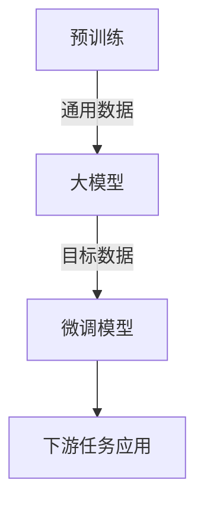

# 从零开始大模型开发与微调：基于深度学习的模型训练

## 1. 背景介绍

### 1.1 大模型的兴起

近年来,大型神经网络模型在自然语言处理、计算机视觉等领域取得了令人瞩目的成就。这些模型被称为"大模型",因为它们拥有数十亿甚至上万亿的参数,在训练时需要消耗大量的计算资源。大模型的出现,源于深度学习算法、硬件加速器(如GPU和TPU)以及海量数据的共同推动。

大模型的优势在于,通过增加模型规模和训练数据量,可以显著提高模型的泛化能力,使其在各种下游任务中表现出色。著名的大模型有GPT(Generative Pre-trained Transformer)、BERT(Bidirectional Encoder Representations from Transformers)、ViT(Vision Transformer)等。

### 1.2 大模型的挑战

尽管大模型取得了卓越的成绩,但它们也面临着一些挑战:

1. **计算资源需求巨大**:训练大模型需要耗费大量的计算资源,包括GPU/TPU等加速器和大规模的集群。这对于普通开发者和中小型企业来说,可能是一个障碍。
2. **数据饥渴**:大模型往往需要海量的训练数据,而高质量的标注数据并不是随处可得的。
3. **模型解释性差**:大模型通常是一个黑箱,很难解释其内部工作原理,这在一定程度上影响了它们在关键领域(如医疗、金融等)的应用。
4. **能耗和碳足迹高**:训练大模型需要消耗大量的能源,产生了较高的碳排放,这与环境可持续发展的目标相矛盾。

### 1.3 大模型微调

为了解决上述挑战,研究人员提出了"大模型微调"(Transfer Learning)的思路。微调是指在一个预训练的大模型基础上,使用相对较少的数据和计算资源,针对特定任务进行模型调整和优化。这种方式可以充分利用大模型强大的泛化能力,同时降低了训练成本和数据需求。

本文将详细介绍大模型微调的核心概念、算法原理、实践案例,以及相关工具和资源,为读者提供一个全面的指南。

## 2. 核心概念与联系

### 2.1 迁移学习

迁移学习(Transfer Learning)是机器学习中的一个重要概念。它指的是将在一个领域学习到的知识,应用到另一个相似但不同的领域。在深度学习中,迁移学习通常表现为:使用在大型数据集上预训练的模型,并在目标任务的数据上进行微调(fine-tuning),以获得更好的性能。

大模型微调正是迁移学习在自然语言处理和计算机视觉领域的一种具体应用。预训练的大模型可以看作是在通用数据上学习到的先验知识,而微调则是将这些知识迁移并适配到特定任务上。

### 2.2 预训练与微调

在大模型微调中,预训练(Pre-training)和微调(Fine-tuning)是两个关键的步骤:

1. **预训练**:使用海量的通用数据(如网页文本、图像等)对模型进行初始训练,学习通用的表示能力。这个过程通常耗费大量的计算资源,但只需执行一次。
2. **微调**:在预训练模型的基础上,使用与目标任务相关的数据对模型进行进一步训练,使其适应特定的任务。与从头训练相比,微调只需少量的数据和计算资源。

预训练和微调的分离,使得大模型可以在不同的任务之间共享知识,提高了训练效率和模型性能。



### 2.3 模型压缩

由于大模型存在巨大的参数量,在实际部署时会面临计算资源和内存限制的挑战。为了解决这个问题,研究人员提出了模型压缩(Model Compression)的技术,旨在减小模型的尺寸,同时保持模型性能。

常见的模型压缩方法包括:

- 量化(Quantization):将原始的32位或16位浮点数参数压缩为8位或更低位宽的定点数表示。
- 知识蒸馏(Knowledge Distillation):使用一个小模型去学习一个大教师模型的预测行为。
- 剪枝(Pruning):移除模型中的冗余参数,从而减小模型尺寸。

通过模型压缩,可以将大模型部署到资源受限的环境中,如移动设备、物联网设备等。

## 3. 核心算法原理具体操作步骤

### 3.1 预训练算法

大模型预训练通常采用自监督学习(Self-Supervised Learning)的方式,利用大量的未标注数据来学习通用的表示能力。以自然语言处理领域的BERT模型为例,它的预训练过程包括两个主要的任务:

1. **掩码语言模型(Masked Language Modeling, MLM)**: 随机掩码输入序列中的一些词,模型需要根据上下文预测被掩码的词。这有助于模型学习理解语义和上下文的能力。

2. **下一句预测(Next Sentence Prediction, NSP)**: 给定两个句子,模型需要判断第二个句子是否为第一个句子的下一句。这有助于模型学习理解句子之间的关系。

在计算机视觉领域,常用的自监督预训练方法包括:对比学习(Contrastive Learning)、自编码器(AutoEncoder)等。

预训练算法的具体步骤如下:

1. 准备大规模的未标注数据集。
2. 定义自监督学习任务,如MLM、NSP等。
3. 构建深度神经网络模型,如Transformer等。
4. 使用自监督学习任务的目标函数对模型进行训练,优化模型参数。
5. 在训练过程中,可以采用一些策略来提高模型性能,如数据增强、梯度裁剪等。

### 3.2 微调算法

在完成预训练后,我们需要将大模型微调到特定的下游任务上。微调算法的核心思想是:在预训练模型的基础上,使用与目标任务相关的数据进行进一步训练,以使模型适应该任务。

以自然语言处理任务为例,微调算法的步骤如下:

1. 准备与目标任务相关的标注数据集,如文本分类、机器阅读理解等。
2. 将预训练模型(如BERT)作为初始模型,添加一个适合任务的输出层(如分类层)。
3. 使用目标任务的损失函数(如交叉熵损失)对模型进行训练,优化模型参数。
4. 在训练过程中,可以对预训练模型的参数和新添加层的参数采用不同的学习率,以获得更好的效果。
5. 可以尝试不同的优化器、正则化策略等超参数,以提高模型性能。

对于计算机视觉任务,微调算法的步骤类似,只需将输入数据从文本换成图像,并使用适合的模型架构和损失函数。

## 4. 数学模型和公式详细讲解举例说明

在大模型微调中,常见的数学模型和公式包括:

### 4.1 Transformer模型

Transformer是一种广泛应用于自然语言处理和计算机视觉的序列到序列(Sequence-to-Sequence)模型。它的核心组件是多头自注意力(Multi-Head Attention)机制,用于捕捉序列中元素之间的长程依赖关系。

多头自注意力的计算公式如下:

$$
\begin{aligned}
\text{MultiHead}(Q, K, V) &= \text{Concat}(\text{head}_1, \dots, \text{head}_h)W^O\\
\text{where } \text{head}_i &= \text{Attention}(QW_i^Q, KW_i^K, VW_i^V)
\end{aligned}
$$

其中$Q$、$K$、$V$分别表示查询(Query)、键(Key)和值(Value)向量。$W_i^Q$、$W_i^K$、$W_i^V$和$W^O$是可学习的权重矩阵。

自注意力机制的计算过程如下:

1. 计算查询$Q$与所有键$K$的点积,得到注意力分数矩阵。
2. 对注意力分数矩阵进行缩放和软最大化,得到注意力权重矩阵。
3. 将注意力权重矩阵与值$V$相乘,得到加权和的注意力表示。

通过多头注意力机制,Transformer能够同时关注输入序列中的不同位置,捕捉全局依赖关系。

### 4.2 交叉熵损失函数

在分类任务中,交叉熵损失函数是一种常用的目标函数。对于一个样本$x$,其真实标签为$y$,模型的预测概率为$\hat{y}$,交叉熵损失可表示为:

$$
\mathcal{L}(x, y) = -\sum_{i=1}^{C} y_i \log \hat{y}_i
$$

其中$C$是类别数量。

交叉熵损失函数可以衡量模型预测与真实标签之间的差异,值越小表示模型预测越准确。在训练过程中,我们需要最小化损失函数,以优化模型参数。

### 4.3 示例:文本分类

假设我们有一个文本分类任务,需要将一段文本划分为正面或负面情感。我们可以使用BERT作为预训练模型,在其顶层添加一个分类层,然后使用交叉熵损失函数进行微调。

设输入文本为$X = (x_1, x_2, \dots, x_n)$,其对应的BERT输出表示为$H = (h_1, h_2, \dots, h_n)$。我们取$H$的第一个向量$h_1$作为句子的表示,送入分类层:

$$
\hat{y} = \text{softmax}(W^T h_1 + b)
$$

其中$W$和$b$是分类层的可学习参数。

对于一个样本$(X, y)$,其交叉熵损失为:

$$
\mathcal{L}(X, y) = -\sum_{i=1}^{2} y_i \log \hat{y}_i
$$

在训练过程中,我们需要最小化损失函数,优化BERT模型和分类层的参数,使模型能够正确预测文本的情感极性。

## 5. 项目实践:代码实例和详细解释说明

在这一部分,我们将通过一个实际的项目案例,演示如何使用Python和深度学习框架(如PyTorch或TensorFlow)进行大模型微调。我们将基于一个文本分类任务,使用BERT作为预训练模型,并在其基础上进行微调。

### 5.1 准备数据

首先,我们需要准备文本分类数据集。这里以一个简单的电影评论情感分类数据集为例:

```python
import torch
from torchtext.datasets import text_classification

# 加载数据集
train_dataset, test_dataset = text_classification.DATASETS['AG_NEWS'](
    root='data', ngrams=1, vocab=None)

# 构建词汇表
from torchtext.data import get_tokenizer
tokenizer = get_tokenizer('basic_english')
vocab = train_dataset.get_vocab(tokenizer)

# 数据预处理
def preprocess_text(text):
    return [vocab[token] for token in tokenizer(text)]

# 构建数据加载器
from torch.utils.data import DataLoader
batch_size = 32

train_loader = DataLoader(train_dataset, batch_size=batch_size,
                          shuffle=True, collate_fn=lambda x: x)
test_loader = DataLoader(test_dataset, batch_size=batch_size,
                         shuffle=False, collate_fn=lambda x: x)
```

上述代码使用了PyTorch中的`torchtext`库来加载AG_NEWS数据集,并进行了基本的数据预处理和构建数据加载器。

### 5.2 导入预训练模型

接下来,我们需要导入预训练的BERT模型。这里使用了Hugging Face的`transformers`库:

```python
from transformers import BertTokenizer, BertModel

# 加载预训练模型和tokenizer
tokenizer = BertTokenizer.from_pretrained('bert-base-uncased')
bert_model = BertModel.from_pretrained('bert-base-uncased')
```

### 5.3 定义微调模型

现在,我们可以定义微调模型的架构。我们将BERT模型作为底层,在其顶部添