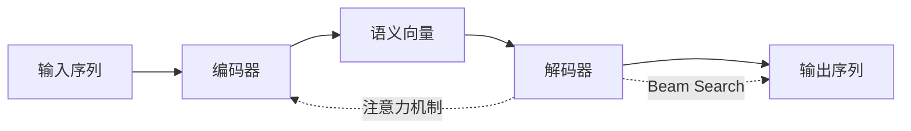

# 从零开始大模型开发与微调：解码器实战—拼音汉字翻译模型

## 1. 背景介绍

随着人工智能技术的飞速发展,自然语言处理(NLP)领域也取得了长足的进步。近年来,以 Transformer 为代表的深度学习模型在机器翻译、文本摘要、问答系统等任务上取得了令人瞩目的成绩。而在中文信息处理方面,拼音输入法作为人机交互的重要工具,其性能的提升对于提高用户体验至关重要。

本文将介绍如何从零开始,利用深度学习技术构建一个高效、准确的拼音汉字翻译模型。我们将重点关注解码器(Decoder)模块的设计与实现,探讨其内部原理,并给出详细的代码示例。通过本文的学习,读者将掌握大模型开发与微调的基本流程,了解主流的解码算法,并能够动手实践构建自己的拼音输入法模型。

### 1.1 拼音输入法的发展历程

### 1.2 深度学习在输入法领域的应用

### 1.3 解码器在输入法中的重要性

## 2. 核心概念与联系

在深入探讨拼音汉字翻译模型之前,我们有必要了解一些基本概念及其内在联系。本节将重点介绍编码器-解码器(Encoder-Decoder)架构、注意力机制(Attention Mechanism)以及 Beam Search 算法。

### 2.1 编码器-解码器架构

编码器-解码器架构是现代神经机器翻译系统的核心组成部分。其基本思想是通过编码器将输入序列映射为一个固定维度的语义向量,再由解码器根据该向量生成目标序列。这种架构使得模型能够处理不定长的输入和输出,具有很大的灵活性。

### 2.2 注意力机制

传统的编码器-解码器架构存在信息瓶颈问题,难以捕捉输入序列中的长距离依赖关系。注意力机制的引入有效地缓解了这一问题。它允许解码器在生成每个输出token时,都能够"聚焦"于输入序列中的相关部分,动态地计算上下文信息。

### 2.3 Beam Search 算法

Beam Search 是一种启发式图搜索算法,常用于解码阶段以生成最优的输出序列。与贪心解码不同,Beam Search 在每一步都保留 Top-K 个最优候选,最终从中选择得分最高的结果。这种做法在一定程度上克服了贪心算法的局限性,提高了解码质量。



## 3. 核心算法原理与具体操作步骤

### 3.1 编码器的设计与实现

#### 3.1.1 基于 RNN 的编码器

#### 3.1.2 基于 CNN 的编码器

#### 3.1.3 基于 Transformer 的编码器

### 3.2 解码器的设计与实现

#### 3.2.1 基于 RNN 的解码器

#### 3.2.2 基于 CNN 的解码器 

#### 3.2.3 基于 Transformer 的解码器

### 3.3 注意力机制的实现

#### 3.3.1 Bahdanau Attention

#### 3.3.2 Luong Attention

#### 3.3.3 Self-Attention

### 3.4 Beam Search 算法的实现

#### 3.4.1 基本原理

#### 3.4.2 伪代码

#### 3.4.3 优化技巧

## 4. 数学模型和公式详细讲解举例说明

### 4.1 编码器数学模型

编码器的目标是将离散的输入序列 $X=(x_1,x_2,...,x_T)$ 映射为一个固定维度的连续向量 $\mathbf{z}$ 。以 RNN 为例,编码器可以表示为:

$$\mathbf{h}_t=f(\mathbf{x}_t,\mathbf{h}_{t-1})$$

$$\mathbf{z}=q(\mathbf{h}_1,\mathbf{h}_2,...,\mathbf{h}_T)$$

其中, $f$ 是一个非线性变换(如LSTM或GRU), $q$ 是一个汇聚函数(如 last、mean、max)。

### 4.2 解码器数学模型

解码器的目标是根据编码器生成的语义向量 $\mathbf{z}$ ,逐步生成目标序列 $Y=(y_1,y_2,...,y_{T'})$ 。以 RNN 为例,解码器可以表示为:

$$\mathbf{s}_t=f(\mathbf{y}_{t-1},\mathbf{s}_{t-1},\mathbf{c}_t)$$

$$p(y_t|y_1,...,y_{t-1},X)=g(\mathbf{y}_{t-1},\mathbf{s}_t,\mathbf{c}_t)$$

其中, $\mathbf{s}_t$ 是解码器的隐藏状态, $\mathbf{c}_t$ 是根据注意力机制计算得到的上下文向量, $g$ 是一个非线性变换(如 Softmax)。

### 4.3 注意力机制数学模型

以 Bahdanau Attention 为例,注意力机制可以表示为:

$$e_{ti}=\mathbf{v}_a^\top \tanh(\mathbf{W}_a\mathbf{s}_{t-1}+\mathbf{U}_a\mathbf{h}_i)$$

$$\alpha_{ti}=\frac{\exp(e_{ti})}{\sum_{j=1}^T \exp(e_{tj})}$$  

$$\mathbf{c}_t=\sum_{i=1}^T \alpha_{ti}\mathbf{h}_i$$

其中, $\mathbf{v}_a$ 、 $\mathbf{W}_a$ 、 $\mathbf{U}_a$ 是注意力机制的可学习参数。 $\alpha_{ti}$ 表示解码器在时间步 $t$ 对编码器隐藏状态 $\mathbf{h}_i$ 的注意力权重。

### 4.4 Beam Search 算法数学模型

Beam Search 算法的核心思想是在每个时间步保留 Top-K 个最优候选。假设当前时间步为 $t$ ,Beam Size 为 $K$ ,则算法可以表示为:

$$\hat{Y}_t=\underset{y_1,...,y_t}{\arg\max} \sum_{i=1}^t \log p(y_i|y_1,...,y_{i-1},X)$$

$$\hat{Y}_t=\text{Top-K}(\hat{Y}_{t-1} \circ V)$$

其中, $V$ 表示模型的输出词表, $\circ$ 表示组合操作。算法最终会从 $\hat{Y}_{T'}$ 中选择得分最高的序列作为最优解。

## 5. 项目实践：代码实例和详细解释说明

下面我们将使用 PyTorch 框架,实现一个基于 Transformer 的拼音汉字翻译模型。为了简洁起见,代码中省略了部分细节,重点展示解码器及其相关组件的实现。

### 5.1 定义模型结构

```python
class TransformerDecoder(nn.Module):
    def __init__(self, vocab_size, embed_dim, num_heads, hidden_dim, num_layers, dropout=0.1):
        super(TransformerDecoder, self).__init__()
        self.embedding = nn.Embedding(vocab_size, embed_dim)
        self.pos_encoding = PositionalEncoding(embed_dim, dropout)
        decoder_layer = nn.TransformerDecoderLayer(embed_dim, num_heads, hidden_dim, dropout)
        self.transformer_decoder = nn.TransformerDecoder(decoder_layer, num_layers)
        self.fc = nn.Linear(embed_dim, vocab_size)

    def forward(self, tgt, memory, tgt_mask=None, memory_mask=None, tgt_key_padding_mask=None, memory_key_padding_mask=None):
        tgt = self.embedding(tgt) * math.sqrt(self.embed_dim)
        tgt = self.pos_encoding(tgt)
        output = self.transformer_decoder(tgt, memory, tgt_mask, memory_mask, tgt_key_padding_mask, memory_key_padding_mask)
        output = self.fc(output)
        return output
```

### 5.2 实现 Beam Search 算法

```python
def beam_search(model, src, max_len, beam_size, device):
    src = src.to(device)
    batch_size = src.size(0)
    src_mask = model.make_src_mask(src)
    src = model.encoder(src, src_mask)

    output = torch.ones(batch_size, 1).fill_(BOS_IDX).long().to(device)
    scores = torch.zeros(batch_size, beam_size).to(device)
    active_beams = torch.arange(0, batch_size).view(-1, 1).repeat(1, beam_size).view(-1).to(device)
    active_nodes = torch.ones(batch_size, beam_size, max_len).long().to(device) * PAD_IDX

    for i in range(max_len):
        tgt_mask = model.make_tgt_mask(output.size(1)).expand(batch_size * beam_size, -1, -1).to(device)
        out = model.decoder(output, src.index_select(0, active_beams), tgt_mask, src_mask.index_select(0, active_beams))
        out = model.fc(out)
        out = F.log_softmax(out[:, -1, :], dim=-1)

        scores = scores.view(-1, 1) + out
        scores, indices = scores.view(batch_size, -1).topk(beam_size, dim=-1)
        active_beams = indices // vocab_size + (torch.arange(0, batch_size).to(device) * beam_size).unsqueeze(1)
        active_nodes[:, :, :i+1] = active_nodes[active_beams, torch.arange(beam_size).unsqueeze(0), :i+1]
        active_nodes[indices < vocab_size, :, i+1] = indices % vocab_size
        output = active_nodes.view(-1, i+2)
        active_beams = active_beams.view(-1)

        if (output == EOS_IDX).any(dim=1).all():
            break

    best_scores, best_indices = scores.max(dim=1)
    decoded = active_nodes[best_indices + (torch.arange(0, batch_size).to(device) * beam_size)]
    return decoded
```

### 5.3 训练与评估

```python
def train(model, optimizer, criterion, train_loader, device):
    model.train()
    total_loss = 0
    for src, tgt in train_loader:
        src, tgt = src.to(device), tgt.to(device)
        tgt_input = tgt[:, :-1]
        tgt_output = tgt[:, 1:]
        tgt_mask = model.make_tgt_mask(tgt_input.size(1)).to(device)
        src_mask = model.make_src_mask(src).to(device)
        output = model(src, tgt_input, src_mask, tgt_mask)
        loss = criterion(output.contiguous().view(-1, output.size(-1)), tgt_output.contiguous().view(-1))
        optimizer.zero_grad()
        loss.backward()
        optimizer.step()
        total_loss += loss.item()
    return total_loss / len(train_loader)

def evaluate(model, test_loader, device):
    model.eval()
    correct = 0
    total = 0
    with torch.no_grad():
        for src, tgt in test_loader:
            src = src.to(device)
            tgt = tgt.to(device)
            decoded = beam_search(model, src, max_len=tgt.size(1), beam_size=5, device=device)
            correct += (decoded == tgt).all(dim=1).sum().item()
            total += tgt.size(0)
    return correct / total
```

## 6. 实际应用场景

拼音汉字翻译模型在实际生活中有广泛的应用,主要包括:

### 6.1 移动端输入法

在智能手机、平板电脑等移动设备上,拼音输入法是最常用的中文输入方式。通过本文介绍的技术,可以开发出性能更优、用户体验更好的移动端输入法产品。

### 6.2 语音识别后处理

语音识别系统的输出往往是拼音序列,需要进一步转换为对应的汉字序列。使用拼音汉字翻译模型可以大幅提高语音识别的准确率,减少错别字的出现。

### 6.3 汉字输入辅助工具

对于残障人士、儿童等特殊群体,使用普通的输入法可能存在困难。拼音汉字翻译模型可以作为一种辅助工具,降低汉字输入的难度,提高输入效率。

### 6.4 汉字错别字纠正

在文本编辑、信息处理等场景中,经常会出现汉字错别字的问题。利用拼音汉字翻译模型,可以实现自动检测和纠正错别字,提高文本质量。

## 7. 工具和资源推荐

### 7.1 开源工具包

- [Fairseq](