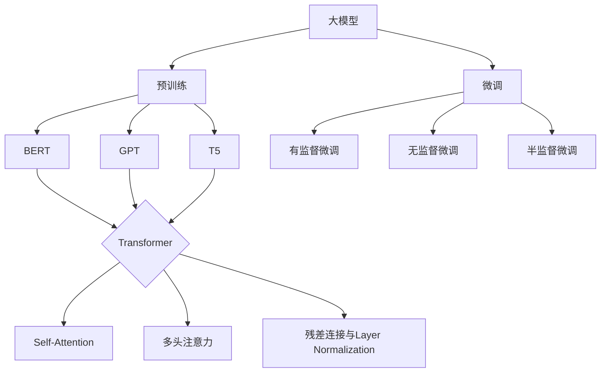

# 从零开始大模型开发与微调：近在咫尺的未来—大模型的应用前景

## 1.背景介绍
### 1.1 人工智能发展历程
#### 1.1.1 人工智能的起源与发展
#### 1.1.2 深度学习的崛起
#### 1.1.3 大模型时代的到来

### 1.2 大模型概述  
#### 1.2.1 大模型的定义
#### 1.2.2 大模型的特点
#### 1.2.3 大模型的发展现状

### 1.3 大模型应用前景展望
#### 1.3.1 大模型在自然语言处理领域的应用
#### 1.3.2 大模型在计算机视觉领域的应用  
#### 1.3.3 大模型在其他领域的应用潜力

## 2.核心概念与联系
### 2.1 大模型的核心概念
#### 2.1.1 预训练模型
#### 2.1.2 迁移学习
#### 2.1.3 微调fine-tuning

### 2.2 大模型与传统机器学习模型的区别
#### 2.2.1 模型规模的差异
#### 2.2.2 训练方式的差异
#### 2.2.3 泛化能力的差异

### 2.3 大模型与深度学习的关系
#### 2.3.1 大模型是深度学习的延伸
#### 2.3.2 深度学习技术在大模型中的应用
#### 2.3.3 大模型对深度学习的推动作用

## 3.核心算法原理具体操作步骤
### 3.1 Transformer 架构
#### 3.1.1 Self-Attention 机制
#### 3.1.2 多头注意力机制
#### 3.1.3 残差连接与Layer Normalization

### 3.2 预训练算法
#### 3.2.1 BERT 预训练
#### 3.2.2 GPT 预训练
#### 3.2.3 T5 预训练

### 3.3 微调算法
#### 3.3.1 有监督微调
#### 3.3.2 无监督微调
#### 3.3.3 半监督微调

## 4.数学模型和公式详细讲解举例说明
### 4.1 Transformer 的数学原理
#### 4.1.1 Self-Attention 的数学表示
#### 4.1.2 多头注意力的数学表示
#### 4.1.3 残差连接与 Layer Normalization 的数学表示

### 4.2 预训练的数学原理
#### 4.2.1 BERT 预训练的数学表示
#### 4.2.2 GPT 预训练的数学表示 
#### 4.2.3 T5 预训练的数学表示

### 4.3 微调的数学原理
#### 4.3.1 有监督微调的数学表示
#### 4.3.2 无监督微调的数学表示
#### 4.3.3 半监督微调的数学表示

## 5.项目实践：代码实例和详细解释说明
### 5.1 使用 PyTorch 实现 Transformer
#### 5.1.1 定义 Transformer 模型结构
#### 5.1.2 实现 Self-Attention 机制
#### 5.1.3 实现多头注意力机制

### 5.2 使用 Hugging Face 进行预训练
#### 5.2.1 加载预训练模型
#### 5.2.2 准备预训练数据
#### 5.2.3 执行预训练过程

### 5.3 使用 Hugging Face 进行微调
#### 5.3.1 加载预训练模型
#### 5.3.2 准备微调数据集
#### 5.3.3 执行微调过程

## 6.实际应用场景
### 6.1 自然语言处理应用
#### 6.1.1 文本分类
#### 6.1.2 命名实体识别
#### 6.1.3 机器翻译

### 6.2 计算机视觉应用
#### 6.2.1 图像分类
#### 6.2.2 目标检测
#### 6.2.3 语义分割

### 6.3 其他领域应用
#### 6.3.1 语音识别
#### 6.3.2 推荐系统
#### 6.3.3 药物发现

## 7.工具和资源推荐
### 7.1 开源框架和库
#### 7.1.1 PyTorch
#### 7.1.2 TensorFlow
#### 7.1.3 Hugging Face Transformers

### 7.2 预训练模型资源
#### 7.2.1 BERT 预训练模型
#### 7.2.2 GPT 预训练模型
#### 7.2.3 T5 预训练模型

### 7.3 数据集资源
#### 7.3.1 自然语言处理数据集
#### 7.3.2 计算机视觉数据集
#### 7.3.3 语音识别数据集

## 8.总结：未来发展趋势与挑战
### 8.1 大模型的未来发展趋势
#### 8.1.1 模型规模的持续增长
#### 8.1.2 多模态大模型的兴起
#### 8.1.3 大模型的democratization

### 8.2 大模型面临的挑战
#### 8.2.1 计算资源的限制
#### 8.2.2 数据隐私与安全问题
#### 8.2.3 模型的可解释性与公平性

### 8.3 大模型的研究方向展望
#### 8.3.1 模型压缩与加速
#### 8.3.2 少样本学习与零样本学习
#### 8.3.3 大模型的理论基础研究

## 9.附录：常见问题与解答
### 9.1 如何选择合适的预训练模型？
### 9.2 微调过程中出现过拟合怎么办？
### 9.3 大模型在部署时有哪些需要注意的地方？

大模型的出现标志着人工智能发展进入了一个新的阶段。通过在海量数据上进行预训练，大模型能够学习到丰富的语言知识和世界知识，具备强大的语言理解和生成能力。同时，通过微调技术，大模型可以快速适应不同的下游任务，大大降低了任务特定模型的开发成本。

从技术角度来看，Transformer 架构的提出是大模型得以实现的关键。Self-Attention 机制让模型能够捕捉到输入序列中的长距离依赖关系，多头注意力机制则增强了模型的表达能力。此外，残差连接与 Layer Normalization 的引入也提高了模型的训练稳定性。

在实践中，PyTorch 和 TensorFlow 等深度学习框架以及 Hugging Face Transformers 库为大模型的开发提供了便利。通过加载预训练模型并使用相应的数据集进行微调，即使是非专业人士也能够快速构建起性能优越的模型。

大模型在自然语言处理和计算机视觉等领域已经取得了广泛的成功，但它的应用前景远不止于此。随着模型规模的不断增长以及多模态大模型的兴起，大模型有望在更多领域发挥重要作用，如语音识别、推荐系统、药物发现等。

然而，大模型的发展也面临着诸多挑战。庞大的计算资源需求使得大模型的训练和部署成本高昂，数据隐私与安全问题也不容忽视。此外，如何提高大模型的可解释性与公平性也是亟待解决的难题。

未来，大模型的研究方向将更加多元化。模型压缩与加速技术有望降低大模型的资源消耗，少样本学习与零样本学习则旨在提高大模型的泛化能力。同时，大模型的理论基础研究也将受到更多关注，以期发现更加高效和鲁棒的模型架构。

总之，大模型代表了人工智能的未来发展方向。随着技术的不断进步以及应用场景的日益丰富，大模型必将在各个领域发挥越来越重要的作用，推动人工智能走向更加智能和普惠的未来。让我们拭目以待，见证这一切的实现。

作者：禅与计算机程序设计艺术 / Zen and the Art of Computer Programming