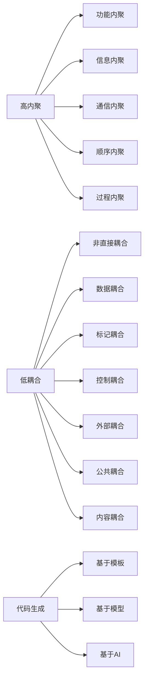

# 代码生成与软件架构设计:高内聚低耦合

## 1.背景介绍
### 1.1 软件开发的痛点
在软件开发过程中,我们常常面临着代码重复、耦合度高、可维护性差等问题。这些问题不仅降低了开发效率,也增加了后期维护的成本。如何编写高质量、可维护的代码,是每个开发者都需要思考的问题。
### 1.2 高内聚低耦合的意义  
高内聚低耦合是软件设计的一个重要原则。高内聚指的是模块内部各个元素之间联系紧密,职责单一;低耦合指的是模块之间的依赖关系要尽量弱化,模块之间要独立。遵循高内聚低耦合的设计原则,可以提高代码的可读性、可维护性和可复用性。
### 1.3 代码生成技术的发展
随着人工智能技术的发展,代码生成技术也取得了长足的进步。通过机器学习算法,可以自动生成符合特定模式的代码,大大提高了开发效率。同时,代码生成技术也为实现高内聚低耦合的代码设计提供了新的思路和方法。

## 2.核心概念与联系
### 2.1 内聚性
内聚性描述了一个模块内部各个元素之间的联系紧密程度。内聚性分为以下几种类型:
- 功能内聚:模块内的所有元素都是为了完成一个单一功能而协同工作。
- 信息内聚:模块内的所有元素都在操作同一个数据结构。 
- 通信内聚:模块内的所有元素之间通过参数传递信息。
- 顺序内聚:模块内的元素之间存在时间或空间上的依赖关系。
- 过程内聚:模块内的所有元素通过控制流相关联。
### 2.2 耦合性
耦合性描述了一个模块和其他模块之间的依赖关系。耦合性可分为:
- 内容耦合:一个模块直接修改或操作另一个模块的数据。
- 公共耦合:两个或多个模块共同引用一个全局数据。
- 外部耦合:一个模块访问另一个模块的外部接口。
- 控制耦合:一个模块向另一个模块传递控制信息。
- 标记耦合:两个模块之间通过一个公共数据格式进行通信。
- 数据耦合:模块之间通过参数传递数据。
- 非直接耦合:两个模块之间没有直接关系,它们通过第三方模块进行通信。
### 2.3 代码生成
代码生成是指根据某种规范或模板,自动生成代码的过程。常见的代码生成方法有:
- 基于模板的生成:根据预定义的模板,将业务逻辑嵌入到模板中生成代码。
- 基于模型的生成:根据领域模型,自动生成符合模型的代码。
- 基于AI的生成:利用机器学习算法,通过学习大量代码,自动生成特定模式的代码。



## 3.核心算法原理具体操作步骤
### 3.1 基于模板的代码生成
1. 定义代码模板:根据业务需求,设计符合要求的代码结构和接口。
2. 解析模板:将代码模板解析成抽象语法树(AST)。
3. 生成中间代码:根据AST和业务逻辑,生成中间代码。
4. 优化中间代码:对中间代码进行优化,如去除无用代码、内联函数等。
5. 生成目标代码:将优化后的中间代码转换成目标语言的代码。
### 3.2 基于模型的代码生成
1. 构建领域模型:根据业务需求,抽象出领域模型和业务规则。
2. 设计元模型:根据领域模型,设计用于描述模型的元模型。
3. 定义模型转换规则:设计将元模型转换为代码的规则。
4. 生成代码:应用转换规则,将元模型实例转换为代码。
### 3.3 基于AI的代码生成
1. 收集代码语料:收集大量的代码样本作为训练数据。
2. 预处理数据:对收集的代码样本进行清洗、标注,并将其转化为神经网络可以处理的格式。
3. 训练模型:选择合适的神经网络模型(如RNN、Transformer等),用预处理后的数据训练模型。
4. 生成代码:给定代码前缀或自然语言描述,用训练好的模型生成后续的代码。
5. 评估优化:评估生成代码的质量,不断优化和改进模型。

## 4.数学模型和公式详细讲解举例说明
### 4.1 基于模板的代码生成
基于模板的代码生成可以用以下公式来表示:

$G(T,D) = C$

其中,$T$表示代码模板,$D$表示业务数据,$C$表示生成的代码。生成过程可以用以下伪代码来描述:

```
function generate(template, data)
    ast = parse(template)
    ir = generateIR(ast, data)
    optimizedIR = optimize(ir)
    code = generateCode(optimizedIR)
    return code
```

### 4.2 基于模型的代码生成
基于模型的代码生成可以用以下公式来表示:

$G(M,R) = C$

其中,$M$表示领域模型,$R$表示转换规则,$C$表示生成的代码。生成过程可以用以下伪代码来描述:

```
function generate(model, rules)
    metamodel = createMetamodel(model)
    instance = createInstance(metamodel)
    code = applyRules(instance, rules)
    return code
```

### 4.3 基于AI的代码生成
基于AI的代码生成可以用以下公式来表示:

$G(P,\theta) = C$

其中,$P$表示代码前缀或自然语言描述,$\theta$表示训练好的神经网络模型参数,$C$表示生成的代码。生成过程可以用以下伪代码来描述:

```
function generate(prefix, model)
    code = model.predict(prefix)
    return code

function train(samples)
    X, Y = preprocess(samples)
    model = createModel()
    model.train(X, Y)
    return model
```

## 5.项目实践：代码实例和详细解释说明
下面是一个使用Python实现的基于模板的代码生成示例:

```python
from jinja2 import Template

def generate(template_str, data):
    template = Template(template_str)
    return template.render(data)

template_str = """
class {{ class_name }}:
    
    {{ field['type'] }} {{ field['name'] }};
    
    
    
    {{ method['return_type'] }} {{ method['name'] }}({{ method['params'] }}) {
        // TODO: implement
    }
    
"""

data = {
    'class_name': 'Person',
    'fields': [
        {'type': 'String', 'name': 'name'},
        {'type': 'int', 'name': 'age'}
    ],
    'methods': [
        {'name': '__init__', 'params': 'self, name, age', 'return_type': ''},
        {'name': 'greet', 'params': 'self', 'return_type': 'void'}
    ]
}

code = generate(template_str, data)
print(code)
```

在这个例子中,我们使用了Jinja2库来实现代码模板的渲染。generate函数接受两个参数:模板字符串和数据字典。它首先将模板字符串解析为Template对象,然后调用render方法,传入数据字典,生成最终的代码。

模板中使用了Jinja2的语法。{{ }}用于变量替换,用于控制语句。在这个例子中,我们根据data字典中的class_name、fields和methods生成了一个简单的类定义。

这只是一个简单的例子,实际的代码生成系统会更加复杂,需要考虑更多的因素,如语法检查、类型推断、优化等。但是,这个例子展示了基于模板的代码生成的基本原理。

## 6.实际应用场景
### 6.1 Web应用开发
在Web应用开发中,我们经常需要编写大量的增删改查(CRUD)代码。这些代码的结构非常相似,只是针对不同的实体和字段。我们可以使用代码生成技术,根据数据库表结构或领域模型,自动生成相应的Controller、Service、DAO等代码,提高开发效率。
### 6.2 移动应用开发
在移动应用开发中,我们经常需要为不同的平台(如Android和iOS)编写相似的业务逻辑代码。我们可以定义一套平台无关的领域模型和API,然后使用代码生成技术,根据这些模型和API,自动生成不同平台的代码,实现"一次设计,多平台运行"。
### 6.3 微服务开发
在微服务开发中,我们经常需要编写大量的服务接口和数据传输对象(DTO)。我们可以使用代码生成技术,根据服务的接口定义(如OpenAPI规范),自动生成服务端和客户端的代码,减少重复劳动。
### 6.4 低代码开发平台
低代码开发平台允许用户通过可视化的方式来设计应用,然后自动生成相应的代码。在这种场景下,代码生成技术是低代码平台的核心。平台需要根据用户的设计,自动生成符合设计的可运行代码。

## 7.工具和资源推荐
### 7.1 代码生成工具
- [Yeoman](https://yeoman.io/):一个通用的脚手架系统,可以帮助生成各种类型的项目。
- [Cookiecutter](https://github.com/cookiecutter/cookiecutter):一个使用模板生成项目的命令行工具。
- [Acceleo](https://www.eclipse.org/acceleo/):一个基于模型驱动的代码生成工具。
- [CodeSmith](https://www.codesmithtools.com/):一个用于生成代码的模板引擎。
### 7.2 代码生成库
- [Jinja2](https://jinja.palletsprojects.com/):一个Python的模板引擎,可以用于生成代码。
- [FreeMarker](https://freemarker.apache.org/):一个Java的模板引擎,可以用于生成代码。
- [Mustache](https://mustache.github.io/):一个跨语言的模板引擎,可以用于生成代码。
- [Roslyn](https://github.com/dotnet/roslyn):微软开源的C#和VB编译器,提供了丰富的代码分析和生成API。
### 7.3 学习资源
- [Martin Fowler的文章](https://martinfowler.com/articles/languageWorkbench.html):介绍了语言工作台和代码生成技术。
- [Code Generation Network](https://www.codegeneration.net/):一个专门讨论代码生成技术的网站。
- [MDSD专题](https://www.infoq.com/model-driven-software-development/):InfoQ上关于模型驱动软件开发的专题,包含了大量关于代码生成的文章和演讲。

## 8.总结：未来发展趋势与挑战
### 8.1 AI驱动的代码生成
随着人工智能技术的发展,特别是自然语言处理和机器学习技术的进步,AI驱动的代码生成将成为未来的一个重要方向。通过学习大量的代码和文档,AI系统可以理解开发者的意图,并自动生成符合要求的代码。这将极大地提高开发效率,降低开发门槛。
### 8.2 低代码/无代码开发
低代码/无代码开发平台允许用户通过可视化的方式来设计和开发应用,无需编写代码。这种趋势与代码生成技术密切相关。未来的低代码/无代码平台将更加智能,能够根据用户的设计意图,自动生成高质量、可维护的代码。
### 8.3 领域特定语言(DSL)
领域特定语言是为特定领域设计的编程语言。它们通常比通用编程语言更加简洁和抽象,更接近领