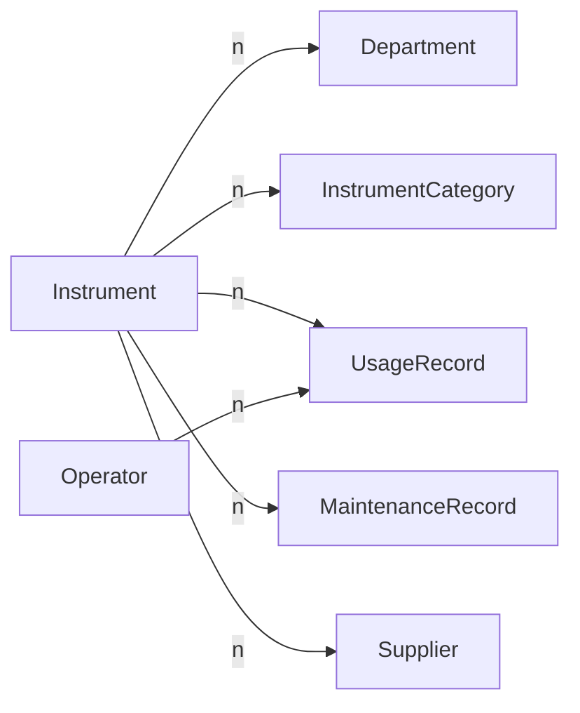

# 仪器管理系统详细设计与具体代码实现

## 1. 背景介绍

在现代化的科研、生产、医疗等领域,仪器设备的管理与维护是一项非常重要且复杂的工作。传统的人工管理方式,效率低下、差错率高,已经无法满足日益增长的仪器管理需求。因此,开发一套功能完善、易用高效的仪器管理系统势在必行。

本文将详细阐述如何从需求分析入手,经过概要设计、详细设计,最终通过具体的代码实现,开发出一套实用的仪器管理系统。重点介绍系统架构设计、数据库设计、核心业务逻辑的算法实现等关键内容。

### 1.1 仪器管理面临的问题与挑战

- 仪器设备种类繁多,参数各异,管理难度大
- 使用、维修记录缺乏规范性,查询困难
- 人工排班、统计效率低下,差错率高
- 缺乏统一的报表、数据分析功能,无法支撑管理决策

### 1.2 仪器管理系统的目标

- 信息化、规范化管理仪器设备及其使用、维护全生命周期
- 提高排班、统计、查询等管理工作效率,降低人为差错
- 支持多角色操作,控制数据访问权限,保障信息安全
- 自动生成各类报表,为管理决策提供数据支撑

## 2. 核心概念与关联

要设计仪器管理系统,首先要明确其核心业务概念,主要包括:

- 仪器(Instrument):系统管理的核心对象,具有编号、名称、型号、规格参数、购置日期、价格等属性信息。
- 科室(Department):使用仪器的单位,如化验科、放射科等。
- 仪器类别(InstrumentCategory):按功能、用途等对仪器进行分类,便于统计汇总。
- 操作员(Operator):使用仪器的工作人员,需要登记其基本信息。
- 使用记录(UsageRecord):操作员使用仪器时登记的记录,包括开始时间、结束时间、使用项目等。
- 维护记录(MaintenanceRecord):仪器的保养、维修、故障等情况的登记。
- 供应商(Supplier):仪器的生产厂商或销售单位。

这些核心概念之间的关联如下图所示:



## 3. 核心算法原理与操作步骤

仪器管理系统涉及的核心算法主要体现在排班、统计查询等功能。下面以排班为例,讲解其算法原理。

### 3.1 排班算法

排班是指根据操作员、仪器的属性,自动安排一定时间周期内,人员使用仪器的时间计划。其核心要素有:

1. 排班周期:以天、周、月为单位
2. 操作员:考虑其职称、专业特长等
3. 仪器:考虑其功能类别、数量、开放时段等
4. 约束条件:如每人每周使用不超过x小时,特定仪器需要特定人员操作等

排班可建模为约束满足问题(CSP),用回溯法求解:

1. 定义问题变量:Xij表示第i个人第j个时段是否排班
2. 定义约束条件:如 Σ Xij ≤ x (每人每周≤x小时)
3. 用回溯树枚举所有可能的排班方案
4. 剪枝:提前避免搜索不可行解,如第i人第j时段已排满,后续时段不再搜索
5. 找出满足所有约束的可行解,输出排班结果

伪代码:

```
function schedule(operators, instruments, constraints):
    result = []
    def backtrack(i, j, plan):
        if i == len(operators):  # 排完所有人
            result.append(plan)
            return
        for j in range(len(timeSlots)):
            if not conforms(plan, constraints): continue # 检查是否满足约束
            plan[i][j] = True
            backtrack(i+1, j, plan)
            plan[i][j] = False # 回溯
    backtrack(0, 0, [[False] * len(timeSlots)] * len(operators))
    return result
```

### 3.2 查询统计算法

查询统计是指根据设定的查询条件,从数据库检索出符合条件的数据,并进行汇总分析。其原理是将查询条件转化为SQL语句,提交给数据库执行。

以统计一段时间内仪器的使用情况为例:

1. 确定查询条件:如仪器类型、时间范围等
2. 生成SQL语句:
```sql
SELECT i.name, COUNT(r.id) AS times  
FROM Instrument i JOIN UsageRecord r ON i.id=r.instrumentId
WHERE i.categoryId=X AND r.startTime BETWEEN 'YYYY-MM-DD' AND 'YYYY-MM-DD'
GROUP BY i.id
```
3. 执行SQL得到聚合结果
4. 对结果进行进一步统计分析,如计算总使用次数、平均使用时长等

## 4. 数学建模与公式详解

仪器管理系统的一些功能需要借助数学模型来实现,如仪器故障预测、生命周期管理等。下面以故障预测为例,讲解其数学原理。

### 4.1 仪器故障预测模型

仪器故障率往往呈现出浴盆曲线(Bathtub Curve)的特点,即早期故障率较高(磨合期),之后进入平稳期,故障率降低并稳定一段时间,最后进入损耗期,故障率再度上升。

可使用威布尔分布(Weibull Distribution)对其建模,其概率密度函数为:

$$ f(t) = \frac{k}{\lambda} (\frac{t}{\lambda})^{k-1} e^{-(t/\lambda)^k} $$

其中:
- $t$ 是仪器使用时长
- $k$ 是形状参数,决定曲线的形状
- $\lambda$ 是尺度参数,决定曲线在时间轴上的伸缩

当 $k<1$ 时,故障率随时间递减;$k=1$ 时,故障率为常数;$k>1$ 时,故障率随时间递增。

根据仪器历史维修数据,可用最大似然估计(MLE)拟合出威布尔分布的参数。再根据当前时间t,计算出仪器的故障率,从而预测其故障风险。

### 4.2 仪器生命周期管理

仪器都有其自然的生命周期,购置初期价值较高,随着使用逐渐贬值,最后报废。为合理控制仪器更新成本,可借助数学模型优化其生命周期管理。

设仪器使用 $n$ 年的总费用为:

$$ C(n) = 购置成本 + \sum_{i=1}^n 年运维费 - 报废残值 $$

其中年运维费可视为固定值,报废残值可用直线折旧法估算:

$$ 报废残值 = 购置成本 \times (1 - 已使用年限/预计使用年限) $$

目标是求解最优的 $n$,使得平均年费用最小,即:

$$ min \frac{C(n)}{n} $$

可用数值优化算法求解,如梯度下降法、牛顿法等。

## 5. 项目实践:代码实现

下面给出仪器管理系统的部分核心代码实现,主要用到Spring Boot、MyBatis、MySQL等技术栈。

### 5.1 仪器管理模块

`Instrument.java` 定义仪器实体类:

```java
@Data
public class Instrument {
    private Long id;
    private String name;
    private String model;
    private Long categoryId;
    private Date purchaseDate;
    private BigDecimal price;
    //getter setter
}
```

`InstrumentMapper.java` 定义仪器数据访问层接口:

```java
@Mapper
public interface InstrumentMapper {
    @Select("SELECT * FROM instrument WHERE id=#{id}")
    Instrument getById(Long id);
    
    @Insert("INSERT INTO instrument(name,model,category_id,purchase_date,price) VALUES (#{name},#{model},#{categoryId},#{purchaseDate},#{price})")
    @Options(useGeneratedKeys=true, keyProperty="id")  
    void insert(Instrument instrument);
    
    @Update("UPDATE instrument SET name=#{name},model=#{model},category_id=#{categoryId},purchase_date=#{purchaseDate},price=#{price} WHERE id=#{id}")
    void update(Instrument instrument);
    
    @Delete("DELETE FROM instrument WHERE id=#{id}")
    void deleteById(Long id);
}
```

`InstrumentService.java` 定义仪器业务逻辑层:

```java
@Service
@Transactional
public class InstrumentService {
    @Autowired
    private InstrumentMapper instrumentMapper;
    
    public Instrument getInstrumentById(Long id) {
        return instrumentMapper.getById(id);
    }
    
    public void saveInstrument(Instrument instrument) {
        if(instrument.getId() == null) {
            instrumentMapper.insert(instrument);
        } else {
            instrumentMapper.update(instrument);
        }
    }
    
    public void removeInstrumentById(Long id) {
        instrumentMapper.deleteById(id);
    }
}
```

`InstrumentController.java` 定义仪器相关的Web接口:

```java
@RestController
@RequestMapping("/instrument")
public class InstrumentController {
    @Autowired
    private InstrumentService instrumentService;
    
    @GetMapping("/{id}")
    public Instrument getInstrument(@PathVariable Long id) {
        return instrumentService.getInstrumentById(id);
    }
    
    @PostMapping
    public void addInstrument(@RequestBody Instrument instrument) {
        instrumentService.saveInstrument(instrument);
    }
    
    @PutMapping
    public void updateInstrument(@RequestBody Instrument instrument) {
        instrumentService.saveInstrument(instrument);
    }
    
    @DeleteMapping("/{id}")
    public void removeInstrument(@PathVariable Long id) {
        instrumentService.removeInstrumentById(id);
    }
}
```

### 5.2 排班管理模块

`Operator.java` 定义操作员实体类:

```java
@Data
public class Operator {
    private Long id;
    private String name;
    private String title;
    private String specialty;
    //getter setter
}
```

`Schedule.java` 定义排班结果类:

```java
@Data
public class Schedule {
    private Long operatorId;
    private Long instrumentId;
    private Date startTime;
    private Date endTime;
    //getter setter
}
```

`ScheduleService.java` 实现排班算法:

```java
@Service
public class ScheduleService {
    
    public List<Schedule> autoSchedule(List<Operator> operators, List<Instrument> instruments, 
        Map<String,Object> constraints) {
        
        List<Schedule> result = new ArrayList<>();
        
        backtrack(result, operators, 0, instruments, 0, constraints, new ArrayList<>());
        
        return result; 
    }
    
    private void backtrack(List<Schedule> result, List<Operator> operators, int i, 
        List<Instrument> instruments, int j, Map<String,Object> constraints, List<Schedule> temp) {
        
        if(i == operators.size()) {
            result.addAll(temp);
            return;
        }
        
        for(int k=j; k<instruments.size(); k++) {
            if(!satisfy(temp, constraints)) continue;
            
            Operator o = operators.get(i);
            Instrument s = instruments.get(k);
            temp.add(new Schedule(o.getId(), s.getId(), startTime, endTime));
            
            backtrack(result, operators, i+1, instruments, k, constraints, temp);
            
            temp.remove(temp.size()-1);
        }
    }
    
    private boolean satisfy(List<Schedule> plan, Map<String,Object> constraints) {
        //check if satisfy constraints
        //...
    }
}
```

### 5.3 查询统计模块

`StatisticsController.java` 定义查询统计相关的Web接口:

```java
@RestController
@RequestMapping("/statistics")
public class StatisticsController {
    
    @Autowired
    private StatisticsService statisticsService;
    
    @GetMapping("/instrument-usage")
    public List<Map<String,Object>> getInstrumentUsage(@RequestParam Long categoryId, 
        @RequestParam @DateTimeFormat(pattern="yyyy-MM-dd") Date startDate,
        @RequestParam @DateTimeFormat(pattern="yyyy-MM-dd") Date endDate) {
        
        return statisticsService.instrumentUsage(categoryId, startDate, endDate);
    }
}
```

`StatisticsService.java` 实现查询统计SQL:

```java
@Service
public class StatisticsService {
    
    @Autowired
    private JdbcTemplate jdbcTemplate;
    
    public List<Map<String,Object>> instrumentUsage(Long categoryId, Date startDate, Date endDate) {
        String sql = "SELECT i.name, COUNT(r.id) AS times " +  
                "FROM instrument i JOIN usage_record r ON i.id=r.instrument_id " +
                "WHERE i.category_id=? AND r.start_time BETWEEN ? AND ? " +
                "GROUP BY i.id";
        
        return jdbcTemplate.queryForList(sql, categoryId, startDate, endDate);        
    }
}
```

## 6. 实际应用场景

仪器管