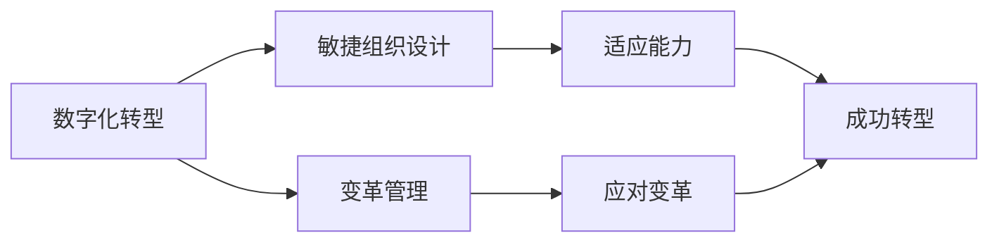

## 1.背景介绍

在我们的日常生活中，数字化转型已经成为了一个常见的词汇。从小到家庭，大到企业，无不在进行着各种形式的数字化转型。然而，数字化转型并非一蹴而就的过程，而是需要企业进行深度的组织设计和变革管理。本文将详细介绍企业在数字化转型中如何进行敏捷的组织设计和变革管理。

## 2.核心概念与联系

让我们首先了解一下相关的核心概念。敏捷组织设计是一种以人为本，注重灵活性和适应性的组织设计方式。它强调的是组织的快速响应和适应能力，而不是传统的稳定性和预测性。而变革管理则是指通过系统的方法和技术，使组织能够更好地适应和应对内外部环境的变化。

在数字化转型的过程中，这两个概念是相辅相成的。敏捷的组织设计可以使企业在面对数字化转型的挑战时，有更强的适应能力和应变能力。而有效的变革管理则可以帮助企业更好地应对和管理数字化转型过程中的各种变革。



## 3.核心算法原理具体操作步骤

在进行敏捷组织设计和变革管理时，我们可以遵循以下步骤：

1. 定义转型目标：明确企业的数字化转型目标是什么，这是所有工作的基础。
2. 设计组织结构：根据转型目标，设计出适应数字化转型的敏捷组织结构。
3. 制定变革策略：根据组织结构和转型目标，制定出相应的变革策略。
4. 实施变革：按照变革策略，进行具体的实施工作。
5. 评估与调整：在实施过程中，不断进行评估和调整，以确保变革的效果。

## 4.数学模型和公式详细讲解举例说明

在敏捷组织设计和变革管理中，我们可以使用一些数学模型和公式来帮助我们进行决策和评估。例如，我们可以使用决策树模型来帮助我们进行决策。决策树模型是一种树形结构，其中每个内部节点表示一个属性上的测试，每个分支代表一个测试结果，每个叶节点代表一种决策结果。

假设我们有一个决策问题，需要在三种策略中选择一种，我们可以使用决策树模型来帮助我们进行决策。首先，我们需要确定每种策略的可能结果和对应的概率，然后计算每种策略的期望值，选择期望值最大的策略。

假设策略A的可能结果有两种，分别是成功和失败，成功的概率是0.7，失败的概率是0.3，成功的收益是100，失败的收益是-50。那么策略A的期望值可以用以下公式计算：

$$
E(A) = 0.7 * 100 + 0.3 * (-50) = 55
$$

同样，我们也可以计算其他策略的期望值，然后选择期望值最大的策略。

## 5.项目实践：代码实例和详细解释说明

在实际的项目实践中，我们可以使用一些工具和方法来帮助我们进行敏捷组织设计和变革管理。例如，我们可以使用Scrum和Kanban这样的敏捷方法来管理我们的项目。这些方法强调的是灵活性和适应性，可以帮助我们更好地应对和管理变革。

以下是一个使用Python实现的简单决策树模型的代码示例：

```python
class DecisionNode:
    def __init__(self, value, true_branch=None, false_branch=None):
        self.value = value
        self.true_branch = true_branch
        self.false_branch = false_branch

def build_decision_tree(data):
    # ...
    return DecisionNode(value)

def classify(node, input_data):
    # ...
    return result
```

这个代码示例中，我们首先定义了一个决策节点类，然后实现了构建决策树和分类的函数。在实际的项目中，我们可以根据自己的需求来扩展这个模型。

## 6.实际应用场景

敏捷组织设计和变革管理在很多实际的应用场景中都有着广泛的应用。例如，在软件开发中，我们可以使用敏捷方法来管理我们的项目，以更好地应对需求的变化。在企业管理中，我们也可以使用敏捷的组织设计和变革管理，以更好地应对市场的变化。

## 7.工具和资源推荐

在进行敏捷组织设计和变革管理时，有一些工具和资源可以帮助我们。例如，我们可以使用Jira和Trello这样的项目管理工具来管理我们的项目。我们也可以阅读《敏捷革命》和《敏捷敏捷软件开发：原则、模式与实践》这样的书籍，以深入了解敏捷的理念和方法。

## 8.总结：未来发展趋势与挑战

随着数字化转型的深入，敏捷组织设计和变革管理将会越来越重要。然而，这也带来了很多挑战，例如如何在保持敏捷的同时，确保组织的稳定性和效率。这需要我们不断的学习和实践，以找到最适合自己的方法。

## 9.附录：常见问题与解答

1. 问题：敏捷组织设计和变革管理有什么关系？
   答：敏捷组织设计和变革管理是相辅相成的。敏捷的组织设计可以使企业在面对数字化转型的挑战时，有更强的适应能力和应变能力。而有效的变革管理则可以帮助企业更好地应对和管理数字化转型过程中的各种变革。

2. 问题：如何进行敏捷组织设计和变革管理？
   答：我们可以遵循以下步骤：定义转型目标，设计组织结构，制定变革策略，实施变革，评估与调整。

3. 问题：敏捷组织设计和变革管理有哪些实际应用？
   答：敏捷组织设计和变革管理在很多实际的应用场景中都有着广泛的应用。例如，在软件开发中，我们可以使用敏捷方法来管理我们的项目，以更好地应对需求的变化。在企业管理中，我们也可以使用敏捷的组织设计和变革管理，以更好地应对市场的变化。

作者：禅与计算机程序设计艺术 / Zen and the Art of Computer Programming