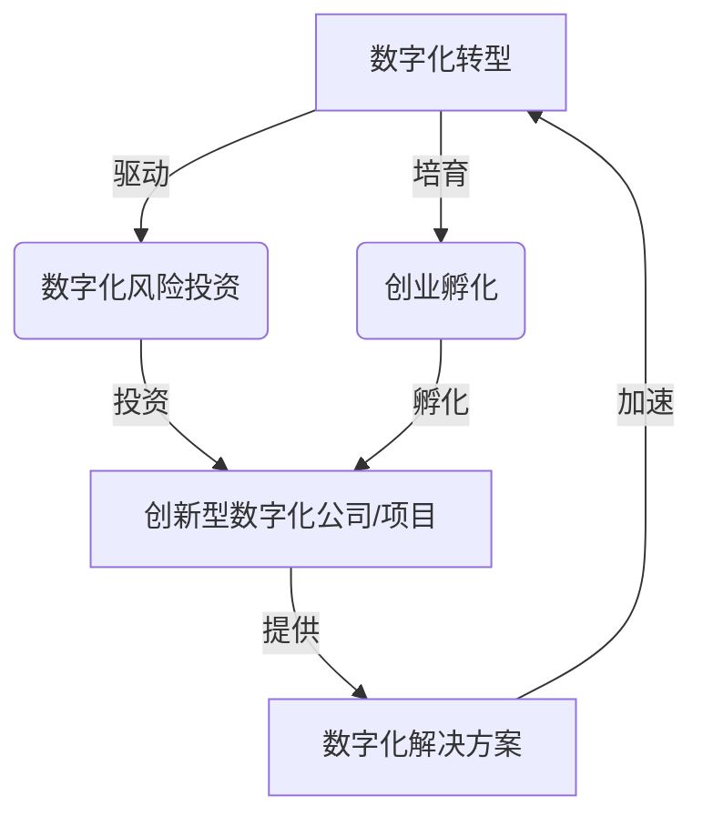

# 企业数字化转型中的数字化风险投资与创业孵化

## 1. 背景介绍

### 1.1 数字化转型的重要性

在当今快速发展的数字时代,企业面临着前所未有的挑战和机遇。传统的商业模式和运营方式已经无法满足日益变化的市场需求和消费者期望。因此,企业必须紧跟时代步伐,全面拥抱数字化转型,以保持竞争力并实现可持续发展。

数字化转型是指利用数字技术来彻底改造企业的业务流程、运营模式和客户体验。这种转型不仅涉及技术层面,更需要改变企业的文化、思维模式和组织结构。成功的数字化转型能够帮助企业提高效率、降低成本、增强灵活性,并创造全新的收入来源和商业机会。

### 1.2 数字化风险投资的重要性

尽管数字化转型带来了巨大的机遇,但同时也存在着诸多风险和挑战。企业需要投入大量资金和资源来实施数字化战略,并面临着技术、人才、安全等多方面的风险。因此,数字化风险投资成为了企业数字化转型的关键环节。

数字化风险投资是指投资于那些致力于开发和应用数字技术的创新型公司和项目。这些投资不仅能够为企业带来直接的经济回报,更重要的是能够帮助企业获取先进的数字技术和解决方案,从而加速数字化转型进程。

### 1.3 创业孵化在数字化转型中的作用

创业孵化是指为初创企业提供所需的资源和支持,帮助它们成长并最终独立运营。在数字化转型的背景下,创业孵化扮演着至关重要的角色。

一方面,创业孵化能够培育出大量具有创新思维和数字化能力的初创企业,为企业数字化转型提供新鲜血液和持续动力。另一方面,企业也可以通过创业孵化的方式,与初创企业建立合作关系,共同探索和开发数字化解决方案。

总的来说,数字化风险投资和创业孵化是企业数字化转型不可或缺的两个重要环节,它们能够为企业注入创新动力,降低转型风险,并加速转型进程。

## 2. 核心概念与联系

在探讨企业数字化转型中的数字化风险投资与创业孵化之前,我们需要先了解几个核心概念及它们之间的联系。

### 2.1 数字化转型

数字化转型是指企业利用数字技术来彻底改造业务流程、运营模式和客户体验的过程。它不仅涉及技术层面,更需要改变企业的文化、思维模式和组织结构。

### 2.2 数字化风险投资

数字化风险投资是指投资于那些致力于开发和应用数字技术的创新型公司和项目。通过投资这些公司和项目,企业能够获取先进的数字技术和解决方案,从而加速数字化转型进程。

### 2.3 创业孵化

创业孵化是指为初创企业提供所需的资源和支持,帮助它们成长并最终独立运营。在数字化转型的背景下,创业孵化能够培育出大量具有创新思维和数字化能力的初创企业,为企业数字化转型提供新鲜血液和持续动力。

### 2.4 创新型数字化公司/项目

创新型数字化公司/项目是指那些专注于开发和应用数字技术的创新型企业或项目。它们通常拥有先进的技术和创新理念,能够为企业数字化转型提供切实可行的解决方案。

### 2.5 数字化解决方案

数字化解决方案是指利用数字技术来解决企业在数字化转型过程中遇到的各种问题和挑战的方案。这些解决方案可以来自于企业内部研发,也可以来自于外部投资或合作。

## 3. 核心算法原理具体操作步骤

在企业数字化转型中,数字化风险投资和创业孵化并非一蹴而就的过程,而是需要遵循一定的原理和步骤。下面我们将详细介绍其中的核心算法原理和具体操作步骤。

### 3.1 数字化风险投资的核心算法原理

数字化风险投资的核心算法原理可以概括为以下几个方面:

1. **投资组合优化原理**

投资组合优化原理是指通过科学的方式来构建和管理投资组合,以实现风险和收益的最佳平衡。在数字化风险投资中,这意味着需要对潜在的投资标的进行全面评估,并根据风险偏好和投资目标来合理分配资金。

2. **技术评估原理**

技术评估原理是指对投资标的的技术实力进行深入评估,以确保其技术的先进性、可行性和商业价值。这通常需要专家团队对技术进行全面审核和测试。

3. **商业模式评估原理**

商业模式评估原理是指对投资标的的商业模式进行评估,以确保其能够实现可持续的盈利和增长。这需要分析市场需求、竞争格局、收入模式等多个方面。

4. **风险管理原理**

风险管理原理是指通过各种手段来识别、评估和控制投资过程中的各种风险,包括技术风险、市场风险、财务风险等。这需要建立完善的风险管理体系和应急预案。

5. **价值增值原理**

价值增值原理是指在投资过程中,不仅提供资金支持,还要为投资标的提供管理、技术、市场等多方面的指导和帮助,以帮助其快速成长并实现价值最大化。

### 3.2 创业孵化的核心算法原理

创业孵化的核心算法原理可以概括为以下几个方面:

1. **项目甄选原理**

项目甄选原理是指通过严格的标准和流程来甄选具有创新性和发展潜力的初创项目,以确保孵化资源的高效利用。

2. **资源整合原理**

资源整合原理是指为初创企业提供所需的各种资源支持,包括办公场地、专业指导、融资渠道等,并将这些资源进行有效整合,以最大限度地促进初创企业的发展。

3. **培育机制原理**

培育机制原理是指建立科学的培育机制,通过分阶段的指导和帮助,逐步提升初创企业的各项能力,直至最终能够独立运营。

4. **网络效应原理**

网络效应原理是指利用孵化器内部的资源网络和外部的合作伙伴网络,为初创企业提供更多的机会和支持,形成良性循环。

5. **价值实现原理**

价值实现原理是指通过孵化过程,不仅帮助初创企业实现自身价值,同时也为企业数字化转型输送创新力量和解决方案,实现双赢。

### 3.3 数字化风险投资与创业孵化的具体操作步骤

基于上述核心算法原理,我们可以总结出数字化风险投资与创业孵化的具体操作步骤如下:

#### 数字化风险投资操作步骤:

1. 确定投资策略和目标
2. 建立投资团队和专家委员会
3. 搜寻和甄选潜在投资标的
4. 进行尽职调查和风险评估
5. 确定投资金额和条款
6. 签订投资协议并落实投资
7. 提供后续支持和指导
8. 持续监控和管理投资组合
9. 实现投资退出并获取回报

#### 创业孵化操作步骤:

1. 制定孵化器发展规划
2.建立孵化器运营团队
3. 搭建孵化器基础设施
4. 确立项目甄选标准和流程
5. 吸引并甄选优质初创项目
6. 提供全方位资源支持
7. 实施分阶段培育计划
8. 建立内外部合作网络
9. 推动初创企业独立运营
10. 持续优化孵化器运营模式

通过严格执行上述操作步骤,企业可以更加高效地开展数字化风险投资和创业孵化工作,从而为数字化转型注入持续的创新动力。

## 4. 数学模型和公式详细讲解举例说明

在数字化风险投资和创业孵化过程中,我们需要借助一些数学模型和公式来进行决策分析和优化。下面我们将详细介绍其中的几个重要模型和公式。

### 4.1 投资组合理论

投资组合理论是数字化风险投资中一个非常重要的理论基础。它旨在通过构建优化的投资组合,实现风险和收益的最佳平衡。

投资组合理论的核心公式是:

$$
\sigma_p^2 = \sum_{i=1}^n \sum_{j=1}^n w_i w_j \sigma_{ij}
$$

其中:
- $\sigma_p^2$ 表示投资组合的方差(风险)
- $w_i$ 和 $w_j$ 分别表示投资标的 i 和 j 在投资组合中的权重
- $\sigma_{ij}$ 表示投资标的 i 和 j 之间的协方差

通过调整每个投资标的的权重,我们可以最小化投资组合的风险,或在给定风险水平下最大化收益。

### 4.2 技术评估模型

技术评估模型旨在对投资标的的技术实力进行全面评估,以确保其技术的先进性、可行性和商业价值。一个常用的技术评估模型是:

$$
T = \sum_{i=1}^n w_i \cdot s_i
$$

其中:
- $T$ 表示技术评估得分
- $w_i$ 表示第 i 个评估指标的权重
- $s_i$ 表示投资标的在第 i 个评估指标上的得分

评估指标通常包括技术创新性、技术可行性、技术成熟度、专利情况、团队实力等多个方面。通过对每个指标进行打分并加权求和,我们可以得到投资标的的综合技术评估得分。

### 4.3 商业模式评估模型

商业模式评估模型旨在对投资标的的商业模式进行评估,以确保其能够实现可持续的盈利和增长。一个常用的商业模式评估模型是:

$$
B = \sum_{i=1}^n w_i \cdot s_i
$$

其中:
- $B$ 表示商业模式评估得分
- $w_i$ 表示第 i 个评估指标的权重
- $s_i$ 表示投资标的在第 i 个评估指标上的得分

评估指标通常包括市场需求、竞争格局、收入模式、盈利能力、团队实力等多个方面。通过对每个指标进行打分并加权求和,我们可以得到投资标的的综合商业模式评估得分。

### 4.4 风险管理模型

风险管理模型旨在识别、评估和控制投资过程中的各种风险。一个常用的风险管理模型是:

$$
R = \sum_{i=1}^n p_i \cdot c_i
$$

其中:
- $R$ 表示总体风险值
- $p_i$ 表示第 i 种风险发生的概率
- $c_i$ 表示第 i 种风险造成的损失

通过评估每种风险的发生概率和潜在损失,并将它们相乘求和,我们可以得到投资过程的总体风险值。根据这个风险值,我们可以制定相应的风险应对策略和应急预案。

### 4.5 价值增值模型

价值增值模型旨在量化投资标的在投资过程中的价值增长情况,以评估投资的效果。一个常用的价值增值模型是:

$$
V = V_0 \cdot (1 + r)^t
$$

其中:
- $V$ 表示投资标的的最终价值
- $V_0$ 表示投资标的的初始价值
- $r$ 表示年化增长率
- $t$ 表示投资期限(年