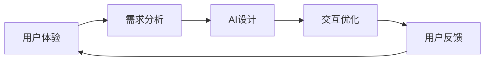

## 1.背景介绍

随着科技的快速发展，人工智能（AI）已经渗透到了我们生活的方方面面。从智能手机到智能家居，从自动驾驶到虚拟助手，AI正在逐渐改变我们的生活方式。然而，尽管AI的技术在不断进步，但用户的交互体验却常常被忽视。这就引出了我们今天要探讨的主题：如何优化AI交互体验，以用户为中心的设计。

## 2.核心概念与联系

在深入讨论如何优化AI交互体验之前，我们首先需要了解两个核心概念：用户体验（UX）和人工智能（AI）。用户体验是指用户在使用产品或服务时的感受和反应，而人工智能则是指由计算机系统执行的，通常需要人类智能的任务。这两者之间的关系是密不可分的，因为AI的目标就是提供更好的用户体验。

为了更好地理解这两个概念之间的联系，我们可以通过以下Mermaid流程图进行直观的展示：



## 3.核心算法原理具体操作步骤

优化AI交互体验的过程可以分为以下几个步骤：

1. 需求分析：首先，我们需要对用户的需求进行深入的分析，了解用户在使用产品或服务时遇到的问题和挑战。

2. AI设计：基于需求分析的结果，我们可以设计出满足用户需求的AI解决方案。这可能涉及到机器学习、深度学习、自然语言处理等多种AI技术。

3. 交互优化：在AI设计的基础上，我们需要进一步优化用户交互体验。这可能涉及到界面设计、交互流程优化、反馈机制设计等方面。

4. 用户反馈：最后，我们需要收集用户的反馈，以便不断优化我们的AI解决方案。

## 4.数学模型和公式详细讲解举例说明

在AI设计中，我们通常会使用一些数学模型和公式来帮助我们理解和解决问题。例如，我们可能会使用决策树、神经网络、支持向量机等模型来进行机器学习，或者使用概率模型来进行自然语言处理。

为了方便理解，我们以决策树为例，详细讲解其数学模型和公式。

决策树是一种常用的分类方法，它通过一系列的问题来决定数据的分类结果。决策树的构建过程可以用以下公式表示：

$$
Information Gain(D, a) = Entropy(D) - \sum_{v \in Values(a)} \frac{|D_v|}{|D|} Entropy(D_v)
$$

其中，$D$表示数据集，$a$表示属性，$Values(a)$表示属性$a$的所有可能值，$D_v$表示数据集$D$中属性$a$的值为$v$的子集，$Entropy(D)$表示数据集$D$的熵。

## 5.项目实践：代码实例和详细解释说明

在实际项目中，我们可以使用Python的scikit-learn库来实现决策树模型。以下是一个简单的代码示例：

```python
from sklearn import datasets
from sklearn.model_selection import train_test_split
from sklearn import tree

# 加载数据集
iris = datasets.load_iris()
X = iris.data
y = iris.target

# 划分训练集和测试集
X_train, X_test, y_train, y_test = train_test_split(X, y, test_size=0.3, random_state=1)

# 创建决策树模型
clf = tree.DecisionTreeClassifier()

# 训练模型
clf.fit(X_train, y_train)

# 测试模型
print(clf.score(X_test, y_test))
```

## 6.实际应用场景

优化AI交互体验的方法可以应用在许多场景中，例如智能家居、自动驾驶、虚拟助手等。以下是一些具体的应用示例：

1. 智能家居：通过对用户的生活习惯进行学习，AI可以自动调整家庭设备的设置，以提供更好的用户体验。

2. 自动驾驶：通过对驾驶环境和用户需求的理解，AI可以提供更安全、更舒适的驾驶体验。

3. 虚拟助手：通过对用户的需求和反馈的理解，AI可以提供更个性化的服务，以提供更好的用户体验。

## 7.工具和资源推荐

优化AI交互体验的过程中，以下工具和资源可能会对你有所帮助：

1. 设计工具：如Sketch、Adobe XD等，可以帮助你设计出更好的用户界面。

2. AI库：如TensorFlow、PyTorch、scikit-learn等，可以帮助你实现各种AI算法。

3. 用户研究工具：如UserTesting、Hotjar等，可以帮助你获取用户的反馈和建议。

## 8.总结：未来发展趋势与挑战

随着AI技术的不断发展，我们有理由相信，优化AI交互体验将会成为未来的一个重要趋势。然而，同时我们也面临着一些挑战，例如如何更好地理解用户需求，如何设计出更自然的交互方式，如何处理用户的隐私问题等。

## 9.附录：常见问题与解答

1. 问题：优化AI交互体验的过程中，我应该如何理解用户需求？

   回答：理解用户需求的最好方法就是直接与用户进行交流。你可以通过调查问卷、用户访谈、用户测试等方式来获取用户的反馈和建议。

2. 问题：我应该如何选择合适的AI算法？

   回答：选择AI算法的时候，你应该考虑你的问题类型、数据类型、计算资源等因素。你也可以参考相关的研究论文和教程来获取更多的建议。

3. 问题：如何处理用户的隐私问题？

   回答：在使用AI技术的过程中，你应该尊重用户的隐私，遵守相关的法律法规。你应该明确告知用户你会如何使用他们的数据，并提供给用户足够的控制权。

作者：禅与计算机程序设计艺术 / Zen and the Art of Computer Programming