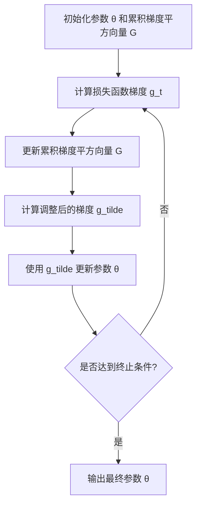

# 优化算法：Adagrad 原理与代码实例讲解

## 1.背景介绍

在机器学习和深度学习领域中,优化算法扮演着至关重要的角色。它们用于调整模型的可训练参数,以最小化损失函数并提高模型的性能。传统的优化算法,如梯度下降(Gradient Descent)和随机梯度下降(Stochastic Gradient Descent,SGD),虽然简单有效,但在处理高维稀疏数据或特征之间存在明显梯度差异时,可能会遇到一些挑战。

为了解决这些挑战,研究人员提出了自适应学习率优化算法。Adagrad(Adaptive Gradient Algorithm)就是其中一种广为人知的自适应学习率优化算法。它通过根据参数的历史梯度值来动态调整每个参数的学习率,从而加速收敛并提高模型性能。

### 1.1 梯度下降算法的局限性

在深入探讨 Adagrad 算法之前,让我们先回顾一下传统梯度下降算法的局限性。

梯度下降算法使用固定的全局学习率来更新模型参数。这种方法在处理平坦区域(低曲率)和陡峭区域(高曲率)时可能会遇到问题。在平坦区域,较大的学习率可能会导致振荡,而在陡峭区域,较小的学习率可能会导致缓慢收敛。

此外,梯度下降算法对于不同特征的梯度大小也是一视同仁。这可能会导致一些参数被过度更新,而另一些参数则更新不足,从而影响模型的收敛速度和性能。

### 1.2 Adagrad 算法的优势

Adagrad 算法通过为每个参数分配一个自适应的学习率来解决上述问题。它根据参数的历史梯度值来动态调整学习率,从而实现更快的收敛和更好的性能。

具体来说,Adagrad 算法会累积所有过去的梯度平方,并使用这个累积值来缩放当前的梯度。对于具有较大梯度的参数,学习率会被适当缩小,从而避免过度更新。相反,对于具有较小梯度的参数,学习率会被适当增大,以加速收敛。

通过这种自适应的学习率调整机制,Adagrad 算法可以更好地处理梯度差异问题,并提高模型在高维稀疏数据上的性能。

## 2.核心概念与联系

为了更好地理解 Adagrad 算法,我们需要先介绍一些核心概念。

### 2.1 学习率(Learning Rate)

学习率是一个超参数,它控制了每次参数更新的步长大小。较大的学习率可以加快收敛速度,但可能会导致振荡和不稳定。较小的学习率则可能会导致收敛缓慢。因此,选择合适的学习率对于优化算法的性能至关重要。

### 2.2 梯度(Gradient)

梯度是损失函数关于模型参数的偏导数。它指示了参数应该朝哪个方向更新,以最小化损失函数。在梯度下降算法中,我们根据梯度的方向和学习率来更新参数。

### 2.3 自适应学习率(Adaptive Learning Rate)

自适应学习率是一种动态调整每个参数学习率的机制。与使用固定全局学习率不同,自适应学习率可以根据参数的历史梯度值来调整每个参数的学习率。这种方法可以更好地处理梯度差异问题,并加速收敛。

Adagrad 算法就是一种自适应学习率优化算法,它通过累积历史梯度平方来动态调整每个参数的学习率。

## 3.核心算法原理具体操作步骤

现在,让我们深入探讨 Adagrad 算法的核心原理和具体操作步骤。

### 3.1 算法描述

Adagrad 算法的核心思想是为每个参数维护一个累积梯度平方的向量,并使用该向量来缩放当前的梯度。具体步骤如下:

1. 初始化模型参数 $\theta$ 和累积梯度平方向量 $G$,其中 $G$ 初始值为 0。
2. 在每次迭代中,计算损失函数关于当前参数 $\theta$ 的梯度 $g_t$。
3. 更新累积梯度平方向量 $G$:

$$G_{t+1} = G_t + g_t^2$$

其中 $g_t^2$ 表示对梯度向量进行逐元素平方操作。

4. 计算调整后的梯度:

$$\tilde{g_t} = \frac{\eta}{\sqrt{G_{t+1} + \epsilon}} \odot g_t$$

其中 $\eta$ 是初始学习率, $\epsilon$ 是一个平滑项(通常取 $10^{-8}$),用于避免除以 0 的情况。$\odot$ 表示逐元素相乘。

5. 使用调整后的梯度 $\tilde{g_t}$ 更新参数:

$$\theta_{t+1} = \theta_t - \tilde{g_t}$$

通过上述步骤,Adagrad 算法可以自适应地调整每个参数的学习率。对于具有较大梯度的参数,累积梯度平方会增加,从而缩小学习率,避免过度更新。相反,对于具有较小梯度的参数,累积梯度平方增加较慢,因此学习率会相对较大,加速收敛。

### 3.2 算法流程图

为了更好地理解 Adagrad 算法的工作流程,我们使用 Mermaid 绘制了一个流程图:



该流程图清晰地展示了 Adagrad 算法的核心步骤,包括初始化、计算梯度、更新累积梯度平方、计算调整后的梯度、更新参数,以及终止条件的检查。

## 4.数学模型和公式详细讲解举例说明

在上一节中,我们已经介绍了 Adagrad 算法的核心原理和操作步骤。现在,让我们更深入地探讨一下算法中使用的数学模型和公式。

### 4.1 累积梯度平方

Adagrad 算法的核心思想是累积历史梯度平方,并使用该累积值来调整每个参数的学习率。具体来说,在第 $t$ 次迭代中,累积梯度平方向量 $G_t$ 的更新公式为:

$$G_{t+1} = G_t + g_t^2$$

其中 $g_t$ 是当前迭代的梯度向量,而 $g_t^2$ 表示对梯度向量进行逐元素平方操作。

例如,假设我们有一个简单的线性回归模型,其中只有两个参数 $\theta_1$ 和 $\theta_2$。在第 $t$ 次迭代中,梯度向量为 $g_t = [0.2, -0.1]^T$,则:

$$g_t^2 = [0.2^2, (-0.1)^2] = [0.04, 0.01]$$

如果初始时 $G_0 = [0, 0]^T$,那么在第 $t+1$ 次迭代中,累积梯度平方向量 $G_{t+1}$ 将更新为:

$$G_{t+1} = G_t + g_t^2 = [0, 0] + [0.04, 0.01] = [0.04, 0.01]$$

通过不断累积历史梯度平方,Adagrad 算法可以动态地调整每个参数的学习率,从而加速收敛并提高模型性能。

### 4.2 调整后的梯度

在计算出累积梯度平方向量 $G_{t+1}$ 后,Adagrad 算法会使用它来缩放当前的梯度 $g_t$,得到调整后的梯度 $\tilde{g_t}$:

$$\tilde{g_t} = \frac{\eta}{\sqrt{G_{t+1} + \epsilon}} \odot g_t$$

其中 $\eta$ 是初始学习率, $\epsilon$ 是一个平滑项(通常取 $10^{-8}$),用于避免除以 0 的情况。$\odot$ 表示逐元素相乘。

让我们继续上面的线性回归示例,假设初始学习率 $\eta = 0.1$,平滑项 $\epsilon = 10^{-8}$,那么在第 $t+1$ 次迭代中,调整后的梯度 $\tilde{g_{t+1}}$ 将被计算为:

$$\tilde{g_{t+1}} = \frac{0.1}{\sqrt{[0.04, 0.01] + 10^{-8}}} \odot [0.2, -0.1]$$
$$= [0.1 / \sqrt{0.04 + 10^{-8}}, 0.1 / \sqrt{0.01 + 10^{-8}}] \odot [0.2, -0.1]$$
$$= [0.0447, -0.0995]$$

我们可以看到,对于具有较大梯度的参数 $\theta_1$,其对应的调整后梯度 $\tilde{g_{t+1}}[0]$ 被缩小了,而对于具有较小梯度的参数 $\theta_2$,其对应的调整后梯度 $\tilde{g_{t+1}}[1]$ 被放大了。这种自适应的学习率调整机制有助于加速收敛并提高模型性能。

### 4.3 参数更新

最后,Adagrad 算法使用调整后的梯度 $\tilde{g_t}$ 来更新模型参数 $\theta$:

$$\theta_{t+1} = \theta_t - \tilde{g_t}$$

在我们的线性回归示例中,假设当前参数为 $\theta_t = [1.0, -0.5]^T$,那么在第 $t+1$ 次迭代中,参数将被更新为:

$$\theta_{t+1} = \theta_t - \tilde{g_{t+1}} = [1.0, -0.5] - [0.0447, -0.0995] = [0.9553, -0.4005]$$

通过不断地重复这个过程,Adagrad 算法可以逐步调整模型参数,最小化损失函数,并提高模型性能。

## 5.项目实践：代码实例和详细解释说明

为了更好地理解 Adagrad 算法,让我们通过一个实际的代码示例来演示它的实现和应用。在这个示例中,我们将使用 Python 和 NumPy 库来构建一个简单的线性回归模型,并使用 Adagrad 算法来优化模型参数。

### 5.1 导入所需库

```python
import numpy as np
```

### 5.2 生成模拟数据

首先,我们生成一些模拟数据,用于训练线性回归模型。

```python
# 生成模拟数据
X = np.random.rand(1000, 1)
y = 2 * X + 1 + np.random.randn(1000, 1)
```

在这个示例中,我们生成了 1000 个样本,每个样本只有一个特征值。真实的目标值 `y` 是由线性方程 `y = 2 * X + 1` 加上一些随机噪声生成的。

### 5.3 定义线性回归模型

接下来,我们定义线性回归模型的预测函数和损失函数。

```python
# 线性回归模型
def predict(X, theta):
    return X.dot(theta)

# 均方误差损失函数
def mse_loss(y_true, y_pred):
    return 0.5 * np.mean((y_true - y_pred) ** 2)
```

`predict` 函数实现了线性回归模型的预测,它将输入特征 `X` 与模型参数 `theta` 相乘,得到预测值。`mse_loss` 函数则计算了均方误差损失,用于评估模型的性能。

### 5.4 实现 Adagrad 算法

现在,我们来实现 Adagrad 算法的核心部分。

```python
# Adagrad 算法
def adagrad(X, y, theta, eta=0.1, eps=1e-8, n_iters=1000):
    m = len(y)
    g_sum = np.zeros_like(theta)  # 累积梯度平方
    
    for i in range(n_iters):