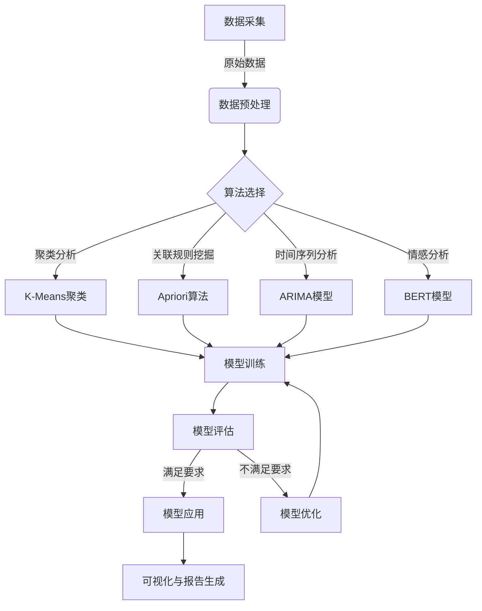

# 使用AI代理进行市场分析：工作流程与数据解读

## 1.背景介绍

### 1.1 市场分析的重要性

在当今瞬息万变的商业环境中,市场分析已成为企业赢得竞争优势的关键因素。通过深入分析市场趋势、消费者行为和竞争格局,企业可以制定出明智的战略决策,抓住新的商机,并提高产品或服务的市场适应性。

### 1.2 人工智能(AI)在市场分析中的作用

传统的市场分析方法往往依赖于人工处理大量数据,费时费力且容易出现偏差。而AI技术的出现为市场分析带来了全新的机遇。AI代理可以高效处理海量数据,发现隐藏的模式和洞见,从而为企业提供更准确、更深入的市场分析结果。

## 2.核心概念与联系

### 2.1 AI代理

AI代理是指具备一定智能的软件程序,能够根据预设目标和环境信息自主做出决策并采取行动。在市场分析领域,AI代理可以集成多种算法模型,包括机器学习、自然语言处理、计算机视觉等,用于分析各种形式的市场数据。

### 2.2 数据采集

高质量的数据是市场分析的基础。AI代理可以从多个渠道采集相关数据,包括网络爬虫、社交媒体API、在线调查等。同时,AI代理还可以对数据进行预处理,如去重、标准化等,为后续分析做好准备。

### 2.3 数据分析

AI代理可以应用各种机器学习算法对采集的数据进行分析,包括:

- 聚类分析:发现消费者群体的潜在细分
- 关联规则挖掘:发现产品或服务之间的关联模式
- 时间序列分析:预测未来的市场趋势
- 情感分析:分析消费者对品牌或产品的情绪态度
- ...

### 2.4 可视化与报告

分析结果需要以易于理解的形式呈现,AI代理可以生成丰富的可视化图表和报告,帮助企业领导和营销人员快速把握关键信息。

## 3.核心算法原理具体操作步骤

使用AI代理进行市场分析的核心算法原理和具体操作步骤如下:



### 3.1 数据采集

使用网络爬虫、API等方式从各种在线渠道采集原始数据,包括电商网站、社交媒体、论坛等。

### 3.2 数据预处理

对采集的原始数据进行清洗、标准化、去重等预处理,以确保数据质量。常用的预处理技术包括正则表达式、TF-IDF等。

### 3.3 算法选择

根据分析目标,选择合适的机器学习算法,如聚类分析、关联规则挖掘、时间序列分析、情感分析等。

### 3.4 模型训练

使用预处理后的数据训练选定的算法模型。

#### 3.4.1 聚类分析 - K-Means算法

K-Means是一种常用的聚类算法,可用于发现消费者群体的潜在细分。算法步骤:

1. 随机选取K个初始质心
2. 计算每个数据点到各个质心的距离,将其分配到最近的簇
3. 重新计算每个簇的质心
4. 重复步骤2-3,直至质心不再发生变化

#### 3.4.2 关联规则挖掘 - Apriori算法  

Apriori算法用于发现数据集中的频繁项集,从而挖掘出有价值的关联规则。算法步骤:

1. 设定最小支持度阈值
2. 统计数据集中每个项的支持度,过滤掉低于阈值的项
3. 生成满足最小支持度的频繁项集
4. 从频繁项集中挖掘出满足最小置信度阈值的关联规则

#### 3.4.3 时间序列分析 - ARIMA模型

ARIMA(自回归移动平均模型)常用于对具有一定趋势和周期性的时间序列数据(如销售额)进行预测。模型步骤:

1. 检查时间序列的平稳性,必要时进行差分
2. 识别模型的自回归(AR)和移动平均(MA)阶数
3. 估计模型参数
4. 使用拟合后的ARIMA模型进行预测

#### 3.4.4 情感分析 - BERT模型

BERT是一种基于Transformer的预训练语言模型,可用于情感分析等自然语言处理任务。算法步骤:

1. 使用BERT对文本进行预训练,获取上下文表示
2. 在预训练模型的基础上,进行针对情感分析的微调训练
3. 使用微调后的BERT模型对新文本进行情感分类

### 3.5 模型评估

使用测试集对训练好的模型进行评估,计算相关指标(如准确率、F1分数等),判断模型性能是否满足要求。

### 3.6 模型应用与优化

如果模型性能满足要求,即可将其应用于实际的市场分析任务;否则需要对模型进行优化,如调整超参数、增加训练数据等。

### 3.7 可视化与报告生成

将分析结果以图表、报告等形式可视化输出,方便企业领导和营销人员理解和决策。

## 4.数学模型和公式详细讲解举例说明

市场分析中常用的数学模型和公式包括:

### 4.1 K-Means聚类

K-Means聚类的目标是将$n$个数据点$\{x_1,x_2,...,x_n\}$划分为$K$个簇$\{C_1,C_2,...,C_K\}$,使得簇内数据点相似度较高,簇间相似度较低。常用的相似度度量是欧几里得距离:

$$d(x_i,x_j)=\sqrt{\sum_{l=1}^{m}(x_{il}-x_{jl})^2}$$

其中$m$是数据点的维度。

K-Means算法的目标函数是最小化所有数据点到其所属簇质心的距离平方和:

$$J=\sum_{i=1}^{n}\sum_{j=1}^{K}r_{ij}d(x_i,\mu_j)^2$$

这里$r_{ij}$是指示函数,当$x_i$属于簇$C_j$时取1,否则取0;$\mu_j$是簇$C_j$的质心,计算方法为:

$$\mu_j=\frac{1}{|C_j|}\sum_{x_i\in C_j}x_i$$

通过迭代优化目标函数$J$,可以得到最终的聚类结果。

### 4.2 Apriori算法

Apriori算法中的两个关键概念是支持度和置信度。

给定项集$X$和事务数据集$D$,项集$X$在$D$中的支持度定义为:

$$\text{support}(X)=\frac{|\{t\in D|X\subseteq t\}|}{|D|}$$

也就是包含项集$X$的事务在整个数据集中所占的比例。

对于关联规则$X\Rightarrow Y$,其置信度定义为:

$$\text{confidence}(X\Rightarrow Y)=\frac{\text{support}(X\cup Y)}{\text{support}(X)}$$

置信度表示在包含$X$的事务中,同时也包含$Y$的比例。

Apriori算法的目标是找到所有满足最小支持度和最小置信度阈值的频繁项集和关联规则。

### 4.3 ARIMA模型

ARIMA模型由三部分组成:自回归(AR)模型、积分(I)和移动平均(MA)模型。对于时间序列$\{y_t\}$,ARIMA(p,d,q)模型可表示为:

$$y_t=c+\phi_1y_{t-1}+...+\phi_py_{t-p}+\theta_1\epsilon_{t-1}+...+\theta_q\epsilon_{t-q}+\epsilon_t$$

其中:
- $c$是常数项
- $\phi_1,...,\phi_p$是自回归系数
- $\theta_1,...,\theta_q$是移动平均系数
- $\epsilon_t$是白噪声项,服从均值为0、方差为$\sigma^2$的正态分布

通过估计这些参数,即可对时间序列进行预测。

### 4.4 BERT情感分析

BERT是一种基于Transformer的双向编码器表示,可以很好地捕获文本的上下文信息。对于给定的文本序列$\{x_1,x_2,...,x_n\}$,BERT将其映射为上下文表示序列$\{h_1,h_2,...,h_n\}$。

在情感分析任务中,我们将$h_n$作为文本的句级表示,送入分类器进行情感预测:

$$\hat{y}=\text{softmax}(Wh_n+b)$$

其中$W$和$b$是可训练参数。

通过最小化交叉熵损失函数,可以学习BERT模型和分类器的参数:

$$J(\theta)=-\frac{1}{N}\sum_{i=1}^N\sum_{c=1}^C\mathbb{1}(y^{(i)}=c)\log p(y^{(i)}=c|x^{(i)};\theta)$$

这里$\theta$代表所有可训练参数,$N$是训练样本数,$C$是情感类别数。

## 5.项目实践:代码实例和详细解释说明

以下是一个使用Python和相关库实现市场分析AI代理的示例代码:

```python
import pandas as pd
import numpy as np
from sklearn.cluster import KMeans
from mlxtend.frequent_patterns import apriori
from statsmodels.tsa.arima.model import ARIMA
from transformers import BertForSequenceClassification

# 数据采集和预处理
data = pd.read_csv('ecommerce_data.csv')
data = data.dropna()

# 聚类分析 - 客户细分
X = data[['Age', 'Income']]
kmeans = KMeans(n_clusters=5).fit(X)
data['Cluster'] = kmeans.labels_

# 关联规则挖掘 - 购买模式
transactions = data['Products'].str.split(',')
frequent_itemsets = apriori(transactions, min_support=0.01, use_colnames=True)
rules = association_rules(frequent_itemsets, metric='confidence', min_threshold=0.6)

# 时间序列分析 - 销售预测
sales = data.groupby('Date')['Revenue'].sum().reset_index()
model = ARIMA(sales['Revenue'], order=(1,1,1)).fit()
forecast = model.forecast(steps=30)[0]

# 情感分析 - 评论分类
bert = BertForSequenceClassification.from_pretrained('bert-base-uncased')
tokenizer = BertTokenizer.from_pretrained('bert-base-uncased')

texts = data['Review'].values
encoded = tokenizer(list(texts), padding=True, truncation=True, return_tensors='pt')

output = bert(**encoded)
preds = output.logits.argmax(-1)
```

以上代码实现了四个核心功能:

1. **客户细分**:使用K-Means聚类算法根据客户年龄和收入对客户进行细分,结果保存在`data`数据框的`Cluster`列中。

2. **购买模式挖掘**:使用Apriori算法从交易数据中发现频繁项集,并生成关联规则,置信度阈值设为0.6。

3. **销售预测**:使用ARIMA模型对时间序列销售数据进行建模,并预测未来30天的销售额。

4. **评论情感分析**:使用预训练的BERT模型对产品评论进行情感分类,得到每条评论的情感极性预测。

这些功能可为企业提供有价值的市场洞见,如消费者群体特征、热销产品组合、未来销售趋势、客户满意度等。

需要注意的是,上述代码只是一个简单示例,在实际应用中可能需要进行更多数据预处理、模型调优等工作。此外,还可以结合其他AI技术(如计算机视觉)对更丰富的数据进行分析。

## 6.实际应用场