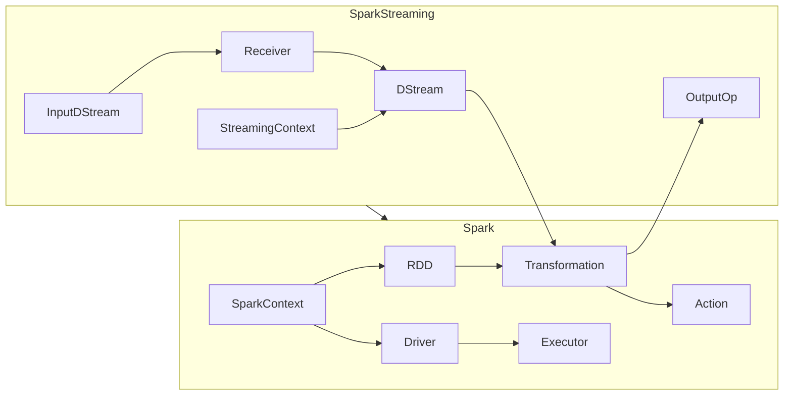
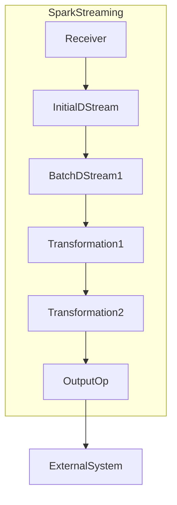

# 使用SparkStreaming处理实时农业数据分析

## 1.背景介绍

### 1.1 农业大数据时代的来临

随着物联网、云计算和大数据技术的快速发展,农业生产正在经历前所未有的数字化转型。传统的农业生产方式正在被新的数据驱动的智能农业所取代。无论是种植业还是畜牧业,都产生了大量的实时数据,包括土壤湿度、温度、作物生长状况、牲畜健康状况等。这些海量的实时数据对于提高农业生产效率、降低成本、实现精准化管理具有重要意义。

### 1.2 实时数据处理的挑战

然而,处理这些实时农业大数据面临着巨大的挑战。首先,数据量巨大且不断增长,单机处理能力有限。其次,数据种类繁多,结构复杂,包括结构化数据(如温湿度数据)和非结构化数据(如农田图像)。再者,实时性要求很高,需要在数据产生后的几秒钟内完成处理和分析,以便及时作出决策。最后,数据来源分散,需要集成多个异构数据源。

### 1.3 SparkStreaming作为解决方案

Apache Spark作为一种快速、通用的大数据处理引擎,其流数据处理组件SparkStreaming可以高效、可靠地处理实时农业数据。SparkStreaming能够从诸如Kafka、Flume、Kinesis等流媒体中读取数据,并利用Spark强大的内存计算能力对数据进行实时处理、分析和建模。同时,SparkStreaming与Spark生态圈中的其他组件高度集成,可以轻松构建端到端的实时数据处理管道。

## 2.核心概念与联系

### 2.1 Spark核心概念

在深入讨论SparkStreaming之前,我们先简要介绍一下Spark的核心概念:

- **RDD(Resilient Distributed Dataset)**:Spark的基本数据结构,是一个不可变、分区的记录集合。
- **Transformation**:对RDD进行无副作用的转换操作,如map、filter、join等。
- **Action**:对RDD进行有副作用的操作并触发实际计算,如count、collect、save等。
- **SparkContext**:程序的入口点,用于创建RDD和发起计算任务。
- **Executor**:运行在Worker节点上的计算进程,负责执行任务。
- **Driver Program**:运行在Master节点上的主程序,负责调度和协调Executor。

### 2.2 SparkStreaming概念

SparkStreaming将实时数据流分成多个批次,每个批次数据都被当作一个RDD进行处理。其核心概念包括:

- **DStream(Discretized Stream)**:代表连续不断的数据流,由一系列连续的RDD组成。
- **Input DStream**:从外部数据源(如Kafka、Flume)获取实时数据流。
- **Receiver**:接收外部数据源的数据,并将其存储为Spark的内部数据。
- **Transformation on DStreams**:对DStream应用RDD的转换操作,如map、filter等。
- **Output Operation on DStreams**:输出操作,如保存到外部数据库或文件系统。
- **StreamingContext**:类似于SparkContext,是流式程序的入口点。



上图展示了Spark和SparkStreaming之间的关系。SparkStreaming将实时数据流处理转化为对一系列小批量数据RDD的操作,从而利用Spark强大的内存计算能力。

## 3.核心算法原理具体操作步骤 

### 3.1 SparkStreaming工作原理

SparkStreaming将实时数据流分成一个个小批次,每个批次数据都被当作一个RDD进行处理。具体步骤如下:

1. **接收数据**:Receiver从数据源(如Kafka)获取实时数据,并将其存储到Spark的内存中,形成一个初始的数据流DStream。

2. **批次划分**:根据配置的批次间隔时间(如2秒),将DStream按时间切分成一系列小批次的DStream。每个批次DStream内部数据都是一个RDD。

3. **转换操作**:对每个批次DStream应用RDD的转换操作,如map、flatMap、filter等,生成新的DStream。

4. **输出操作**:在经过一系列转换后,对结果DStream执行输出操作,如保存到外部数据库或文件系统。

5. **驱动执行**:由SparkStreaming的驱动程序启动执行,周期性地从源头重新获取数据,并应用上述步骤。



上图展示了SparkStreaming的核心工作流程。通过周期性地将实时数据流拆分成小批次的RDD,并对每个批次RDD进行转换和输出操作,从而实现了准实时的数据处理。

### 3.2 有状态转换操作

除了常规的转换操作外,SparkStreaming还支持有状态的转换操作,如updateStateByKey和mapWithState。有状态转换允许在批次之间维护和传递状态信息,适用于需要跨批次聚合的场景,如计算移动平均值、实现数据去重等。

```scala
val updateFunc = (values: Seq[Int], state: Option[Int]) => {
  val currentCount = state.getOrElse(0)
  val newSum = values.sum + currentCount
  state.isSome && (newSum > MAX_COUNT)
}

val runningCounts = dataStream.updateStateByKey(updateFunc)
```

上面的代码展示了updateStateByKey的使用方式。updateFunc函数根据当前批次的数据和上一批次的状态计算新的结果,并决定是否更新状态。通过有状态转换,可以实现更加复杂的数据处理逻辑。

## 4.数学模型和公式详细讲解举例说明

在农业大数据分析中,常常需要利用数学模型和公式对数据进行建模和预测。以下是一些常见的模型和公式:

### 4.1 作物生长模型

作物生长模型用于预测作物在特定环境条件下的生长情况,是精准农业的重要工具。一种常用的作物生长模型是逻辑斯谛(Logistic)模型:

$$
Y = \frac{A}{1 + e^{-k(t-t_0)}}
$$

其中:
- $Y$是作物生物量
- $A$是最大生物量
- $k$是相对生长率
- $t$是时间
- $t_0$是拐点时间

通过对历史数据拟合,可以估计出模型参数$A$、$k$和$t_0$,进而对未来作物生长情况进行预测。

### 4.2 土壤湿度模型

土壤湿度是影响作物生长的重要因素。一种常用的土壤湿度模型是van Genuchten模型:

$$
\theta(h) = \theta_r + \frac{\theta_s - \theta_r}{[1 + (\alpha|h|)^n]^m}
$$

其中:
- $\theta(h)$是给定压力头$h$时的体积含水率
- $\theta_r$是残余含水率
- $\theta_s$是饱和含水率
- $\alpha$、$n$、$m$是经验参数,与土壤结构有关

利用该模型可以根据测量的压力头数据预测土壤含水量,为灌溉决策提供依据。

### 4.3 牲畜健康评估

在畜牧业中,及时评估牲畜健康状况对于防治疫病、提高饲养效率至关重要。一种常用的健康评估模型是Logistic回归模型:

$$
P(y=1|X) = \frac{1}{1 + e^{-(\beta_0 + \beta_1 x_1 + \beta_2 x_2 + \cdots + \beta_n x_n)}}
$$

其中:
- $y$是二元结果(健康或患病)
- $X = (x_1, x_2, \ldots, x_n)$是特征向量,包括体温、食量、活动量等指标
- $\beta_i$是回归系数,需要通过训练数据估计

该模型可以根据牲畜的各项健康指标,计算出患病的概率,从而对其健康状况进行评估。

通过将这些数学模型与SparkStreaming相结合,我们可以实现实时的农业数据建模和预测,为精准决策提供支持。

## 5.项目实践:代码实例和详细解释说明

为了更好地理解如何使用SparkStreaming进行实时农业数据分析,我们将通过一个具体的项目实践来演示。该项目旨在实时监测农场的土壤湿度,并根据湿度数据进行灌溉决策。

### 5.1 项目概述

我们假设农场安装了多个土壤湿度传感器,这些传感器会实时将数据发送到Kafka消息队列中。我们需要从Kafka中消费数据,对其进行实时处理和分析,并根据分析结果触发相应的灌溉操作。

### 5.2 开发环境准备

1. 安装Spark、Kafka和相关依赖库。
2. 启动Kafka服务器和ZooKeeper服务器。
3. 创建Kafka主题用于接收传感器数据。

### 5.3 数据模拟

为了模拟实时数据流,我们创建一个Kafka生产者程序,每隔一段时间向Kafka主题发送一条湿度数据。

```scala
import java.util.Properties
import org.apache.kafka.clients.producer.{KafkaProducer, ProducerRecord}

object MockSensorData {
  def main(args: Array[String]): Unit = {
    val props = new Properties()
    props.put("bootstrap.servers", "localhost:9092")
    props.put("key.serializer", "org.apache.kafka.common.serialization.StringSerializer")
    props.put("value.serializer", "org.apache.kafka.common.serialization.StringSerializer")

    val producer = new KafkaProducer[String, String](props)

    while (true) {
      val moisture = Math.random() * 100 // 模拟湿度数据
      val record = new ProducerRecord[String, String]("soil-moisture", s"sensor1,$moisture")
      producer.send(record)
      Thread.sleep(5000) // 每5秒发送一条数据
    }
  }
}
```

### 5.4 SparkStreaming应用程序

接下来,我们编写SparkStreaming应用程序,从Kafka中消费数据,并对其进行实时分析和处理。

```scala
import org.apache.spark.SparkConf
import org.apache.spark.streaming.{Seconds, StreamingContext}
import org.apache.spark.streaming.kafka010.ConsumerStrategies.Subscribe
import org.apache.spark.streaming.kafka010.KafkaUtils
import org.apache.spark.streaming.kafka010.LocationStrategies.PreferConsistent

object SoilMoistureAnalyzer {
  def main(args: Array[String]): Unit = {
    val conf = new SparkConf().setAppName("SoilMoistureAnalyzer")
    val ssc = new StreamingContext(conf, Seconds(5))

    val kafkaParams = Map(
      "bootstrap.servers" -> "localhost:9092",
      "key.deserializer" -> classOf[StringDeserializer],
      "value.deserializer" -> classOf[StringDeserializer],
      "group.id" -> "soil-moisture-group",
      "auto.offset.reset" -> "latest",
      "enable.auto.commit" -> (false: java.lang.Boolean)
    )

    val topics = Array("soil-moisture")
    val stream = KafkaUtils.createDirectStream[String, String](
      ssc,
      PreferConsistent,
      Subscribe[String, String](topics, kafkaParams)
    )

    val moistureData = stream.map(record => {
      val fields = record.value().split(",")
      (fields(0), fields(1).toDouble)
    })

    val avgMoisture = moistureData.reduceByKey((x, y) => (x + y) / 2)

    avgMoisture.foreachRDD(rdd => {
      if (!rdd.isEmpty()) {
        val results = rdd.collect().mkString("\n")
        println(s"Average soil moisture: \n$results")

        // 根据湿度数据触发灌溉操作
        rdd.foreach(data => {
          if (data._2 < 30.0) {
            println(s"Triggering irrigation for ${data._1}")
            // 执行灌溉操作的代码
          }
        })
      }
    })

    ssc.start()
    ssc.awaitTermination()
  }
}
```

上述程序的主要步骤如下:

1. 创建SparkStreaming上下文和Kafka参数配置。
2. 从