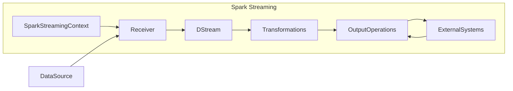
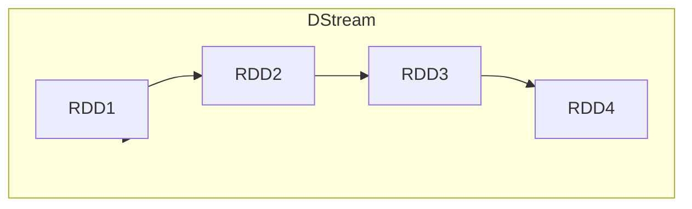
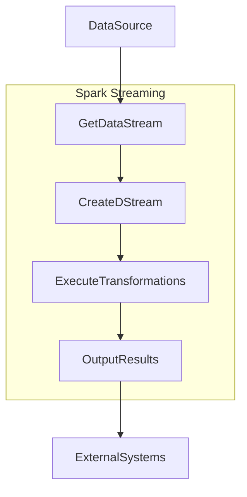

# 使用SparkStreaming进行实时网络数据分析

## 1.背景介绍

### 1.1 大数据时代的来临

在当今时代,数据已经成为了一种新的"燃料",推动着各行各业的发展。随着物联网、移动互联网、社交网络等新兴技术的迅猛发展,海量的数据源源不断地产生,数据规模呈现出前所未有的增长态势。传统的数据处理系统很难满足对实时性和大规模数据处理的需求。因此,大数据技术应运而生,旨在高效地收集、存储和分析这些海量数据。

### 1.2 实时数据处理的重要性

在大数据时代,实时数据处理变得越来越重要。企业需要及时获取数据洞见,以便快速做出决策并保持竞争优势。例如,金融机构需要实时检测欺诈行为;电商网站需要实时分析用户行为以提供个性化推荐;社交媒体平台需要实时监控热点话题等。实时数据处理不仅能够提高数据价值,还能够优化业务流程,提高运营效率。

### 1.3 Spark Streaming简介

Apache Spark是一个开源的大数据处理引擎,它提供了强大的实时数据处理能力。Spark Streaming作为Spark生态系统的一个重要组成部分,旨在解决实时数据处理的挑战。它支持从各种数据源(如Kafka、Flume、Kinesis等)获取实时数据流,并使用Spark的高度优化的执行引擎对数据进行分布式处理。Spark Streaming将实时数据流拆分为一系列的小批量(micro-batches),并使用Spark的RDD(Resilient Distributed Dataset)进行并行处理,从而实现高吞吐量和低延迟的实时数据处理。

## 2.核心概念与联系

### 2.1 Spark Streaming架构

Spark Streaming的架构由以下几个核心组件组成:

1. **Spark Streaming Context**: 它是Spark Streaming的主要入口点,用于创建输入DStream(Discretized Stream)和执行数据处理操作。

2. **Receiver(接收器)**: 它从数据源(如Kafka、Flume等)获取实时数据,并将数据存储在Spark的内存中。

3. **DStream(Discretized Stream)**: 它是Spark Streaming中最基本的抽象,表示一个连续的数据流,由一系列的RDD(Resilient Distributed Dataset)组成。

4. **Transformations(转换操作)**: 这些操作用于对DStream进行各种转换,如过滤、映射、连接等,以实现所需的数据处理逻辑。

5. **Output Operations(输出操作)**: 这些操作用于将处理后的数据输出到外部系统,如HDFS、数据库等。

以下是Spark Streaming架构的Mermaid流程图:



### 2.2 DStream和RDD

DStream(Discretized Stream)是Spark Streaming中的核心抽象,它表示一个连续的数据流,由一系列的RDD(Resilient Distributed Dataset)组成。每个RDD包含一个数据批次,其中包含在特定时间段内到达的数据。DStream提供了一组高级别的转换操作,如map、filter、join等,用于对数据流进行处理。

DStream和RDD之间的关系如下:

- DStream是一个不可变的、有序的数据流,由多个RDD组成。
- 每个RDD包含一个数据批次,其中包含在特定时间段内到达的数据。
- DStream的转换操作实际上是对底层RDD执行相应的转换操作。

以下是DStream和RDD之间关系的Mermaid流程图:



### 2.3 有状态和无状态转换

Spark Streaming支持两种类型的转换操作:无状态转换(stateless transformations)和有状态转换(stateful transformations)。

1. **无状态转换**:这些转换只依赖于当前批次的数据,例如map、filter、flatMap等。无状态转换不需要维护任何状态信息,因此可以独立地对每个批次进行处理。

2. **有状态转换**:这些转换需要维护一些状态信息,例如updateStateByKey、reduceByKeyAndWindow等。有状态转换需要跨多个批次进行计算,因此需要维护一些状态信息,如窗口数据或累加器等。

无状态转换通常用于简单的数据转换和过滤操作,而有状态转换则用于更复杂的数据聚合和窗口计算等场景。

## 3.核心算法原理具体操作步骤

### 3.1 Spark Streaming工作流程

Spark Streaming的工作流程如下:

1. **获取数据流**:首先,Spark Streaming需要从数据源(如Kafka、Flume等)获取实时数据流。这通常由Receiver(接收器)完成。

2. **创建DStream**:接下来,Spark Streaming会将获取到的数据流转换为DStream(Discretized Stream)。DStream由一系列的RDD(Resilient Distributed Dataset)组成,每个RDD包含一个数据批次。

3. **执行转换操作**:对DStream执行各种转换操作,如map、filter、join等,以实现所需的数据处理逻辑。这些转换操作实际上是对底层RDD执行相应的转换操作。

4. **输出结果**:最后,将处理后的数据输出到外部系统,如HDFS、数据库等。

以下是Spark Streaming工作流程的Mermaid流程图:



### 3.2 Spark Streaming编程模型

Spark Streaming提供了一种简单而强大的编程模型,用于实现实时数据处理逻辑。以下是编程模型的基本步骤:

1. **创建SparkStreaming上下文**:首先,需要创建一个SparkStreaming上下文对象(StreamingContext),它是Spark Streaming的主要入口点。

```scala
import org.apache.spark.streaming.StreamingContext
import org.apache.spark.streaming.Seconds

val sparkConf = new SparkConf().setAppName("NetworkStreamingAnalysis")
val ssc = new StreamingContext(sparkConf, Seconds(2))
```

2. **创建输入DStream**:接下来,需要从数据源创建一个输入DStream。Spark Streaming支持多种数据源,如Kafka、Flume、Socket等。

```scala
val lines = ssc.socketTextStream("localhost", 9999)
```

3. **执行转换操作**:对输入DStream执行各种转换操作,如map、filter、reduceByKey等,以实现所需的数据处理逻辑。

```scala
val words = lines.flatMap(_.split(" "))
val pairs = words.map(word => (word, 1))
val wordCounts = pairs.reduceByKey(_ + _)
```

4. **输出结果**:最后,将处理后的结果输出到外部系统,如HDFS、数据库等。

```scala
wordCounts.print()
```

5. **启动Spark Streaming应用**:启动Spark Streaming应用,开始处理实时数据流。

```scala
ssc.start()
ssc.awaitTermination()
```

通过这种编程模型,开发人员可以快速构建实时数据处理管道,并轻松地集成各种数据源和输出系统。

## 4.数学模型和公式详细讲解举例说明

在实时数据处理中,常常需要使用一些数学模型和公式来进行数据分析和预测。以下是一些常见的数学模型和公式,以及它们在实时数据处理中的应用场景。

### 4.1 指数平滑模型

指数平滑模型是一种时间序列预测模型,它通过对历史数据进行加权平均来预测未来值。该模型的基本公式如下:

$$
S_t = \alpha X_t + (1 - \alpha) S_{t-1}
$$

其中:

- $S_t$ 表示时间 $t$ 的平滑值
- $X_t$ 表示时间 $t$ 的实际观测值
- $\alpha$ 是平滑参数,取值范围为 $0 < \alpha < 1$
- $S_{t-1}$ 表示时间 $t-1$ 的平滑值

指数平滑模型在实时数据处理中有多种应用场景,例如:

- 网络流量预测:通过分析历史网络流量数据,预测未来网络流量的变化趋势,从而优化网络资源分配。
- 实时异常检测:通过对实时数据进行指数平滑,可以检测出异常值,从而及时发现和处理异常情况。

### 4.2 线性回归模型

线性回归模型是一种常用的监督学习算法,它通过拟合一条直线来描述自变量和因变量之间的线性关系。线性回归模型的基本公式如下:

$$
y = \beta_0 + \beta_1 x_1 + \beta_2 x_2 + \cdots + \beta_n x_n + \epsilon
$$

其中:

- $y$ 是因变量
- $x_1, x_2, \cdots, x_n$ 是自变量
- $\beta_0, \beta_1, \cdots, \beta_n$ 是回归系数
- $\epsilon$ 是误差项

线性回归模型在实时数据处理中也有广泛的应用,例如:

- 实时需求预测:通过分析历史销售数据和其他影响因素,预测未来的产品需求,从而优化库存管理和供应链决策。
- 实时定价优化:通过分析市场数据和竞争对手的价格策略,动态调整产品价格,以最大化收益。

### 4.3 逻辑回归模型

逻辑回归模型是一种用于分类问题的监督学习算法。它通过估计自变量对因变量的影响,计算因变量取不同值的概率。逻辑回归模型的基本公式如下:

$$
P(Y=1|X) = \frac{1}{1 + e^{-(\beta_0 + \beta_1 X_1 + \cdots + \beta_n X_n)}}
$$

其中:

- $P(Y=1|X)$ 表示给定自变量 $X$ 时,因变量 $Y$ 取值为 1 的概率
- $X_1, X_2, \cdots, X_n$ 是自变量
- $\beta_0, \beta_1, \cdots, \beta_n$ 是回归系数

逻辑回归模型在实时数据处理中的应用场景包括:

- 实时欺诈检测:通过分析用户行为数据和历史欺诈案例,建立逻辑回归模型,实时预测欺诈概率,从而及时发现和防止欺诈行为。
- 实时用户分类:通过分析用户的浏览记录、购买历史等数据,建立逻辑回归模型,实时将用户划分为不同的类别,从而提供个性化的推荐和服务。

通过将这些数学模型和公式应用于实时数据处理,我们可以提高数据分析的准确性和效率,从而获得更有价值的洞见和预测结果。

## 5.项目实践:代码实例和详细解释说明

在本节中,我们将通过一个实际的项目实践,演示如何使用Spark Streaming进行实时网络数据分析。我们将构建一个简单的网络流量监控系统,实时分析来自多个网络节点的流量数据,并输出每个节点的流量统计信息。

### 5.1 项目概述

我们将模拟一个网络环境,其中有多个节点(如路由器、交换机等)产生网络流量数据。每个节点会定期向Kafka发送包含时间戳和流量大小的消息。我们将使用Spark Streaming从Kafka消费这些消息,并实时统计每个节点的流量信息,包括总流量、平均流量和最大流量等。

### 5.2 项目设置

首先,我们需要准备以下环境:

1. **Apache Kafka**:用于模拟网络节点发送流量数据。
2. **Apache Spark**:用于构建实时数据处理管道。
3. **Scala**:我们将使用Scala编写Spark Streaming应用程序。

接下来,我们需要创建一个Kafka主题,用于模拟网络节点发送流量数据。在Kafka安装目录下执行以下命令:

```bash
bin/kafka-topics.sh --create --bootstrap-server localhost:9092 --replication-factor