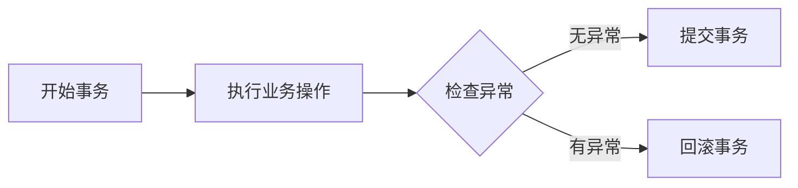

## 1.背景介绍

在许多现代企业级应用中，事务管理是一个关键的组成部分。事务可以确保数据的一致性和完整性，特别是在并发环境中。在Java企业应用开发中，Spring框架为事务管理提供了强大的支持，其中包括编程式和声明式两种事务管理方式。本文将重点讨论编程式事务管理的优缺点。

## 2.核心概念与联系

编程式事务管理是指通过编程的方式来管理事务，即在代码中明确地调用事务API。Spring框架提供了PlatformTransactionManager接口，以及其各种实现，如DataSourceTransactionManager，HibernateTransactionManager等，以支持编程式事务管理。



## 3.核心算法原理具体操作步骤

编程式事务管理的操作步骤如下：

1. 获取PlatformTransactionManager实例。
2. 使用TransactionDefinition定义事务属性。
3. 使用PlatformTransactionManager的getTransaction()方法开始一个新的事务。
4. 执行业务操作。
5. 如果业务操作成功，使用PlatformTransactionManager的commit()方法提交事务；如果业务操作失败，使用PlatformTransactionManager的rollback()方法回滚事务。

## 4.数学模型和公式详细讲解举例说明

在事务管理中，一个重要的概念是ACID属性，即原子性(Atomicity)，一致性(Consistency)，隔离性(Isolation)和持久性(Durability)。这些属性确保在并发环境中数据的一致性和完整性。

- 原子性：事务是一个不可分割的工作单位，事务中的操作要么全部完成，要么全部不完成。
- 一致性：事务必须使数据库从一个一致性状态变到另一个一致性状态。
- 隔离性：一个事务的执行不能被其他事务干扰。
- 持久性：一个事务一旦被提交，它对数据库中的数据的改变就是永久性的。

## 5.项目实践：代码实例和详细解释说明

以下是一个使用Spring编程式事务管理的代码示例：

```java
@Autowired
private PlatformTransactionManager txManager;

public void transfer(String out, String in, Double money) {
    TransactionDefinition definition = new DefaultTransactionDefinition();
    TransactionStatus status = txManager.getTransaction(definition);

    try {
        accountDao.outMoney(out, money);
        accountDao.inMoney(in, money);
        txManager.commit(status);
    } catch (Exception e) {
        txManager.rollback(status);
        throw e;
    }
}
```

## 6.实际应用场景

编程式事务管理在以下场景中可能更有优势：

- 当事务管理需要细粒度控制时，如需要在运行时动态决定是否使用事务，或者需要在一个方法中包含多个事务。
- 当事务管理的复杂性超出了声明式事务管理的能力时，如需要处理嵌套事务。

## 7.工具和资源推荐

- Spring框架：提供了强大的事务管理支持。
- MyBatis、Hibernate等ORM框架：与Spring框架集成，可以方便地进行事务管理。

## 8.总结：未来发展趋势与挑战

尽管编程式事务管理提供了更高的灵活性，但它也有一些缺点。首先，它会使代码变得复杂，增加了出错的可能性。其次，事务管理代码与业务代码混合在一起，违反了关注点分离原则。

随着微服务和分布式系统的普及，事务管理面临着新的挑战。在这种情况下，可能需要使用更复杂的事务模型，如分布式事务，这使得事务管理变得更加复杂。因此，如何简化事务管理，保证数据的一致性和完整性，是未来需要解决的问题。

## 9.附录：常见问题与解答

- 问：编程式事务管理和声明式事务管理有什么区别？
答：编程式事务管理是通过编程的方式来管理事务，需要在代码中明确地调用事务API。而声明式事务管理是通过配置的方式来管理事务，无需在代码中调用事务API。

- 问：编程式事务管理有什么优点？
答：编程式事务管理提供了更高的灵活性，可以进行细粒度的事务控制。例如，可以在运行时动态决定是否使用事务，或者在一个方法中包含多个事务。

- 问：编程式事务管理有什么缺点？
答：编程式事务管理会使代码变得复杂，增加了出错的可能性。此外，事务管理代码与业务代码混合在一起，违反了关注点分离原则。

作者：禅与计算机程序设计艺术 / Zen and the Art of Computer Programming