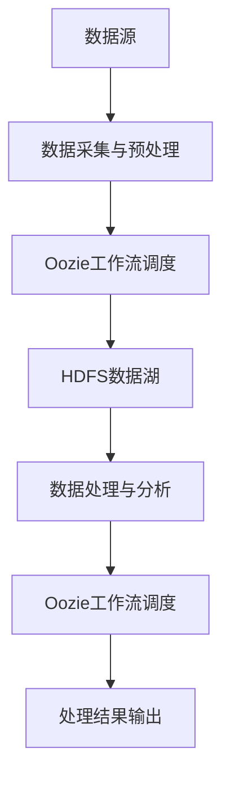

# 借助Oozie构建数据湖应用

## 1. 背景介绍
### 1.1 数据湖概述
#### 1.1.1 什么是数据湖
数据湖(Data Lake)是一个存储海量原始数据的大型集中式存储库,可以存储结构化、半结构化和非结构化数据。数据湖的概念最早由Pentaho公司的首席科学家James Dixon在2010年提出。与数据仓库不同,数据湖存储的是原始格式的数据,数据湖强调对数据的"Schema on read",即在读取数据时再定义模式,而不是在存储数据时就确定数据的模式。

#### 1.1.2 数据湖的特点
- 存储海量数据:数据湖可以存储PB级别的海量数据。
- 数据类型多样:可以存储结构化、半结构化和非结构化数据。  
- 数据处理灵活:支持批处理、交互式查询、实时流处理等多种数据处理方式。
- 成本相对较低:基于廉价的商用硬件,存储成本相对较低。

### 1.2 Oozie简介
#### 1.2.1 什么是Oozie
Apache Oozie是一个用于管理和调度Hadoop作业的工作流调度系统。它允许用户定义由不同类型的Hadoop作业(如MapReduce、Pig、Hive查询等)组成的工作流,并以DAG(有向无环图)的形式呈现这些工作流。Oozie负责按照工作流中指定的顺序执行这些作业,并提供了重试失败作业、并行执行作业等功能。

#### 1.2.2 Oozie的主要特性
- 支持多种类型的Hadoop作业,如MapReduce、Pig、Hive、Sqoop等。
- 使用XML格式定义工作流,易于理解和编辑。
- 提供了Web管理界面,可以方便地监控和管理工作流。  
- 具有容错和重试机制,可以自动重试失败的作业。
- 可以设置不同作业之间的依赖关系,实现作业的有序执行。

## 2. 核心概念与联系
### 2.1 Oozie中的核心概念
#### 2.1.1 工作流(Workflow)
工作流定义了一系列要按特定顺序执行的动作(Action)。工作流以DAG的形式表示,从开始节点(start)开始,到结束节点(end)结束。工作流中的每个节点表示一个动作,节点之间的有向边表示动作之间的依赖关系。

#### 2.1.2 动作(Action)  
动作是Oozie工作流中的基本执行单元,表示一个具体的任务,如运行一个MapReduce作业、执行一个Hive查询等。Oozie支持多种类型的动作,包括Hadoop MapReduce、Hadoop FileSystem、Pig、Hive、Sqoop、SSH、Email等。

#### 2.1.3 控制流节点(Control Flow Nodes)
除了动作节点外,Oozie工作流还包含一些控制流节点,用于控制工作流的执行流程,如decision(决策)、fork(分支)、join(汇聚)等。

#### 2.1.4 协调器(Coordinator)
协调器用于定义基于时间触发的Oozie作业。它允许用户指定作业的运行频率和输入/输出数据集。当满足指定的时间条件和数据依赖时,协调器会自动触发相应的工作流。

#### 2.1.5 捆绑包(Bundle)
捆绑包用于将多个协调器作业打包在一起,定义它们之间的数据依赖关系。这样可以更方便地管理一组相关的协调器作业。

### 2.2 Oozie在数据湖中的作用
在数据湖的构建和应用中,Oozie可以发挥重要作用:

1. 数据采集和预处理:可以使用Oozie工作流来调度和管理数据采集和预处理任务,如从外部数据源获取数据,进行数据清洗、转换等操作。

2. 数据处理和分析:Oozie可以协调各种数据处理和分析作业,如MapReduce、Hive、Spark等,实现对数据湖中数据的批处理、交互式查询等。

3. 数据管道的构建:借助Oozie的工作流和协调器功能,可以构建自动化的数据管道,实现数据在不同阶段和系统之间的有序流动。

4. 任务调度与监控:Oozie提供了一个统一的平台来调度和监控数据湖相关的各种任务,可以设置任务的执行时间、频率、依赖关系等,并监控任务的运行状态。

下面是Oozie在数据湖应用中的架构示意图:



## 3. 核心算法原理与操作步骤
### 3.1 Oozie工作流定义
Oozie工作流使用XML格式的Hadoop Process Definition Language (hPDL)来定义。一个典型的Oozie工作流定义文件包含以下几个主要部分:

1. 开始节点(start):工作流的起点。 
2. 动作节点(action):执行具体任务的节点,如MapReduce、Hive等。
3. 控制流节点(control flow):控制工作流执行流程的节点,如decision、fork、join等。
4. 结束节点(end):工作流的终点。
5. 转移(transition):连接各个节点,定义执行顺序。

下面是一个简单的Oozie工作流定义示例:

```xml
<workflow-app name="example-wf" xmlns="uri:oozie:workflow:0.5">
    <start to="mr-node"/>
    <action name="mr-node">
        <map-reduce>
            <job-tracker>${jobTracker}</job-tracker>
            <name-node>${nameNode}</name-node>
            <configuration>
                <property>
                    <name>mapred.mapper.class</name>
                    <value>org.apache.oozie.example.SampleMapper</value>
                </property>
                <property>
                    <name>mapred.reducer.class</name>
                    <value>org.apache.oozie.example.SampleReducer</value>
                </property>
                <property>
                    <name>mapred.input.dir</name>
                    <value>/user/${wf:user()}/input</value>
                </property>
                <property>
                    <name>mapred.output.dir</name>
                    <value>/user/${wf:user()}/output</value>
                </property>
            </configuration>
        </map-reduce>
        <ok to="end"/>
        <error to="fail"/>
    </action>
    <kill name="fail">
        <message>Map/Reduce failed, error message[${wf:errorMessage(wf:lastErrorNode())}]</message>
    </kill>
    <end name="end"/>
</workflow-app>
```

### 3.2 Oozie工作流调度步骤
1. 安装和配置Oozie:在Hadoop集群上安装和配置Oozie服务。

2. 准备工作流应用:
   - 创建工作流定义XML文件,定义工作流的结构和节点。
   - 准备工作流中各个动作节点需要的配置文件、脚本等。
   - 将工作流应用所需的文件打包成一个ZIP文件(Workflow Application)。

3. 部署工作流应用:
   - 将Workflow Application上传到HDFS的指定目录。
   - 使用Oozie客户端命令或Oozie Web UI提交和启动工作流作业。

4. 监控工作流执行:
   - 通过Oozie Web UI或Oozie客户端命令查看工作流作业的执行状态。
   - 如果出现错误,可以查看相应的日志文件进行排查。

5. 管理工作流生命周期:
   - 根据需要暂停、恢复或杀死工作流作业。
   - 对已完成的工作流作业进行存档或删除。

## 4. 数学模型与公式详解
### 4.1 工作流的DAG模型
Oozie工作流可以用有向无环图(DAG)来建模。将工作流中的每个节点看作DAG中的一个顶点,节点之间的转移关系看作有向边。

设工作流$G=(V,E)$,其中:  
- $V$表示工作流中的节点集合,每个$v \in V$表示一个节点; 
- $E$表示节点之间的转移关系集合,每个$e=(u,v) \in E$表示从节点$u$到节点$v$的一个转移。

则$G$必须满足以下条件:
1. $G$必须是一个DAG,即不能包含环路。
2. $G$必须有唯一的开始节点$start \in V$,满足$\forall e=(u,v) \in E, v \neq start$。
3. $G$必须有唯一的结束节点$end \in V$,满足$\forall e=(u,v) \in E, u \neq end$。

### 4.2 工作流调度的关键路径方法
设$G=(V,E)$为一个Oozie工作流的DAG模型,$t(v)$表示节点$v$的执行时间。
对于每个节点$v \in V$,定义:
- $ES(v)$:节点$v$的最早开始时间。
- $EF(v)$:节点$v$的最早结束时间,满足$EF(v)=ES(v)+t(v)$。
- $LS(v)$:节点$v$的最晚开始时间。
- $LF(v)$:节点$v$的最晚结束时间,满足$LF(v)=LS(v)+t(v)$。

则关键路径方法的步骤如下:
1. 正向计算每个节点的$ES$和$EF$:
   - 对于开始节点$start$,令$ES(start)=0$。
   - 对于其他节点$v$,令$ES(v)=\max\limits_{e=(u,v) \in E}\{EF(u)\}$。
   - 对每个节点$v$,令$EF(v)=ES(v)+t(v)$。

2. 反向计算每个节点的$LS$和$LF$:
   - 对于结束节点$end$,令$LF(end)=EF(end)$。
   - 对于其他节点$v$,令$LF(v)=\min\limits_{e=(v,w) \in E}\{LS(w)\}$。  
   - 对每个节点$v$,令$LS(v)=LF(v)-t(v)$。

3. 计算每个节点的时间余量$TF(v)=LS(v)-ES(v)$。
4. 关键路径为$TF(v)=0$的节点序列,这些节点的执行时间直接影响整个工作流的完成时间。

通过关键路径方法,可以识别出工作流中的关键节点和关键路径,进而优化工作流的调度和执行。

## 5. 项目实践:代码实例与详解
下面通过一个简单的Oozie工作流应用示例,演示如何使用Oozie构建数据湖应用。
该示例包括以下几个步骤:
1. 数据采集:从外部数据源采集数据并上传到HDFS。
2. 数据预处理:使用MapReduce作业对采集的数据进行清洗和转换。
3. 数据分析:使用Hive对预处理后的数据进行分析。
4. 结果导出:将分析结果导出到外部系统。

### 5.1 准备数据和脚本
1. 在HDFS上准备输入数据目录`/user/data/input`。
2. 准备MapReduce作业的Mapper和Reducer实现类`PreprocessingMapper`和`PreprocessingReducer`,打包成JAR文件`preprocessing.jar`。
3. 准备Hive查询脚本`analyze.hql`,实现数据分析逻辑。

### 5.2 定义Oozie工作流
创建工作流定义文件`workflow.xml`:

```xml
<workflow-app name="data-lake-wf" xmlns="uri:oozie:workflow:0.5">
    <start to="data-collection"/>
    
    <action name="data-collection">
        <fs>
            <mkdir path="${nameNode}/user/data/raw"/>
            <move source="${nameNode}/user/data/input" target="${nameNode}/user/data/raw"/>
        </fs>
        <ok to="data-preprocessing"/>
        <error to="fail"/>
    </action>
    
    <action name="data-preprocessing">
        <map-reduce>
            <job-tracker>${jobTracker}</job-tracker>
            <name-node>${nameNode}</name-node>
            <prepare>
                <delete path="${nameNode}/user/data/processed"/>
            </prepare>
            <configuration>
                <property>
                    <name>mapred.mapper.class</name>
                    <value>com.example.PreprocessingMapper</value>
                </property>
                <property>
                    <name>mapred.reducer.class