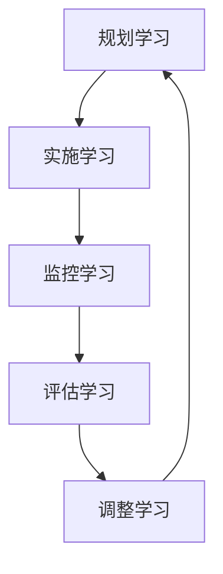

# 元学习:学习如何更好地学习

## 1.背景介绍

在当今快节奏的数字时代,学习新技能和掌握新知识已经成为保持竞争力和适应不断变化的环境的关键。然而,传统的学习方式往往效率低下,难以满足现代社会对快速学习和持续发展的需求。这就催生了"元学习"(Meta-Learning)这一新兴概念的出现。

元学习是一种学习方法,旨在提高学习效率并培养持续学习的能力。它不仅关注学习内容本身,更重要的是学习"如何学习"。通过元学习,我们可以掌握高效的学习策略,提高信息加工能力,从而更好地适应不断变化的知识环境。

### 1.1 元学习的重要性

在当今时代,知识的半衰期越来越短,新技术层出不穷。单纯依赖传统的学习模式很难跟上时代的步伐。元学习为我们提供了一种解决方案,帮助我们:

- 提高学习效率,加快知识获取速度
- 培养终身学习的习惯和能力
- 适应不断变化的工作和生活环境
- 提高创新能力和解决复杂问题的能力

### 1.2 元学习的应用前景

元学习不仅在教育领域备受关注,在人工智能、机器学习等领域也有广阔的应用前景。通过元学习,我们可以:

- 开发通用的学习算法,提高机器学习模型的泛化能力
- 加快机器学习模型的训练过程,降低计算成本
- 实现跨领域知识迁移,提高人工智能系统的适应性

## 2.核心概念与联系

### 2.1 元认知(Metacognition)

元认知是元学习的核心概念之一。它指的是个体对自身认知过程的认识、监控和调节能力。具体包括:

- 元认知知识:对自身认知过程的了解
- 元认知监控:对认知过程的实时监控
- 元认知调节:根据监控结果调整认知策略

强大的元认知能力是成功元学习的基础。通过提高元认知水平,我们可以更好地规划学习过程、监控学习进度、调整学习策略,从而提高学习效率。

### 2.2 学习转移(Transfer of Learning)

学习转移是指将已学习的知识和技能应用到新的情境中的能力。它是元学习的另一个重要概念,体现了学习的广度和深度。良好的学习转移能力可以:

- 加深对知识的理解和掌握
- 提高解决实际问题的能力
- 促进创新思维和发散思维

通过元学习,我们可以培养更强的学习转移能力,从而更好地将所学知识内化为自身的能力,并应用到实际问题中。

### 2.3 元学习与其他学习理论的关系

元学习并非一种全新的学习理论,而是吸收和整合了多种学习理论的精华,包括:

- 建构主义学习理论
- 情境学习理论
- 自我调节学习理论
- 多元智能理论

元学习将这些理论有机结合,形成了一种全新的学习范式,旨在提高学习者的自主性、灵活性和适应性。

## 3.核心算法原理具体操作步骤

### 3.1 元学习循环

元学习遵循一个循环过程,包括以下几个关键步骤:



1. **规划学习**:根据学习目标和个人特点,制定合理的学习计划和策略。
2. **实施学习**:按照计划有条不紊地执行学习活动。
3. **监控学习**:实时跟踪学习进度,注意力集中,及时发现问题。
4. **评估学习**:客观评价学习效果,分析成功经验和不足之处。
5. **调整学习**:根据评估结果,对学习计划和策略进行必要的调整和优化。

这个循环不断重复,形成一个持续改进的过程,促进学习效率和质量的不断提高。

### 3.2 元认知策略

为了提高元认知能力,我们可以采用以下几种元认知策略:

1. **规划策略**:制定明确的学习目标和时间安排,合理分配学习资源。
2. **监控策略**:注意力集中,及时发现学习中的困难和问题。
3. **评估策略**:客观评价学习效果,分析成功经验和不足之处。
4. **调节策略**:根据评估结果,调整学习方法和策略。
5. **信息处理策略**:有效组织和加工信息,促进知识内化。
6. **资源管理策略**:合理利用各种学习资源,提高学习效率。

### 3.3 学习转移策略

为了提高学习转移能力,我们可以采用以下几种策略:

1. **概念映射**:将新知识与已有知识建立联系,形成知识网络。
2. **元认知提示**:在学习过程中提供元认知提示,引导学习者思考如何应用所学知识。
3. **情境变换**:在不同情境下练习应用所学知识,促进知识灵活转移。
4. **反思总结**:及时总结所学知识,反思应用过程中的经验教训。
5. **协作学习**:通过小组讨论和合作完成任务,互相分享学习经验。

## 4.数学模型和公式详细讲解举例说明

在元学习领域,一些重要的数学模型和公式可以帮助我们更好地理解和优化元学习过程。

### 4.1 元学习模型

元学习模型旨在描述和解释元学习过程中的各个组成部分及其相互关系。一个典型的元学习模型可以用下面的公式表示:

$$
L_m(\mathcal{D}_m, \theta) = \sum_{i=1}^{N} L_t(\mathcal{D}_t^i, \phi_i^*)
$$

其中:

- $L_m$是元学习模型的损失函数
- $\mathcal{D}_m$是元学习数据集,包含多个任务
- $\theta$是元学习模型的参数
- $L_t$是任务特定的损失函数
- $\mathcal{D}_t^i$是第i个任务的数据集
- $\phi_i^*$是在$\mathcal{D}_t^i$上通过梯度下降优化得到的最优参数

该模型的目标是找到一组通用的参数$\theta$,使得在各个任务上的损失函数之和最小化。这样,元学习模型就可以快速适应新的任务,提高学习效率。

### 4.2 元学习算法

基于上述模型,我们可以设计出各种元学习算法来优化元学习过程。其中,一种广为人知的算法是模型无关的元学习算法(Model-Agnostic Meta-Learning, MAML)。

MAML算法的核心思想是通过多任务训练,找到一组良好的初始参数,使得在新任务上只需少量梯度更新步骤即可获得良好的性能。其更新公式如下:

$$
\begin{aligned}
\phi_i &= \theta - \alpha \nabla_\theta L_t(\mathcal{D}_t^i, \theta) \\
\theta &\leftarrow \theta - \beta \nabla_\theta \sum_{i=1}^{N} L_t(\mathcal{D}_t^i, \phi_i)
\end{aligned}
$$

其中:

- $\alpha$是任务内更新步长
- $\beta$是元更新步长
- $\phi_i$是在第i个任务上通过一步梯度下降得到的参数
- $\theta$是元学习模型的参数,通过最小化所有任务损失的均值进行更新

MAML算法已被广泛应用于各种元学习问题,展现出了优异的性能和泛化能力。

### 4.3 其他模型和算法

除了上述模型和算法,元学习领域还有许多其他重要的模型和算法,例如:

- 基于优化的元学习算法(Optimization-Based Meta-Learning)
- 基于度量的元学习算法(Metric-Based Meta-Learning)
- 基于生成模型的元学习算法(Generative Meta-Learning)
- 基于注意力机制的元学习模型(Attentive Meta-Learner)

这些模型和算法各有特色,适用于不同的元学习场景。通过深入研究和比较,我们可以选择最合适的模型和算法来提高元学习的效率和性能。

## 5.项目实践:代码实例和详细解释说明

为了更好地理解元学习的原理和应用,我们可以通过一个实际项目来进行实践。这里,我们将使用Python和PyTorch框架,实现一个基于MAML算法的元学习模型,并应用于小样本图像分类任务。

### 5.1 数据准备

我们将使用著名的Omniglot数据集,它包含了来自50种不同字母表的手写字符图像。我们将把每种字母表视为一个独立的任务,并使用元学习模型进行小样本学习。

```python
import torchvision.datasets as datasets

# 加载Omniglot数据集
omniglot = datasets.Omniglot(root='./data', download=True)
```

### 5.2 模型定义

我们定义一个简单的卷积神经网络作为基础模型,用于图像分类任务。

```python
import torch.nn as nn

class OmniglotModel(nn.Module):
    def __init__(self):
        super(OmniglotModel, self).__init__()
        self.conv1 = nn.Conv2d(1, 64, kernel_size=3, padding=1)
        self.bn1 = nn.BatchNorm2d(64)
        self.conv2 = nn.Conv2d(64, 64, kernel_size=3, padding=1)
        self.bn2 = nn.BatchNorm2d(64)
        self.conv3 = nn.Conv2d(64, 64, kernel_size=3, padding=1)
        self.bn3 = nn.BatchNorm2d(64)
        self.conv4 = nn.Conv2d(64, 64, kernel_size=3, padding=1)
        self.bn4 = nn.BatchNorm2d(64)
        self.fc1 = nn.Linear(64, num_classes)

    def forward(self, x):
        x = F.max_pool2d(F.relu(self.bn1(self.conv1(x))), 2)
        x = F.max_pool2d(F.relu(self.bn2(self.conv2(x))), 2)
        x = F.max_pool2d(F.relu(self.bn3(self.conv3(x))), 2)
        x = F.max_pool2d(F.relu(self.bn4(self.conv4(x))), 2)
        x = x.view(x.size(0), -1)
        x = self.fc1(x)
        return x
```

### 5.3 MAML算法实现

接下来,我们实现MAML算法的核心部分。

```python
import torch

def maml(model, optimizer, loss_fn, x_spt, y_spt, x_qry, y_qry, inner_train_steps=1, inner_lr=0.4, meta_lr=0.1):
    # 计算支持集上的梯度
    gradients = torch.zeros_like(model.parameters())
    for x_spt_i, y_spt_i in zip(x_spt, y_spt):
        logits = model(x_spt_i)
        inner_loss = loss_fn(logits, y_spt_i)
        model.zero_grad()
        inner_loss.backward()
        gradients = [grad.detach() + inner_grad.detach() for grad, inner_grad in zip(gradients, model.parameters())]

    # 在支持集上进行内循环更新
    fast_weights = list(map(lambda p: p[1] - inner_lr * p[0], zip(gradients, model.parameters())))

    # 计算查询集上的损失
    qry_logits = [model(x_qry_i, fast_weights) for x_qry_i in x_qry]
    qry_loss = [loss_fn(logits, y_qry_i) for logits, y_qry_i in zip(qry_logits, y_qry)]
    qry_loss = torch.stack(qry_loss).mean()

    # 对原始模型进行元更新
    optimizer.zero_grad()
    qry_loss.backward()
    optimizer.step()

    return qry_loss.item()
```

在这个实现中,我们首先计算支持集上的梯度,然后在支持集上进行内循环更新,得到快速权重。接下来,我们使用快速权重在查询集上计算损失,并对原始模型进行元更新。

### 5.4 训练和测试

最后,我们可以进行模型的训练和测试。

```python
import torch.optim as optim