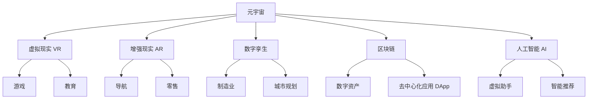

# 元宇宙 (Metaverse)

## 1. 背景介绍

### 1.1 元宇宙的兴起

近年来,"元宇宙"(Metaverse)这个概念在科技界掀起了热潮。元宇宙被视为互联网发展的下一个阶段,是一个由多种新兴技术融合而成的虚拟世界,旨在打造一个全新的数字生活空间。在这个虚拟世界中,人们可以通过数字化身进行社交、工作、娱乐等多种活动,实现物理世界和虚拟世界的无缝融合。

### 1.2 元宇宙的前景

随着5G、人工智能、虚拟现实、区块链等技术的快速发展,元宇宙的构建正在变得越来越可行。许多科技巨头如Meta(Facebook)、微软、英伟达等都已经投入大量资源布局元宇宙。根据市场研究公司Strategy Analytics的预测,到2025年,元宇宙相关市场规模将达到8000亿美元。这个庞大的市场前景吸引了众多企业和投资者的关注,元宇宙正在成为科技界的新热点。

## 2. 核心概念与联系

### 2.1 元宇宙的核心概念

元宇宙是一个由多种技术融合而成的虚拟世界,它包含以下几个核心概念:

1. **虚拟现实(VR)**: 通过头戴式显示设备,用户可以身临其境地体验虚拟环境。
2. **增强现实(AR)**: 在现实世界的基础上叠加虚拟信息,实现虚实融合。
3. **数字孪生**: 在虚拟世界中构建现实世界的数字化复制品,用于模拟和测试。
4. **区块链**: 作为元宇宙的底层技术,可确保数字资产的所有权和交易安全。
5. **人工智能**: 为虚拟世界提供智能化服务,如虚拟助手、智能推荐等。

### 2.2 元宇宙与现有技术的联系

元宇宙并非一种全新的技术,而是将现有技术进行了融合和升级,形成了一个全新的应用场景。以下是元宇宙与现有技术的联系:

## 3. 核心算法原理具体操作步骤

### 3.1 虚拟现实(VR)算法原理

虚拟现实(VR)技术的核心算法包括:

1. **三维建模**:使用多边形网格、NURBS曲面等方法构建虚拟场景和物体。
2. **渲染管线**:通过视锥体剔除、背面剔除、光栅化等步骤将三维场景渲染为二维图像。
3. **动画算法**:使用关键帧插值、逆运动学等方法实现虚拟角色的动画。
4. **物理模拟**:通过刚体动力学、软体动力学等算法模拟物体的运动和变形。

### 3.2 增强现实(AR)算法原理

增强现实(AR)技术的核心算法包括:

1. **图像处理**:使用边缘检测、特征提取等算法识别现实世界中的目标。
2. **计算机视觉**:通过相机标定、空间映射等技术获取环境的三维信息。
3. **图像融合**:将虚拟元素与现实画面进行实时融合,实现虚实叠加。
4. **手势识别**:利用深度学习等算法识别用户的手���,实现自然交互。

### 3.3 数字孪生算法原理

数字孪生技术的核心算法包括:

1. **三维重建**:使用激光扫描、结构光等方法获取现实物体的三维数据。
2. **参数化建模**:基于获取的三维数据,构建参数化的CAD模型。
3. **物理仿真**:利用有限元分析、计算流体动力学等方法模拟物理过程。
4. **数据融合**:将来自多个传感器的数据进行融合,更新数字孪生模型。

### 3.4 区块链算法原理

区块链技术的核心算法包括:

1. **加密算法**:使用非对称加密算法(如RSA、ECC)保证数据的安全性。
2. **共识算法**:采用工作量证明(PoW)、权益证明(PoS)等算法达成网络共识。
3. **分布式存储**:利用分布式哈希表(DHT)等技术实现去中心化的数据存储。
4. **智能合约**:使用图灵完备的脚本语言编写自动执行的合约程序。

### 3.5 人工智能算法原理

人工智能技术在元宇宙中的应用包括:

1. **计算机视觉**:使用卷积神经网络(CNN)等算法进行图像识别和目标检测。
2. **自然语言处理**:利用transformer等模型实现语音识别、机器翻译等功能。
3. **强化学习**:通过试错与反馈,训练智能体在虚拟环境中完成任务。
4. **推理系统**:基于知识图谱和规则引擎,实现智能问答和决策支持。

## 4. 数学模型和公式详细讲解举例说明

### 4.1 三维建模数学模型

在三维建模中,常用的数学模型包括:

1. **参数方程**

参数方程用于描述曲线和曲面,如下所示:

$$
\begin{align*}
\vec{r}(u,v) = (x(u,v), y(u,v), z(u,v))
\end{align*}
$$

其中$u$和$v$是参数,$x(u,v)$、$y(u,v)$和$z(u,v)$是坐标函数。

2. **Bézier曲线**

Bézier曲线是一种参数曲线,由控制点和基函数构成:

$$
\vec{r}(t) = \sum_{i=0}^n P_i B_{i,n}(t)
$$

其中$P_i$是控制点,$B_{i,n}(t)$是Bernstein基函数。

3. **NURBS曲面**

NURBS(Non-Uniform Rational B-Spline)曲面是一种广泛应用的自由曲面表示方法:

$$
\vec{r}(u,v) = \frac{\sum_{i=0}^n \sum_{j=0}^m N_{i,p}(u)N_{j,q}(v)w_{i,j}\vec{P}_{i,j}}{\sum_{i=0}^n \sum_{j=0}^m N_{i,p}(u)N_{j,q}(v)w_{i,j}}
$$

其中$N_{i,p}(u)$和$N_{j,q}(v)$是B-Spline基函数,$w_{i,j}$是权重,$\vec{P}_{i,j}$是控制点。

### 4.2 渲染管线数学模型

渲染管线中涉及的数学模型包括:

1. **视锥体剔除**

使用视锥体对三维场景进行剔除,只渲染可见部分。视锥体由近平面和远平面界定:

$$
\begin{align*}
Ax + By + Cz + D = 0
\end{align*}
$$

其中$(A,B,C)$是平面法向量,$(x,y,z)$是点坐标,$D$是平面常数。

2. **透视投影**

透视投影将三维场景映射到二维视平面上,常用的投影矩阵为:

$$
M_\text{proj} = \begin{bmatrix}
\frac{2n}{r-l} & 0 & \frac{r+l}{r-l} & 0\\
0 & \frac{2n}{t-b} & \frac{t+b}{t-b} & 0\\
0 & 0 & \frac{f+n}{n-f} & \frac{2fn}{n-f}\\
0 & 0 & -1 & 0
\end{bmatrix}
$$

其中$n$和$f$分别为近平面和远平面距离,$l$、$r$、$b$和$t$分别为视锥体的左、右、下和上平面。

3. **光栅化**

光栅化将三角形投影到二维视平面上,需要进行梯形插值计算颜色和深度值。对于一个三角形,其插值函数为:

$$
\begin{align*}
f(x,y) = \frac{1}{A}[(x_2y_3 - x_3y_2)f_1 + (x_3y_1 - x_1y_3)f_2 + (x_1y_2 - x_2y_1)f_3]
\end{align*}
$$

其中$A$为三角形面积,$(x_i,y_i)$为三个顶点坐标,$f_i$为对应的函数值。

### 4.3 动画算法数学模型

动画算法中常用的数学模型包括:

1. **关键帧插值**

通过插值计算中间帧的位置和姿态,常用的插值方法有线性插值、贝塞尔曲线插值等。

2. **逆运动学**

逆运动学用于计算机械臂或虚拟角色的姿态,求解关节角度使末端达到目标位置。常用的数学模型为:

$$
\vec{x} = f(\vec{\theta})
$$

其中$\vec{x}$为末端位置,$\vec{\theta}$为关节角度向量,$f$为正运动学函数。

3. **刚体动力学**

刚体动力学描述了刚体在力和力矩作用下的运动,常用的模型为牛顿-欧拉方程:

$$
\begin{align*}
m\ddot{\vec{r}} &= \vec{F}\\
I\dot{\vec{\omega}} + \vec{\omega} \times I\vec{\omega} &= \vec{T}
\end{align*}
$$

其中$m$为质量,$\vec{r}$为位置,$\vec{F}$为合力,$I$为惯量矩阵,$\vec{\omega}$为角速度,$\vec{T}$为合力矩。

### 4.4 计算机视觉数学模型

计算机视觉算法中常用的数学模型包括:

1. **相机模型**

利用针孔相机模型将三维点投影到二维像平面上:

$$
\begin{bmatrix}u\\v\\1\end{bmatrix} = \begin{bmatrix}\frac{f_x}{s_x} & 0 & c_x\\\frac{f_y}{s_y} & c_y & 0\\0 & 0 & 1\end{bmatrix}\begin{bmatrix}r_{11} & r_{12} & r_{13}\\r_{21} & r_{22} & r_{23}\\r_{31} & r_{32} & r_{33}\end{bmatrix}\begin{bmatrix}X\\Y\\Z\\1\end{bmatrix}
$$

其中$(u,v)$为像素坐标,$(X,Y,Z)$为三维点坐标,$f_x$、$f_y$为焦距,$s_x$、$s_y$为像素尺寸,$(c_x,c_y)$为主点,$r_{ij}$为旋转矩阵元素。

2. **单应性变换**

单应性变换描述了平面到平面之间的投影关系:

$$
\begin{bmatrix}u'\\v'\\w'\end{bmatrix} = H\begin{bmatrix}u\\v\\w\end{bmatrix} = \begin{bmatrix}h_{11} & h_{12} & h_{13}\\h_{21} & h_{22} & h_{23}\\h_{31} & h_{32} & h_{33}\end{bmatrix}\begin{bmatrix}u\\v\\w\end{bmatrix}
$$

其中$(u,v)$和$(u',v')$分别为源点和目标点的归一化坐标,$H$为单应性矩阵。

3. **特征点检测**

特征点检测算法如SIFT、ORB等,通常基于尺度空间理论,在不同尺度下检测关键点。尺度空间由高斯核和尺度因子构成:

$$
L(x,y,\sigma) = G(x,y,\sigma) * I(x,y)
$$

其中$L(x,y,\sigma)$为尺度空间,$G(x,y,\sigma)$为高斯核,$I(x,y)$为输入图像,$\sigma$为尺度因子。

### 4.5 区块链密码学数学模型

区块链中常用的密码学数学模型包括:

1