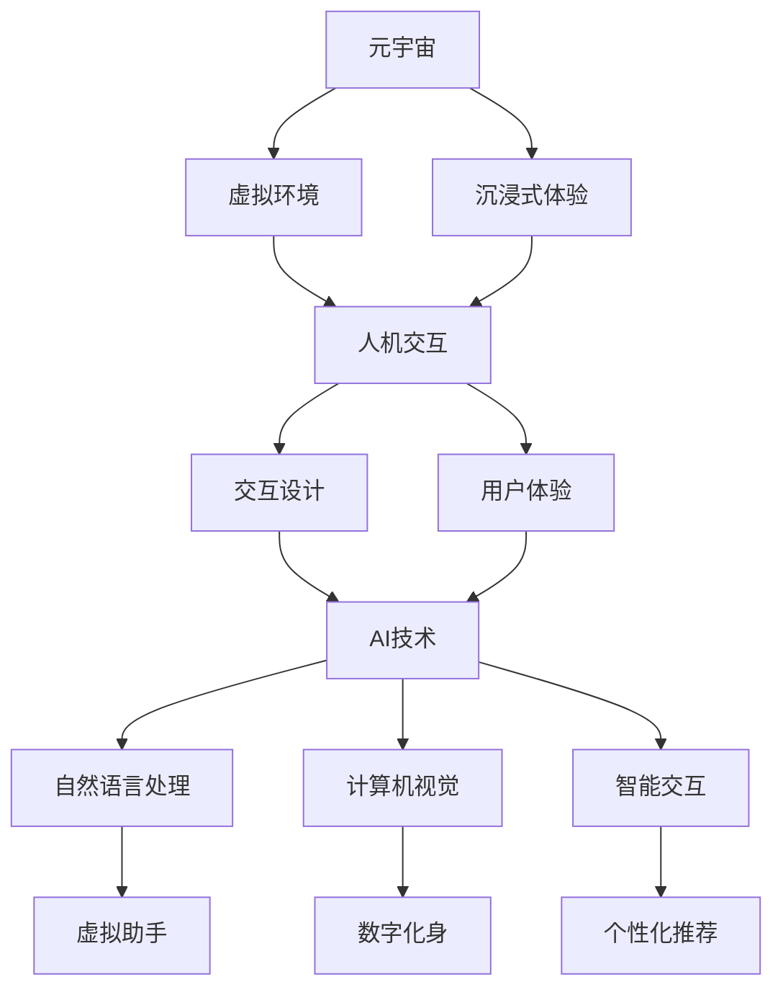

# 元宇宙的人机交互：AI的角色

## 1.背景介绍
### 1.1 元宇宙的概念与发展
#### 1.1.1 元宇宙的定义
元宇宙(Metaverse)是一个融合了虚拟现实(VR)、增强现实(AR)、互联网和区块链技术的沉浸式虚拟世界。在元宇宙中，用户可以通过数字化身(Avatar)进行社交、娱乐、工作和创造等活动。

#### 1.1.2 元宇宙的发展历程
元宇宙的概念最早由科幻小说家尼尔·斯蒂芬森(Neal Stephenson)在1992年的小说《雪崩》(Snow Crash)中提出。随着VR、AR、人工智能(AI)、区块链等技术的不断进步，元宇宙逐渐从科幻概念走向现实。

#### 1.1.3 元宇宙的应用场景
元宇宙的应用场景广泛，包括社交、娱乐、教育、商业、医疗等领域。例如，用户可以在元宇宙中举办虚拟会议、参加虚拟演唱会、进行虚拟购物等。

### 1.2 人机交互的重要性
#### 1.2.1 人机交互的定义
人机交互(Human-Computer Interaction, HCI)是研究人与计算机之间交互的学科，旨在设计出易用、高效、愉悦的交互方式，提升用户体验。

#### 1.2.2 人机交互在元宇宙中的重要性
在元宇宙中，用户主要通过数字化身与虚拟世界进行交互。因此，设计出自然、直观、沉浸式的人机交互方式对于提升用户体验至关重要。

### 1.3 AI在元宇宙中的角色
#### 1.3.1 AI的定义与发展
人工智能是一门研究、开发能够模拟人类智能的理论、方法、技术及应用系统的学科。近年来，随着深度学习、大数据等技术的进步，AI在各个领域取得了长足发展。

#### 1.3.2 AI在元宇宙中的应用
在元宇宙中，AI技术可以应用于自然语言处理、计算机视觉、虚拟助手等方面，为用户提供更加智能、个性化的服务，提升交互体验。

## 2.核心概念与联系
### 2.1 元宇宙的核心概念
#### 2.1.1 虚拟现实(VR)
虚拟现实是利用计算机模拟产生一个三维空间的虚拟世界，提供沉浸式体验。VR是构建元宇宙的基础技术之一。

#### 2.1.2 增强现实(AR) 
增强现实是将虚拟信息叠加到真实世界中，增强用户对真实世界的感知。AR可以与VR结合，打造更加逼真的元宇宙体验。

#### 2.1.3 数字化身(Avatar)
数字化身是用户在元宇宙中的虚拟形象，可以代表用户进行社交、创作等活动。打造个性化、栩栩如生的数字化身是提升元宇宙沉浸感的关键。

### 2.2 人机交互的核心概念
#### 2.2.1 用户体验(UX)
用户体验是用户在使用产品或服务过程中建立起来的主观感受。提供良好的用户体验是人机交互设计的核心目标。

#### 2.2.2 交互设计
交互设计是根据用户的需求和行为，设计易用、高效、愉悦的人机交互方式。在元宇宙中，交互设计需要考虑虚拟环境的特点，提供沉浸式体验。

#### 2.2.3 自然用户界面(NUI)
自然用户界面是一种模仿人类自然交互方式(如手势、语音)的人机交互范式。在元宇宙中应用NUI,可以提供更加直观、自然的交互体验。

### 2.3 AI的核心概念
#### 2.3.1 机器学习
机器学习是一种通过数据训练使计算机系统具备自动学习和改进性能的方法。机器学习算法可以应用于元宇宙中的智能交互、推荐系统等。

#### 2.3.2 深度学习
深度学习是机器学习的一个分支,通过模拟人脑的神经网络结构,实现对复杂模式的识别和学习。深度学习在计算机视觉、语音识别等领域取得了突破性进展。

#### 2.3.3 自然语言处理(NLP)
自然语言处理是研究计算机处理人类语言的学科,旨在实现人机之间自然、高效的语言交互。NLP技术可以应用于元宇宙中的虚拟助手、智能对话等场景。

### 2.4 三者之间的关系
元宇宙、人机交互和AI三者之间密切相关。元宇宙为人机交互提供了一个沉浸式的虚拟环境,对交互设计提出了新的要求和挑战。AI技术可以应用于元宇宙中的智能交互,如自然语言处理、计算机视觉等,提升用户体验。同时,元宇宙也为AI技术的应用和发展提供了广阔的空间。三者的结合将推动元宇宙的进一步发展和应用。

## 3.核心算法原理具体操作步骤
### 3.1 自然语言处理算法
#### 3.1.1 文本表示
将文本转化为计算机可以处理的数值形式,常用方法包括:
1. One-hot编码:将每个词映射为一个唯一的高维稀疏向量
2. Word Embedding:将词映射为低维稠密向量,如Word2Vec、GloVe等
3. 预训练语言模型:如BERT、GPT等,通过预训练获得上下文相关的词向量表示

#### 3.1.2 序列建模
对文本序列进行建模,捕捉上下文信息,常用方法包括:
1. 循环神经网络(RNN):如LSTM、GRU等,通过循环连接捕捉长距离依赖
2. 卷积神经网络(CNN):通过卷积操作提取局部特征
3. 注意力机制(Attention):通过加权聚合捕捉关键信息
4. Transformer:基于自注意力机制的序列建模方法

#### 3.1.3 下游任务
利用上述方法对文本进行表示和建模后,可以应用于各种下游任务,如:
1. 文本分类:如情感分析、主题分类等
2. 序列标注:如命名实体识别、词性标注等
3. 文本生成:如机器翻译、对话生成等
4. 文本匹配:如问答系统、语义搜索等

### 3.2 计算机视觉算法
#### 3.2.1 图像表示
将图像转化为计算机可以处理的数值形式,常用方法包括:
1. 原始像素值:直接使用图像的像素值作为输入
2. 手工特征:如SIFT、HOG等,提取图像的局部特征
3. 卷积神经网络(CNN):通过卷积操作自动提取图像的层次化特征

#### 3.2.2 图像分类
对图像进行分类,预测图像所属的类别,常用方法包括:
1. 传统机器学习方法:如SVM、决策树等,基于手工特征进行分类
2. 深度学习方法:如AlexNet、VGGNet、ResNet等,端到端学习特征和分类器

#### 3.2.3 目标检测
在图像中定位和识别目标物体,常用方法包括:
1. 两阶段检测器:如R-CNN系列,先生成候选区域,再对候选区域进行分类和回归
2. 单阶段检测器:如YOLO、SSD等,直接对整图进行分类和回归
3. 基于Anchor的检测器:如Faster R-CNN、RetinaNet等,预定义一组候选框,再进行分类和回归

#### 3.2.4 图像生成
生成逼真的图像,常用方法包括:
1. 生成对抗网络(GAN):通过生成器和判别器的对抗学习生成逼真图像
2. 变分自编码器(VAE):通过编码器和解码器的变分推断生成图像
3. 自回归模型:如PixelRNN、PixelCNN等,逐像素生成图像

### 3.3 智能交互算法
#### 3.3.1 推荐系统
根据用户的历史行为和偏好,推荐用户可能感兴趣的内容,常用方法包括:
1. 协同过滤:基于用户或物品的相似性进行推荐,如基于用户的协同过滤、基于物品的协同过滤等
2. 矩阵分解:将用户-物品交互矩阵分解为低维用户和物品向量,如SVD、NMF等
3. 深度学习:利用深度神经网络学习用户和物品的隐式表示,如NCF、DeepFM等

#### 3.3.2 对话系统
实现人机之间自然的对话交互,常用方法包括:
1. 基于检索的方法:从预定义的对话库中检索最相关的回复
2. 基于生成的方法:利用序列到序列模型生成回复,如Seq2Seq、Transformer等
3. 基于强化学习的方法:通过与用户的交互学习对话策略,如DDPG、PPO等

#### 3.3.3 虚拟助手
提供个性化的智能助理服务,常用方法包括:
1. 意图识别:识别用户的意图,如查询天气、播放音乐等
2. 槽位填充:提取用户话语中的关键信息,如地点、时间等
3. 对话管理:根据意图和槽位信息,决定下一步的动作,如查询数据库、生成回复等
4. 语音交互:通过语音识别和语音合成实现语音交互

## 4.数学模型和公式详细讲解举例说明
### 4.1 Word2Vec词嵌入模型
Word2Vec是一种常用的词嵌入模型,可以将词映射为低维稠密向量。其核心思想是利用词的上下文信息学习词向量,使得语义相似的词具有相近的向量表示。

Word2Vec有两种训练方式:连续词袋模型(CBOW)和Skip-Gram模型。以CBOW为例,其目标是根据上下文词预测中心词。假设词汇表大小为$V$,词向量维度为$d$,上下文窗口大小为$c$,则CBOW的数学模型为:

$$
\begin{aligned}
\mathbf{h} &= \frac{1}{2c}\sum_{i=1}^{2c} \mathbf{w}_{t+i} \\
\mathbf{u}_j &= \mathbf{v}_j^\top \mathbf{h} \\
p(w_t|w_{t-c},...,w_{t+c}) &= \text{softmax}(\mathbf{u}) = \frac{\exp(\mathbf{u}_{w_t})}{\sum_{j=1}^V \exp(\mathbf{u}_j)}
\end{aligned}
$$

其中,$\mathbf{w}_i$是第$i$个上下文词的词向量,$\mathbf{h}$是上下文词向量的平均,$\mathbf{v}_j$是第$j$个词的输出向量,$\mathbf{u}_j$是第$j$个词的输出得分。最终的目标是最大化如下似然函数:

$$
\mathcal{L} = \sum_{t=1}^T \log p(w_t|w_{t-c},...,w_{t+c})
$$

通过随机梯度下降法优化上述目标函数,可以学习到词向量$\mathbf{w}_i$和$\mathbf{v}_j$。训练完成后,词向量$\mathbf{w}_i$可以用于下游的NLP任务。

例如,假设我们有以下句子:"The cat sits on the mat."。首先将句子中的词映射为词向量:

$$
\begin{aligned}
\mathbf{w}_{\text{The}} &= [0.1, -0.2, 0.3]^\top \\
\mathbf{w}_{\text{cat}} &= [0.2, 0