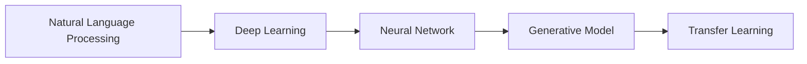

## 1.背景介绍

内容生成（Content Generation）是人工智能领域的一个重要研究方向，其主要目标是通过机器学习和深度学习技术，自动生成人类可理解的文本、图片、音频或视频等内容。近年来，随着深度学习技术的发展，内容生成领域取得了显著的进步，例如GPT-3和DALL·E等模型的出现，使得机器生成的内容在质量和多样性上都有了显著提升。

## 2.核心概念与联系

内容生成涉及到的核心概念主要有以下几个：自然语言处理（NLP）、生成模型、深度学习、神经网络以及转换学习。

- 自然语言处理（NLP）：是计算机科学和人工智能的一个重要领域，主要研究如何让计算机理解和生成人类语言。

- 生成模型：是一类用于描述观测数据如何生成的统计模型，常用于无监督学习。

- 深度学习：是机器学习的一个分支，主要研究如何使用神经网络模拟人脑进行学习和思考。

- 神经网络：是一种模拟人脑神经元结构的计算模型，被广泛应用于深度学习中。

- 转换学习：是一种机器学习方法，可以将已经学习到的知识应用到新的任务中。

这些概念之间的关系可以用以下的Mermaid流程图进行表示：



## 3.核心算法原理具体操作步骤

内容生成的核心算法通常包括以下几个步骤：

1. 数据预处理：将原始数据转换为机器可以理解的形式，例如将文本转换为词向量。

2. 模型训练：使用深度学习模型（如神经网络）对数据进行训练，学习数据的分布特性。

3. 内容生成：根据学习到的数据分布，生成新的内容。

4. 评估和优化：通过人工或自动化的方式评估生成内容的质量，并根据评估结果优化模型。

## 4.数学模型和公式详细讲解举例说明

内容生成的数学模型主要依赖于生成模型和神经网络。以生成对抗网络（GAN）为例，其基本原理可以用以下公式表示：

$$
\min_{G}\max_{D}V(D,G)=\mathbb{E}_{x\sim p_{data}(x)}[\log D(x)]+\mathbb{E}_{z\sim p_{z}(z)}[\log(1-D(G(z)))]
$$

其中，$G$ 是生成器，$D$ 是判别器，$p_{data}(x)$ 是真实数据的分布，$p_{z}(z)$ 是生成器的输入噪声分布。

## 5.项目实践：代码实例和详细解释说明

假设我们要使用Python和TensorFlow库来实现一个简单的文本生成模型。首先，我们需要加载数据并进行预处理：

```python
import tensorflow as tf
import numpy as np

# Load and preprocess data
text = open('input.txt').read()
vocab = sorted(set(text))
char2idx = {u:i for i, u in enumerate(vocab)}
idx2char = np.array(vocab)
text_as_int = np.array([char2idx[c] for c in text])
```

然后，我们可以定义模型并进行训练：

```python
# Define the model
model = tf.keras.models.Sequential([
  tf.keras.layers.Embedding(len(vocab), 256, input_length=100),
  tf.keras.layers.GRU(1024, return_sequences=True),
  tf.keras.layers.Dense(len(vocab))
])

# Compile and train the model
model.compile(optimizer='adam', loss=tf.losses.SparseCategoricalCrossentropy(from_logits=True))
model.fit(input_data, target_data, epochs=10)
```

最后，我们可以使用训练好的模型来生成新的文本：

```python
# Generate text
input_eval = [char2idx[s] for s in 'Hello, ']
input_eval = tf.expand_dims(input_eval, 0)
predicted_id = model.predict(input_eval).argmax(axis=-1)[-1]
predicted_char = idx2char[predicted_id]
print('Hello, ' + predicted_char)
```

## 6.实际应用场景

内容生成技术在许多实际应用场景中都有广泛的应用，例如：

- 新闻自动撰写：新闻机器人可以根据给定的数据或模板自动生成新闻报道。

- 自动编程：通过学习大量的代码库，机器可以生成新的代码片段，帮助程序员提高编程效率。

- 虚拟助手：虚拟助手可以根据用户的问题，自动生成回答。

- 个性化推荐：通过学习用户的喜好，机器可以生成个性化的推荐内容。

## 7.工具和资源推荐

以下是一些内容生成领域的相关工具和资源：

- TensorFlow和PyTorch：这是两个非常流行的深度学习库，可以用于实现各种内容生成模型。

- GPT-3：这是OpenAI开发的一种强大的文本生成模型，可以用于各种文本生成任务。

- DALL·E：这是OpenAI开发的一种图像生成模型，可以根据文本描述生成对应的图像。

- huggingface/transformers：这是一个开源库，提供了各种预训练的转换学习模型，可以用于各种NLP任务。

## 8.总结：未来发展趋势与挑战

内容生成技术在近年来取得了显著的进步，但仍然面临着许多挑战，例如生成内容的质量、多样性、可控性以及道德和法律问题等。随着技术的发展，我们期待看到更多的创新和突破。

## 9.附录：常见问题与解答

1. 问：内容生成技术可以生成任何类型的内容吗？

答：理论上是可以的，但实际上生成的内容质量和多样性取决于训练数据和模型的复杂性。

2. 问：内容生成技术是否可以替代人类创作？

答：目前来看，内容生成技术还不能完全替代人类创作，因为机器生成的内容缺乏人类的情感和创新性。但是，它可以作为一个有用的工具，帮助人类提高创作效率。

3. 问：内容生成技术是否有道德和法律问题？

答：是的，内容生成技术可能会引发一些道德和法律问题，例如版权问题、虚假信息传播等。因此，使用内容生成技术时需要遵守相关的道德和法律规定。

作者：禅与计算机程序设计艺术 / Zen and the Art of Computer Programming