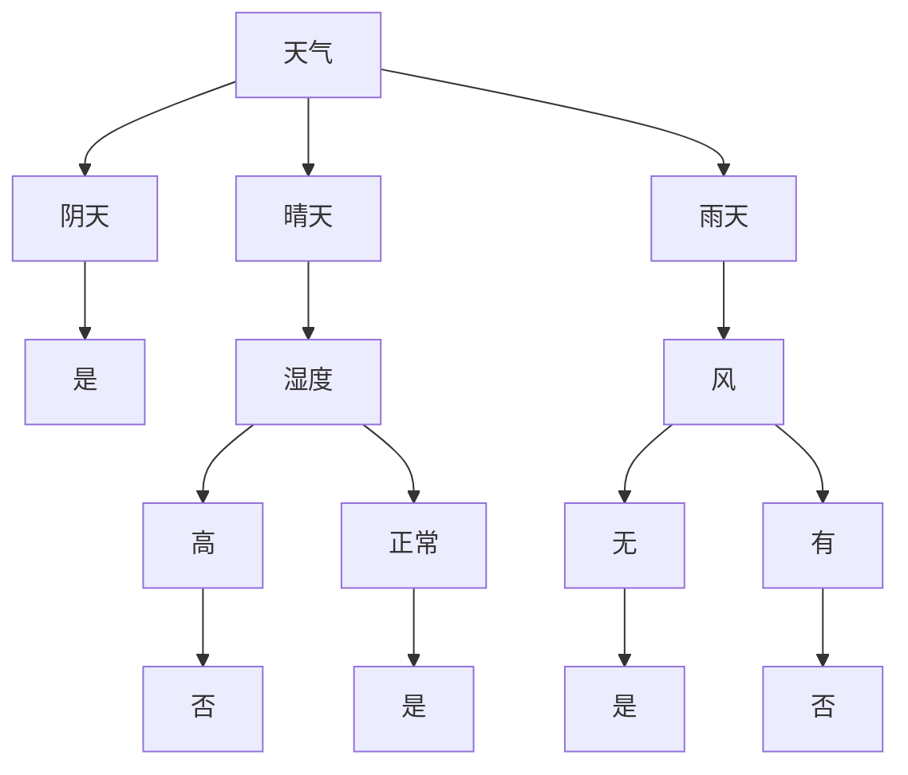

# 决策树(Decision Trees) - 原理与代码实例讲解

## 1.背景介绍

### 1.1 决策树的定义与作用

决策树是一种常用的机器学习算法,属于有监督学习的分类算法。它可以用于解决分类和回归问题,特别适用于处理非线性关系的数据。决策树通过对数据进行递归划分,构建一个树形结构的预测模型。树的每个节点表示一个属性测试,每个分支代表一个测试输出,每个叶节点存储一个类别标签。

### 1.2 决策树的发展历史

决策树算法最早可以追溯到1963年,由 Morgan 和 Sonquist 提出了 AID (Automatic Interaction Detection) 算法。之后,Quinlan 在1986年提出了著名的 ID3 算法,并在1993年提出了改进版 C4.5 算法。另一个重要的决策树算法是由 Breiman 等人在1984年提出的 CART (Classification and Regression Trees)算法。近年来,随着集成学习的发展,决策树也成为了随机森林、梯度提升决策树等算法的基础。

### 1.3 决策树的优缺点

决策树的主要优点包括:

1. 易于理解和解释,决策过程透明。
2. 数据准备工作较少,能够处理数值型和类别型数据。  
3. 能够处理多输出问题。
4. 使用白盒模型,可以很容易地可视化决策过程。
5. 对缺失值不敏感。

决策树的主要缺点包括:

1. 容易过拟合。
2. 对于那些各类别样本数量不一致的数据,信息增益的结果偏向于那些具有更多数值的特征。
3. 忽略了特征之间的相关性。
4. 不适合处理非线性数据。

## 2.核心概念与联系

### 2.1 信息熵与信息增益

信息熵(Information Entropy)衡量的是一个随机变量的不确定性。对于一个有 $k$ 个不同取值的随机变量 $X$,其信息熵为:

$$
H(X) = -\sum_{i=1}^{k} p_i \log_2 p_i
$$

其中,$p_i$ 是该分类的概率。

信息增益(Information Gain)表示得知一个特征的信息后使得类别的信息熵减少的程度。特征 $A$ 对训练集 $D$ 的信息增益为:

$$
g(D,A) = H(D) - H(D|A) = H(D) - \sum_{v=1}^{V} \frac{|D^v|}{|D|} H(D^v) 
$$

其中,$H(D)$ 为数据集 $D$ 的信息熵,$H(D^v)$ 为特征 $A$ 取值为 $v$ 的样本子集的信息熵。

### 2.2 决策树的一般流程

一般来说,决策树的构建过程包括以下步骤:

1. 从根节点开始,对节点计算所有可能的特征的信息增益。
2. 选择信息增益最大的特征作为节点的特征,按该特征的不同取值建立子节点。 
3. 对子节点递归调用上述方法,构建决策树。
4. 直到所有特征的信息增益均很小或没有特征可以选择时,决策树构建完成。

预测时,将样本从根节点开始,按照决策树的结构进行分类,直到到达叶子节点,将叶子节点的类别作为该样本的预测结果。

### 2.3 决策树的剪枝

为了防止决策树过拟合,通常需要对决策树进行剪枝。剪枝的基本策略有:

1. 预剪枝(Pre-Pruning):在决策树生成过程中,对每个节点在划分前先进行估计,若当前节点的划分不能带来决策树泛化性能的提升,则停止划分并将当前节点标记为叶节点。

2. 后剪枝(Post-Pruning):先从训练集生成一棵完整的决策树,然后自底向上地对非叶节点进行考察,若将该节点对应的子树替换为叶节点能带来决策树泛化性能的提升,则将该子树替换为叶节点。

## 3.核心算法原理具体操作步骤

以下是 ID3 算法构建决策树的具体步骤:

1. 计算数据集 $D$ 的信息熵 $H(D)$。

2. 对每个特征 $A$:
   
   (1)计算特征 $A$ 的所有可能取值 $\{a_1,a_2,...,a_V\}$。
   
   (2)将数据集 $D$ 按特征 $A$ 的取值划分成 $V$ 个子集 $\{D^1,D^2,...,D^V\}$。
   
   (3)计算每个子集 $D^v$ 的信息熵 $H(D^v)$。
   
   (4)计算特征 $A$ 对数据集 $D$ 的信息增益:
   
   $$
   g(D,A) = H(D) - \sum_{v=1}^{V} \frac{|D^v|}{|D|} H(D^v)
   $$

3. 选择信息增益最大的特征 $A_g$ 作为当前节点的特征。

4. 对特征 $A_g$ 的每个可能取值 $a_v$,创建一个分支。令 $D^v$ 表示 $D$ 中特征 $A_g$ 取值为 $a_v$ 的样本子集。
   
   (1)如果 $D^v$ 为空,将分支节点标记为叶节点,类别标记为 $D$ 中样本最多的类别。
   
   (2)如果 $D^v$ 中所有样本的类别都相同,将分支节点标记为叶节点,类别标记为该类别。
   
   (3)否则,以 $D^v$ 为新的数据集,创建一个分支节点,递归执行步骤1-4。

5. 返回决策树。

## 4.数学模型和公式详细讲解举例说明

这里以一个简单的例子来说明决策树的构建过程。假设我们有如下数据集:

| 天气   | 温度   | 湿度   | 风     | 是否外出 |
|--------|--------|--------|--------|----------|
| 晴天   | 高温   | 高     | 无     | 否       |
| 晴天   | 高温   | 高     | 有     | 否       |
| 阴天   | 高温   | 高     | 无     | 是       |
| 雨天   | 温暖   | 高     | 无     | 是       |
| 雨天   | 寒冷   | 正常   | 无     | 是       |
| 雨天   | 寒冷   | 正常   | 有     | 否       |
| 阴天   | 寒冷   | 正常   | 有     | 是       |
| 晴天   | 温暖   | 高     | 无     | 否       |
| 晴天   | 寒冷   | 正常   | 无     | 是       |
| 雨天   | 温暖   | 正常   | 无     | 是       |
| 晴天   | 温暖   | 正常   | 有     | 是       |
| 阴天   | 温暖   | 高     | 有     | 是       |
| 阴天   | 高温   | 正常   | 无     | 是       |
| 雨天   | 温暖   | 高     | 有     | 否       |

我们的目标是预测在不同天气条件下是否适合外出。

首先,计算数据集的信息熵:

$$
\begin{aligned}
H(D) &= -(\frac{9}{14}\log_2 \frac{9}{14} + \frac{5}{14}\log_2 \frac{5}{14}) \\
     &\approx 0.940
\end{aligned}
$$

然后,计算每个特征的信息增益。以"天气"特征为例:

$$
\begin{aligned}
H(D^{晴天}) &= -(\frac{2}{5}\log_2 \frac{2}{5} + \frac{3}{5}\log_2 \frac{3}{5}) \approx 0.971 \\
H(D^{阴天}) &= 0 \\
H(D^{雨天}) &= -(\frac{3}{5}\log_2 \frac{3}{5} + \frac{2}{5}\log_2 \frac{2}{5}) \approx 0.971 \\
g(D,天气) &= 0.940 - (\frac{5}{14} \times 0.971 + \frac{4}{14} \times 0 + \frac{5}{14} \times 0.971) \\
         &\approx 0.247
\end{aligned}
$$

类似地,可以计算出其他特征的信息增益:

$$
\begin{aligned}
g(D,温度) &\approx 0.029 \\  
g(D,湿度) &\approx 0.152 \\
g(D,风) &\approx 0.048
\end{aligned}
$$

可以看出,"天气"特征的信息增益最大,因此选择"天气"作为根节点的特征。根据"天气"的取值将数据集划分为三个子集,分别对应"晴天"、"阴天"、"雨天"三个分支。

对于"阴天"分支,对应的子集中所有样本的类别都是"是",因此将该分支节点标记为叶节点,类别为"是"。

对于"晴天"和"雨天"分支,仍需要继续选择特征进行划分。以此类推,不断递归直到所有分支都成为叶节点或满足停止条件。最终得到的决策树如下:



## 5.项目实践：代码实例和详细解释说明

以下是使用 Python 实现 ID3 决策树算法的示例代码:

```python
import numpy as np
from collections import Counter
from math import log

class ID3DecisionTree:
    def __init__(self, epsilon=0.1):
        self.epsilon = epsilon
        self.tree = None

    def fit(self, X, y):
        self.n_features = X.shape[1]
        self.tree = self._build_tree(X, y)

    def _build_tree(self, X, y):
        if len(set(y)) == 1:
            return y[0]

        if X.shape[1] == 0:
            return Counter(y).most_common(1)[0][0]

        best_feature, best_gain = self._choose_best_feature(X, y)
        if best_gain < self.epsilon:
            return Counter(y).most_common(1)[0][0]

        tree = {best_feature: {}}
        feature_values = set(X[:, best_feature])
        for value in feature_values:
            sub_X, sub_y = self._split_dataset(X, y, best_feature, value)
            tree[best_feature][value] = self._build_tree(sub_X, sub_y)

        return tree

    def _entropy(self, y):
        counter = Counter(y)
        ps = [count / len(y) for count in counter.values()]
        return -sum([p * log(p, 2) for p in ps if p > 0])

    def _choose_best_feature(self, X, y):
        best_gain = -1
        best_feature = -1
        for feature in range(self.n_features):
            gain = self._information_gain(X, y, feature)
            if gain > best_gain:
                best_gain = gain
                best_feature = feature
        return best_feature, best_gain

    def _information_gain(self, X, y, feature):
        base_entropy = self._entropy(y)
        feature_values = set(X[:, feature])
        new_entropy = 0
        for value in feature_values:
            sub_X, sub_y = self._split_dataset(X, y, feature, value)
            prob = len(sub_y) / len(y)
            new_entropy += prob * self._entropy(sub_y)
        return base_entropy - new_entropy

    def _split_dataset(self, X, y, feature, value):
        index = np.where(X[:, feature] == value)
        sub_X = np.delete(X[index], feature, axis=1)
        sub_y = y[index]
        return sub_X, sub_y

    def predict(self, X):
        return [self._predict_sample(sample) for sample in X]

    def _predict_sample(self, sample):
        node = self.tree
        while isinstance(node, dict):
            feature = list(node.keys())[0]
            feature_value = sample[feature]
            if feature_value not in node[feature]:
                return None
            node = node[feature][feature_value]
        return node
```

这个实现包含了以下主要部分:

1. `__init__(self, epsilon=0.1)`: 初始化决策树,`epsilon` 表示信息增益的阈值,当小于该