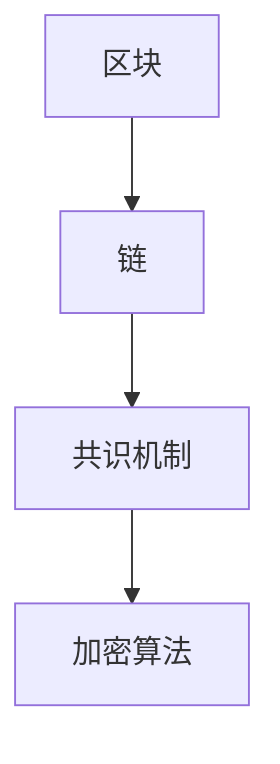

## 1.背景介绍

区块链，一种分布式数据存储、点对点传输、共识机制、加密算法等计算机技术的新型应用模式，自2008年比特币的诞生以来，已经引起了全球范围的广泛关注和研究。区块链技术的核心价值在于其能够实现数据的透明、可追溯、不可篡改等特性，为各行各业提供了全新的解决方案。

## 2.核心概念与联系

区块链技术主要由四个核心概念构成：区块、链、共识机制和加密算法。

### 2.1 区块

区块是区块链中的基本单位，每个区块包含了一定数量的交易数据。每个区块都有一个时间戳和一个指向前一个区块的指针。

### 2.2 链

链是由区块通过哈希指针连接而成的，形成一个按照时间顺序排列的区块链。

### 2.3 共识机制

共识机制是区块链系统中的关键技术，它确保了系统中的所有节点对区块链的状态达成一致。最常见的共识机制有工作量证明（Proof of Work, PoW）和权益证明（Proof of Stake, PoS）。

### 2.4 加密算法

加密算法是区块链技术的基础，它确保了交易数据的安全。区块链中常用的加密算法有SHA-256和Scrypt。



## 3.核心算法原理具体操作步骤

区块链的核心算法主要包括区块的生成、验证和共识算法。

### 3.1 区块的生成

1. 当一个节点接收到新的交易时，它会将这些交易放入待处理交易池。
2. 节点从待处理交易池中选择一部分交易，生成一个新的区块。
3. 节点通过解决一个复杂的数学问题（工作量证明），来找到一个特定的数值，使得新区块的哈希值满足系统设定的条件。

### 3.2 区块的验证

1. 当一个节点接收到一个新的区块时，它会先验证这个区块的哈希值是否满足系统设定的条件。
2. 如果满足条件，节点再验证区块中的每一笔交易。
3. 如果所有交易都有效，节点将这个区块添加到自己的区块链上。

### 3.3 共识算法

1. 当一个节点生成一个新的区块后，它会将这个区块广播到网络中的其他节点。
2. 其他节点收到新的区块后，会通过共识算法来决定是否接受这个区块。
3. 如果大多数节点接受这个区块，那么这个区块就被添加到区块链上。

## 4.数学模型和公式详细讲解举例说明

在区块链中，工作量证明（Proof of Work, PoW）是一种常用的共识机制。它的主要思想是要求节点在生成新区块时，需要解决一个复杂的数学问题。这个数学问题可以用以下的公式来表示：

$$ H(n, x) < D $$

其中，$H$ 是哈希函数，$n$ 是新区块的信息，$x$ 是要找的数值，$D$ 是系统设定的难度值。节点需要找到一个$x$，使得$H(n, x)$的值小于$D$。

## 5.项目实践：代码实例和详细解释说明

以下是一个简单的区块链的Python实现：

```python
import hashlib
import time

class Block:
    def __init__(self, index, previous_hash, timestamp, data, hash):
        self.index = index
        self.previous_hash = previous_hash
        self.timestamp = timestamp
        self.data = data
        self.hash = hash

def calculate_hash(index, previous_hash, timestamp, data):
    value = str(index) + str(previous_hash) + str(timestamp) + str(data)
    return hashlib.sha256(value.encode('utf-8')).hexdigest()

def create_genesis_block():
    return Block(0, "0", time.time(), "Genesis Block", calculate_hash(0, "0", time.time(), "Genesis Block"))

def create_new_block(previous_block, data):
    index = previous_block.index + 1
    timestamp = time.time()
    hash = calculate_hash(index, previous_block.hash, timestamp, data)
    return Block(index, previous_block.hash, timestamp, data, hash)
```

## 6.实际应用场景

区块链技术已经被广泛应用在金融、供应链、医疗、版权保护等多个领域。例如，比特币和以太坊等数字货币就是区块链技术的典型应用。

## 7.工具和资源推荐

- Bitcoin Core：比特币的官方客户端，提供了完整的比特币节点和钱包功能。
- Ethereum：一个开源的区块链平台，支持智能合约。
- Hyperledger：一个开源的跨行业区块链平台，由Linux基金会主导。

## 8.总结：未来发展趋势与挑战

区块链技术的发展前景广阔，但也面临着许多挑战，包括技术的复杂性、隐私保护、法规制约等。未来，我们期待看到更多的创新和应用，推动区块链技术的发展和普及。

## 9.附录：常见问题与解答

Q: 区块链是什么？
A: 区块链是一种分布式数据存储、点对点传输、共识机制、加密算法等计算机技术的新型应用模式。

Q: 区块链技术的核心价值是什么？
A: 区块链技术的核心价值在于其能够实现数据的透明、可追溯、不可篡改等特性。

Q: 区块链技术有哪些应用？
A: 区块链技术已经被广泛应用在金融、供应链、医疗、版权保护等多个领域。

作者：禅与计算机程序设计艺术 / Zen and the Art of Computer Programming
