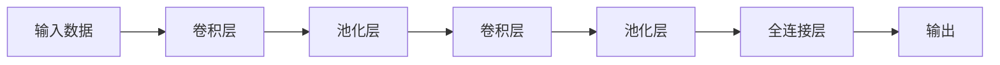
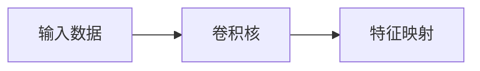
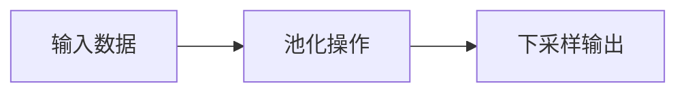

# 卷积神经网络 (CNN) 原理与代码实例讲解

## 1.背景介绍

### 1.1 神经网络与深度学习的兴起

在过去几十年中,人工智能领域取得了长足的进步,尤其是机器学习和深度学习的发展,推动了计算机视觉、自然语言处理、语音识别等领域的突破性进展。神经网络作为一种生物学启发的机器学习模型,模拟了人类大脑神经元之间的连接和信息传递方式,展现出强大的模式识别和数据处理能力。

### 1.2 卷积神经网络在计算机视觉中的重要性

在计算机视觉任务中,卷积神经网络(Convolutional Neural Network, CNN)凭借其独特的网络结构和权重共享机制,在图像分类、目标检测、语义分割等领域取得了卓越的成绩。CNN能够自动从原始图像数据中提取出多层次的特征表示,并对目标进行高效的识别和定位。

### 1.3 CNN 应用广泛

CNN已经广泛应用于无人驾驶、医疗影像分析、人脸识别、机器人视觉等诸多领域,为人工智能系统赋予了"视觉"能力。随着算力的不断提升和数据量的快速增长,CNN在未来仍将扮演重要角色,推动计算机视觉技术的持续创新。

## 2.核心概念与联系

### 2.1 卷积神经网络的基本结构

卷积神经网络通常由以下几个关键组件构成:

1. **卷积层(Convolutional Layer)**: 通过滑动卷积核(Kernel)在输入数据(如图像)上进行卷积操作,提取局部特征。
2. **池化层(Pooling Layer)**: 对卷积层的输出进行下采样,减小数据量,提取主要特征。
3. **全连接层(Fully Connected Layer)**: 将前面层的特征映射到最终的输出,如分类或回归任务。



### 2.2 卷积运算

卷积运算是CNN中最关键的操作之一。它通过在输入数据(如图像)上滑动卷积核,对局部区域进行加权求和,提取出特征映射(Feature Map)。卷积核的权重在训练过程中不断调整,使得网络能够学习到最优的特征表示。



### 2.3 池化操作

池化操作通常在卷积层之后进行,目的是降低数据的空间维度,减少计算量和过拟合风险。常见的池化方法有最大池化(Max Pooling)和平均池化(Average Pooling)。池化操作保留了输入数据的主要特征,同时丢弃了一些冗余信息。



### 2.4 激活函数

激活函数在神经网络中扮演着非常重要的角色,它引入了非线性,使得网络能够学习复杂的映射关系。常用的激活函数包括ReLU(整流线性单元)、Sigmoid、Tanh等。选择合适的激活函数对网络的收敛性和表现力有重要影响。

### 2.5 反向传播和权重更新

CNN通过反向传播算法对网络中的权重进行更新,使得损失函数最小化。在每次迭代中,误差从输出层反向传播到前面的层,根据链式法则计算每个权重的梯度,然后使用优化算法(如随机梯度下降)调整权重,使网络能够逐步拟合训练数据。

## 3.核心算法原理具体操作步骤

### 3.1 卷积层的前向传播

卷积层是CNN的核心组成部分,它通过在输入数据上滑动卷积核,提取出局部特征映射。具体操作步骤如下:

1. 初始化卷积核的权重,通常使用小的随机值。
2. 在输入数据(如图像)上,从左上角开始,沿着水平和垂直方向移动卷积核。
3. 在每个位置,计算卷积核与输入数据对应区域的元素wise乘积之和,作为该位置的特征值。
4. 将所有位置的特征值组成一个特征映射(Feature Map)。
5. 对特征映射应用激活函数(如ReLU),引入非线性。
6. 重复步骤2-5,使用多个不同的卷积核,生成多个特征映射。

卷积层的参数包括卷积核的权重和偏置项。在训练过程中,这些参数将通过反向传播算法不断调整,使得网络能够学习到最优的特征表示。

### 3.2 池化层的前向传播

池化层通常在卷积层之后,对特征映射进行下采样,减小数据量,提取主要特征。常见的池化操作包括最大池化和平均池化。

1. **最大池化(Max Pooling)**:在输入特征映射上滑动一个池化窗口,取窗口内的最大值作为输出特征值。
2. **平均池化(Average Pooling)**:在输入特征映射上滑动一个池化窗口,取窗口内所有值的平均值作为输出特征值。

池化层没有需要学习的参数,它只是对输入数据进行下采样操作,降低数据维度,同时保留了主要的特征信息。

### 3.3 全连接层的前向传播

全连接层通常位于CNN的最后几层,它将前面层的特征映射展平,并与一个全连接的权重矩阵相乘,得到最终的输出。全连接层的操作步骤如下:

1. 将前一层的所有特征映射展平成一个一维向量。
2. 将展平后的向量与全连接层的权重矩阵相乘,得到一个新的向量。
3. 对新向量加上偏置项,得到未激活的输出。
4. 对未激活的输出应用激活函数(如Softmax),得到最终的输出向量。

全连接层的参数包括权重矩阵和偏置项,这些参数在训练过程中也需要通过反向传播算法进行更新。

### 3.4 反向传播和权重更新

CNN的训练过程遵循监督学习范式,通过反向传播算法对网络中的可学习参数(如卷积核权重、全连接层权重)进行更新,使得损失函数最小化。具体步骤如下:

1. 前向传播:输入训练数据,通过卷积层、池化层和全连接层,计算出预测输出。
2. 计算损失:将预测输出与真实标签计算损失函数(如交叉熵损失)。
3. 反向传播:根据链式法则,计算每个可学习参数相对于损失函数的梯度。
4. 权重更新:使用优化算法(如随机梯度下降)根据梯度值,更新网络中的可学习参数。
5. 重复步骤1-4,直到损失函数收敛或达到最大迭代次数。

在反向传播过程中,误差从输出层反向传播到前面的层,通过计算每个参数的梯度,指导参数的更新方向。通过不断迭代,网络能够逐步拟合训练数据,提高在测试数据上的泛化能力。

## 4.数学模型和公式详细讲解举例说明

### 4.1 卷积运算

卷积运算是CNN中最关键的操作之一,它通过在输入数据上滑动卷积核,对局部区域进行加权求和,提取出特征映射。

设输入数据为 $I$,卷积核的权重为 $K$,卷积运算可以表示为:

$$
(I * K)(i, j) = \sum_{m} \sum_{n} I(i+m, j+n) \cdot K(m, n)
$$

其中 $i$、$j$ 表示输出特征映射的位置,  $m$、$n$ 表示卷积核的大小。

例如,对于一个 $3 \times 3$ 的卷积核 $K$ 和一个 $5 \times 5$ 的输入数据 $I$,卷积运算的过程如下:

```
输入数据 I:
1 2 3 4 5
6 7 8 9 10
11 12 13 14 15
16 17 18 19 20
21 22 23 24 25

卷积核 K:
1 2 3
4 5 6
7 8 9

输出特征映射:
(1*1 + 2*6 + 3*11 + 4*2 + 5*7 + 6*12 + 7*3 + 8*8 + 9*13) = 348
(1*2 + 2*7 + 3*12 + 4*3 + 5*8 + 6*13 + 7*4 + 8*9 + 9*14) = 429
...
```

通过在输入数据上滑动卷积核,并对每个局部区域进行加权求和,我们可以得到输出特征映射。在实际应用中,CNN通常会使用多个不同的卷积核,从而提取出不同的特征映射。

### 4.2 池化操作

池化操作通常在卷积层之后进行,目的是降低数据的空间维度,减少计算量和过拟合风险。常见的池化方法有最大池化和平均池化。

**最大池化(Max Pooling)**

设输入特征映射为 $F$,池化窗口大小为 $p \times q$,最大池化操作可以表示为:

$$
\text{max\_pool}(F)(i, j) = \max_{(m, n) \in R_{i,j}} F(m, n)
$$

其中 $R_{i,j} = \{(m, n) | i \leq m < i+p, j \leq n < j+q\}$ 表示以 $(i, j)$ 为中心的池化窗口区域。

**平均池化(Average Pooling)**

平均池化操作与最大池化类似,只是取池化窗口内元素的平均值,而不是最大值。它可以表示为:

$$
\text{avg\_pool}(F)(i, j) = \frac{1}{pq} \sum_{(m, n) \in R_{i,j}} F(m, n)
$$

其中 $R_{i,j}$ 和最大池化中的定义相同。

例如,对于一个 $4 \times 4$ 的输入特征映射 $F$,使用 $2 \times 2$ 的最大池化,过程如下:

```
输入特征映射 F:
1 3 5 7
2 4 6 8
9 11 13 15
10 12 14 16

最大池化输出:
3 7
11 15
```

可以看到,最大池化操作保留了每个池化窗口内的最大值,从而降低了特征映射的空间维度。

### 4.3 全连接层

全连接层通常位于CNN的最后几层,它将前面层的特征映射展平,并与一个全连接的权重矩阵相乘,得到最终的输出。

设输入向量为 $x$,全连接层的权重矩阵为 $W$,偏置向量为 $b$,则全连接层的输出 $y$ 可以表示为:

$$
y = f(W^T x + b)
$$

其中 $f$ 表示激活函数,如ReLU或Softmax。

在分类任务中,如果有 $K$ 个类别,全连接层的输出维度为 $K$,每个维度对应一个类别的预测概率。通过选择概率最大的那一维,即可得到预测的类别标签。

### 4.4 损失函数和反向传播

CNN的训练过程遵循监督学习范式,通过最小化损失函数来调整网络参数。常用的损失函数包括交叉熵损失和均方误差损失。

**交叉熵损失**

对于分类任务,交叉熵损失可以表示为:

$$
L = -\sum_{i=1}^{N} \sum_{k=1}^{K} y_{i,k} \log(\hat{y}_{i,k})
$$

其中 $N$ 表示样本数量,  $K$ 表示类别数量,  $y_{i,k}$ 是样本 $i$ 对应类别 $k$ 的真实标签(0或1),  $\hat{y}_{i,k}$ 是网络对样本 $i$ 预测的类别 $k$ 的概率。

**均方误差损失**

对于回归任务,均方误差损失可以表示为:

$$
L = \