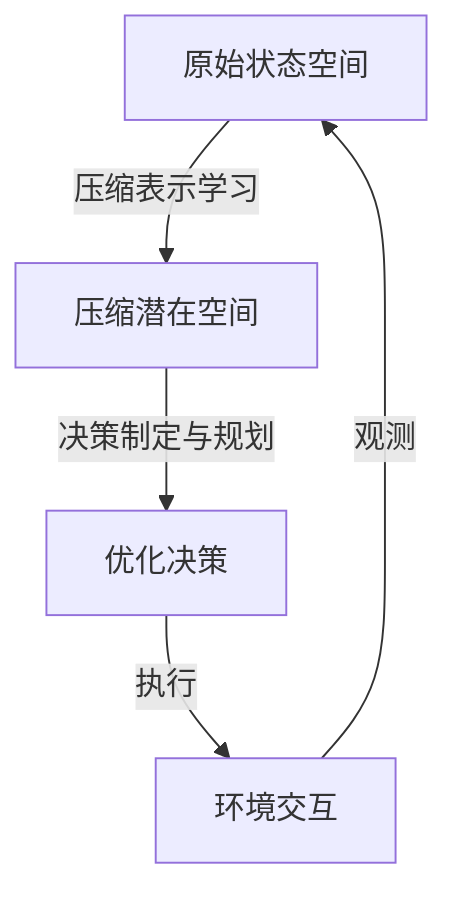

# 压缩强化学习模型:更高效的决策

## 1.背景介绍

### 1.1 强化学习的挑战

强化学习是一种基于环境交互的机器学习范式,其目标是通过试错来学习一个策略,使代理能够在给定环境中获得最大的累积奖励。然而,传统的强化学习方法面临着一些重大挑战:

1. **维数灾难**: 当状态空间和动作空间变大时,探索和学习所需的时间和计算资源会快速增长。
2. **样本效率低下**: 强化学习算法通常需要大量的环境交互来学习一个有效的策略,这在现实世界中是代价高昂的。
3. **泛化能力差**: 传统方法很难将学习到的知识有效地泛化到新的情况。

### 1.2 压缩强化学习的兴起

为了解决上述挑战,压缩强化学习(Compressed Reinforcement Learning)应运而生。压缩强化学习旨在通过压缩表示和高效的决策制定,来提高强化学习的样本效率、泛化能力和计算效率。

压缩强化学习的核心思想是将高维的状态空间和动作空间映射到一个低维的潜在空间,在这个潜在空间中进行策略学习和决策制定。通过这种压缩表示,模型可以更高效地探索和学习,从而提高样本效率和泛化能力。

## 2.核心概念与联系

### 2.1 压缩表示学习

压缩表示学习是压缩强化学习的关键组成部分。它旨在从高维的原始状态空间中学习一个低维的潜在表示,同时保留足够的信息来支持策略学习和决策制定。

常见的压缩表示学习方法包括:

1. **自编码器(Autoencoders)**: 通过重构损失函数来学习压缩表示。
2. **变分自编码器(Variational Autoencoders, VAEs)**: 引入潜在变量的概率分布,使用变分推理来近似后验分布。
3. **生成对抗网络(Generative Adversarial Networks, GANs)**: 通过对抗训练来学习数据分布,从而获得压缩表示。

这些方法可以单独使用,也可以与强化学习算法结合使用,形成端到端的压缩强化学习框架。

### 2.2 决策制定与规划

在压缩的潜在空间中,决策制定和规划变得更加高效。常见的方法包括:

1. **模型预测控制(Model Predictive Control, MPC)**: 在潜在空间中构建动态模型,并使用优化技术进行规划和控制。
2. **路径积分控制(Path Integral Control)**: 基于概率推理的控制方法,在潜在空间中进行路径采样和评估。
3. **模型预测路径积分(Model Predictive Path Integral)**: 结合MPC和路径积分控制的方法,在潜在空间中进行高效的决策制定。

这些方法利用压缩表示的低维性质,可以显著降低计算复杂度,从而实现更高效的决策制定。

## 3.核心算法原理具体操作步骤

### 3.1 压缩表示学习算法

以变分自编码器(VAE)为例,压缩表示学习的具体操作步骤如下:

1. **定义潜在变量**: 定义一个连续的潜在变量 $z$,用于表示压缩的状态表示。
2. **定义生成模型**: 定义一个生成模型 $p_\theta(x|z)$,用于从潜在变量 $z$ 生成观测数据 $x$。
3. **定义先验分布**: 定义潜在变量 $z$ 的先验分布 $p(z)$,通常假设为标准正态分布。
4. **定义变分后验**: 定义一个变分后验分布 $q_\phi(z|x)$,用于近似真实的后验分布 $p(z|x)$。
5. **优化变分下界**: 通过最大化证据下界(ELBO)来优化生成模型参数 $\theta$ 和变分后验参数 $\phi$:

$$
\mathcal{L}(\theta, \phi; x) = \mathbb{E}_{q_\phi(z|x)}[\log p_\theta(x|z)] - D_\text{KL}(q_\phi(z|x) \| p(z))
$$

6. **编码和解码**: 在训练完成后,可以使用变分后验 $q_\phi(z|x)$ 将观测数据 $x$ 编码为潜在表示 $z$,并使用生成模型 $p_\theta(x|z)$ 将潜在表示 $z$ 解码为重构数据 $\hat{x}$。

通过上述步骤,VAE可以学习到一个压缩的潜在表示 $z$,同时保留了足够的信息来重构原始数据。

### 3.2 决策制定与规划算法

以模型预测路径积分(Model Predictive Path Integral, MPPI)为例,决策制定与规划的具体操作步骤如下:

1. **构建动态模型**: 在压缩的潜在空间中,构建一个动态模型 $f$,用于预测状态转移:

$$
z_{t+1} = f(z_t, u_t)
$$

其中 $z_t$ 和 $z_{t+1}$ 分别表示时刻 $t$ 和 $t+1$ 的潜在状态,而 $u_t$ 表示时刻 $t$ 的控制输入。

2. **定义代价函数**: 定义一个代价函数 $J$,用于评估未来轨迹的质量:

$$
J = \sum_{t=0}^{T} c(z_t, u_t)
$$

其中 $c(z_t, u_t)$ 是单步代价函数,可以根据任务需求进行设计。

3. **采样轨迹**: 从一个基准轨迹出发,采样多条不同的轨迹,每条轨迹对应一个控制序列 $\{u_0, u_1, \ldots, u_{T-1}\}$。
4. **评估轨迹**: 对每条采样轨迹计算代价函数值 $J$。
5. **更新基准轨迹**: 根据代价函数值,更新基准轨迹的控制序列,使其朝着更优的方向移动。
6. **迭代优化**: 重复步骤 3-5,直到收敛或达到最大迭代次数。

通过上述步骤,MPPI可以在压缩的潜在空间中高效地进行决策制定和规划,从而获得优化的控制序列。

## 4.数学模型和公式详细讲解举例说明

### 4.1 变分自编码器(VAE)

变分自编码器(VAE)是一种常用的压缩表示学习模型,它通过引入潜在变量的概率分布,使用变分推理来近似后验分布。VAE的核心思想是最大化证据下界(ELBO),从而同时优化生成模型和变分后验模型。

VAE的数学模型可以表示为:

$$
\begin{aligned}
p_\theta(x) &= \int p_\theta(x|z)p(z)dz \\
\log p_\theta(x) &= \mathbb{E}_{q_\phi(z|x)}[\log p_\theta(x|z)] - D_\text{KL}(q_\phi(z|x) \| p(z)) + \text{const.}
\end{aligned}
$$

其中:

- $p_\theta(x)$ 是观测数据 $x$ 的边缘分布。
- $p_\theta(x|z)$ 是生成模型,用于从潜在变量 $z$ 生成观测数据 $x$。
- $p(z)$ 是潜在变量 $z$ 的先验分布,通常假设为标准正态分布。
- $q_\phi(z|x)$ 是变分后验分布,用于近似真实的后验分布 $p(z|x)$。
- $D_\text{KL}(q_\phi(z|x) \| p(z))$ 是 $q_\phi(z|x)$ 与 $p(z)$ 之间的 KL 散度。

VAE通过最大化证据下界(ELBO)来优化生成模型参数 $\theta$ 和变分后验参数 $\phi$:

$$
\mathcal{L}(\theta, \phi; x) = \mathbb{E}_{q_\phi(z|x)}[\log p_\theta(x|z)] - D_\text{KL}(q_\phi(z|x) \| p(z))
$$

在训练过程中,VAE会学习到一个压缩的潜在表示 $z$,同时保留了足够的信息来重构原始数据 $x$。

### 4.2 模型预测路径积分(MPPI)

模型预测路径积分(MPPI)是一种在压缩的潜在空间中进行决策制定和规划的算法。它结合了模型预测控制(MPC)和路径积分控制(Path Integral Control)的思想,通过采样和评估多条轨迹来优化控制序列。

MPPI的核心思想是最小化一个代价函数 $J$,该函数衡量未来轨迹的质量。具体来说,MPPI的数学模型可以表示为:

$$
J = \sum_{t=0}^{T} c(z_t, u_t)
$$

其中:

- $z_t$ 是时刻 $t$ 的潜在状态。
- $u_t$ 是时刻 $t$ 的控制输入。
- $c(z_t, u_t)$ 是单步代价函数,用于评估状态-控制对的质量。

MPPI算法通过以下步骤来优化控制序列:

1. 从一个基准轨迹出发,采样多条不同的轨迹,每条轨迹对应一个控制序列 $\{u_0, u_1, \ldots, u_{T-1}\}$。
2. 对每条采样轨迹计算代价函数值 $J$。
3. 根据代价函数值,更新基准轨迹的控制序列,使其朝着更优的方向移动。
4. 重复步骤 1-3,直到收敛或达到最大迭代次数。

通过上述步骤,MPPI可以在压缩的潜在空间中高效地进行决策制定和规划,从而获得优化的控制序列。

### 4.3 示例:机器人路径规划

考虑一个机器人路径规划的问题,机器人需要在一个环境中从起点移动到终点,同时避开障碍物。我们可以使用压缩强化学习来解决这个问题。

首先,我们使用VAE来学习一个压缩的潜在表示 $z$,将高维的环境状态 $x$ (如机器人位置、障碍物位置等)映射到低维的潜在空间。VAE的目标是最大化证据下界(ELBO):

$$
\mathcal{L}(\theta, \phi; x) = \mathbb{E}_{q_\phi(z|x)}[\log p_\theta(x|z)] - D_\text{KL}(q_\phi(z|x) \| p(z))
$$

其中 $p_\theta(x|z)$ 是生成模型,用于从潜在表示 $z$ 重构原始状态 $x$,而 $q_\phi(z|x)$ 是变分后验模型,用于将状态 $x$ 编码为潜在表示 $z$。

接下来,我们在压缩的潜在空间中使用MPPI进行路径规划和决策制定。我们构建一个动态模型 $f$,用于预测机器人在执行控制输入 $u_t$ 后的下一个潜在状态 $z_{t+1}$:

$$
z_{t+1} = f(z_t, u_t)
$$

然后,我们定义一个代价函数 $J$,用于评估未来轨迹的质量:

$$
J = \sum_{t=0}^{T} c(z_t, u_t)
$$

其中 $c(z_t, u_t)$ 可以包括机器人与障碍物的距离、机器人与终点的距离等因素。

MPPI算法通过采样和评估多条轨迹,并不断更新基准轨迹的控制序列,最终找到一条优化的路径。在这个过程中,压缩的潜在表示 $z$ 使得探索和规划变得更加高效,从而提高了算法的性能。

## 5.项目实践:代码实例和详细解释说明

在这一部分,我们将提供一个基于PyTorch实现的压缩强化学习项目示例,包括VAE和MPPI的代码实现。

### 5