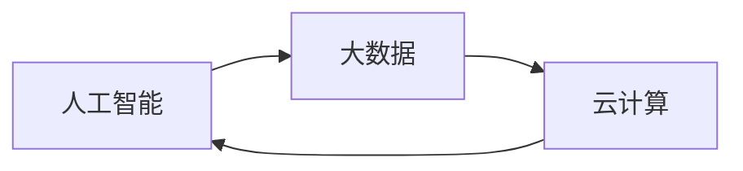

## 1.背景介绍

随着科技的快速发展，人工智能、大数据和云计算等技术在各个领域得到了广泛的应用。在这个过程中，理解各种技术原理并将其应用到实际项目中成为了每个技术人员必须掌握的技能。本文将通过详细讲解原理，并结合代码实战案例，帮助读者更好地理解和掌握这些技术。

## 2.核心概念与联系

在开始深入讲解之前，我们先来了解一下几个核心的概念：

- **人工智能**：人工智能是一种通过计算机程序和系统模拟、扩展和增强人的智能处理能力的技术。它包括机器学习、深度学习、自然语言处理等多个子领域。

- **大数据**：大数据是指在传统数据处理应用软件难以处理的数据集。这些数据集具有大量、高增长率和多样性的特点，需要新的处理方式才能进行更深入的分析。

- **云计算**：云计算是一种通过网络提供按需访问的计算资源和服务的模式。用户无需了解、管理和维护底层的复杂基础设施，就可以简单、快速地获取所需的资源。

这三个概念之间的联系非常紧密。人工智能需要大量的数据进行训练，而大数据技术则可以处理和分析这些数据。云计算提供了强大的计算资源和服务，为人工智能的发展提供了可能。



## 3.核心算法原理具体操作步骤

接下来，我们将通过一个简单的代码实战案例来讲解人工智能中的一种核心算法——线性回归的原理和操作步骤。

### 3.1 线性回归原理

线性回归是一种预测模型，用于解释自变量和因变量之间的关系。线性回归模型的基本形式为 $y = a * x + b$，其中 $a$ 和 $b$ 是模型的参数，$x$ 是自变量，$y$ 是因变量。

### 3.2 算法操作步骤

线性回归的操作步骤主要包括以下几个步骤：

1. **数据准备**：收集并处理数据，将数据划分为训练集和测试集。

2. **模型训练**：使用训练集数据训练模型，通过梯度下降等优化算法求解模型参数。

3. **模型评估**：使用测试集数据评估模型的性能，如预测准确率、误差等。

4. **模型应用**：将训练好的模型应用到实际问题中，进行预测或决策。

## 4.数学模型和公式详细讲解举例说明

在线性回归模型中，我们的目标是找到一条直线，使得所有数据点到这条直线的距离之和最小。这就是最小二乘法的原理。

线性回归模型的损失函数可以表示为：

$$
L(a, b) = \sum_{i=1}^{n}(y_i - (a * x_i + b))^2
$$

其中，$n$ 是数据点的数量，$x_i$ 和 $y_i$ 分别是第 $i$ 个数据点的自变量和因变量值。

我们的目标是找到参数 $a$ 和 $b$，使得损失函数 $L(a, b)$ 最小。这可以通过梯度下降等优化算法实现。

## 5.项目实践：代码实例和详细解释说明

接下来，我们将通过一个简单的代码实战案例来展示线性回归模型的训练和应用过程。

### 5.1 数据准备

首先，我们需要准备一些数据。在这个案例中，我们将使用 Python 的 sklearn 库中的波士顿房价数据集。

```python
from sklearn.datasets import load_boston
from sklearn.model_selection import train_test_split

# 加载数据
boston = load_boston()

# 划分训练集和测试集
X_train, X_test, y_train, y_test = train_test_split(boston.data, boston.target, test_size=0.2, random_state=42)
```

### 5.2 模型训练

然后，我们使用训练集数据训练线性回归模型。

```python
from sklearn.linear_model import LinearRegression

# 创建模型
model = LinearRegression()

# 训练模型
model.fit(X_train, y_train)
```

### 5.3 模型评估

接下来，我们使用测试集数据评估模型的性能。

```python
from sklearn.metrics import mean_squared_error

# 预测测试集数据
y_pred = model.predict(X_test)

# 计算均方误差
mse = mean_squared_error(y_test, y_pred)
print('均方误差：', mse)
```

### 5.4 模型应用

最后，我们可以将训练好的模型应用到实际问题中。例如，我们可以使用模型预测新的房价数据。

```python
# 新的房价数据
new_data = [[0.02731, 0.0, 7.07, 0.0, 0.469, 6.421, 78.9, 4.9671, 2.0, 242.0, 17.8, 396.90, 9.14]]

# 预测新的房价数据
new_pred = model.predict(new_data)
print('预测房价：', new_pred[0])
```

## 6.实际应用场景

线性回归模型在各个领域都有广泛的应用，例如：

- **预测销售额**：零售商可以根据历史销售数据，使用线性回归模型预测未来的销售额。

- **房价预测**：房地产公司可以根据房屋的各种特征（如面积、位置、装修等），使用线性回归模型预测房价。

- **股票预测**：投资者可以根据历史股票价格，使用线性回归模型预测未来的股票价格。

## 7.工具和资源推荐

以下是一些推荐的工具和资源，可以帮助你更好地学习和应用线性回归模型：

- **Python**：Python 是一种广泛用于科学计算和数据分析的编程语言。Python 的 sklearn 库提供了丰富的机器学习算法，包括线性回归。

- **Jupyter Notebook**：Jupyter Notebook 是一个开源的 Web 应用程序，允许你创建和共享包含代码、方程、可视化和文本的文档。它非常适合用于数据分析和机器学习。

- **Coursera**：Coursera 是一个在线学习平台，提供了许多关于机器学习和数据科学的课程。

## 8.总结：未来发展趋势与挑战

随着科技的快速发展，人工智能、大数据和云计算等技术将在各个领域得到更广泛的应用。然而，这也带来了一些挑战，例如数据安全、隐私保护、算法可解释性等。

未来，我们需要更深入地研究这些技术，解决这些挑战，以实现技术的可持续发展，并为社会带来更大的价值。

## 9.附录：常见问题与解答

### Q: 线性回归模型适用于所有的数据吗？

A: 不是。线性回归模型假设数据之间存在线性关系。如果数据之间的关系是非线性的，那么线性回归模型可能无法很好地拟合数据。

### Q: 如何选择合适的机器学习模型？

A: 选择机器学习模型需要考虑多个因素，包括问题的性质、数据的特征、模型的复杂性、训练时间等。通常，我们会尝试多种模型，然后选择性能最好的模型。

### Q: 如何评估模型的性能？

A: 评估模型的性能通常需要使用一些度量指标，如预测准确率、误差等。选择哪种度量指标取决于问题的性质和目标。例如，对于回归问题，我们通常使用均方误差作为度量指标。

作者：禅与计算机程序设计艺术 / Zen and the Art of Computer Programming