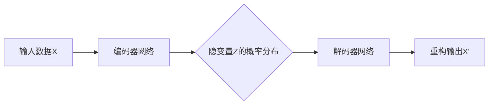

# 变分自编码器(VAE)原理与代码实战案例讲解

## 1. 背景介绍
### 1.1 生成模型概述
### 1.2 VAE的起源与发展
### 1.3 VAE在深度学习中的地位

## 2. 核心概念与联系
### 2.1 自编码器(Autoencoder)
#### 2.1.1 编码器(Encoder)  
#### 2.1.2 解码器(Decoder)
#### 2.1.3 自编码器的目标函数
### 2.2 变分推断(Variational Inference) 
#### 2.2.1 概率图模型
#### 2.2.2 变分下界(ELBO)
#### 2.2.3 KL散度(Kullback-Leibler Divergence)
### 2.3 VAE结构总览
#### 2.3.1 VAE的编码器
#### 2.3.2 VAE的解码器 
#### 2.3.3 VAE的损失函数



## 3. 核心算法原理具体操作步骤
### 3.1 编码阶段
#### 3.1.1 将输入数据X映射到隐空间Z
#### 3.1.2 隐变量Z服从正态分布N(μ,σ²)
#### 3.1.3 使用重参数化技巧生成Z
### 3.2 解码阶段  
#### 3.2.1 将隐变量Z映射回原始数据空间
#### 3.2.2 重构出输入数据的近似X'
### 3.3 模型训练
#### 3.3.1 重构损失
#### 3.3.2 KL散度正则化
#### 3.3.3 反向传播与参数更新

## 4. 数学模型和公式详细讲解举例说明
### 4.1 变分下界(ELBO)推导
假设观测数据为$X=\{x^{(1)},\cdots,x^{(N)}\}$，隐变量为$Z$。我们希望找到一个概率分布$q_{\phi}(z|x)$来近似真实的后验分布$p_{\theta}(z|x)$。根据Gibbs不等式，可以得到如下变分下界(ELBO):

$$\begin{aligned}
\log p_{\theta}(x) &= \log\int p_{\theta}(x,z)dz \\
&= \log\int q_{\phi}(z|x)\frac{p_{\theta}(x,z)}{q_{\phi}(z|x)}dz \\
&\geq \int q_{\phi}(z|x)\log\frac{p_{\theta}(x,z)}{q_{\phi}(z|x)}dz \\
&= \mathbb{E}_{q_{\phi}(z|x)}[\log p_{\theta}(x|z)] - D_{KL}(q_{\phi}(z|x)||p_{\theta}(z)) \\
&\triangleq \mathcal{L}(\theta,\phi;x)
\end{aligned}$$

其中，$\mathcal{L}(\theta,\phi;x)$即为ELBO，由重构项$\mathbb{E}_{q_{\phi}(z|x)}[\log p_{\theta}(x|z)]$和KL散度正则项$D_{KL}(q_{\phi}(z|x)||p_{\theta}(z))$组成。

### 4.2 重参数化技巧
为了能够对ELBO进行端到端的随机梯度优化，VAE使用了重参数化技巧。引入一个服从标准正态分布的随机噪声变量$\epsilon \sim \mathcal{N}(0,I)$，然后可以将隐变量$z$表示为：

$$z=\mu+\sigma \odot \epsilon$$

其中$\mu$和$\sigma$是编码器网络的输出，$\odot$表示逐元素相乘。这样就可以将隐变量$z$的采样过程集成到整个网络的前向传播中，使得梯度能够回传。

## 5. 项目实践：代码实例和详细解释说明
下面以PyTorch为例，给出VAE的核心代码实现：

```python
class VAE(nn.Module):
    def __init__(self, input_dim, hidden_dim, latent_dim):
        super(VAE, self).__init__()
        
        # 编码器
        self.encoder = nn.Sequential(
            nn.Linear(input_dim, hidden_dim),
            nn.ReLU(),
            nn.Linear(hidden_dim, 2*latent_dim) 
        )
        
        # 解码器
        self.decoder = nn.Sequential(
            nn.Linear(latent_dim, hidden_dim),
            nn.ReLU(),
            nn.Linear(hidden_dim, input_dim),
            nn.Sigmoid()
        )
        
    def encode(self, x):
        h = self.encoder(x)
        mu, logvar = h.chunk(2, dim=-1)
        return mu, logvar
    
    def reparameterize(self, mu, logvar):
        std = torch.exp(0.5*logvar)
        eps = torch.randn_like(std)
        z = mu + eps*std
        return z
    
    def decode(self, z):
        x_recon = self.decoder(z)
        return x_recon
        
    def forward(self, x):
        mu, logvar = self.encode(x)
        z = self.reparameterize(mu, logvar)
        x_recon = self.decode(z)
        return x_recon, mu, logvar
        
def vae_loss(x, x_recon, mu, logvar):
    recon_loss = F.binary_cross_entropy(x_recon, x, reduction='sum')
    kl_div = -0.5 * torch.sum(1 + logvar - mu.pow(2) - logvar.exp())
    return recon_loss + kl_div       
```

其中，`VAE`类定义了VAE模型，包括编码器和解码器两个子网络。`encode`方法将输入映射到隐空间，并输出隐变量的均值和对数方差。`reparameterize`方法使用重参数化技巧生成隐变量。`decode`方法将隐变量映射回原始数据空间进行重构。`forward`方法定义了VAE的前向传播过程。

`vae_loss`函数计算VAE的损失，包括重构损失和KL散度正则化项。重构损失使用二元交叉熵，KL散度可以根据隐变量的先验分布和后验分布的解析形式计算得到。

## 6. 实际应用场景
### 6.1 图像生成
### 6.2 异常检测
### 6.3 半监督学习
### 6.4 可解释的表征学习

## 7. 工具和资源推荐
### 7.1 深度学习框架
- PyTorch: https://pytorch.org/
- TensorFlow: https://www.tensorflow.org/
- Keras: https://keras.io/
### 7.2 相关论文
- Kingma, D. P., & Welling, M. (2013). Auto-encoding variational bayes. arXiv preprint arXiv:1312.6114.
- Rezende, D. J., Mohamed, S., & Wierstra, D. (2014). Stochastic backpropagation and approximate inference in deep generative models. In International conference on machine learning (pp. 1278-1286). PMLR.
### 7.3 开源实现
- PyTorch-VAE: https://github.com/AntixK/PyTorch-VAE  
- Keras-VAE: https://github.com/keras-team/keras-io/blob/master/examples/generative/vae.py

## 8. 总结：未来发展趋势与挑战
### 8.1 VAE的局限性
### 8.2 VAE的改进与扩展
#### 8.2.1 β-VAE
#### 8.2.2 条件VAE
#### 8.2.3 层次VAE
### 8.3 结合其他生成模型
#### 8.3.1 VAE+GAN
#### 8.3.2 VAE+Normalizing Flow
### 8.4 开放性问题与挑战

## 9. 附录：常见问题与解答
### 9.1 VAE与传统自编码器的区别？ 
### 9.2 为什么要用重参数化技巧？
### 9.3 如何理解ELBO？  
### 9.4 VAE能否生成离散型数据？
### 9.5 β-VAE的原理是什么？

作者：禅与计算机程序设计艺术 / Zen and the Art of Computer Programming