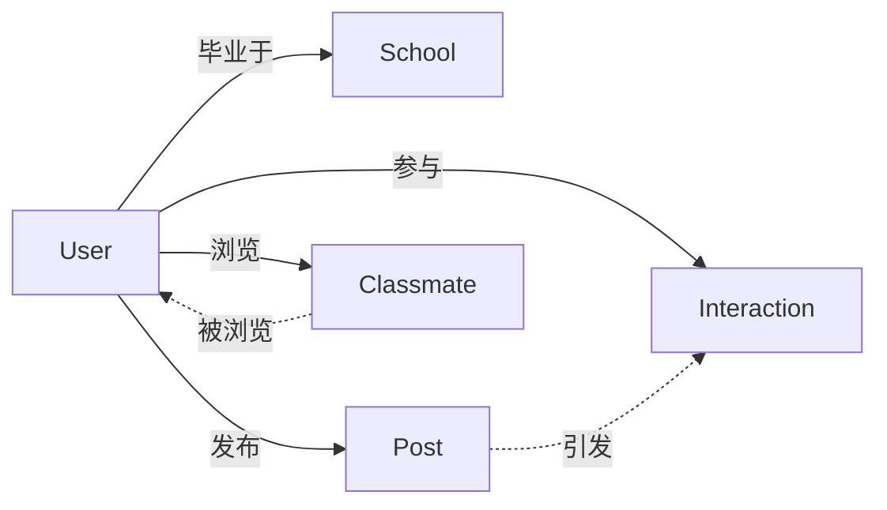

# 同学录管理系统详细设计与具体代码实现

## 1. 背景介绍

随着互联网和移动互联网的迅猛发展,人们的生活方式和交流方式发生了翻天覆地的变化。作为人生重要阶段的同学关系,也因为毕业分离、工作繁忙等原因变得日渐淡漠。如何利用信息技术手段,方便快捷地管理和维系同学关系,成为了一个值得探讨的话题。

本文将详细介绍一个基于Web的同学录管理系统的设计与实现。该系统采用当前流行的B/S架构,前端使用HTML、CSS、JavaScript等技术,后端采用Java语言,基于Spring Boot框架开发,数据库使用MySQL。力求为用户提供功能完善、界面友好、性能优异的同学录管理平台。

## 2. 核心概念与联系

在深入探讨同学录管理系统的设计与实现之前,我们有必要厘清几个核心概念,理解它们之间的关系:

### 2.1 用户(User)
- 定义:使用同学录管理系统的主体,通常是注册了账号的同学。
- 属性:用户ID、用户名、密码、姓名、性别、出生日期、籍贯、毕业院校、毕业年份、联系方式等。
- 行为:注册、登录、完善个人信息、浏览同学信息、发布动态、参与互动等。

### 2.2 同学(Classmate) 
- 定义:用户的同学,通常是注册了同一所学校的其他用户。
- 属性:同学ID、姓名、性别、毕业年份、专业、班级、常用联系方式等。
- 行为:被其他用户浏览、被加为好友、接收好友动态等。

### 2.3 动态(Post)
- 定义:用户在同学录系统中发布的内容,可以是文字、图片、视频等形式。
- 属性:动态ID、发布用户ID、发布时间、动态内容、点赞数、评论数等。 
- 行为:被浏览、被点赞、被评论、被转发等。

### 2.4 互动(Interaction)
- 定义:用户之间通过动态产生的交流,例如点赞、评论、私信等。
- 属性:互动ID、互动类型、发起用户ID、接收用户ID、互动内容、互动时间等。
- 行为:被发起、被接收、引发后续互动等。

它们之间的关系可以用下面的Mermaid图来表示:



## 3. 核心算法原理具体操作步骤

同学录管理系统的核心功能是帮助用户高效便捷地管理同学关系,快速检索到想联系的同学。因此,系统需要实现的核心算法主要包括:

### 3.1 用户注册登录
1. 用户在注册页面填写相关信息并提交
2. 后端接收到注册请求,对用户名、密码等关键信息进行合法性校验
3. 通过校验后,将用户信息持久化到数据库,并返回注册成功的响应
4. 用户在登录页面填写用户名和密码并提交
5. 后端接收到登录请求,与数据库中的用户信息进行比对
6. 比对成功后,生成JWT(JSON Web Token)返回给前端,前端存储该token
7. 后续请求都通过token进行用户身份验证

### 3.2 同学检索
1. 用户在检索页面选择检索条件(姓名、学校、专业、毕业年份等)并提交
2. 后端接收到检索请求,根据条件生成对应的SQL语句
3. 在数据库中执行该SQL语句,返回匹配的同学信息列表
4. 前端接收到同学列表后进行展示,提供分页功能

### 3.3 动态发布与互动
1. 用户在发布页面编辑动态内容(文字、图片、视频等),设置可见范围并提交
2. 后端接收到发布请求,将动态内容持久化到数据库,并更新用户的动态列表
3. 其他用户浏览动态时,可以点赞、评论、转发等,后端接收到互动请求后更新数据库
4. 被互动的用户实时收到互动提醒,可以进行回复

## 4. 数学模型和公式详细讲解举例说明

在同学录管理系统中,我们可以用一些数学模型来刻画用户之间的关系,例如:

### 4.1 用户相似度计算

我们可以用余弦相似度来计算两个用户的相似程度。设用户 $i$ 和用户 $j$ 的属性向量分别为 $U_i$ 和 $U_j$,则他们的相似度为:

$$
sim(i,j) = \frac{U_i \cdot U_j}{||U_i|| \times ||U_j||}
$$

其中 $U_i \cdot U_j$ 表示两个向量的内积, $||U_i||$ 表示向量的模。

举例来说,如果我们只考虑用户的毕业年份和性别两个属性,那么属性向量可以表示为:

$$
U_i = (year_i, gender_i), U_j = (year_j, gender_j)
$$

其中 $year$ 表示毕业年份(可以转化为数值), $gender$ 用0/1表示性别。

假设用户 $i$ 的毕业年份为2010,性别为男;用户 $j$ 的毕业年份为2011,性别为女,则:

$$
\begin{aligned}
U_i &= (2010, 1) \\
U_j &= (2011, 0) \\
U_i \cdot U_j &= 2010 \times 2011 + 1 \times 0 = 4044110 \\
||U_i|| &= \sqrt{2010^2 + 1^2} \approx 2010 \\  
||U_j|| &= \sqrt{2011^2 + 0^2} = 2011 \\
sim(i,j) &= \frac{4044110}{2010 \times 2011} \approx 0.9997
\end{aligned}
$$

可见这两个用户的相似度很高。我们可以利用相似度来给用户推荐潜在的好友。

### 4.2 用户影响力计算

在社交网络中,我们常常需要衡量一个用户的影响力。影响力高的用户发布的动态更容易被其他用户看到和互动。一个简单的影响力模型是:

$$
Influence(i) = \sum_{j=1}^N w_{ij}
$$

其中 $N$ 表示用户总数, $w_{ij}$ 表示用户 $j$ 与用户 $i$ 互动的权重,可以用互动次数、互动类型等因素来定义。

举例来说,假设用户 $i$ 发布了一条动态,用户 $j$ 点赞了该动态,用户 $k$ 评论了该动态,我们定义点赞的权重为1,评论的权重为2,则:

$$
Influence(i) = 1 + 2 = 3
$$

我们可以利用影响力模型来识别出关键用户,重点推荐他们的动态。

## 5. 项目实践:代码实例和详细解释说明

下面我们通过几个核心功能的代码实例,来说明同学录管理系统的具体实现。

### 5.1 用户注册

前端注册页面(register.html):

```html
<form id="registerForm">
  <div>
    <label>用户名:</label>
    <input type="text" name="username" required>
  </div>
  <div>
    <label>密码:</label>
    <input type="password" name="password" required>
  </div>
  <div>
    <label>确认密码:</label>
    <input type="password" name="repassword" required>
  </div>
  <button type="submit">注册</button>
</form>
<script>
  $('#registerForm').submit(function(e) {
    e.preventDefault();
    var formData = $(this).serialize();
    $.post('/api/register', formData, function(res) {
      if (res.code == 0) {
        alert('注册成功!');
        location.href = '/login.html';
      } else {
        alert('注册失败: ' + res.msg);
      }
    });
  });
</script>
```

后端注册接口(UserController.java):

```java
@RestController
@RequestMapping("/api")
public class UserController {

  @Autowired
  private UserService userService;

  @PostMapping("/register")
  public Result register(String username, String password, String repassword) {
    if (!password.equals(repassword)) {
      return Result.error("两次密码不一致");
    }
    User user = new User();
    user.setUsername(username);
    user.setPassword(DigestUtils.md5Hex(password));
    userService.save(user);
    return Result.ok();
  }
}
```

这里前端通过一个表单收集用户名、密码等信息,提交到后端的`/api/register`接口。

后端首先校验两次输入的密码是否一致,然后将用户信息设置到User对象中。注意这里要用MD5等方式加密存储密码。

最后调用UserService的save方法将用户信息持久化到数据库。

### 5.2 同学检索

前端检索页面(search.html):

```html
<form id="searchForm">
  <div>
    <label>姓名:</label>
    <input type="text" name="name">
  </div>
  <div>
    <label>学校:</label>
    <input type="text" name="school">
  </div>
  <div>
    <label>专业:</label>
    <input type="text" name="major">
  </div>
  <div>
    <label>毕业年份:</label>
    <input type="number" name="year">
  </div>
  <button type="submit">搜索</button>
</form>
<ul id="resultList"></ul>
<script>
  $('#searchForm').submit(function(e) {
    e.preventDefault();
    var formData = $(this).serialize();
    $.get('/api/search?' + formData, function(res) {
      if (res.code == 0) {
        var html = res.data.map(function(item) {
          return `<li>
            <h4>${item.name}</h4>
            <p>${item.school} | ${item.major} | ${item.year}届</p>
          </li>`;
        }).join('');
        $('#resultList').html(html);
      } else {
        alert('搜索失败: ' + res.msg);
      }
    });
  });
</script>
```

后端检索接口(ClassmateController.java):

```java
@RestController
@RequestMapping("/api")
public class ClassmateController {

  @Autowired
  private ClassmateService classmateService;

  @GetMapping("/search")
  public Result search(String name, String school, String major, Integer year) {
    LambdaQueryWrapper<Classmate> wrapper = new LambdaQueryWrapper<>();
    wrapper.like(StringUtils.isNotBlank(name), Classmate::getName, name)
           .like(StringUtils.isNotBlank(school), Classmate::getSchool, school)  
           .like(StringUtils.isNotBlank(major), Classmate::getMajor, major)
           .eq(year != null, Classmate::getYear, year);
    List<Classmate> list = classmateService.list(wrapper);
    return Result.ok(list);
  }
}
```

这里前端通过一个表单收集姓名、学校、专业、毕业年份等检索条件,提交到后端的`/api/search`接口。

后端使用MyBatis-Plus的LambdaQueryWrapper来动态生成SQL语句。它允许我们用链式调用的方式拼接多个查询条件。

最后调用ClassmateService的list方法执行查询,将结果返回给前端展示。

### 5.3 动态发布

前端发布页面(post.html):

```html
<form id="postForm">
  <div>
    <label>内容:</label>
    <textarea name="content" required></textarea>
  </div>
  <div>
    <label>图片:</label>
    <input type="file" name="image">
  </div>
  <div>
    <label>可见范围:</label>
    <select name="scope">
      <option value="1">公开</option>
      <option value="2">好友可见</option>
      <option value="3">仅自己可见</option>
    </select>
  </div>
  <button type="submit">发布</button>
</form>
<script>
  $('#postForm').submit(function(e) {
    e.preventDefault();
    var formData = new FormData(this);
    $.ajax({
      url: '/api/post',
      type: 'POST',
      data: formData,
      processData: false,
      contentType: false,
      success: function(res) {
        if (res.code == 0) {
          alert('发布成功!');
          location.href = '/index.html';
        } else {
          alert('发布失败: ' + res.msg);
        }
      }
    });
  });
</script>
```

后端发布接口(PostController.java):

```java
@RestController
@RequestMapping("/api")