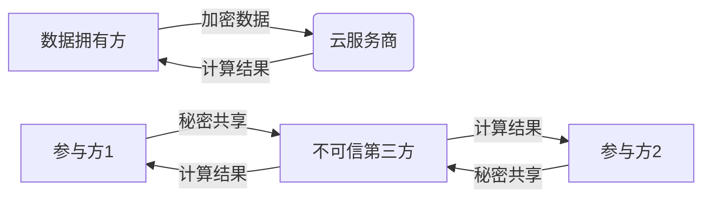

# 同态加密与安全多方计算原理与代码实战案例讲解

## 1.背景介绍
### 1.1 数据安全与隐私保护的重要性
在大数据时代,海量数据的收集、存储和分析给各行各业带来了巨大的价值,但同时也带来了数据安全和隐私保护的巨大挑战。个人信息、商业机密、政府数据等敏感信息一旦泄露,将会造成难以估量的损失。因此,如何在充分利用数据的同时,确保数据安全和隐私,成为当前亟需解决的关键问题。

### 1.2 传统数据安全技术的局限性
传统的数据安全技术如访问控制、数据加密等,虽然在一定程度上可以保护数据安全,但仍然存在一些局限性:
- 访问控制无法防止内部人员的数据滥用
- 数据加密虽然可以保护静态数据,但一旦解密就失去保护
- 对外包、云计算等场景下的数据保护能力有限

### 1.3 隐私保护计算技术的兴起 
为了解决传统安全技术的不足,近年来兴起了一系列隐私保护计算技术,包括同态加密(Homomorphic Encryption)、安全多方计算(Secure Multi-Party Computation)、可搜索加密、零知识证明等。这些技术可以在保护数据隐私的同时,支持对加密数据的直接计算,为数据安全与隐私保护提供了新的解决思路。

本文将重点介绍同态加密和安全多方计算这两种核心技术,深入剖析它们的原理、算法实现和实际应用,并给出详细的代码实例,帮助读者全面掌握这两种前沿技术。

## 2.核心概念与联系
### 2.1 同态加密 
同态加密(Homomorphic Encryption, HE)是一种特殊的加密方案,它允许对密文进行某些运算,得到的结果解密后与对明文进行同样运算的结果一致。根据支持的操作类型,同态加密可分为:
- 部分同态加密(Partially HE):仅支持密文的加法或乘法运算 
- 略同态加密(Somewhat HE):支持密文的加法和有限次数的乘法运算
- 全同态加密(Fully HE):支持密文的任意多项式函数计算

同态加密的优点是无需解密即可对加密数据进行处理,非常适合外包计算、云计算等场景。但其缺点是计算效率较低,且密钥管理复杂。

### 2.2 安全多方计算
安全多方计算(Secure Multi-Party Computation, MPC)允许多个参与方在不泄露各自隐私数据的前提下,共同完成某个计算任务。MPC的一个经典问题是"百万富翁问题":两个百万富翁想知道谁更富有,但又都不想透露自己的具体财富。MPC可以在不泄露任何一方具体数值的情况下,求出两人财富的大小关系。

MPC的主要实现方法包括:
- 不经意传输(Oblivious Transfer)
- 秘密共享(Secret Sharing)
- 混淆电路(Garbled Circuit)

MPC的优点是可以在完全不信任的场景下,实现隐私保护的分布式计算。但其缺点是通信开销大,且对参与方数量敏感。

### 2.3 两种技术的联系与区别
同态加密和安全多方计算都是隐私保护计算的重要技术,它们的相同点是:
- 可以实现加密数据的直接计算
- 保护数据隐私,防止数据泄露

但两者也存在一些区别:
- 参与方:HE一般为数据拥有方和计算方两方,MPC涉及多个参与方
- 密钥管理:HE需要管理加解密密钥,MPC无需考虑密钥问题
- 适用场景:HE适合数据所有权明确的外包计算,MPC适合平等互不信任方的联合计算

下图描述了两种技术的主要区别:

## 3.核心算法原理具体操作步骤
### 3.1 同态加密算法原理
#### 3.1.1 RSA同态
RSA同态是最早的同态加密方案,它基于RSA公钥加密体制,支持密文的乘法同态运算。设 $(n,e)$ 为公钥, $m_1, m_2$ 为两个明文,则有:

$$
D(E(m_1)·E(m_2) \bmod n) = m_1·m_2 \bmod n
$$

其中 $E,D$ 分别为RSA的加密和解密函数。但RSA同态只支持一次乘法,多次乘法后结果会超出明文空间而解密失败。

#### 3.1.2 Paillier同态
Paillier同态基于Paillier公钥加密体制,支持密文的加法同态运算。设 $(n,g)$ 为公钥, $m_1, m_2$ 为两个明文,则有:

$$
D(E(m_1)·E(m_2) \bmod n^2) = m_1 + m_2 \bmod n
$$

Paillier同态可以支持任意多次密文加法,但不支持乘法运算。

#### 3.1.3 BGV全同态
BGV全同态由Brakerski、Gentry和Vaikuntanathan在2012年提出,是第一个实用的全同态加密方案。BGV基于格密码理论,通过引入噪声机制,巧妙地平衡了安全性和效率。

BGV的核心原理如下:
1. 定义多项式环 $R_q = \mathbb{Z}_q[X] / (X^N+1)$,其中 $N$ 为2的幂次, $q$ 为模数。
2. 定义密文空间为多项式环上的向量 $(c_0, c_1) \in R_q^2$。
3. 公钥为一个"小"多项式 $a \in R_q$ 和一个"大"多项式 $b = a·s + t·e \in R_q$,其中 $s$ 为私钥多项式, $e$ 为噪声多项式, $t$ 为缩放因子。
4. 加密时,对明文多项式 $m \in R_t$ ($t$ 为明文模数),随机选取多项式 $r,e_1,e_2$,计算密文:
$$
ct = (c_0, c_1) = (r·b + e_1 + m, r·a + e_2) \in R_q^2
$$
5. 同态加法:两个密文 $ct_1 = (c_0, c_1), ct_2 = (d_0, d_1)$ 的和为:
$$
ct_1 + ct_2 = (c_0+d_0, c_1+d_1) \in R_q^2
$$
6. 同态乘法:两个密文 $ct_1, ct_2$ 的乘积为:
$$
ct_1 · ct_2 = (c_0·d_0, c_0·d_1 + c_1·d_0, c_1·d_1) \in R_q^3
$$
7. 密文刷新:乘法后密文长度和噪声会增大,需要进行刷新操作控制噪声,保持格式一致。
8. 解密:利用私钥 $s$ 计算 $m' = c_0 - c_1·s \in R_q$,然后对 $m'$ 进行去噪和缩放,得到明文 $m$。

BGV方案的同态乘法深度受噪声增长的限制,后续的一些工作如GSW方案、CKKS方案等都在BGV的基础上进行了改进,以提高效率和适用性。

### 3.2 安全多方计算算法原理
#### 3.2.1 不经意传输 (OT)
不经意传输允许发送方从两个消息 $m_0, m_1$ 中发送一个,接收方可以选择获得其中一个消息 $m_b$,但发送方不知道接收方的选择是什么,接收方也无法获得未选择的另一个消息。

一个简单的1-out-of-2不经意传输协议如下:
1. 发送方生成RSA公私钥对 $(pk, sk)$,将公钥 $pk$ 发给接收方。
2. 接收方选择 $b \in \{0,1\}$,生成两个随机数 $x_0, x_1$。如果 $b=0$,令 $y_0=x_0^e \bmod n$, $y_1=x_1$;否则令 $y_0=x_0$, $y_1=x_1^e \bmod n$。将 $(y_0, y_1)$ 发给发送方。
3. 发送方解密 $z_0 = y_0^d \bmod n$, $z_1 = y_1^d \bmod n$,随机选择 $r_0, r_1$,计算 $w_0 = r_0 \oplus H(z_0)$, $w_1 = r_1 \oplus H(z_1)$,发送 $(w_0 \oplus m_0, r_0, w_1 \oplus m_1, r_1)$ 给接收方。
4. 接收方计算 $m_b = (w_b \oplus m_b) \oplus H(x_b)$。

其中 $\oplus$ 为异或运算, $H$ 为随机预言机。可以证明,在半诚实模型下,该协议是安全的不经意传输。

#### 3.2.2 秘密共享
秘密共享(Secret Sharing)允许将一个秘密值 $s$ 分割成 $n$ 个子秘密 $s_1, ..., s_n$,分别由 $n$ 个参与方持有。除非至少有 $t$ 个参与方合作,否则无法恢复出原始的秘密 $s$,这里 $t$ 称为门限值。

Shamir秘密共享是最经典的门限秘密共享方案,基本原理如下:
1. 在有限域 $\mathbb{F}_p$ 上,选取一个 $t-1$ 次多项式 $f(x) = a_0 + a_1x + ... + a_{t-1}x^{t-1}$,系数 $a_0,a_1,...,a_{t-1}$ 随机选取,且令 $a_0 = s$。 
2. 选取 $n$ 个不同的 $x_i \in \mathbb{F}_p$,计算 $y_i = f(x_i)$,将 $(x_i, y_i)$ 作为第 $i$ 个子秘密分发给参与方 $i$。
3. 当至少 $t$ 个参与方提供他们的子秘密 $(x_i, y_i)$ 时,可以通过Lagrange插值公式恢复出 $f(x)$,从而得到秘密 $s = f(0)$。

Shamir方案的安全性基于多项式插值的唯一性,少于 $t$ 个子秘密无法恢复出原多项式,从而保护了秘密 $s$。

#### 3.2.3 混淆电路 (GC)
混淆电路允许在不泄露隐私输入的情况下,安全地计算任意函数。其基本思想是将函数表示为一个布尔电路,对电路中的每一个门进行"混淆",使得计算方无法获知电路的具体结构和输入,但又能正确计算出电路的输出。

Yao氏混淆电路协议的基本步骤如下:
1. 发送方(电路生成方)将待计算的函数 $f$ 表示为一个布尔电路 $C$。
2. 对于电路的每一个输入线,发送方生成一对密钥 $k_0, k_1$,分别表示0和1。
3. 对于电路的每一个门 $g$,发送方生成一个混淆表 $E_g$,表项 $E_g[a,b]$ 包含用 $k_a, k_b$ 加密的输出线密钥和门的真值表。
4. 发送方将混淆电路 $\{E_g\}$ 发送给接收方(电路计算方),并通过OT协议将自己的输入对应的密钥发送给接收方。
5. 接收方利用自己的输入和获得的输入密钥,逐门计算混淆电路,解密出电路的最终输出。
6. 接收方将电路输出发送给发送方,发送方用输出线密钥解密得到最终结果。

混淆电路的安全性基于假设发送方和接收方是半诚实的,且底层的OT和加密方案是安全的