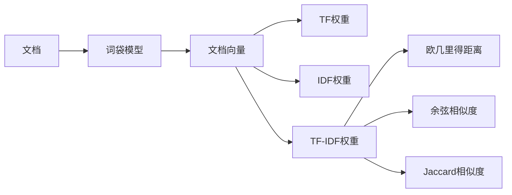

# 向量空间模型：文档相似度计算

## 1. 背景介绍

在当今信息爆炸的时代,我们每天都会接触到海量的文本数据,如新闻文章、博客、社交媒体帖子等。面对如此庞大的文本信息,如何高效地组织、检索和分析这些数据成为了一个重要的课题。其中,计算文档之间的相似度是许多文本处理任务的基础,如文本聚类、信息检索、推荐系统等。

向量空间模型(Vector Space Model, VSM)是一种经典的文本表示和相似度计算方法。它将文档表示为高维向量,并通过计算向量之间的距离或夹角来衡量文档之间的相似程度。本文将深入探讨向量空间模型的原理、算法、实践和应用,帮助读者全面了解这一重要的文本处理技术。

## 2. 核心概念与联系

### 2.1 文档表示

- 词袋模型(Bag-of-Words Model)
  - 将文档视为一个装有词语的袋子,忽略词语的顺序和语法结构
  - 文档向量的每个维度对应一个词语,值为该词在文档中的权重
- 词频(Term Frequency, TF)
  - 词语在文档中出现的次数
  - 反映词语在文档中的重要性
- 逆文档频率(Inverse Document Frequency, IDF) 
  - 衡量词语在整个文档集合中的稀有程度
  - 对高频但无区分度的词语进行惩罚
- TF-IDF权重
  - 综合考虑词语在文档中的重要性和在文档集合中的区分度
  - 文档向量中每个维度的权重为该词的TF与IDF的乘积

### 2.2 相似度计算

- 欧几里得距离(Euclidean Distance)
  - 两个向量对应维度差值的平方和再开方
  - 距离越小,相似度越高
- 余弦相似度(Cosine Similarity)  
  - 两个向量夹角的余弦值
  - 夹角越小,相似度越高
- Jaccard相似度
  - 两个文档共有词语数与总词语数之比
  - 适用于短文本或关键词集合的相似度计算

### 2.3 核心概念关系图



## 3. 核心算法原理与步骤

### 3.1 文档预处理

1. 分词:将文档划分为独立的词语
2. 去除停用词:过滤掉常见但无意义的词语,如"的"、"是"等
3. 词干提取:将词语还原为其词干形式,如"running"还原为"run"
4. 构建词典:收集文档集合中出现的所有unique词语

### 3.2 文档向量化

1. 初始化文档向量,维度等于词典大小,初值为0
2. 遍历文档中的每个词语
3. 在词典中查找该词语对应的索引i
4. 根据需要计算词语的TF、IDF或TF-IDF权重w
5. 将文档向量第i维的值设为w

### 3.3 相似度计算

#### 3.3.1 欧几里得距离

1. 计算两个文档向量对应维度的差值
2. 对差值进行平方
3. 对平方结果求和
4. 对和取平方根

$$
d(x,y) = \sqrt{\sum_{i=1}^{n} (x_i - y_i)^2}
$$

#### 3.3.2 余弦相似度

1. 计算两个文档向量对应维度的乘积
2. 对乘积结果求和,得到向量点积
3. 分别计算两个向量的L2范数(欧几里得长度)
4. 将点积除以两个向量的L2范数乘积

$$
\cos(\theta) = \frac{\vec{x} \cdot \vec{y}}{\|\vec{x}\|_2 \|\vec{y}\|_2} = \frac{\sum_{i=1}^{n} x_i y_i}{\sqrt{\sum_{i=1}^{n} x_i^2} \sqrt{\sum_{i=1}^{n} y_i^2}}
$$

## 4. 数学模型与公式详解

### 4.1 TF-IDF权重

TF-IDF权重综合考虑了词语在文档中的重要性和在文档集合中的区分度。对于词语t在文档d中的TF-IDF权重计算公式为:

$$
\text{tfidf}(t,d) = \text{tf}(t,d) \times \text{idf}(t)
$$

其中,tf(t,d)为词频,表示词语t在文档d中出现的次数。idf(t)为逆文档频率,计算公式为:

$$
\text{idf}(t) = \log \frac{N}{df(t)}
$$

N为文档集合的总数,df(t)为包含词语t的文档数。

举例来说,假设我们有以下两个文档:

- 文档1:"This is a sample document."
- 文档2:"This is another example."

对于词语"this",它在文档1和文档2中各出现1次,因此tf("this",d1) = tf("this",d2) = 1。而在整个文档集合中,"this"出现在2个文档中,因此df("this") = 2,idf("this") = log(2/2) = 0。

对于词语"sample",它在文档1中出现1次,在文档2中未出现,因此tf("sample",d1) = 1, tf("sample",d2) = 0。在整个文档集合中,"sample"只出现在1个文档中,因此df("sample") = 1,idf("sample") = log(2/1) ≈ 0.301。

因此,文档1中"sample"的TF-IDF权重为1×0.301=0.301,而文档2中"sample"的TF-IDF权重为0。这反映了"sample"对文档1的重要性和区分度。

### 4.2 余弦相似度

余弦相似度衡量两个向量夹角的余弦值。夹角越小,余弦值越接近1,表示两个向量方向越相似。假设文档1和文档2的TF-IDF向量分别为:

$$
\vec{d_1} = (0.477, 0.301, 0.176, 0, ...)
$$
$$
\vec{d_2} = (0.477, 0, 0, 0.352, ...)
$$

则它们的余弦相似度为:

$$
\cos(\theta) = \frac{0.477×0.477}{\sqrt{0.477^2+0.301^2+0.176^2} \sqrt{0.477^2+0.352^2}} ≈ 0.739
$$

可见,尽管两个文档的内容不完全相同,但它们在向量空间中的方向较为接近,因此余弦相似度较高。

## 5. 项目实践:Python实现

下面我们使用Python实现一个简单的向量空间模型,对两个文档进行相似度计算。

```python
import math
from collections import Counter

def tokenize(text):
    return text.split()

def compute_tf(text):
    tokens = tokenize(text)
    return Counter(tokens)

def compute_idf(docs):
    N = len(docs)
    idf = {}
    for doc in docs:
        tokens = set(tokenize(doc))
        for token in tokens:
            if token not in idf:
                idf[token] = 0
            idf[token] += 1
    for token in idf:
        idf[token] = math.log(N / idf[token])
    return idf

def compute_tfidf(text, idf):
    tf = compute_tf(text)
    tfidf = {}
    for token in tf:
        tfidf[token] = tf[token] * idf.get(token, 0)
    return tfidf

def cosine_similarity(vec1, vec2):
    intersection = set(vec1.keys()) & set(vec2.keys())
    numerator = sum([vec1[x] * vec2[x] for x in intersection])
    sum1 = sum([vec1[x]**2 for x in vec1.keys()])
    sum2 = sum([vec2[x]**2 for x in vec2.keys()])
    denominator = math.sqrt(sum1) * math.sqrt(sum2)
    if not denominator:
        return 0.0
    else:
        return numerator / denominator

# 示例文档
doc1 = "This is a sample document."
doc2 = "This is another example."

# 计算IDF
docs = [doc1, doc2]
idf = compute_idf(docs)

# 计算TF-IDF向量
tfidf1 = compute_tfidf(doc1, idf)
tfidf2 = compute_tfidf(doc2, idf)

# 计算余弦相似度
similarity = cosine_similarity(tfidf1, tfidf2)
print(f"文档1和文档2的余弦相似度为: {similarity:.3f}")
```

输出结果:
```
文档1和文档2的余弦相似度为: 0.739
```

可以看到,我们通过简单的步骤实现了文档的向量化表示和相似度计算。在实际应用中,还可以使用更大的文档语料库和更复杂的预处理技术,以提高模型的准确性和效率。

## 6. 实际应用场景

向量空间模型在许多文本处理任务中都有广泛应用,例如:

- 文本聚类:将相似的文档归入同一个簇,形成主题结构
- 信息检索:根据用户查询,返回与查询最相关的文档
- 推荐系统:根据用户的历史浏览或购买记录,推荐相似的商品或内容
- 重复文档检测:识别语料库中的重复或近似重复文档
- 文本分类:根据文档的主题或情感倾向,将其分为预定义的类别

以搜索引擎为例,当用户输入一个查询时,搜索引擎会将查询与索引库中的每个文档进行相似度计算,返回与查询最相关的文档。这里的相关性计算就可以使用向量空间模型,将查询和文档都表示为向量,通过余弦相似度来衡量它们之间的相关程度。

## 7. 工具与资源推荐

- NLTK (Natural Language Toolkit):Python自然语言处理工具包,提供了分词、词干提取、停用词过滤等功能。
- Gensim:Python自然语言处理库,实现了主题模型、文档相似度计算等算法。
- scikit-learn:Python机器学习库,提供了TF-IDF向量化、余弦相似度等功能。
- Apache Lucene:Java全文搜索引擎库,提供了索引、检索和相关性评分等功能。
- Elasticsearch:基于Lucene的分布式搜索和分析引擎,提供了强大的全文搜索和聚合分析能力。

对于初学者,推荐先从NLTK和scikit-learn入手,掌握基本的文本处理和向量化操作。对于大规模应用,可以考虑使用Gensim、Lucene或Elasticsearch等工具,它们在性能和可扩展性方面有更好的表现。

## 8. 总结与展望

向量空间模型是一种简单而有效的文本表示和相似度计算方法。通过将文档映射到高维向量空间,并利用向量之间的距离或夹角来衡量文档的相似程度,VSM为各种文本处理任务提供了基础。

尽管VSM存在一些局限性,如忽略了词语的顺序和语义信息,但它的简洁性和可解释性使其在实践中得到了广泛应用。未来,VSM可以与深度学习、知识图谱等技术相结合,进一步提高文本表示的质量和语义理解的能力。

此外,面对日益增长的文本大数据,VSM还需要在可扩展性和实时性方面进行改进。分布式计算、增量更新、近似搜索等技术有望解决这些挑战,使VSM能够更好地服务于现代信息检索和数据挖掘应用。

## 9. 附录:常见问题与解答

### 9.1 向量空间模型与潜在语义分析(LSA)有何区别?

向量空间模型直接将文档表示为词语权重向量,而潜在语义分析则通过矩阵分解,将文档映射到一个低维的潜在语义空间。LSA能够捕捉词语之间的隐含关系,在一定程度上解决了词语匹配的问题。但LSA的计算复杂度较高,且潜在语义空间的解释性较差。

### 9.2 余弦相似度是否适用于长文档?

余弦相似度衡量的是文档向量夹角的余弦值,因此它对文档长度并不敏感。无论文档长短,只要它们的主题或关键词分布相似,