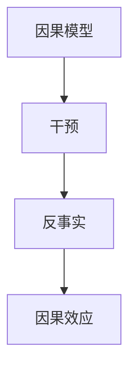

## 1.背景介绍

在现代科学研究中，因果推理（Causal Inference）是一种重要的推理方法，它主要用于研究因果关系。在众多领域，如医学、经济、社会科学、人工智能等，都有广泛的应用。本文将深入探讨因果推理的原理，并通过代码实例进行详细讲解。

## 2.核心概念与联系

因果推理的核心概念主要包括因果模型、干预（Intervention）、反事实（Counterfactual）和因果效应（Causal Effect）。这些概念的理解是理解因果推理的关键。

- 因果模型：因果模型是对因果关系的数学描述，通常使用有向无环图（DAG）表示。
- 干预：干预是改变一个或多个变量的值，以观察其对其他变量的影响。
- 反事实：反事实是对“如果没有发生某事件，会发生什么”这样的问题的推理。
- 因果效应：因果效应是一个变量对另一个变量的影响程度。

这些概念之间的联系可以用下面的Mermaid流程图进行表示：



## 3.核心算法原理具体操作步骤

因果推理的核心算法主要包括因果模型的构建、干预的实施、反事实的推理和因果效应的计算。下面将分别对这些步骤进行详细介绍。

### 3.1 因果模型的构建

因果模型的构建主要包括变量的选择和因果关系的确定两个步骤。变量的选择需要根据研究的问题和可用的数据进行，因果关系的确定则需要依据领域知识和数据分析的结果。

### 3.2 干预的实施

干预的实施主要是改变一个或多个变量的值，然后观察其对其他变量的影响。这一步骤的关键是选择合适的干预变量和干预方式。

### 3.3 反事实的推理

反事实的推理是在干预后，对“如果没有进行干预，会发生什么”这样的问题进行推理。这一步骤需要依据因果模型和干预的结果进行。

### 3.4 因果效应的计算

因果效应的计算是量化一个变量对另一个变量的影响程度。这一步骤需要依据反事实的推理结果进行。

## 4.数学模型和公式详细讲解举例说明

在因果推理中，我们通常使用潜在结果模型（Potential Outcomes Model）来进行数学建模。在这个模型中，我们假设对于每个单元（例如，一个人、一个公司等），在每种可能的干预下，都有一个潜在的结果。例如，我们可以用$Y_i(1)$表示第$i$个单元在干预下的潜在结果，用$Y_i(0)$表示第$i$个单元在未干预下的潜在结果。那么，因果效应可以定义为潜在结果的差异，即$Y_i(1) - Y_i(0)$。

在实际应用中，我们通常无法同时观察到同一个单元在干预和未干预下的潜在结果，这就导致了所谓的“反事实问题”。为了解决这个问题，我们可以使用平均因果效应（Average Causal Effect，ACE）作为因果效应的估计，其公式为：

$$
ACE = E[Y(1)] - E[Y(0)]
$$

其中，$E[Y(1)]$和$E[Y(0)]$分别表示在干预和未干预下的潜在结果的期望。

## 5.项目实践：代码实例和详细解释说明

在这部分，我们将使用Python的因果推理库`CausalInference`来进行实践。首先，我们需要安装这个库，可以通过以下命令进行安装：

```python
pip install causal_inference
```

安装完成后，我们可以使用以下代码进行因果推理：

```python
from causal_inference import CausalModel

# 创建因果模型
cm = CausalModel(Y, D, X)

# 估计平均因果效应
cm.est_via_matching()
print(cm.estimates)
```

在这段代码中，`Y`是结果变量，`D`是干预变量，`X`是协变量。`est_via_matching`方法是通过匹配方法来估计平均因果效应，`cm.estimates`则包含了因果效应的估计结果。

## 6.实际应用场景

因果推理在众多领域都有广泛的应用。例如，在医学研究中，因果推理可以用于研究某种治疗方法对疾病的影响；在经济学中，因果推理可以用于研究政策对经济的影响；在人工智能中，因果推理可以用于理解和解释机器学习模型的行为。

## 7.工具和资源推荐

在进行因果推理的研究和实践中，以下工具和资源可能会有所帮助：

- `CausalInference`：这是一个Python的因果推理库，提供了一系列的方法来进行因果推理。
- `DAGitty`：这是一个用于创建和分析因果图的在线工具。
- `Causal Diagrams: Draw Your Assumptions Before Your Conclusions`：这是一篇关于因果图的入门教程，对于理解和使用因果图非常有帮助。

## 8.总结：未来发展趋势与挑战

随着大数据和人工智能的发展，因果推理的重要性日益凸显。然而，因果推理也面临着一些挑战，例如因果关系的确定、反事实问题的解决、因果效应的估计等。未来，我们期待有更多的研究和方法来解决这些挑战，使得因果推理能够更好地服务于科学研究和实践。

## 9.附录：常见问题与解答

Q: 什么是因果推理？
A: 因果推理是一种推理方法，主要用于研究因果关系。

Q: 什么是因果模型？
A: 因果模型是对因果关系的数学描述，通常使用有向无环图（DAG）表示。

Q: 什么是反事实？
A: 反事实是对“如果没有发生某事件，会发生什么”这样的问题的推理。

Q: 什么是因果效应？
A: 因果效应是一个变量对另一个变量的影响程度。

Q: 如何估计因果效应？
A: 在实际应用中，我们通常使用平均因果效应（ACE）作为因果效应的估计。

作者：禅与计算机程序设计艺术 / Zen and the Art of Computer Programming