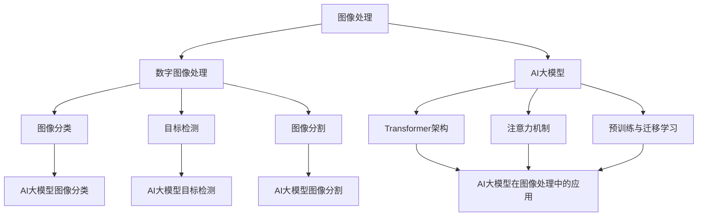

# 图像处理的AI大模型：重塑视觉技术的未来

## 1. 背景介绍
### 1.1 图像处理的发展历程
#### 1.1.1 早期的图像处理技术
#### 1.1.2 数字图像处理的兴起
#### 1.1.3 深度学习时代的图像处理
### 1.2 AI大模型的崛起
#### 1.2.1 AI大模型的定义与特点  
#### 1.2.2 AI大模型在自然语言处理领域的成功应用
#### 1.2.3 AI大模型在图像处理领域的潜力

## 2. 核心概念与联系
### 2.1 图像处理的基本概念
#### 2.1.1 图像的数字化表示
#### 2.1.2 图像的基本属性与特征
#### 2.1.3 图像处理的常用操作
### 2.2 AI大模型的关键技术
#### 2.2.1 深度学习网络架构
#### 2.2.2 注意力机制与Transformer
#### 2.2.3 预训练与迁移学习
### 2.3 图像处理与AI大模型的融合
#### 2.3.1 AI大模型在图像分类中的应用
#### 2.3.2 AI大模型在目标检测中的应用 
#### 2.3.3 AI大模型在图像生成中的应用



## 3. 核心算法原理具体操作步骤
### 3.1 基于AI大模型的图像分类算法
#### 3.1.1 问题定义与数据准备
#### 3.1.2 模型结构设计
#### 3.1.3 预训练与微调
#### 3.1.4 推理与评估
### 3.2 基于AI大模型的目标检测算法
#### 3.2.1 问题定义与数据准备
#### 3.2.2 模型结构设计
#### 3.2.3 预训练与微调
#### 3.2.4 推理与评估
### 3.3 基于AI大模型的图像生成算法
#### 3.3.1 问题定义与数据准备
#### 3.3.2 模型结构设计
#### 3.3.3 预训练与微调
#### 3.3.4 推理与评估

## 4. 数学模型和公式详细讲解举例说明
### 4.1 图像分类中的数学模型
#### 4.1.1 softmax函数与交叉熵损失
#### 4.1.2 数据增强技术的数学原理
#### 4.1.3 模型集成的数学原理
### 4.2 目标检测中的数学模型 
#### 4.2.1 IoU(Intersection over Union)的计算
#### 4.2.2 NMS(Non-Maximum Suppression)的数学原理
#### 4.2.3 Focal Loss的数学推导
### 4.3 图像生成中的数学模型
#### 4.3.1 GAN(Generative Adversarial Network)的数学原理
#### 4.3.2 VAE(Variational Autoencoder)的数学推导
#### 4.3.3 Diffusion Model的数学原理

以下是softmax函数与交叉熵损失的数学公式：

对于一个K分类问题，模型的输出是一个K维向量$\mathbf{z}=[z_1,z_2,...,z_K]^T$，softmax函数将其转化为一个概率分布$\mathbf{p}=[p_1,p_2,...,p_K]^T$：

$$
p_i=\frac{e^{z_i}}{\sum_{j=1}^K e^{z_j}}, \quad i=1,2,...,K
$$

假设真实标签的one-hot编码为$\mathbf{y}=[y_1,y_2,...,y_K]^T$，其中真实类别对应的位置为1，其余为0。交叉熵损失函数定义为：

$$
\mathcal{L}=-\sum_{i=1}^K y_i \log p_i
$$

直观理解是，交叉熵损失函数衡量了真实分布与预测分布之间的差异，当两个分布越接近时，损失函数的值越小。

## 5. 项目实践：代码实例和详细解释说明
### 5.1 基于PyTorch实现图像分类
#### 5.1.1 数据集准备与数据增强
#### 5.1.2 模型定义与训练
#### 5.1.3 模型评估与推理
### 5.2 基于TensorFlow实现目标检测
#### 5.2.1 数据集准备与数据增强
#### 5.2.2 模型定义与训练
#### 5.2.3 模型评估与推理
### 5.3 基于PyTorch实现图像生成
#### 5.3.1 数据集准备
#### 5.3.2 模型定义与训练
#### 5.3.3 模型评估与推理

以下是一个基于PyTorch实现图像分类的简单示例：

```python
import torch
import torch.nn as nn
import torchvision.transforms as transforms
from torchvision.datasets import CIFAR10
from torch.utils.data import DataLoader

# 定义数据增强
transform_train = transforms.Compose([
    transforms.RandomCrop(32, padding=4),
    transforms.RandomHorizontalFlip(),
    transforms.ToTensor(),
    transforms.Normalize((0.4914, 0.4822, 0.4465), (0.2023, 0.1994, 0.2010)),
])

transform_test = transforms.Compose([
    transforms.ToTensor(),
    transforms.Normalize((0.4914, 0.4822, 0.4465), (0.2023, 0.1994, 0.2010)),
])

# 加载CIFAR10数据集
trainset = CIFAR10(root='./data', train=True, download=True, transform=transform_train)
trainloader = DataLoader(trainset, batch_size=128, shuffle=True, num_workers=2)

testset = CIFAR10(root='./data', train=False, download=True, transform=transform_test)
testloader = DataLoader(testset, batch_size=128, shuffle=False, num_workers=2)

# 定义残差块
class BasicBlock(nn.Module):
    def __init__(self, in_planes, planes, stride=1):
        super(BasicBlock, self).__init__()
        self.conv1 = nn.Conv2d(in_planes, planes, kernel_size=3, stride=stride, padding=1, bias=False)
        self.bn1 = nn.BatchNorm2d(planes)
        self.conv2 = nn.Conv2d(planes, planes, kernel_size=3, stride=1, padding=1, bias=False)
        self.bn2 = nn.BatchNorm2d(planes)

        self.shortcut = nn.Sequential()
        if stride != 1 or in_planes != planes:
            self.shortcut = nn.Sequential(
                nn.Conv2d(in_planes, planes, kernel_size=1, stride=stride, bias=False),
                nn.BatchNorm2d(planes)
            )

    def forward(self, x):
        out = nn.ReLU(inplace=True)(self.bn1(self.conv1(x)))
        out = self.bn2(self.conv2(out))
        out += self.shortcut(x)
        out = nn.ReLU(inplace=True)(out)
        return out

# 定义ResNet模型
class ResNet(nn.Module):
    def __init__(self, block, num_blocks, num_classes=10):
        super(ResNet, self).__init__()
        self.in_planes = 64

        self.conv1 = nn.Conv2d(3, 64, kernel_size=3, stride=1, padding=1, bias=False)
        self.bn1 = nn.BatchNorm2d(64)
        self.layer1 = self._make_layer(block, 64, num_blocks[0], stride=1)
        self.layer2 = self._make_layer(block, 128, num_blocks[1], stride=2)
        self.layer3 = self._make_layer(block, 256, num_blocks[2], stride=2)
        self.layer4 = self._make_layer(block, 512, num_blocks[3], stride=2)
        self.linear = nn.Linear(512, num_classes)

    def _make_layer(self, block, planes, num_blocks, stride):
        strides = [stride] + [1]*(num_blocks-1)
        layers = []
        for stride in strides:
            layers.append(block(self.in_planes, planes, stride))
            self.in_planes = planes
        return nn.Sequential(*layers)

    def forward(self, x):
        out = nn.ReLU(inplace=True)(self.bn1(self.conv1(x)))
        out = self.layer1(out)
        out = self.layer2(out)
        out = self.layer3(out)
        out = self.layer4(out)
        out = nn.AvgPool2d(4)(out)
        out = out.view(out.size(0), -1)
        out = self.linear(out)
        return out

# 训练函数
def train(model, device, trainloader, criterion, optimizer, epoch):
    model.train()
    train_loss = 0
    correct = 0
    total = 0
    for batch_idx, (inputs, targets) in enumerate(trainloader):
        inputs, targets = inputs.to(device), targets.to(device)
        optimizer.zero_grad()
        outputs = model(inputs)
        loss = criterion(outputs, targets)
        loss.backward()
        optimizer.step()

        train_loss += loss.item()
        _, predicted = outputs.max(1)
        total += targets.size(0)
        correct += predicted.eq(targets).sum().item()
    
    print(f"Epoch [{epoch}] Loss: {train_loss/(batch_idx+1):.4f} | Acc: {100.*correct/total:.2f}%")

# 测试函数  
def test(model, device, testloader, criterion):
    model.eval()
    test_loss = 0
    correct = 0
    total = 0
    with torch.no_grad():
        for batch_idx, (inputs, targets) in enumerate(testloader):
            inputs, targets = inputs.to(device), targets.to(device)
            outputs = model(inputs)
            loss = criterion(outputs, targets)

            test_loss += loss.item()
            _, predicted = outputs.max(1)
            total += targets.size(0)
            correct += predicted.eq(targets).sum().item()

    print(f"Test Loss: {test_loss/(batch_idx+1):.4f} | Acc: {100.*correct/total:.2f}%")

# 训练参数设置
device = torch.device("cuda" if torch.cuda.is_available() else "cpu")
model = ResNet(BasicBlock, [2, 2, 2, 2]).to(device)
criterion = nn.CrossEntropyLoss()
optimizer = torch.optim.Adam(model.parameters(), lr=0.001)
num_epochs = 50

# 开始训练
for epoch in range(num_epochs):
    train(model, device, trainloader, criterion, optimizer, epoch)
    test(model, device, testloader, criterion)
```

这个示例中，我们首先定义了数据增强操作，然后加载CIFAR10数据集。接着定义了残差块和ResNet模型，最后编写了训练函数和测试函数。在训练过程中，我们使用Adam优化器和交叉熵损失函数，训练50个epoch，每个epoch结束后在测试集上评估模型性能。

## 6. 实际应用场景
### 6.1 智能安防
#### 6.1.1 人脸识别与追踪
#### 6.1.2 行为分析与异常检测
#### 6.1.3 车辆与车牌识别
### 6.2 医学影像分析
#### 6.2.1 医学图像分类与检测
#### 6.2.2 医学图像分割
#### 6.2.3 疾病诊断与预后预测
### 6.3 工业视觉检测
#### 6.3.1 缺陷检测
#### 6.3.2 产品质量分析
#### 6.3.3 生产过程监控

## 7. 工具和资源推荐
### 7.1 开源框架
#### 7.1.1 PyTorch
#### 7.1.2 TensorFlow
#### 7.1.3 Keras
### 7.2 预训练模型库
#### 7.2.1 torchvision
#### 7.2.2 TensorFlow Hub
#### 7.2.3 Hugging Face
### 7.3 数据集资源
#### 7.3.1 ImageNet
#### 7.3.2 COCO
#### 7.3.3 PASCAL VOC

## 8. 总结：未来发展趋势与挑战
### 8.1 AI大模型与图像处理技术的深度融合
### 8.2 数据高效利用与隐私保护
### 8.3 模型轻量化与实时处理
### 8.4 可解释性与可靠性
### 8.5 多模态学习与跨领域应用

## 9. 附录：常见问题与解答
### 9.1 如何选择合适的AI大模型？
### 9.2 如何处理不平衡数据集？
### 9.3 如何提高模型的泛化能力？
### 9.4 如何加速模型训练与推理？
### 9.5 如何解释模型的决策过程？

作者：禅与计算机程序设计艺术 / Zen and the Art of