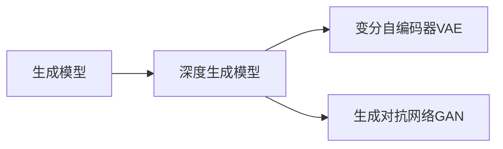
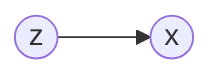

# 图像生成(Image Generation) - 原理与代码实例讲解

## 1.背景介绍
图像生成是人工智能领域的一个热门研究方向,旨在利用计算机算法自动生成逼真、多样化的图像。近年来,随着深度学习技术的飞速发展,特别是生成对抗网络(GAN)的提出,图像生成取得了突破性进展。从最初生成简单手写数字到现在可以生成高分辨率人脸、风景等复杂图像,图像生成技术不断刷新着人们的认知。

图像生成不仅在学术界备受关注,在工业界也有广泛的应用前景,如游戏、电影特效、虚拟现实、广告设计等领域。掌握图像生成的原理和实现,对于从事计算机视觉、人工智能的研究人员和工程师来说至关重要。本文将深入浅出地介绍图像生成的核心概念、主流算法、数学原理以及代码实践,帮助读者全面理解这一前沿技术。

## 2.核心概念与联系
要理解图像生成,首先需要了解以下几个核心概念:

### 2.1 生成模型 
生成模型是一类学习数据分布,并能够从学习到的分布中采样生成新数据的模型。与判别模型直接建模条件概率P(y|x)不同,生成模型建模联合概率分布P(x,y),从而可以生成新样本。常见的生成模型包括高斯混合模型、隐马尔可夫模型、玻尔兹曼机等。

### 2.2 深度生成模型
将深度学习与生成模型结合,就得到了深度生成模型。利用深度神经网络强大的表示学习能力,深度生成模型能够建模复杂高维数据如图像的分布。代表性的深度生成模型有变分自编码器(VAE)和生成对抗网络(GAN)。

### 2.3 变分自编码器(VAE)
VAE由编码器和解码器两部分组成,编码器将输入映射到隐空间的概率分布,解码器从隐空间采样并重构出输入。通过最大化变分下界(ELBO),VAE可以学习到隐空间的先验分布,再利用先验分布采样生成新图像。

### 2.4 生成对抗网络(GAN)
GAN由生成器和判别器两个神经网络对抗学习得到。生成器接收随机噪声生成图像,判别器判断图像是生成的还是真实的,两者互相博弈优化。随着训练的进行,生成器生成的图像质量不断提升,最终可以生成以假乱真的图像。

下面是这些核心概念之间的联系:

## 3.核心算法原理具体操作步骤

### 3.1 变分自编码器(VAE)

#### 3.1.1 VAE的网络结构
VAE主要由编码器网络和解码器网络组成:
- 编码器E(x): 将输入x映射到隐变量z的后验分布q(z|x)
- 解码器D(z): 将隐变量z映射到输入数据的条件概率分布p(x|z)

训练过程中,编码器和解码器联合优化,最大化如下变分下界(ELBO):

$$\mathcal{L}(\theta,\phi;x)= \mathbb{E}_{q_{\phi}(z|x)}[\log p_{\theta}(x|z)]- D_{KL}(q_{\phi}(z|x)||p(z))$$

其中$\theta$和$\phi$分别是解码器和编码器的参数,$p(z)$是隐变量的先验分布,通常假设为标准正态分布$\mathcal{N}(0,I)$。

#### 3.1.2 VAE的训练步骤
1. 从数据集中采样一批数据$\{x^{(1)},\cdots,x^{(m)}\}$
2. 对每个样本$x^{(i)}$,编码器计算隐变量后验分布的均值和方差:
$$\mu^{(i)}=f_{\mu}(x^{(i)};\phi), \log\sigma^{(i)}=f_{\sigma}(x^{(i)};\phi)$$
3. 从后验分布$q_{\phi}(z|x^{(i)})=\mathcal{N}(\mu^{(i)},\text{diag}({\sigma^{(i)}}^2))$中采样隐变量:
$$z^{(i)}=\mu^{(i)}+\sigma^{(i)}\odot\epsilon,\quad \epsilon\sim\mathcal{N}(0,I)$$
4. 解码器根据采样的隐变量$z^{(i)}$重构出$\hat{x}^{(i)}$,并计算重构误差:
$$\hat{x}^{(i)}=f(z^{(i)};\theta),\quad \mathcal{L}_{\text{recon}}^{(i)}=-\log p_{\theta}(\hat{x}^{(i)}|z^{(i)})$$
5. 计算后验分布$q_{\phi}(z|x)$与先验分布$p(z)$的KL散度:
$$\mathcal{L}_{\text{KL}}^{(i)}=D_{KL}(q_{\phi}(z|x^{(i)})||p(z))$$
6. 计算变分下界(ELBO),并在整个批次上取平均:
$$\mathcal{L}(\theta,\phi)=\frac{1}{m}\sum_{i=1}^m(\mathcal{L}_{\text{recon}}^{(i)}+\mathcal{L}_{\text{KL}}^{(i)})$$
7. 计算$\mathcal{L}(\theta,\phi)$对$\theta$和$\phi$的梯度,并用梯度下降法更新参数。
8. 重复步骤1-7,直到模型收敛。

#### 3.1.3 用VAE生成新图像
训练完成后,我们可以用VAE生成新图像:
1. 从先验分布$p(z)$中采样一个隐变量$z$
2. 将采样的隐变量$z$输入到解码器,生成图像$\hat{x}=f(z;\theta)$

### 3.2 生成对抗网络(GAN)

#### 3.2.1 GAN的网络结构 
GAN由两个神经网络组成:
- 生成器G(z): 将随机噪声z映射到生成图像的空间
- 判别器D(x): 将图像x映射到(0,1)区间,表示x为真实图像的概率

生成器和判别器的目标函数可以表示为:

$$\min_G \max_D V(D,G) = \mathbb{E}_{x\sim p_{\text{data}}(x)}[\log D(x)] + \mathbb{E}_{z\sim p_z(z)}[\log (1-D(G(z)))]$$

生成器G试图最小化目标函数,而判别器D试图最大化目标函数,两者进行零和博弈。

#### 3.2.2 GAN的训练步骤
1. 初始化生成器参数$\theta_g$和判别器参数$\theta_d$
2. 在每一个训练迭代中:
   
   for k steps do:
   - 从真实数据分布$p_{\text{data}}(x)$中采样一批真实图像$\{x^{(1)},\cdots,x^{(m)}\}$
   - 从先验分布$p_z(z)$中采样一批随机噪声$\{z^{(1)},\cdots,z^{(m)}\}$
   - 用生成器生成一批图像$\{\tilde{x}^{(1)},\cdots,\tilde{x}^{(m)}\}$,其中$\tilde{x}^{(i)}=G(z^{(i)};\theta_g)$
   - 计算判别器在真实图像和生成图像上的损失:
     $$\mathcal{L}_D=-\frac{1}{m}\sum_{i=1}^m (\log D(x^{(i)};\theta_d) + \log(1-D(\tilde{x}^{(i)};\theta_d)))$$
   - 计算$\mathcal{L}_D$对$\theta_d$的梯度,并用梯度上升法更新判别器参数:
     $$\theta_d \leftarrow \theta_d + \eta \nabla_{\theta_d}\mathcal{L}_D$$
     
   - 从先验分布$p_z(z)$中采样一批随机噪声$\{z^{(1)},\cdots,z^{(m)}\}$
   - 用生成器生成一批图像$\{\tilde{x}^{(1)},\cdots,\tilde{x}^{(m)}\}$,其中$\tilde{x}^{(i)}=G(z^{(i)};\theta_g)$
   - 计算生成器的损失:
     $$\mathcal{L}_G=-\frac{1}{m}\sum_{i=1}^m \log D(\tilde{x}^{(i)};\theta_d)$$
   - 计算$\mathcal{L}_G$对$\theta_g$的梯度,并用梯度下降法更新生成器参数:
     $$\theta_g \leftarrow \theta_g - \eta \nabla_{\theta_g}\mathcal{L}_G$$
     
3. 重复步骤2,直到模型收敛。

#### 3.2.3 用GAN生成新图像
训练完成后,我们可以用GAN生成新图像:
1. 从先验分布$p_z(z)$中采样一个随机噪声$z$
2. 将噪声$z$输入到生成器,生成图像$\tilde{x}=G(z;\theta_g)$

## 4.数学模型和公式详细讲解举例说明

### 4.1 变分自编码器(VAE)的数学原理

#### 4.1.1 概率图模型
首先我们来看VAE的概率图模型:

其中$z$是隐变量,$x$是观测变量。联合分布为:
$$p(x,z)=p(x|z)p(z)$$

VAE的目标是最大化边际似然$p(x)=\int p(x|z)p(z)dz$。但是边际似然的计算是困难的,因为隐变量z是连续的,积分难以求解。

#### 4.1.2 变分下界(ELBO)
为了解决边际似然难以计算的问题,VAE引入一个近似后验分布$q(z|x)$,并最大化如下变分下界(ELBO):

$$\log p(x) \geq \mathbb{E}_{q(z|x)}[\log \frac{p(x,z)}{q(z|x)}] = \mathbb{E}_{q(z|x)}[\log p(x|z)] - D_{KL}(q(z|x)||p(z)) \triangleq \mathcal{L}(x)$$

这个下界可以通过Jensen不等式推导得到。直观地理解,优化ELBO相当于最小化$q(z|x)$与$p(z|x)$的KL散度,同时最大化$\mathbb{E}_{q(z|x)}[\log p(x|z)]$。

#### 4.1.3 重参数技巧
为了优化ELBO,我们需要对$\mathbb{E}_{q(z|x)}[\log p(x|z)]$求梯度。但是期望中的采样操作是不可导的,这里就需要用到重参数技巧。

假设隐变量服从正态分布$z\sim q(z|x)=\mathcal{N}(\mu,\sigma^2)$,我们可以将采样过程重写为:

$$z=\mu + \sigma\odot\epsilon, \quad \epsilon\sim\mathcal{N}(0,1)$$

其中$\odot$表示逐元素相乘。这样一来,采样操作就被拆分为了参数化的可导操作和不可导的采样操作,梯度就可以通过$\mu$和$\sigma$传递了。

### 4.2 生成对抗网络(GAN)的数学原理

#### 4.2.1 二人极小极大博弈
GAN的核心思想是将生成器和判别器的训练过程看作一个二人极小极大博弈。用数学语言描述就是:

$$\min_G \max_D V(D,G) = \mathbb{E}_{x\sim p_{\text{data}}(x)}[\log D(x)] + \mathbb{E}_{z\sim p_z(z)}[\log (1-D(G(z)))]$$

生成器G试图生成尽可能逼真的样本欺骗判别器,最小化$\mathbb{E}_{z\sim p_z(z)}[\log (1-D(G(z)))]$;判别器D试图最大化真实样本的概率$\mathbb{E}_{x\sim p_{\text{data}}(x)}[\log D(x)]$,同时最小化生成样本的概率$\mathbb{E}_{z\sim p_z(z)}[\log D(G(z))]$。

#### 4.2.2 全局最优解
上述博弈