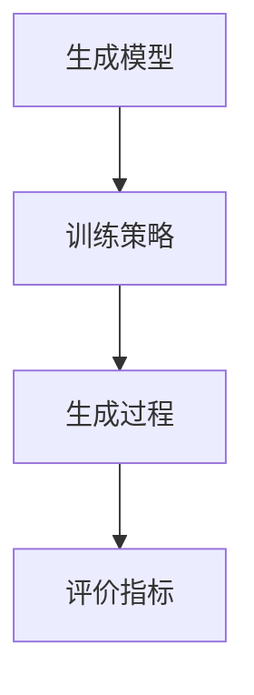
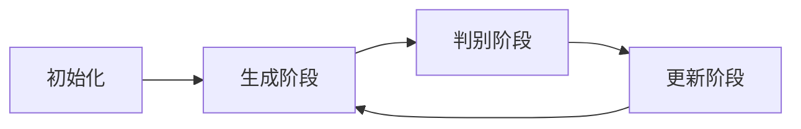
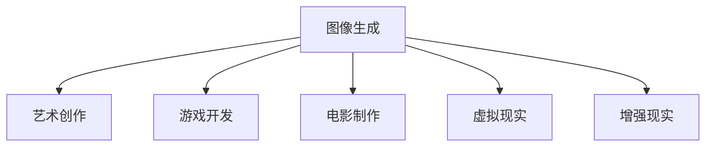

## 1.背景介绍

图像生成，作为计算机视觉和人工智能的一个重要分支，近年来在学术界和工业界引起了广泛的关注和研究。它的主要目标是通过计算机算法生成具有特定属性和特征的新图像。这些新图像可以是全新的创作，也可以是对现有图像的改进或变换。图像生成的应用场景广泛，包括但不限于艺术创作、游戏开发、电影制作、虚拟现实、增强现实等。

尽管图像生成技术已经取得了显著的进步，但仍然面临着许多挑战，包括生成图像的质量、多样性、真实性等问题。同时，随着技术的发展，图像生成也带来了新的机遇，例如生成更高质量的图像、开发新的应用场景等。

## 2.核心概念与联系

图像生成的核心概念包括生成模型、训练策略、生成过程和评价指标。生成模型是用于生成图像的算法模型，包括但不限于生成对抗网络（GAN）、变分自编码器（VAE）、自回归模型等。训练策略是用于训练生成模型的策略，包括但不限于最大似然估计、最小二乘法、强化学习等。生成过程是生成模型在生成图像时的过程，包括初始化、迭代更新、收敛等步骤。评价指标是用于评价生成图像质量的指标，包括但不限于峰值信噪比（PSNR）、结构相似性指数（SSIM）、感知图像质量评价（PIQE）等。

这些核心概念之间存在密切的联系。例如，生成模型的选择会影响训练策略的选择，训练策略的选择会影响生成过程，生成过程的效果会影响评价指标的结果。



## 3.核心算法原理具体操作步骤

以生成对抗网络（GAN）为例，以下是其核心算法原理的具体操作步骤：

1. 初始化：初始化生成器和判别器的参数。
2. 生成阶段：生成器接收一个随机噪声向量，通过神经网络生成一个假图像。
3. 判别阶段：判别器接收一个真图像和一个假图像，通过神经网络判断这两个图像是否真实。
4. 更新阶段：根据判别器的判断结果，更新生成器和判别器的参数。
5. 重复步骤2~4，直到生成器和判别器的参数收敛。



## 4.数学模型和公式详细讲解举例说明

生成对抗网络（GAN）的数学模型可以用下面的最小最大二人零和博弈问题来描述：

$$
\min_G \max_D V(D, G) = \mathbb{E}_{x \sim p_{data}(x)}[\log D(x)] + \mathbb{E}_{z \sim p_z(z)}[\log(1 - D(G(z)))]
$$

其中，$x$是真图像，$z$是随机噪声向量，$D(x)$是判别器对真图像的判断结果，$G(z)$是生成器生成的假图像，$D(G(z))$是判别器对假图像的判断结果。这个公式的意义是，判别器的目标是最大化对真图像和假图像的判断正确率，生成器的目标是最小化判别器对假图像的判断正确率。

## 5.项目实践：代码实例和详细解释说明

以下是一个使用TensorFlow实现的生成对抗网络（GAN）的简单示例：

```python
import tensorflow as tf

# 定义生成器
def generator(z):
    return tf.layers.dense(z, 100, activation=tf.nn.relu)

# 定义判别器
def discriminator(x):
    return tf.layers.dense(x, 1, activation=tf.nn.sigmoid)

# 定义损失函数
def loss(D_real, D_fake):
    return -tf.reduce_mean(tf.log(D_real) + tf.log(1 - D_fake))

# 定义优化器
def optimizer(loss, learning_rate=0.001):
    return tf.train.AdamOptimizer(learning_rate).minimize(loss)

# 定义训练过程
def train(D_loss, G_loss, D_optimizer, G_optimizer, epochs=100):
    for epoch in range(epochs):
        # 训练判别器
        D_loss_val, _ = sess.run([D_loss, D_optimizer])
        # 训练生成器
        G_loss_val, _ = sess.run([G_loss, G_optimizer])
        # 打印损失值
        print('Epoch: {}, D Loss: {}, G Loss: {}'.format(epoch, D_loss_val, G_loss_val))
```

这段代码首先定义了生成器和判别器的结构，然后定义了损失函数和优化器，最后定义了训练过程。在训练过程中，先训练判别器，再训练生成器，每训练一轮都会打印出当前的损失值。

## 6.实际应用场景

图像生成的应用场景非常广泛，以下列举了几个主要的应用场景：

1. 艺术创作：生成对抗网络（GAN）可以用于生成新的艺术作品，例如深梦（DeepDream）、风格迁移（Style Transfer）等。
2. 游戏开发：图像生成技术可以用于生成游戏中的角色、场景、道具等元素，提高游戏的创新性和趣味性。
3. 电影制作：图像生成技术可以用于生成电影中的特效、背景、道具等元素，提高电影的视觉效果和观看体验。
4. 虚拟现实：图像生成技术可以用于生成虚拟现实中的场景、物体、角色等元素，提高虚拟现实的真实感和沉浸感。
5. 增强现实：图像生成技术可以用于生成增强现实中的虚拟元素，提高增强现实的交互性和趣味性。



## 7.工具和资源推荐

以下是一些推荐的图像生成的工具和资源：

1. TensorFlow：一个开源的机器学习框架，提供了一系列的图像生成相关的API和示例。
2. PyTorch：一个开源的机器学习框架，提供了一系列的图像生成相关的API和示例。
3. Keras：一个基于Python的开源的深度学习框架，提供了一系列的图像生成相关的API和示例。
4. GAN Lab：一个在线的生成对抗网络（GAN）可视化工具，可以动态展示GAN的训练过程。
5. GAN Zoo：一个收集了各种生成对抗网络（GAN）的资源库，包括论文、代码、数据集等。

## 8.总结：未来发展趋势与挑战

图像生成技术的未来发展趋势主要有以下几点：

1. 质量：随着技术的发展，生成图像的质量将进一步提高，包括清晰度、真实感、多样性等方面。
2. 效率：随着算法的优化和硬件的进步，生成图像的速度将进一步提高，实时生成图像将成为可能。
3. 应用：随着创新的推动，图像生成的应用场景将进一步拓宽，包括娱乐、教育、医疗、商业等领域。
4. 伦理：随着社会的讨论，图像生成的伦理问题将得到更多的关注，包括版权、隐私、欺诈等问题。

图像生成技术的未来挑战主要有以下几点：

1. 算法：如何设计更有效的生成模型和训练策略，生成更高质量的图像。
2. 数据：如何获取和处理更多的训练数据，提高生成图像的多样性和真实感。
3. 硬件：如何利用更强大的硬件资源，提高生成图像的速度和效率。
4. 伦理：如何处理图像生成的伦理问题，保护版权、隐私和公平性。

## 9.附录：常见问题与解答

1. 问题：生成对抗网络（GAN）的训练为什么很难？
   答：因为GAN的训练是一个最小最大二人零和博弈问题，需要同时优化生成器和判别器的参数，而这两者的优化目标是相互对立的，容易导致模型的训练不稳定。

2. 问题：生成图像的质量如何评价？
   答：可以从多个方面评价生成图像的质量，包括清晰度、真实感、多样性等。清晰度可以通过峰值信噪比（PSNR）等指标评价，真实感可以通过人眼观察或者判别器的判断结果评价，多样性可以通过生成图像的数量和差异性评价。

3. 问题：图像生成有哪些应用场景？
   答：图像生成的应用场景非常广泛，包括艺术创作、游戏开发、电影制作、虚拟现实、增强现实等。

4. 问题：图像生成的伦理问题有哪些？
   答：图像生成的伦理问题主要包括版权、隐私、欺诈等。例如，如果使用GAN生成的图像用于商业用途，可能涉及到版权问题；如果使用GAN生成的图像包含了个人信息，可能涉及到隐私问题；如果使用GAN生成的图像用于欺诈，例如深度伪造（DeepFake），则可能涉及到欺诈问题。

作者：禅与计算机程序设计艺术 / Zen and the Art of Computer Programming