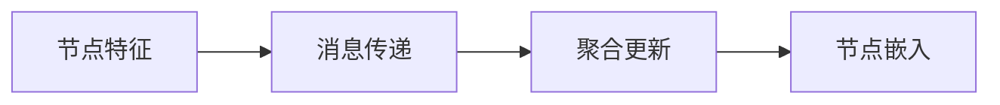

# 图神经网络(Graph Neural Network)原理与代码实战案例讲解

## 1.背景介绍

### 1.1 图神经网络的兴起
图神经网络(Graph Neural Network, GNN)是一种专门用于处理图结构数据的深度学习模型。随着大数据时代的到来,现实世界中很多数据都呈现出图的结构特征,例如社交网络、交通网络、分子结构等。传统的深度学习模型如卷积神经网络(CNN)和循环神经网络(RNN)难以直接处理这些图结构数据。因此,图神经网络应运而生,并在图表示学习、图分类、图生成等任务上取得了优异的表现,成为了图机器学习领域的研究热点。

### 1.2 图神经网络的应用场景
图神经网络在许多领域都有广泛的应用,主要包括:
- 社交网络分析:用于社交关系预测、社区发现、影响力分析等
- 推荐系统:通过构建用户-物品二部图进行个性化推荐
- 交通预测:对路网进行建模,预测路况和交通流量
- 分子指纹与药物发现:将分子结构建模为图,预测分子属性与药效
- 知识图谱:通过图神经网络学习知识图谱中节点的低维嵌入表示

### 1.3 本文的主要内容
本文将围绕图神经网络的基本原理与代码实战展开详细讨论。内容安排如下:

1. 介绍图神经网络的核心概念与基本架构
2. 阐述图神经网络的核心算法原理与数学模型
3. 基于Python和PyTorch框架实现图神经网络的代码实例
4. 总结图神经网络的发展现状与未来挑战

通过本文的学习,读者将对图神经网络的原理和实现有深入的理解,并能够将其应用到实际问题中去。

## 2.核心概念与联系

### 2.1 什么是图(Graph)
图(Graph)是一种由节点(Node)和边(Edge)组成的数据结构。形式化地,一个图可以表示为$G=(V,E)$,其中$V$表示节点的集合,$E$表示边的集合。每条边可以看作是两个节点之间的连接。根据边是否有方向,图可以分为无向图和有向图两类。

### 2.2 图的矩阵表示
图还可以用矩阵的形式来表示,常见的矩阵表示方法有:
- 邻接矩阵(Adjacency Matrix):用一个$N \times N$的矩阵$\mathbf{A}$表示图,其中$N$为节点数。如果节点$i$和$j$之间有边相连,则$\mathbf{A}_{ij}=1$,否则为0。
- 度矩阵(Degree Matrix):对角矩阵$\mathbf{D}$,其中$\mathbf{D}_{ii}$等于节点$i$的度(与之相连的边数)。
- 拉普拉斯矩阵(Laplacian Matrix):定义为$\mathbf{L}=\mathbf{D}-\mathbf{A}$。

### 2.3 图的节点特征与边特征
每个节点可以有自己的特征向量,用$\mathbf{X} \in \mathbb{R}^{N \times F}$表示,其中$F$为节点特征的维度。类似地,每条边也可以有自己的特征向量。节点和边的特征信息对于图神经网络的训练非常重要。

### 2.4 图神经网络的基本思想
图神经网络的基本思想是通过聚合节点自身的特征以及它的邻居节点的特征,来更新该节点的隐藏状态,并生成节点的嵌入表示。重复多轮聚合与更新的过程,就可以得到蕴含图结构信息的节点嵌入。

### 2.5 图神经网络的通用框架
现有的图神经网络可以用一个通用的消息传递框架(Message Passing Framework)来概括:

- 消息传递:每个节点根据自身特征和边的信息,为相邻节点生成消息
- 聚合更新:每个节点聚合所有邻居传来的消息,并更新自身的隐藏状态
- 多轮迭代:重复执行消息传递和聚合更新,得到最终的节点嵌入表示

## 3.核心算法原理具体操作步骤

### 3.1 图卷积网络(GCN)
图卷积网络(Graph Convolutional Network, GCN)是最经典的图神经网络模型之一。它的核心思想是通过聚合节点的一阶邻域信息来更新节点的隐藏状态。

#### 3.1.1 GCN的前向传播
假设$\mathbf{H}^{(l)}$表示第$l$层的节点隐藏状态矩阵,每个节点的隐藏状态维度为$F$。GCN的前向传播公式为:

$$
\mathbf{H}^{(l+1)} = \sigma(\hat{\mathbf{A}} \mathbf{H}^{(l)} \mathbf{W}^{(l)})
$$

其中$\hat{\mathbf{A}}=\tilde{\mathbf{D}}^{-\frac{1}{2}} \tilde{\mathbf{A}} \tilde{\mathbf{D}}^{-\frac{1}{2}}$是对称归一化的邻接矩阵,$\tilde{\mathbf{A}}=\mathbf{A}+\mathbf{I}$是为邻接矩阵添加了自环的结果,$\tilde{\mathbf{D}}$是$\tilde{\mathbf{A}}$的度矩阵,$\mathbf{W}^{(l)}$是第$l$层的权重矩阵,$\sigma$是激活函数。

#### 3.1.2 GCN的训练过程

1. 输入层:$\mathbf{H}^{(0)}=\mathbf{X}$,即节点的原始特征
2. 前向传播:逐层计算$\mathbf{H}^{(l+1)} = \sigma(\hat{\mathbf{A}} \mathbf{H}^{(l)} \mathbf{W}^{(l)})$
3. 输出层:$\mathbf{Z}=\mathbf{H}^{(L)}$,其中$L$为网络层数
4. 损失函数:根据任务类型(如节点分类、链接预测)设计损失函数
5. 反向传播:计算梯度并更新模型参数$\mathbf{W}^{(l)}$

GCN在半监督节点分类、图分类等任务上表现优异,但其聚合方式相对简单,难以捕捉高阶的结构信息。

### 3.2 图注意力网络(GAT)
图注意力网络(Graph Attention Network, GAT)是另一种常用的图神经网络模型。它在聚合邻居信息时引入了注意力机制,可以自适应地为不同邻居分配权重。

#### 3.2.1 GAT的注意力系数计算
对于节点$i$,其注意力系数$\alpha_{ij}$表示节点$j$对节点$i$的重要性,计算公式为:

$$
\alpha_{ij} = \frac{\exp(\text{LeakyReLU}(\mathbf{a}^T[\mathbf{W}\mathbf{h}_i \, \Vert \, \mathbf{W}\mathbf{h}_j]))}{\sum_{k \in \mathcal{N}_i} \exp(\text{LeakyReLU}(\mathbf{a}^T[\mathbf{W}\mathbf{h}_i \, \Vert \, \mathbf{W}\mathbf{h}_k]))}
$$

其中$\mathbf{h}_i$和$\mathbf{h}_j$分别是节点$i$和$j$的隐藏状态,$\mathbf{W}$是共享的权重矩阵,$\mathbf{a}$是注意力向量,$\mathcal{N}_i$表示节点$i$的邻居集合,$\Vert$表示拼接操作。

#### 3.2.2 GAT的聚合更新
节点$i$的隐藏状态通过下式更新:

$$
\mathbf{h}_i^{'} = \sigma(\sum_{j \in \mathcal{N}_i} \alpha_{ij} \mathbf{W}\mathbf{h}_j)
$$

即邻居的隐藏状态根据注意力系数进行加权求和,再经过非线性变换得到新的隐藏状态。

#### 3.2.3 多头注意力
为了提高模型的表达能力,GAT可以使用多头注意力(Multi-head Attention)机制。具体做法是并行计算$K$组不同的注意力系数,然后将$K$个头的结果拼接或取平均作为最终的隐藏状态。

#### 3.2.4 GAT的训练过程
GAT的训练过程与GCN类似,主要区别在于聚合更新的方式不同。GAT能够根据任务自适应地调整邻居的重要性,因此在许多图学习任务上取得了优于GCN的效果。但GAT在计算注意力系数时需要额外的时间和空间开销。

## 4.数学模型和公式详细讲解举例说明

### 4.1 GCN的数学推导

#### 4.1.1 谱图卷积
GCN的理论基础是谱图卷积(Spectral Graph Convolution)。给定图的拉普拉斯矩阵$\mathbf{L}$,其特征分解为$\mathbf{L}=\mathbf{U}\mathbf{\Lambda}\mathbf{U}^T$,其中$\mathbf{U}$是特征向量矩阵,$\mathbf{\Lambda}$是特征值构成的对角矩阵。信号$\mathbf{x}$在图上的傅里叶变换定义为$\hat{\mathbf{x}}=\mathbf{U}^T\mathbf{x}$,傅里叶逆变换为$\mathbf{x}=\mathbf{U}\hat{\mathbf{x}}$。

谱图卷积定义为信号$\mathbf{x}$与滤波器$\mathbf{g}$在傅里叶域的乘积:

$$
\mathbf{g} \star \mathbf{x} = \mathbf{U}(\mathbf{g}(\mathbf{\Lambda})\odot\mathbf{U}^T\mathbf{x})
$$

其中$\odot$表示哈达玛积(Hadamard product),即逐元素相乘。$\mathbf{g}(\mathbf{\Lambda})$是将滤波器函数$\mathbf{g}$应用于$\mathbf{\Lambda}$的对角元素得到的对角矩阵。

#### 4.1.2 一阶近似
直接计算谱图卷积需要对拉普拉斯矩阵进行特征分解,计算复杂度高。为此,GCN采用了一阶切比雪夫多项式近似:

$$
\mathbf{g}_{\theta'}(\mathbf{\Lambda}) \approx \theta'_0 + \theta'_1\mathbf{\Lambda}
$$

代入谱图卷积公式可得:

$$
\mathbf{g}_{\theta'} \star \mathbf{x} \approx \theta'_0\mathbf{x} + \theta'_1\mathbf{L}\mathbf{x}
$$

其中$\theta'_0$和$\theta'_1$是可学习的参数。为了减少计算量并避免过拟合,GCN进一步假设$\theta'_0=-\theta'_1=\theta$,则有:

$$
\mathbf{g}_{\theta} \star \mathbf{x} \approx \theta(\mathbf{I}+\mathbf{D}^{-\frac{1}{2}}\mathbf{A}\mathbf{D}^{-\frac{1}{2}})\mathbf{x}
$$

这就是GCN每一层的前向传播公式。多层GCN通过逐层堆叠而成。

### 4.2 GAT的数学推导

#### 4.2.1 注意力机制
GAT的核心是在聚合邻居信息时引入注意力机制。注意力系数$\alpha_{ij}$衡量节点$j$对节点$i$的重要性,定义为:

$$
\alpha_{ij} = \frac{\exp(\sigma(\mathbf{a}^T[\mathbf{W}\mathbf{h}_i \, \Vert \, \mathbf{W}\mathbf{h}_j]))}{\sum_{k \in \mathcal{N}_i} \exp(\sigma(\mathbf{a}^T[\mathbf{W}\mathbf{h}_i \, \Vert \, \mathbf{W}\mathbf{h}_k]))}
$$

其中$\mathbf{a}$和$\mathbf{W}$是可学习的参数,$\sigma$是LeakyReLU激活函数。分母部分是对所有邻居的注意力系数进行softmax