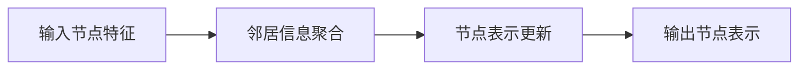

## 1.背景介绍

在过去的几年中，深度学习已经在许多领域取得了显著的成就，包括图像识别、语音识别和自然语言处理等。然而，这些成功在很大程度上都是建立在数据是独立同分布的假设之上的。然而，许多现实世界的数据并不满足这个假设，而是以图的形式存在，例如社交网络、蛋白质互作网络和知识图谱等。图神经网络（GNN）就是为了处理这种图形数据而提出的。

## 2.核心概念与联系

图神经网络是一种特殊的深度学习网络，其主要目标是学习图形数据的表示。图神经网络的主要思想是通过聚合节点的邻居信息来更新节点的表示。这个过程可以被形式化为一个消息传递的过程，每个节点都会接收并处理其邻居节点的信息，然后更新自己的状态。



## 3.核心算法原理具体操作步骤

图神经网络的算法原理主要包括以下几个步骤：

1. 初始化：首先，我们需要对图中的每个节点初始化一个特征向量。这个特征向量可以是节点的属性，也可以是随机的。

2. 聚合：在每一轮的迭代中，每个节点会收集其邻居节点的特征向量，然后通过一个聚合函数（如求和、平均、最大值等）来聚合这些特征向量，得到一个新的特征向量。

3. 更新：然后，每个节点会用一个更新函数（如ReLU、sigmoid等）来更新自己的特征向量。这个更新函数通常是一个神经网络。

4. 输出：最后，我们可以使用得到的节点特征向量进行各种任务，如节点分类、链接预测等。

## 4.数学模型和公式详细讲解举例说明

图神经网络的操作可以被形式化为以下的数学模型：

1. 聚合函数：假设我们有一个图 $G = (V, E)$，其中 $V$ 是节点集合，$E$ 是边集合。对于图中的每个节点 $v$，我们可以定义一个聚合函数 $AGGREGATE$ 来聚合其邻居节点的特征向量：

    $$ h_{v}^{(k)} = AGGREGATE^{(k)}(\{h_{u}^{(k-1)}, \forall u \in N(v)\}) $$

2. 更新函数：然后，我们可以定义一个更新函数 $UPDATE$ 来更新节点 $v$ 的特征向量：

    $$ h_{v}^{(k)} = UPDATE^{(k)}(h_{v}^{(k-1)}, h_{v}^{(k)}) $$

其中，$h_{v}^{(k)}$ 是节点 $v$ 在第 $k$ 轮迭代后的特征向量，$N(v)$ 是节点 $v$ 的邻居节点集合，$AGGREGATE^{(k)}$ 和 $UPDATE^{(k)}$ 分别是第 $k$ 轮迭代的聚合函数和更新函数。

## 5.项目实践：代码实例和详细解释说明

下面我们来看一个简单的图神经网络的实现，这个网络是用PyTorch实现的。首先，我们定义一个图神经网络的层：

```python
class GraphConvolution(nn.Module):
    def __init__(self, input_dim, output_dim):
        super(GraphConvolution, self).__init__()
        self.input_dim = input_dim
        self.output_dim = output_dim
        self.weight = nn.Parameter(torch.FloatTensor(input_dim, output_dim))
        self.reset_parameters()

    def reset_parameters(self):
        init.kaiming_uniform_(self.weight)

    def forward(self, input, adj):
        support = torch.mm(input, self.weight)
        output = torch.spmm(adj, support)
        return output
```

然后，我们可以定义一个图神经网络，这个网络包含两个图卷积层：

```python
class GCN(nn.Module):
    def __init__(self, input_dim, hidden_dim, output_dim):
        super(GCN, self).__init__()
        self.gc1 = GraphConvolution(input_dim, hidden_dim)
        self.gc2 = GraphConvolution(hidden_dim, output_dim)

    def forward(self, input, adj):
        x = F.relu(self.gc1(input, adj))
        x = self.gc2(x, adj)
        return x
```

最后，我们可以使用这个网络来进行节点分类任务：

```python
gcn = GCN(input_dim, hidden_dim, output_dim)
optimizer = torch.optim.Adam(gcn.parameters(), lr=0.01)

for epoch in range(200):
    output = gcn(input, adj)
    loss = F.cross_entropy(output, labels)
    optimizer.zero_grad()
    loss.backward()
    optimizer.step()
```

其中，`input` 是节点的特征矩阵，`adj` 是图的邻接矩阵，`labels` 是节点的标签。

## 6.实际应用场景

图神经网络在许多领域都有广泛的应用，包括但不限于：

1. 社交网络分析：图神经网络可以用来预测社交网络中的链接，例如预测用户之间的好友关系，或者预测用户的兴趣偏好。

2. 生物信息学：图神经网络可以用来分析蛋白质互作网络，预测蛋白质的功能，或者预测药物的作用机制。

3. 推荐系统：图神经网络可以用来分析用户的行为数据，预测用户的兴趣，从而提供个性化的推荐。

4. 知识图谱：图神经网络可以用来分析知识图谱，预测实体之间的关系，或者进行实体链接等任务。

## 7.工具和资源推荐

以下是一些用于学习和实践图神经网络的工具和资源：

1. PyTorch Geometric：这是一个基于PyTorch的图神经网络库，包含了许多预训练的图神经网络模型，以及一些用于图形数据处理的工具。

2. DGL：这是一个基于PyTorch和MXNet的图神经网络库，包含了许多图神经网络的算法和模型。

3. GraphVite：这是一个快速的图神经网络库，可以用来训练大规模的图神经网络模型。

4. NetworkX：这是一个用于创建、操作和研究复杂网络的Python库。

## 8.总结：未来发展趋势与挑战

图神经网络是一个非常活跃的研究领域，未来的发展趋势可能包括以下几个方向：

1. 动态图神经网络：大多数现有的图神经网络都是基于静态图的，但是许多现实世界的图是动态变化的。动态图神经网络是一个新兴的研究方向，旨在处理动态图的挑战。

2. 图神经网络的解释性：虽然图神经网络在许多任务上都表现出了优秀的性能，但是其内部的工作机制往往难以解释。提高图神经网络的解释性是未来的一个重要研究方向。

3. 大规模图神经网络：随着数据规模的增大，如何有效地训练大规模的图神经网络也是一个重要的挑战。

## 9.附录：常见问题与解答

1. **问题：为什么我的图神经网络的性能不好？**

   答：可能的原因有很多，例如模型的复杂度不够，训练数据不足，或者是超参数设置不合适等。你可以尝试增加模型的复杂度，收集更多的训练数据，或者调整超参数来提高性能。

2. **问题：我可以在图神经网络中使用哪些类型的数据？**

   答：你可以使用任何类型的图形数据，包括但不限于社交网络、知识图谱、蛋白质互作网络等。你需要将这些数据转换成图神经网络可以处理的格式，例如邻接矩阵和节点特征矩阵。

3. **问题：图神经网络可以用于哪些任务？**

   答：图神经网络可以用于许多任务，包括但不限于节点分类、链接预测、图分类等。

作者：禅与计算机程序设计艺术 / Zen and the Art of Computer Programming