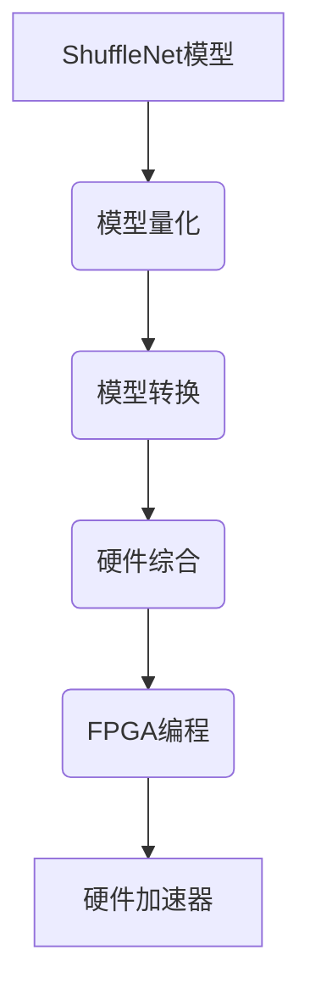

# 在FPGA上部署ShuffleNet:硬件加速方案

## 1.背景介绍

随着深度学习在计算机视觉、自然语言处理等领域的广泛应用,对高效的深度神经网络模型的需求也日益增长。ShuffleNet作为一种轻量级卷积神经网络,因其高效的计算能力和较小的模型尺寸,在移动端和嵌入式系统中备受青睐。然而,即使是这种轻量级模型,在资源受限的嵌入式系统中也可能面临计算能力不足的挑战。

现场可编程门阵列(FPGA)凭借其可重构的硬件架构和并行计算能力,为深度神经网络模型提供了高效的加速平台。通过将深度学习模型映射到FPGA硬件上,可以充分利用FPGA的并行计算资源,从而显著提高推理性能。因此,将ShuffleNet部署到FPGA上可以极大地提升其在资源受限环境中的应用效率。

## 2.核心概念与联系

### 2.1 ShuffleNet概述

ShuffleNet是一种专门为移动设备设计的轻量级卷积神经网络,旨在在保持较高精度的同时,降低计算量和模型大小。它采用了一些创新技术,如逐点群卷积(Pointwise Group Convolution)和通道混洗(Channel Shuffle),从而实现了高效的计算和参数压缩。

### 2.2 FPGA加速原理

FPGA是一种可重构的硬件平台,由大量可编程逻辑单元和内存资源组成。与通用CPU相比,FPGA可以实现针对特定算法的硬件加速,充分利用并行计算和数据流水线等优势。将深度学习模型映射到FPGA上,可以将计算密集型操作(如卷积和全连接层)映射为硬件电路,从而显著提高计算效率。

### 2.3 FPGA加速ShuffleNet的优势

将ShuffleNet部署到FPGA上,可以充分利用FPGA的并行计算能力和数据流水线优势,加速网络的推理过程。由于ShuffleNet本身就是一种轻量级模型,因此将其映射到FPGA上所需的硬件资源相对较少,使得在资源受限的嵌入式系统中也能实现高效的加速。此外,FPGA的可重构性也使得硬件加速器可以根据不同应用场景进行优化和定制。

## 3.核心算法原理具体操作步骤

### 3.1 ShuffleNet网络结构

ShuffleNet的核心网络单元是ShuffleNet单元,它包含三个主要操作:逐点群卷积(Pointwise Group Convolution)、通道混洗(Channel Shuffle)和深度可分离卷积(Depthwise Separable Convolution)。


1. **逐点群卷积(Pointwise Group Convolution)**:将输入特征图分成多个组,对每个组进行标准的1x1卷积操作,从而减少计算量和模型参数。
2. **通道混洗(Channel Shuffle)**:将不同组的输出特征图按照某种规则重新排列和组合,以增加信息流动。
3. **深度可分离卷积(Depthwise Separable Convolution)**:将标准卷积分解为深度卷积和逐点卷积两个步骤,从而进一步减少计算量。

通过上述操作的组合,ShuffleNet能够在保持较高精度的同时,显著降低计算量和模型大小。

### 3.2 FPGA上的ShuffleNet加速流程

将ShuffleNet部署到FPGA上的主要步骤如下:



1. **模型量化**:将浮点数模型转换为定点数模型,以减小硬件资源占用和提高计算效率。
2. **模型转换**:将量化后的模型转换为FPGA可识别的硬件描述语言(如Verilog或VHDL)。
3. **硬件综合**:使用FPGA工具将硬件描述语言代码综合为可编程逻辑单元和内存资源的映射。
4. **FPGA编程**:将综合后的配置文件下载到FPGA芯片上,实现硬件加速器的部署。

在上述流程中,关键步骤是模型转换和硬件综合,需要将ShuffleNet的各个操作(如卷积、池化等)高效地映射到FPGA硬件资源上,并优化数据流水线和并行计算,以充分发挥FPGA的加速能力。

## 4.数学模型和公式详细讲解举例说明

### 4.1 ShuffleNet中的逐点群卷积

逐点群卷积是ShuffleNet的核心操作之一,它将输入特征图分成多个组,对每个组进行标准的1x1卷积操作,从而减少计算量和模型参数。具体来说,假设输入特征图的通道数为 $c$,卷积核的数量为 $c'$,那么逐点群卷积的计算量为:

$$
c' \times c \times 1 \times 1 \times \frac{c}{g}
$$

其中 $g$ 表示分组数量。相比于标准的1x1卷积(计算量为 $c' \times c \times 1 \times 1$),逐点群卷积可以减少 $g$ 倍的计算量。

例如,假设输入特征图的通道数为64,卷积核的数量为256,分组数量为4,那么标准1x1卷积的计算量为256 * 64 * 1 * 1 = 16384,而逐点群卷积的计算量为256 * 64 * 1 * 1 * (64/4) = 4096,计算量减少了4倍。

### 4.2 ShuffleNet中的通道混洗

通道混洗操作的目的是增加不同组之间的信息流动,以提高网络的表达能力。具体来说,假设输入特征图被分成 $g$ 个组,每个组包含 $\frac{c}{g}$ 个通道,那么通道混洗操作可以表示为:

$$
y_{i} = x_{j}, \quad \text{where} \quad j = \operatorname{shuffle}(i)
$$

其中 $x$ 表示输入特征图, $y$ 表示输出特征图, $\operatorname{shuffle}(\cdot)$ 是一个重新排列通道的函数。通过这种方式,不同组的特征图通道被重新组合,从而增加了信息流动。

例如,假设输入特征图被分成4个组,每个组包含4个通道,那么通道混洗操作可以将第一组的4个通道与第二组的4个通道交换,第三组的4个通道与第四组的4个通道交换,从而实现了不同组之间的信息交换。

### 4.3 ShuffleNet中的深度可分离卷积

深度可分离卷积是ShuffleNet中另一个重要的操作,它将标准卷积分解为深度卷积和逐点卷积两个步骤,从而进一步减少计算量。具体来说,假设输入特征图的通道数为 $c$,卷积核的数量为 $c'$,卷积核大小为 $k \times k$,那么标准卷积的计算量为:

$$
c' \times c \times k \times k
$$

而深度可分离卷积将其分解为两个步骤:

1. 深度卷积:对每个输入通道进行 $k \times k$ 的卷积操作,计算量为 $c \times 1 \times k \times k$。
2. 逐点卷积:对深度卷积的输出进行1x1卷积操作,计算量为 $c' \times c \times 1 \times 1$。

因此,深度可分离卷积的总计算量为:

$$
c \times 1 \times k \times k + c' \times c \times 1 \times 1
$$

相比于标准卷积,深度可分离卷积可以显著减少计算量,尤其是在卷积核大小较大时效果更加明显。

例如,假设输入特征图的通道数为64,卷积核的数量为256,卷积核大小为3x3,那么标准卷积的计算量为256 * 64 * 3 * 3 = 147456,而深度可分离卷积的计算量为64 * 1 * 3 * 3 + 256 * 64 * 1 * 1 = 16896,计算量减少了约8.7倍。

## 5.项目实践:代码实例和详细解释说明

为了更好地理解ShuffleNet在FPGA上的硬件加速实现,我们提供了一个基于Xilinx Vivado HLS工具的代码示例。该示例实现了ShuffleNet中的逐点群卷积和深度可分离卷积操作,并对其进行了硬件加速优化。

### 5.1 逐点群卷积实现

```cpp
#include "conv.h"

void pointwise_group_conv(
    const ap_uint<CHANNEL_SIZE>* input,
    ap_uint<CHANNEL_SIZE>* output,
    const ap_uint<KERNEL_SIZE>* kernel,
    const int input_height,
    const int input_width,
    const int output_channels,
    const int groups) {

#pragma HLS ARRAY_PARTITION variable=kernel complete dim=1
#pragma HLS INTERFACE m_axi port=input  offset=slave bundle=gmem
#pragma HLS INTERFACE m_axi port=output offset=slave bundle=gmem
#pragma HLS INTERFACE s_axilite port=input_height
#pragma HLS INTERFACE s_axilite port=input_width
#pragma HLS INTERFACE s_axilite port=output_channels
#pragma HLS INTERFACE s_axilite port=groups
#pragma HLS INTERFACE s_axilite port=return

    const int input_channels = CHANNEL_SIZE / groups;
    const int kernel_size = KERNEL_SIZE / groups;

    for (int h = 0; h < input_height; h++) {
        for (int w = 0; w < input_width; w++) {
            for (int g = 0; g < groups; g++) {
#pragma HLS PIPELINE II=1
                for (int oc = 0; oc < output_channels / groups; oc++) {
                    ap_uint<CHANNEL_SIZE> acc = 0;
                    for (int ic = 0; ic < input_channels; ic++) {
                        const ap_uint<KERNEL_SIZE> weight = kernel[g * kernel_size + oc * input_channels + ic];
                        const ap_uint<CHANNEL_SIZE> input_val = input[(h * input_width + w) * CHANNEL_SIZE + g * input_channels + ic];
                        acc += input_val * weight;
                    }
                    output[(h * input_width + w) * output_channels + g * (output_channels / groups) + oc] = acc;
                }
            }
        }
    }
}
```

在这个实现中,我们使用了Vivado HLS的优化指令来提高性能:

- `#pragma HLS ARRAY_PARTITION`将卷积核分区,以提高内存访问效率。
- `#pragma HLS INTERFACE`指定了输入、输出和参数的接口类型,以便与FPGA硬件进行高效的数据传输。
- `#pragma HLS PIPELINE`启用了流水线,以提高吞吐量。

该实现将输入特征图分成多个组,对每个组进行1x1卷积操作,从而实现了逐点群卷积。通过利用FPGA的并行计算能力和数据流水线,可以显著提高计算效率。

### 5.2 深度可分离卷积实现

```cpp
#include "conv.h"

void depthwise_conv(
    const ap_uint<CHANNEL_SIZE>* input,
    ap_uint<CHANNEL_SIZE>* output,
    const ap_uint<KERNEL_SIZE>* kernel,
    const int input_height,
    const int input_width,
    const int output_channels) {

#pragma HLS ARRAY_PARTITION variable=kernel complete dim=1
#pragma HLS INTERFACE m_axi port=input  offset=slave bundle=gmem
#pragma HLS INTERFACE m_axi port=output offset=slave bundle=gmem
#pragma HLS INTERFACE s_axilite port=input_height
#pragma HLS INTERFACE s_axilite port=input_width
#pragma HLS INTERFACE s_axilite port=output_channels
#pragma HLS INTERFACE s_axilite port=return

    const int kernel_size = KERNEL_SIZE / output_channels;

    for (int h = 0; h < input_height; h++) {
        for (int w = 0; w < input_width; w++) {
#pragma HLS PIPELINE II=1
            for (int oc = 0; oc < output_channels; oc++) {
                ap_uint<CHANNEL_SIZE> acc = 0;
                for (int kh = 0; kh < KERNEL_HEIGHT; kh++) {
                    for (int kw = 0; kw < KERNEL_WIDTH; kw++) {
                        const int input_row = h + kh - KERNEL_HEIGHT / 2;
                        const int input