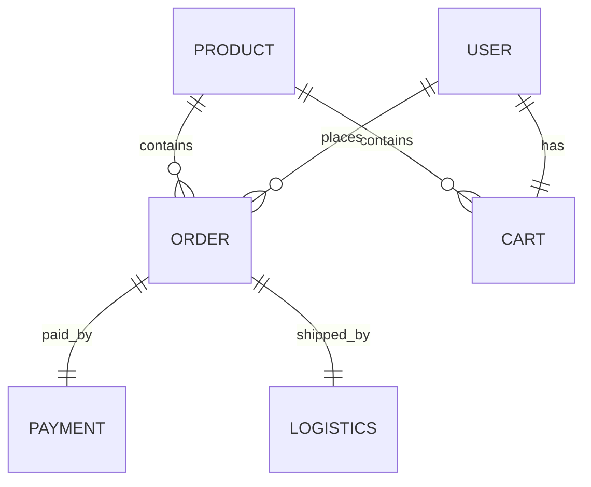

# 在线花卉销售系统详细设计与具体代码实现

## 1. 背景介绍

随着互联网技术的快速发展,电子商务已经成为现代商业的重要组成部分。越来越多的传统行业开始拥抱互联网,花卉行业也不例外。在线花卉销售系统可以帮助花店拓展业务,提高销售额和利润率。本文将详细介绍一个完整的在线花卉销售系统的设计与实现,涵盖需求分析、系统架构、核心算法、数据库设计、API设计以及前后端代码实现等方面。

### 1.1 在线花卉销售的优势

- 扩大销售渠道,不受地域限制
- 降低运营成本,提高利润率  
- 提供个性化定制服务,增强用户体验
- 利用大数据分析,精准营销

### 1.2 系统目标

- 为花店提供一个功能完善、易用的在线销售平台
- 为消费者提供便捷的浏览、购买花卉的渠道
- 实现花卉销售的自动化、智能化,提高效率
- 通过数据分析,帮助花店优化经营策略

## 2. 核心概念与关联

在线花卉销售系统涉及的核心概念包括:

- 花卉产品:包括切花、盆栽等,有价格、库存、图片、详情等属性
- 订单:记录用户购买花卉的信息,包括收货地址、支付状态等
- 购物车:保存用户挑选的商品,方便批量下单
- 用户:注册用户可以下单购买,管理员可以管理商品和订单
- 支付:对接第三方支付平台,实现在线支付功能
- 物流:集成快递公司API,自动生成电子面单,跟踪物流状态

以下是核心概念的 E-R 图:



## 3. 核心算法原理与步骤

### 3.1 个性化推荐算法

利用协同过滤算法,根据用户的历史行为和其他相似用户的行为,为用户推荐可能感兴趣的花卉产品。

#### 步骤:

1. 收集用户行为数据,如浏览、购买、评价等
2. 计算用户之间和商品之间的相似度
3. 根据用户的历史行为,找出相似用户喜欢的商品
4. 过滤掉用户已购买或不感兴趣的商品
5. 将推荐结果展示给用户

### 3.2 智能搜索算法

利用倒排索引和 TF-IDF 算法,实现花卉产品的智能搜索功能。

#### 步骤:

1. 对花卉的名称、描述等文本建立倒排索引
2. 用户输入搜索词,分词后在索引中查找相关商品
3. 根据 TF-IDF 值计算搜索词与商品的相关性得分
4. 按相关性得分由高到低排序,返回搜索结果

## 4. 数学模型与公式详解

### 4.1 协同过滤推荐

#### 4.1.1 用户相似度

用户 $u$ 和 $v$ 的相似度 $sim(u,v)$ 可以用余弦相似度计算:

$$sim(u,v) = \frac{\sum_{i \in I_{uv}} r_{ui} r_{vi}}{\sqrt{\sum_{i \in I_u} r_{ui}^2} \sqrt{\sum_{i \in I_v} r_{vi}^2}}$$

其中 $I_{uv}$ 是 $u$ 和 $v$ 都有评分的商品集合,$r_{ui}$ 是用户 $u$ 对商品 $i$ 的评分。

#### 4.1.2 预测评分

对于用户 $u$ 未评分的商品 $i$,可以用其相似用户的评分来预测:

$$\hat{r}_{ui} = \bar{r}_u + \frac{\sum_{v \in S^k_u(i)} sim(u,v) (r_{vi} - \bar{r}_v)}{\sum_{v \in S^k_u(i)} sim(u,v)}$$

其中 $\bar{r}_u$ 是 $u$ 的平均评分,$S^k_u(i)$ 是与 $u$ 最相似的 $k$ 个用户中对 $i$ 有评分的子集。

### 4.2 智能搜索

#### 4.2.1 倒排索引

将花卉的文本信息(如名称、描述)进行分词,建立(关键词,商品 ID 列表)的映射。

例如:

```
玫瑰 -> [1, 2, 5]
香槟 -> [2, 7] 
康乃馨 -> [3, 6]
...
```

#### 4.2.2 TF-IDF

TF-IDF 用于衡量一个词语对一个文档的重要程度。TF(Term Frequency)表示词频,IDF(Inverse Document Frequency)表示逆文档频率。

$$TF(t,d) = \frac{f_{t,d}}{\sum_{t' \in d} f_{t',d}}$$

$$IDF(t,D) = \log \frac{|D|}{|\{d \in D: t \in d\}|}$$

$$TFIDF(t,d,D) = TF(t,d) \cdot IDF(t,D)$$

其中 $f_{t,d}$ 是词语 $t$ 在文档 $d$ 中出现的次数,$|D|$ 是语料库中文档总数。

## 5. 项目实践:代码实例与说明

下面是一些关键功能的代码示例。

### 5.1 花卉管理 API

使用 Spring Boot 实现 RESTful API:

```java
@RestController
@RequestMapping("/flowers")
public class FlowerController {

    @Autowired
    private FlowerService flowerService;

    @GetMapping
    public List<Flower> getAllFlowers() {
        return flowerService.getAllFlowers();
    }
    
    @PostMapping
    public Flower addFlower(@RequestBody Flower flower) {
        return flowerService.addFlower(flower);
    }
  
    // ...
}
```

### 5.2 个性化推荐

使用 Python 实现协同过滤:

```python
from sklearn.metrics.pairwise import cosine_similarity

def user_similarity(ratings):
    """计算用户相似度矩阵"""
    return cosine_similarity(ratings)

def predict_rating(ratings, user_id, item_id, k=20):
    """预测用户对商品的评分"""
    user_similarities = user_similarity(ratings)
    similar_users = user_similarities[user_id].argsort()[::-1][1:k+1]
    similar_ratings = ratings[similar_users, item_id]
    return ratings[user_id].mean() + np.dot(user_similarities[user_id, similar_users], similar_ratings - ratings[similar_users].mean(axis=1)) / user_similarities[user_id, similar_users].sum() 
```

### 5.3 智能搜索

使用 Elasticsearch 实现倒排索引与搜索:

```java
@Service
public class SearchService {

    @Autowired
    private RestHighLevelClient esClient;

    public List<Flower> searchFlowers(String keyword) throws Exception {
        SearchRequest request = new SearchRequest("flowers");
        SearchSourceBuilder builder = new SearchSourceBuilder();
        builder.query(QueryBuilders.multiMatchQuery(keyword, "name", "description"));
        request.source(builder);
        
        SearchResponse response = esClient.search(request, RequestOptions.DEFAULT);
        
        List<Flower> results = new ArrayList<>();
        for (SearchHit hit : response.getHits().getHits()) {
            results.add(JSON.parseObject(hit.getSourceAsString(), Flower.class));
        }
        return results;
    }
}
```

## 6. 实际应用场景

在线花卉销售系统可应用于以下场景:

- 鲜花电商平台:如花点时间、花礼网等,销售各类鲜切花、花束、绿植等
- 本地实体花店:开设网上商城,提供本地区的送花上门服务
- 节日营销:针对情人节、母亲节等花卉消费高峰,开展个性化促销活动
- 企业对公业务:为企业提供办公室绿植租赁、会议花艺布置等服务

通过在线平台,花店可以更高效地管理库存、处理订单、优化配送,不断提升用户体验和运营效率。个性化推荐、智能搜索等功能可以帮助平台引流、提高转化率。数据分析则可以洞察消费趋势,指导营销决策。

## 7. 工具与资源推荐

- Spring Boot:Java Web 开发框架
- Vue.js:前端 JavaScript 框架 
- MySQL:关系型数据库
- Elasticsearch:搜索引擎
- RabbitMQ:消息队列
- Logstash:日志收集与解析
- Kibana:数据可视化
- Tensorflow:机器学习平台
- 云服务:阿里云、亚马逊云等,提供弹性计算、存储、CDN 等服务

选择合适的技术栈,利用云平台的基础设施,可以快速搭建一个高可用、可扩展的在线销售系统。借助大数据、人工智能等前沿技术,不断挖掘数据价值,优化业务流程,提升核心竞争力。

## 8. 总结:发展趋势与挑战

在线花卉销售是电商行业与传统花卉行业结合的产物,市场前景广阔。随着消费习惯的改变和互联网的普及,越来越多的用户选择线上购买鲜花。对于平台而言,如何在激烈的竞争中脱颖而出,需要在以下方面下功夫:

- 差异化定位:提供个性化、定制化的产品与服务
- 品牌建设:加强品牌宣传,提升品牌形象和忠诚度
- 供应链优化:打造高效的采购、仓储、配送体系,控制成本,保证品质
- 技术驱动:利用大数据、人工智能等新技术,实现精准营销、智能客服等功能
- 多渠道营销:整合线上线下渠道,提供一体化的消费体验

未来,在线花卉销售将迎来更多机遇和挑战。电商平台需要与上下游合作伙伴密切协作,不断创新商业模式,利用新技术赋能传统行业,为消费者带来更美好的花卉消费体验。

## 9. 附录:常见问题与解答

### 9.1 如何确保鲜花的新鲜度?

与合作花农建立可靠的供应链,优化仓储条件和配送时效,一般可以保证送达时花卉的新鲜度。此外还可引入用户评价机制,根据反馈动态调整。

### 9.2 在线支付的安全性如何保障?

选择知名的第三方支付平台作为支付通道,并遵循行业标准和法律法规。采用 SSL 加密传输,定期进行安全审计,保护用户的支付信息。

### 9.3 如何处理售后问题?

建立完善的售后服务体系,如 7 天无理由退换货、延期赔付等。提供多种客服渠道,如电话、在线客服、微信客服等,及时响应用户诉求。对重大投诉,建立专门的处理流程,与用户积极沟通,妥善解决问题。

### 9.4 如何提高用户复购率?

利用 CRM 系统记录用户的购买行为和偏好,针对性地开展营销活动。为老客户提供专享优惠和产品推荐,提高客户粘性。建立会员体系和积分制度,鼓励用户复购和分享。

### 9.5 如何应对节日高峰?

提前根据历史数据和市场趋势预测需求,合理安排采购和备货。优化物流配送,必要时引入外包服务,提高配送效率。加强客服人员培训,应对大规模咨询和投诉。灵活调整营销策略,应对同行竞争。

作者：禅与计算机程序设计艺术 / Zen and the Art of Computer Programming