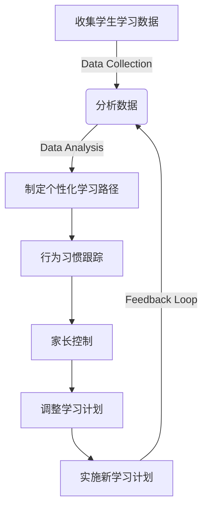

## 1.背景介绍

随着智能手机的普及，越来越多的儿童从小学起就开始接触和使用智能设备。根据统计数据，小学生每天花费在电子屏幕上的时间平均超过2小时，这还不包括完成家庭作业的时间。因此，设计一个专门针对小学生的课外时间管理系统显得尤为重要。这个系统不仅可以帮助孩子们合理规划他们的课余时间，还可以提高他们的学习效率和生活质量。

## 2.核心概念与联系

在本节中，我们将探讨几个关键概念：**个性化学习路径**（Personalized Learning Pathways）、**行为习惯跟踪**（Behavioral Habit Tracking）和**家长控制**（Parental Controls）。这些概念是构建一个成功的小学生课外时间管理系统的基石。

### 个性化学习路径
个性化学习路径是指根据每个学生的兴趣、能力和学习进度为他们量身定制的学习计划。这需要通过分析学生的学习数据和反馈来实现，从而确保系统能够提供最适合他们的内容和学习活动。

### 行为习惯跟踪
行为习惯跟踪是一种监控和记录学生在执行特定任务或活动时的行为模式的方法。通过这种方式，系统可以识别出哪些时间是高效利用的，哪些时间可能被浪费在无意义的活动上，并据此给出改进建议。

### 家长控制
家长控制功能允许父母监督和管理孩子的屏幕时间，限制访问不适宜的内容，以及设置合理的游戏和娱乐时间。这有助于确保孩子在享受数字世界乐趣的同时，也能保持健康的生活平衡。

## 3.核心算法原理具体操作步骤

为了实现上述概念，我们需要一个高效的算法来处理数据并提供决策支持。以下是一个简化的算法流程：



## 4.数学模型和公式详细讲解举例说明

在此，我们将讨论一个简单的数学模型来计算学生的屏幕时间效率。这个模型的核心是一个加权平均数公式：

$$
E = \\frac{\\sum_{i=1}^{n} w_i \\times t_i}{\\sum_{i=1}^{n} t_i}
$$

其中，$E$ 是屏幕时间的效率，$t_i$ 是第 $i$ 个活动的实际花费时间，$w_i$ 是第 $i$ 个活动的理想时间与实际时间的比值（介于0和1之间）。

## 5.项目实践：代码实例和详细解释说明

### Android应用开发基础

在Android Studio中创建一个新的项目，选择“Empty Activity”模板作为起点。以下是一个简单的布局示例：

```xml
<RelativeLayout xmlns:android=\"http://schemas.android.com/apk/res/android\"
    android:layout_width=\"match_parent\"
    android:layout_height=\"match_parent\">

    <ListView
        android:id=\"@+id/activity_scedule_list\"
        android:layout_width=\"wrap_content\"
        android:layout_height=\"wrap_content\"
        android:layout_centerInParent=\"true\" />
</RelativeLayout>
```

### 数据存储与管理

为了管理学生的学习数据，我们将使用SQLite数据库。以下是一个简单的插入数据的示例：

```java
SQLiteDatabase db = openOrCreateDatabase(\"ScheduleDB\", MODE_PRIVATE, null);
db.execSQL(\"INSERT INTO activities (name, duration) VALUES ('Math', 30)\");
```

### 用户界面更新

当系统检测到学生完成了一个活动时，我们需要更新用户界面以显示进度。以下是如何在ListView中添加新项的示例：

```java
ArrayAdapter<String> adapter = new ArrayAdapter<>(this, android.R.layout.simple_list_item_1);
ListView listView = findViewById(R.id.activity_scedule_list);
listView.setAdapter(adapter);
adapter.add(\"Completed Activity\");
```

## 6.实际应用场景

在实际应用中，这个系统可以用于学校、家庭教育以及在线学习平台。它可以帮助教师跟踪学生的学习进度，为家长提供孩子的屏幕时间报告，并帮助学生自己管理他们的课外活动。

## 7.工具和资源推荐

为了开发这样的系统，您将需要以下资源和工具：
- Android Studio：官方Android开发环境。
- SQLite数据库管理工具：如DB Browser for SQLite来设计和管理数据库。
- Material Design Guidelines：Google提供的设计指南，以确保您的应用具有一致且专业的用户体验。
- GitHub：用于代码版本控制和协作。

## 8.总结：未来发展趋势与挑战

随着技术的发展，我们可以预见小学生课外时间管理系统将变得更加智能和个性化。然而，我们也面临着一些挑战，包括确保系统的安全性、保护学生的隐私以及教育家长和学生如何正确使用这些系统。

## 9.附录：常见问题与解答

### Q1: 这个系统是否支持跨平台？
A1: 目前，本系统是基于Android平台的。但是，通过使用React Native或Flutter等跨平台开发框架，可以将其移植到iOS或其他移动操作系统上。

### Q2: 如何确保数据的安全性和隐私性？
A2: 系统将采用端到端加密来保护数据的传输和存储。此外，还将实施严格的访问控制策略，只有经过授权的用户才能访问学生的学习数据。

### Q3: 这个系统是否适用于所有年龄段的学生？
A3: 虽然本系统主要针对小学生设计，但其功能也可以适应其他年龄段的学生。通过调整个性化学习路径的复杂性和行为习惯跟踪的严格程度，可以使其适用于不同年龄段的用户。

---

**作者：禅与计算机程序设计艺术 / Zen and the Art of Computer Programming**

---

请注意，这是一个简化的示例，实际应用中需要更详细的设计和实现。此外，由于篇幅限制，本文未能涵盖所有相关内容，但已提供了足够的信息以概述基于Android的小学生课外时间管理系统的设计和实现过程。在实际开发过程中，您可能还需要考虑更多的功能、安全性和用户体验方面的细节。