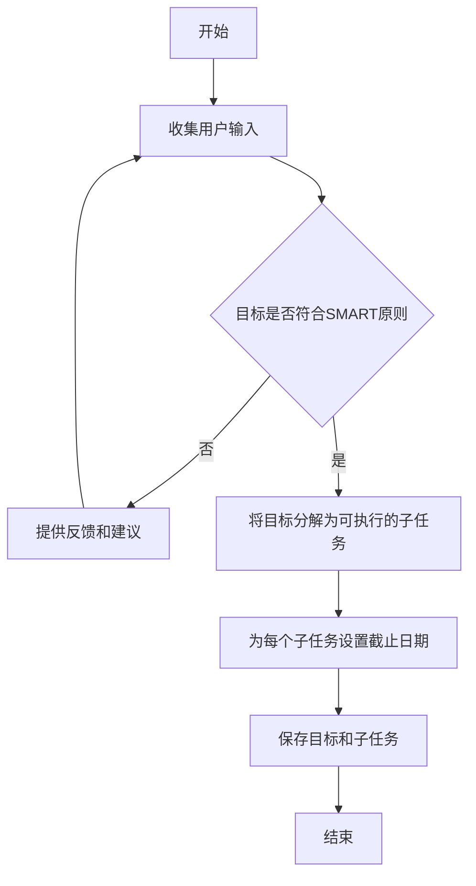
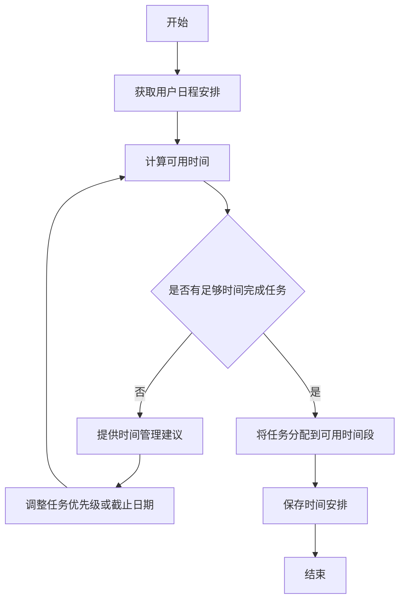
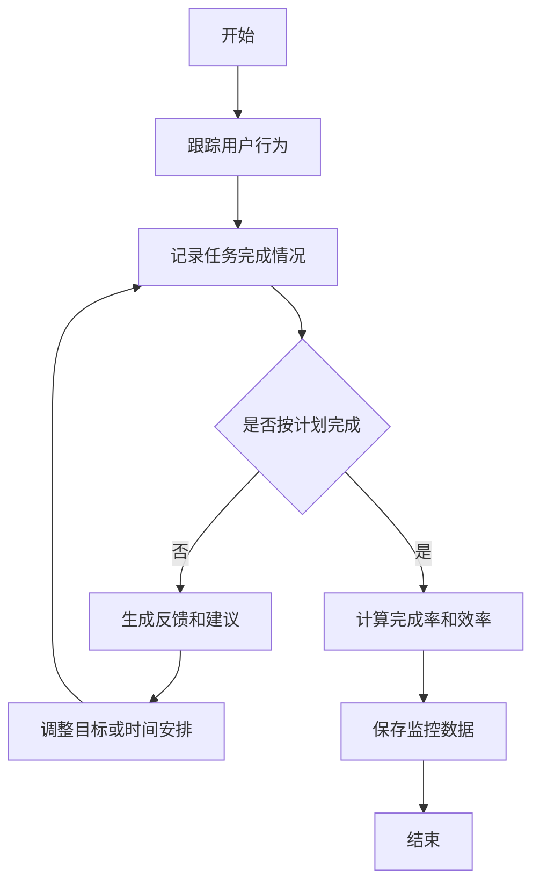
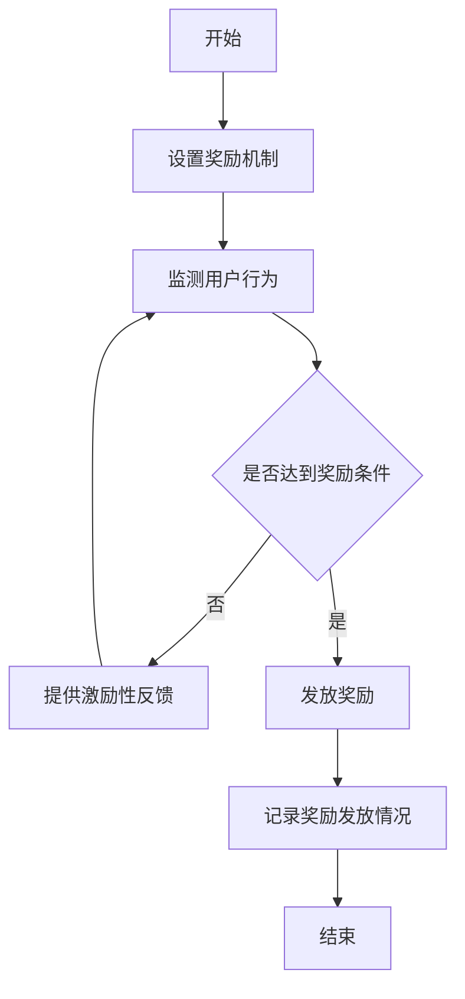
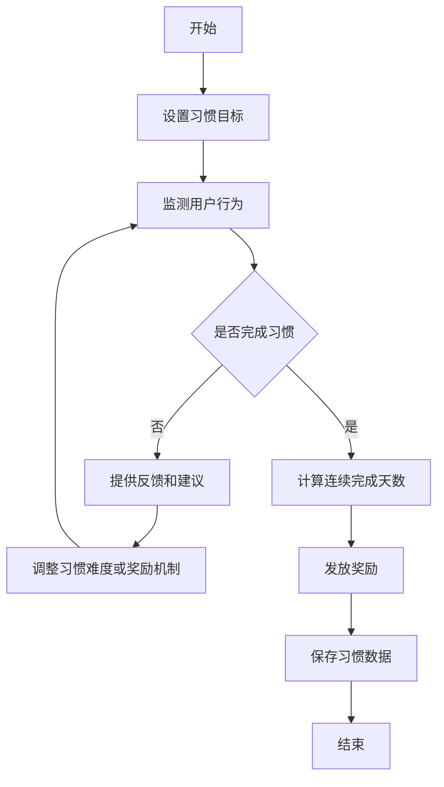

# 基于H5前端开发对自律APP设计与实现

## 1.背景介绍

### 1.1 自律的重要性

在这个快节奏的时代,我们常常被各种诱惑和干扰所包围,很容易失去对自己的控制。自律对于实现目标、提高生活质量和个人成长至关重要。它不仅能帮助我们集中注意力、管理时间、控制冲动,还能培养良好的习惯,提高自我效能感。

### 1.2 移动应用的兴起

随着智能手机的普及,移动应用(APP)已经深深融入了我们的日常生活。移动应用为人们提供了便捷的服务,满足了各种需求。在自律领域,也出现了一些帮助用户建立良好习惯、提高效率的APP。

### 1.3 H5前端技术的优势

H5(HTML5)前端技术凭借其跨平台、无需安装、响应式设计等优势,成为了开发移动应用的热门选择。H5前端技术可以让应用在各种设备和操作系统上运行,提供流畅的用户体验。

## 2.核心概念与联系

### 2.1 自律的核心概念

自律是一种通过自我控制和自我调节来实现预期目标的能力。它包括以下几个关键要素:

- 目标设定
- 时间管理
- 自我监控
- 自我激励
- 习惯培养

### 2.2 H5前端技术与自律APP的联系

H5前端技术为开发自律APP提供了坚实的技术基础。通过HTML5、CSS3和JavaScript等技术,我们可以构建出功能丰富、界面友好的Web应用。H5前端技术还支持离线缓存、本地存储、地理位置等功能,为自律APP增加了更多可能性。

此外,H5前端技术的响应式设计特性,可以确保自律APP在不同尺寸的设备上都能提供良好的用户体验。

## 3.核心算法原理具体操作步骤

### 3.1 目标设定算法



1. 收集用户输入的目标信息
2. 检查目标是否符合SMART原则(具体、可衡量、可实现、相关和有时限)
3. 如果不符合,提供反馈和建议,让用户重新输入
4. 如果符合,将目标分解为可执行的子任务
5. 为每个子任务设置截止日期
6. 保存目标和子任务信息

### 3.2 时间管理算法



1. 获取用户的日程安排信息
2. 计算每天的可用时间
3. 判断是否有足够的时间完成任务
4. 如果没有足够时间,提供时间管理建议,例如调整任务优先级或截止日期
5. 将任务分配到可用的时间段
6. 保存时间安排信息

### 3.3 自我监控算法



1. 跟踪用户在APP中的行为
2. 记录任务的完成情况
3. 判断任务是否按计划完成
4. 如果没有按计划完成,生成反馈和建议,例如调整目标或时间安排
5. 计算任务完成率和效率
6. 保存监控数据

### 3.4 自我激励算法



1. 设置奖励机制,例如完成任务可获得积分或徽章
2. 监测用户的行为
3. 判断用户是否达到奖励条件
4. 如果没有达到,提供激励性反馈,鼓励用户继续努力
5. 如果达到,发放相应的奖励
6. 记录奖励发放情况

### 3.5 习惯培养算法



1. 设置要培养的习惯目标,例如每天早睡早起
2. 监测用户的行为
3. 判断用户是否完成了当天的习惯
4. 如果没有完成,提供反馈和建议,例如调整习惯难度或奖励机制
5. 如果完成了,计算连续完成的天数
6. 根据连续完成天数发放奖励
7. 保存习惯数据

## 4.数学模型和公式详细讲解举例说明

### 4.1 时间管理模型

在时间管理算法中,我们需要计算每天的可用时间。可用时间是指除去睡眠时间、工作时间、约定时间等必须时间后剩余的时间。我们可以使用以下公式计算:

$$
可用时间 = 24小时 - 睡眠时间 - 工作时间 - 约定时间 - 其他必须时间
$$

例如,假设一个人每天需要睡眠8小时、工作8小时、约定时间2小时、其他必须时间(如吃饭、上下班通勤等)3小时,那么他每天的可用时间就是:

$$
可用时间 = 24小时 - 8小时 - 8小时 - 2小时 - 3小时 = 3小时
$$

在分配任务时,我们需要确保任务的总时间不超过可用时间。如果超出,就需要调整任务优先级或截止日期。

### 4.2 自我监控模型

在自我监控算法中,我们需要计算任务完成率和效率。任务完成率是指完成的任务数量与总任务数量的比率,用以下公式表示:

$$
任务完成率 = \frac{完成的任务数量}{总任务数量} \times 100\%
$$

效率是指实际完成时间与预计完成时间的比率,用以下公式表示:

$$
效率 = \frac{预计完成时间}{实际完成时间} \times 100\%
$$

如果效率大于100%,说明提前完成了任务;如果效率小于100%,说明延期完成了任务。

通过计算这些指标,我们可以更好地了解自己的时间管理和任务完成情况,从而做出相应的调整。

### 4.3 自我激励模型

在自我激励算法中,我们可以使用一些数学模型来设计奖励机制。例如,我们可以使用指数函数来计算奖励分数:

$$
奖励分数 = a \times b^{连续完成天数}
$$

其中,a和b是常数,可根据实际情况调整。连续完成天数越多,奖励分数就越高。

我们还可以使用阶梯函数来设计不同级别的奖励:

$$
奖励级别 = \begin{cases}
    1, & \text{if } 连续完成天数 < 7\\
    2, & \text{if } 7 \leq 连续完成天数 < 30\\
    3, & \text{if } 30 \leq 连续完成天数 < 90\\
    4, & \text{if } 连续完成天数 \geq 90
\end{cases}
$$

不同的奖励级别可以对应不同的奖励,例如徽章、优惠券等。

通过合理设计奖励机制,我们可以有效激励用户坚持完成任务和培养习惯。

## 5.项目实践:代码实例和详细解释说明

在这一部分,我们将提供一些代码实例,并详细解释它们的功能和实现原理。

### 5.1 目标设定模块

```html
<div id="goalSetting">
  <h2>设置目标</h2>
  <label for="goalInput">输入你的目标:</label>
  <input type="text" id="goalInput" placeholder="例如:每天跑步30分钟">
  <button id="submitGoal">提交</button>
  <div id="goalFeedback"></div>
</div>
```

```javascript
const goalInput = document.getElementById('goalInput');
const submitGoal = document.getElementById('submitGoal');
const goalFeedback = document.getElementById('goalFeedback');

submitGoal.addEventListener('click', () => {
  const goal = goalInput.value.trim();
  if (goal === '') {
    goalFeedback.textContent = '请输入一个有效的目标';
    return;
  }

  // 检查目标是否符合SMART原则
  const isSmartGoal = checkSmartGoal(goal);
  if (!isSmartGoal) {
    goalFeedback.textContent = '您的目标不符合SMART原则,请重新输入';
    return;
  }

  // 将目标分解为子任务
  const subTasks = breakdownGoal(goal);

  // 保存目标和子任务
  saveGoalAndSubTasks(goal, subTasks);

  goalFeedback.textContent = '目标设置成功!';
  goalInput.value = '';
});
```

在这个示例中,我们创建了一个简单的表单,让用户输入目标。当用户点击"提交"按钮时,我们会执行以下操作:

1. 获取用户输入的目标
2. 检查目标是否为空
3. 检查目标是否符合SMART原则(这里我们使用一个虚构的`checkSmartGoal`函数)
4. 如果不符合,提供反馈并要求用户重新输入
5. 如果符合,将目标分解为子任务(这里我们使用一个虚构的`breakdownGoal`函数)
6. 保存目标和子任务(这里我们使用一个虚构的`saveGoalAndSubTasks`函数)
7. 提供成功反馈并清空输入框

这个模块展示了如何通过JavaScript与用户交互,收集和处理目标信息。

### 5.2 时间管理模块

```html
<div id="timeManagement">
  <h2>时间管理</h2>
  <div id="schedule"></div>
  <button id="addEvent">添加事件</button>
</div>
```

```javascript
const schedule = document.getElementById('schedule');
const addEvent = document.getElementById('addEvent');

// 模拟用户日程安排
const userSchedule = [
  { start: '09:00', end: '17:00', event: '工作' },
  { start: '19:00', end: '20:00', event: '健身' }
];

// 渲染日程安排
function renderSchedule() {
  schedule.innerHTML = '';
  userSchedule.forEach(event => {
    const eventElement = document.createElement('div');
    eventElement.textContent = `${event.start} - ${event.end}: ${event.event}`;
    schedule.appendChild(eventElement);
  });
}

// 初始化
renderSchedule();

addEvent.addEventListener('click', () => {
  // 获取用户输入的事件信息
  const start = prompt('请输入事件开始时间(格式: HH:MM)');
  const end = prompt('请输入事件结束时间(格式: HH:MM)');
  const eventName = prompt('请输入事件名称');

  // 检查输入是否有效
  if (!start || !end || !eventName) {
    alert('输入无效,请重试');
    return;
  }

  // 添加事件到日程安排
  userSchedule.push({ start, end, event: eventName });

  // 重新渲染日程安排
  renderSchedule();
});
```

在这个示例中,我