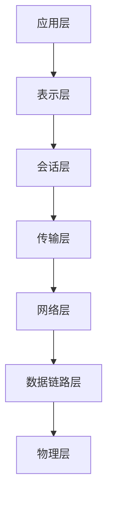
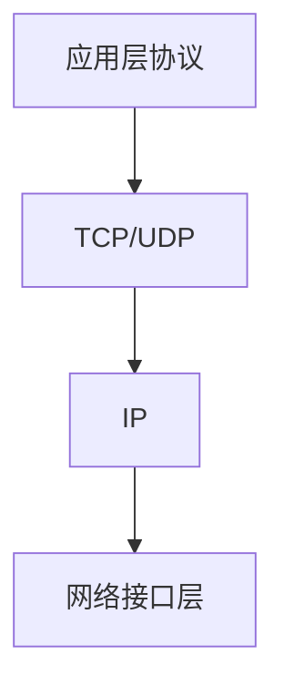
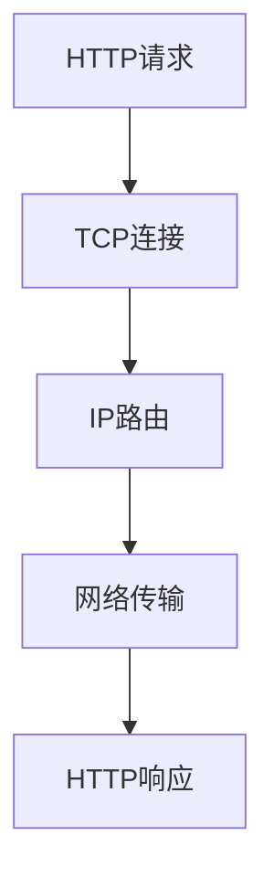
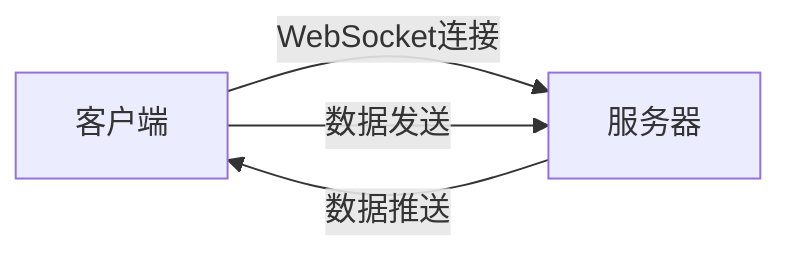
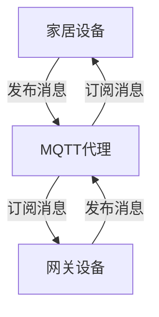

# 基于Java的智能家居设计：征服智能家居的互联网协议栈-从Java视角

## 1.背景介绍

### 1.1 智能家居的兴起

随着物联网、人工智能和云计算技术的快速发展,智能家居正在逐渐走进千家万户。智能家居系统通过将家居设备与互联网相连,实现了对家居环境的自动化控制和远程监控,极大地提高了生活质量和能源利用效率。

### 1.2 智能家居系统的架构

一个典型的智能家居系统由以下几个主要组成部分构成:

- 家居设备(如灯光、空调、安防等)
- 网关设备(连接家居设备与云端)
- 云端服务器(处理数据、控制逻辑)
- 移动应用程序(用户交互界面)

其中,网关设备扮演着桥梁的角色,负责家居设备与云端的数据交互,是整个系统的关键环节。

### 1.3 互联网协议栈在智能家居中的作用

互联网协议栈为智能家居系统提供了高效、可靠的数据传输机制。通过TCP/IP、HTTP等协议,家居设备可以与云端服务器进行实时的双向通信,实现设备状态上报、控制命令下发等功能。同时,互联网协议栈还支持跨平台、跨网络的互操作性,使得不同厂商的设备能够无缝集成。

本文将重点介绍如何基于Java技术,设计并实现一个高性能、可扩展的智能家居网关,全面征服智能家居的互联网协议栈。

## 2.核心概念与联系

### 2.1 OSI参考模型

OSI(Open Systems Interconnection)参考模型是一个概念模型,定义了网络通信的七层架构,每一层负责特定的通信功能。这七层自底向上分别是:物理层、数据链路层、网络层、传输层、会话层、表示层和应用层。

在智能家居系统中,网关设备需要实现OSI模型的下层协议(如物理层的以太网、WIFI等),以及上层应用层协议(如HTTP、MQTT等),从而实现与家居设备和云端服务器的双向通信。



### 2.2 TCP/IP协议族

TCP/IP(Transmission Control Protocol/Internet Protocol)是Internet的核心协议,也是智能家居系统中最常用的协议族。它由多个协议构成,包括IP(网际协议)、TCP(传输控制协议)、UDP(用户数据报协议)等。

在智能家居系统中,IP协议负责设备的寻址和路由,TCP协议提供可靠的数据流传输,而UDP则用于低延迟的数据报传输。网关设备需要支持这些基础协议,以实现与家居设备和云端的可靠通信。



### 2.3 HTTP协议

HTTP(HyperText Transfer Protocol)是Web应用中最常用的应用层协议,它定义了客户端和服务器之间交换数据的格式和方式。在智能家居系统中,HTTP协议通常用于网关设备与云端服务器之间的数据交互,例如设备状态上报、控制命令下发等。

HTTP协议支持多种请求方法(如GET、POST、PUT、DELETE等),可以实现资源的获取、创建、更新和删除操作。同时,它还支持请求头和响应头,用于传递元数据信息。



### 2.4 WebSocket协议

WebSocket是一种在单个TCP连接上进行全双工通信的协议,它可以实现服务器主动向客户端推送数据,非常适合于智能家居系统中的实时数据传输场景。

在传统的HTTP协议中,数据交互是由客户端发起请求,服务器响应的模式。而WebSocket则允许服务器主动向客户端推送数据,从而实现了真正的双向通信。这对于智能家居系统中的实时状态监控、控制命令下发等场景非常有用。



### 2.5 MQTT协议

MQTT(Message Queuing Telemetry Transport)是一种基于发布/订阅模式的轻量级消息传输协议,它被广泛应用于物联网和移动应用领域。在智能家居系统中,MQTT协议可以用于家居设备与网关设备之间的通信,实现设备状态上报和控制命令下发。

MQTT协议采用了主题(Topic)的概念,发布者(Publisher)可以向主题发布消息,而订阅者(Subscriber)则订阅感兴趣的主题,从而接收相应的消息。这种松散耦合的通信模式非常适合于智能家居系统中的分布式设备管理。



## 3.核心算法原理具体操作步骤

在智能家居系统中,网关设备需要实现多种协议栈,以支持与家居设备和云端服务器的通信。下面将介绍基于Java语言实现这些协议栈的核心算法原理和具体操作步骤。

### 3.1 TCP/IP协议栈实现

Java提供了强大的网络编程支持,可以方便地实现TCP/IP协议栈。以TCP协议为例,核心算法步骤如下:

1. 创建ServerSocket,绑定到指定端口,监听客户端连接请求。
2. 接受客户端连接请求,获取Socket对象。
3. 通过Socket的输入/输出流进行数据的发送和接收。
4. 处理数据,执行相应的业务逻辑。
5. 关闭Socket连接。

```java
// 1. 创建ServerSocket
ServerSocket serverSocket = new ServerSocket(8080);

// 2. 接受客户端连接
Socket clientSocket = serverSocket.accept();

// 3. 获取输入/输出流
InputStream in = clientSocket.getInputStream();
OutputStream out = clientSocket.getOutputStream();

// 4. 处理数据
byte[] buffer = new byte[1024];
int len = in.read(buffer);
String data = new String(buffer, 0, len);
// 执行业务逻辑...

// 5. 关闭连接
clientSocket.close();
serverSocket.close();
```

### 3.2 HTTP协议实现

Java提供了HttpURLConnection和HttpClient等API,可以方便地实现HTTP协议的客户端和服务器端。以HttpURLConnection为例,发送HTTP请求的核心算法步骤如下:

1. 创建URL对象,表示请求的目标地址。
2. 打开HTTP连接,获取HttpURLConnection对象。
3. 设置请求方法(GET、POST等)、请求头和请求体(如果有)。
4. 发送HTTP请求,获取响应码和响应数据。
5. 处理响应数据,执行相应的业务逻辑。
6. 关闭HTTP连接。

```java
// 1. 创建URL对象
URL url = new URL("http://example.com/api");

// 2. 打开HTTP连接
HttpURLConnection conn = (HttpURLConnection) url.openConnection();

// 3. 设置请求方法和请求头
conn.setRequestMethod("POST");
conn.setRequestProperty("Content-Type", "application/json");

// 4. 发送请求和获取响应
conn.setDoOutput(true);
OutputStream os = conn.getOutputStream();
os.write(requestBody.getBytes());
int responseCode = conn.getResponseCode();
InputStream is = conn.getInputStream();

// 5. 处理响应数据
// ...

// 6. 关闭连接
conn.disconnect();
```

### 3.3 WebSocket协议实现

Java提供了javax.websocket API,可以方便地实现WebSocket协议的客户端和服务器端。以服务器端为例,核心算法步骤如下:

1. 创建WebSocketServer对象,绑定到指定端口,监听客户端连接请求。
2. 实现WebSocket相关接口,如OnOpen、OnMessage、OnClose等,处理连接建立、消息接收和连接关闭事件。
3. 在OnMessage方法中,处理接收到的消息数据,执行相应的业务逻辑。
4. 通过Session对象,向客户端发送消息。

```java
// 1. 创建WebSocketServer
WebSocketServer server = new WebSocketServer(new InetSocketAddress(8080)) {
    // 2. 实现WebSocket接口
    @Override
    public void onOpen(WebSocket conn, ClientHandshake handshake) {
        // 连接建立
    }

    @Override
    public void onMessage(WebSocket conn, String message) {
        // 3. 处理接收到的消息
        // ...

        // 4. 向客户端发送消息
        conn.send("响应消息");
    }

    @Override
    public void onClose(WebSocket conn, int code, String reason, boolean remote) {
        // 连接关闭
    }
};

// 启动WebSocket服务器
server.start();
```

### 3.4 MQTT协议实现

Java提供了多种MQTT客户端库,如Eclipse Paho、HiveMQ等,可以方便地实现MQTT协议。以Eclipse Paho为例,核心算法步骤如下:

1. 创建MQTT客户端实例,并设置连接选项(如用户名、密码、清除会话等)。
2. 连接到MQTT代理服务器。
3. 订阅感兴趣的主题,并实现回调函数,处理接收到的消息。
4. 向指定主题发布消息。
5. 断开与MQTT代理服务器的连接。

```java
// 1. 创建MQTT客户端实例
MqttClient client = new MqttClient("tcp://broker.example.com:1883", clientId);
MqttConnectOptions options = new MqttConnectOptions();
options.setUserName("username");
options.setPassword("password".toCharArray());

// 2. 连接到MQTT代理服务器
client.connect(options);

// 3. 订阅主题并处理消息
client.subscribe("topic/subtopic", new IMqttMessageListener() {
    @Override
    public void messageArrived(String topic, MqttMessage message) {
        // 处理接收到的消息
        // ...
    }
});

// 4. 发布消息
MqttMessage msg = new MqttMessage("Hello MQTT".getBytes());
client.publish("topic/subtopic", msg);

// 5. 断开连接
client.disconnect();
```

## 4.数学模型和公式详细讲解举例说明

在智能家居系统中,网关设备需要处理来自家居设备和云端服务器的大量数据,这些数据可能包含各种传感器读数、控制命令等。为了有效地处理和分析这些数据,我们可以借助数学模型和公式,对数据进行建模和计算。

### 4.1 时间序列分析

许多家居设备(如温度计、电表等)会持续地产生时间序列数据。我们可以使用时间序列分析模型,对这些数据进行预测和异常检测。

一种常用的时间序列预测模型是自回归移动平均模型(ARMA),它将时间序列数据建模为自回归(AR)部分和移动平均(MA)部分的线性组合。ARMA模型的公式如下:

$$
y_t = c + \phi_1 y_{t-1} + \phi_2 y_{t-2} + ... + \phi_p y_{t-p} + \theta_1 \epsilon_{t-1} + \theta_2 \epsilon_{t-2} + ... + \theta_q \epsilon_{t-q} + \epsilon_t
$$

其中:
- $y_t$ 表示时间 $t$ 时的观测值
- $\phi_1, \phi_2, ..., \phi_p$ 是自回归系数
- $\theta_1, \theta_2, ..., \theta_q$ 是移动平均系数
- $\epsilon_t$ 是时间 $t$ 时的白噪声项

通过估计ARMA模型的参数,我们可以对未来的时间序列数据进行预测。同时,我们还可以利用预测值与实际观测值之间的差异,来检测潜在的异常情况。

### 4.2 聚类分析

在智能家居系统中,我们可能需要根据用户的使用习惯,对家居设备进行分组和个性化设置。这时可以使用聚类分析算法,将具有相似特征的设备或用户划分到同一个簇中。

一种常用的聚类算法是K-Means算法,它的目标是将 $n$ 个数据点划分到 $k