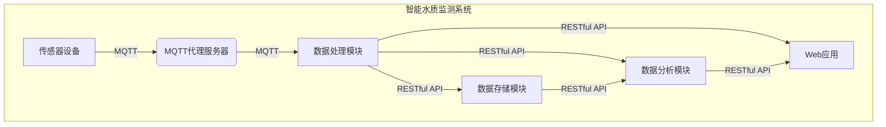
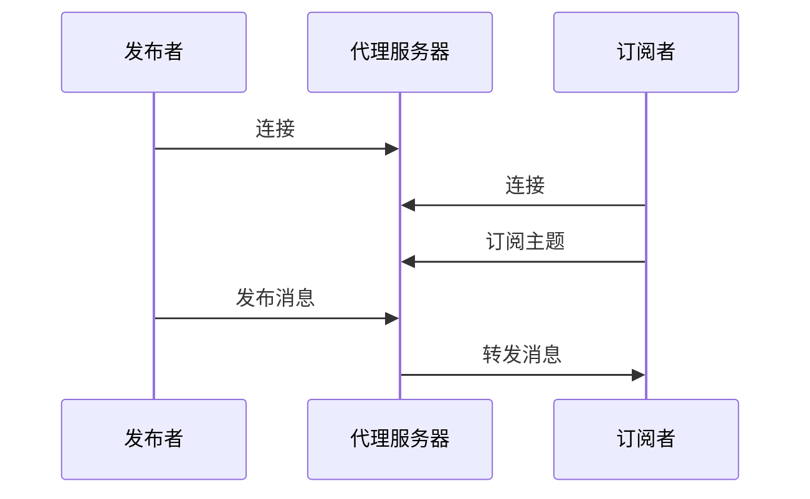
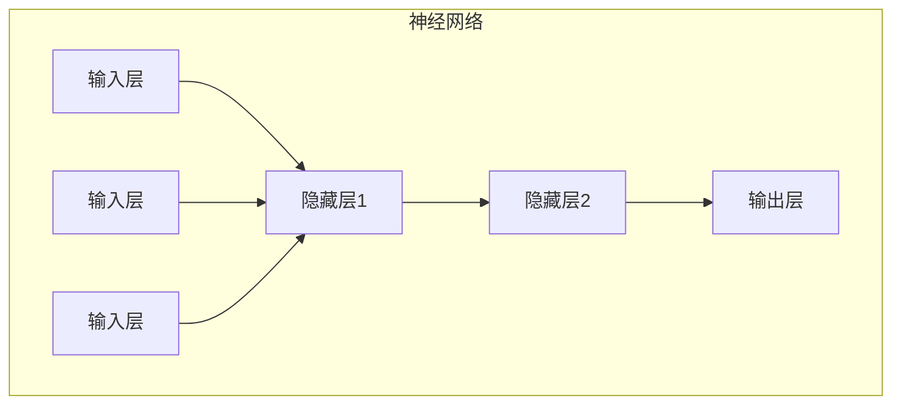

# 基于MQTT协议和RESTful API的智能家居水质监测系统

## 1. 背景介绍

### 1.1 水质监测的重要性

水资源是人类赖以生存的重要资源,良好的水质对于人体健康和环境可持续发展至关重要。然而,由于工业化和城市化进程的加快,水污染问题日益严重,威胁着人类的生存环境。因此,建立高效、实时的水质监测系统,对于保障水资源的安全性和可持续利用具有重大意义。

### 1.2 传统水质监测系统的局限性

传统的水质监测系统主要依赖人工采样和实验室分析,存在诸多不足:

1. 延迟性:采样、运输和分析过程耗时较长,难以实现实时监测。
2. 覆盖范围有限:受制于人力和资金,监测点位有限。
3. 成本高昂:需要大量人力、物力投入。
4. 数据不连续:间歇式采样无法获得连续数据。

### 1.3 智能水质监测系统的需求

为了克服传统监测系统的缺陷,亟需一种智能化、自动化的水质监测系统,能够实现:

1. 实时在线监测,获取连续数据。
2. 远程无人值守,降低人力成本。
3. 覆盖范围广泛,提高监测密度。
4. 数据自动上传和处理,提高效率。

## 2. 核心概念与联系

### 2.1 MQTT协议

MQTT(Message Queuing Telemetry Transport)是一种基于发布/订阅模式的轻量级消息传输协议,专为资源受限的物联网设备而设计。它具有以下特点:

1. 简单轻量:协议开销小,适合低带宽、不可靠网络环境。
2. 发布/订阅模式:允许一对多的异步通信。
3. 三种消息服务质量:最多一次、最少一次、确保一次。

在智能水质监测系统中,MQTT协议用于传感器数据的实时上传和分发。

### 2.2 RESTful API

REST(Representational State Transfer)是一种软件架构风格,RESTful API则是遵循REST原则设计的应用程序接口。它通常基于HTTP协议,具有以下特征:

1. 无状态:客户端和服务器之间的通信无需保持会话状态。
2. 统一接口:使用标准的HTTP方法(GET、POST、PUT、DELETE)操作资源。
3. 面向资源:将数据视为资源,通过URI标识和访问资源。

在智能水质监测系统中,RESTful API用于系统各模块之间的数据交互和管理。

### 2.3 MQTT与RESTful API的关系

MQTT和RESTful API在智能水质监测系统中扮演着互补的角色:

1. MQTT负责传感器数据的实时采集和分发,适合于设备与服务器之间的通信。
2. RESTful API则用于系统内部模块之间的数据交互和管理,提供标准化的接口。

两者的有机结合,构建了一个高效、可扩展的智能水质监测系统。



## 3. 核心算法原理具体操作步骤

### 3.1 MQTT通信流程

MQTT协议基于发布/订阅模式,涉及以下三个主要角色:

1. 发布者(Publisher):发布消息的一方,通常是传感器设备。
2.订阅者(Subscriber):订阅感兴趣主题的一方,通常是数据处理模块。
3.代理服务器(Broker):负责消息路由和分发的中介。

MQTT通信流程如下:

1. 发布者和订阅者分别与代理服务器建立TCP连接。
2. 发布者向代理服务器发布消息,并指定主题(Topic)。
3. 订阅者向代理服务器订阅感兴趣的主题。
4. 代理服务器将发布者发布的消息转发给所有订阅该主题的订阅者。



### 3.2 RESTful API设计原则

设计RESTful API时应遵循以下原则:

1. 面向资源:将数据视为资源,通过URI标识和访问资源。
2. 无状态:客户端和服务器之间的通信无需保持会话状态。
3. 统一接口:使用标准的HTTP方法(GET、POST、PUT、DELETE)操作资源。
4. 分层系统:允许在客户端和服务器之间增加多层,如负载均衡、缓存等。
5. 代码按需:服务器只需提供客户端所需的资源表示。

### 3.3 RESTful API实现步骤

实现RESTful API的典型步骤如下:

1. 识别资源:确定系统中的资源,如传感器数据、分析报告等。
2. 设计资源URI:为每个资源分配唯一的URI,如`/sensors/{id}/data`。
3. 指定资源表示:确定资源的表示格式,如JSON、XML等。
4. 分配HTTP方法:将HTTP方法映射到资源操作,如GET获取数据、POST创建新资源。
5. 实现API逻辑:编写处理HTTP请求和响应的代码逻辑。
6. 测试和部署:对API进行测试,并部署到生产环境。

## 4. 数学模型和公式详细讲解举例说明

在水质监测系统中,常用的数学模型和公式包括:

### 4.1 水质指数模型

水质指数(Water Quality Index, WQI)是一种综合评价水质状况的无量纲指标,通过对多种水质参数进行加权求和计算得到。常用的WQI计算公式为:

$$WQI = \sum_{i=1}^{n} w_i q_i$$

其中:
- $n$为考虑的水质参数个数
- $w_i$为第$i$个参数的权重系数,反映了该参数的重要性
- $q_i$为第$i$个参数的单项水质指数,通过将实测值与标准值对比计算得到

不同的WQI模型对于参数选择和权重分配可能有所不同,但原理类似。

### 4.2 水质参数预测模型

对于某些关键水质参数,如溶解氧、化学需氧量等,可以建立数学模型对其进行预测。常用的模型包括:

1. 多元线性回归模型:

$$y = \beta_0 + \beta_1 x_1 + \beta_2 x_2 + ... + \beta_n x_n + \epsilon$$

其中$y$为预测目标,$(x_1, x_2, ..., x_n)$为自变量,$(\beta_0, \beta_1, ..., \beta_n)$为回归系数,$\epsilon$为随机误差项。

2. 人工神经网络模型:



神经网络通过训练调整网络权重和偏置,从而拟合输入和输出之间的复杂非线性映射关系。

上述模型需要基于历史数据进行训练,获得合理的参数估计,从而对未来水质参数进行预测。

### 4.3 数据插值和平滑

由于水质数据可能存在缺失或噪声,需要进行插值和平滑处理。常用的方法包括:

1. 线性插值:

$$f(x) = f(x_0) + \frac{f(x_1) - f(x_0)}{x_1 - x_0}(x - x_0)$$

其中$x_0$和$x_1$为已知数据点,$f(x_0)$和$f(x_1)$为对应函数值,$x$为待插值点。

2. 移动平均法:

$$\bar{x}_t = \frac{1}{n}\sum_{i=0}^{n-1}x_{t-i}$$

其中$\bar{x}_t$为平滑后的数据点,$x_{t-i}$为原始数据,$n$为平滑窗口大小。

上述方法可以有效补充缺失数据,并消除噪声对数据分析的影响。

## 5. 项目实践:代码实例和详细解释说明

### 5.1 MQTT客户端示例

以下是使用Python的Paho MQTT客户端库实现MQTT发布者和订阅者的示例代码:

```python
# 发布者示例
import paho.mqtt.client as mqtt

# 连接回调函数
def on_connect(client, userdata, flags, rc):
    print("Connected with result code " + str(rc))

# 发布消息
client = mqtt.Client()
client.on_connect = on_connect
client.connect("mqtt.example.com", 1883, 60)
client.publish("sensor/data", payload="23.5", qos=0, retain=False)

# 订阅者示例
def on_message(client, userdata, msg):
    print(f"Received message: {msg.payload.decode()} on topic {msg.topic}")

client = mqtt.Client()
client.on_connect = on_connect
client.on_message = on_message
client.connect("mqtt.example.com", 1883, 60)
client.subscribe("sensor/data")
client.loop_forever()
```

该示例演示了如何建立MQTT连接、发布消息和订阅主题。其中:

- `on_connect`是连接回调函数,用于处理连接结果。
- `on_message`是消息回调函数,用于处理接收到的消息。
- `client.publish`用于发布消息,指定主题和有效载荷。
- `client.subscribe`用于订阅主题。
- `client.loop_forever`使订阅者一直运行,等待接收消息。

### 5.2 RESTful API示例

以下是使用Python的Flask Web框架实现RESTful API的示例代码:

```python
from flask import Flask, jsonify, request

app = Flask(__name__)

# 传感器数据
sensors = [
    {"id": 1, "name": "温度传感器", "data": [25.3, 26.1, 25.8]},
    {"id": 2, "name": "PH传感器", "data": [7.2, 7.1, 7.3]}
]

# 获取所有传感器数据
@app.route('/sensors', methods=['GET'])
def get_sensors():
    return jsonify(sensors)

# 获取单个传感器数据
@app.route('/sensors/<int:sensor_id>', methods=['GET'])
def get_sensor(sensor_id):
    sensor = next((s for s in sensors if s['id'] == sensor_id), None)
    if sensor:
        return jsonify(sensor)
    else:
        return jsonify({"error": "Sensor not found"}), 404

# 添加新的传感器数据
@app.route('/sensors', methods=['POST'])
def add_sensor():
    sensor = request.get_json()
    sensors.append(sensor)
    return jsonify(sensor), 201

if __name__ == '__main__':
    app.run(debug=True)
```

该示例实现了三个RESTful API端点:

- `GET /sensors`获取所有传感器数据。
- `GET /sensors/<id>`获取指定ID的传感器数据。
- `POST /sensors`添加新的传感器数据。

其中:

- `@app.route`装饰器用于定义API路由和HTTP方法。
- `jsonify`函数用于将Python对象转换为JSON格式的响应。
- `request.get_json()`用于获取请求体中的JSON数据。

通过这些API,可以方便地与水质监测系统的数据存储模块进行交互。

## 6. 实际应用场景

智能家居水质监测系统可以应用于以下场景:

### 6.1 家庭用水监测

通过安装水质传感器,可以实时监测家中自来水的水质情况,包括温度、PH值、浑浊度、余氯等指标。一旦发现异常,系统可以及时发出警报,提醒用户采取相应措施,如更换净水器滤芯、检查管道等。

### 6.2 游泳池水质监控

游泳池的水质直接关系到人体健康,需要严格监控。通过部署水质传感器,可以实时监测游泳池水的各项指标,如余氯、PH值、浑浊度等,并根据数据自动