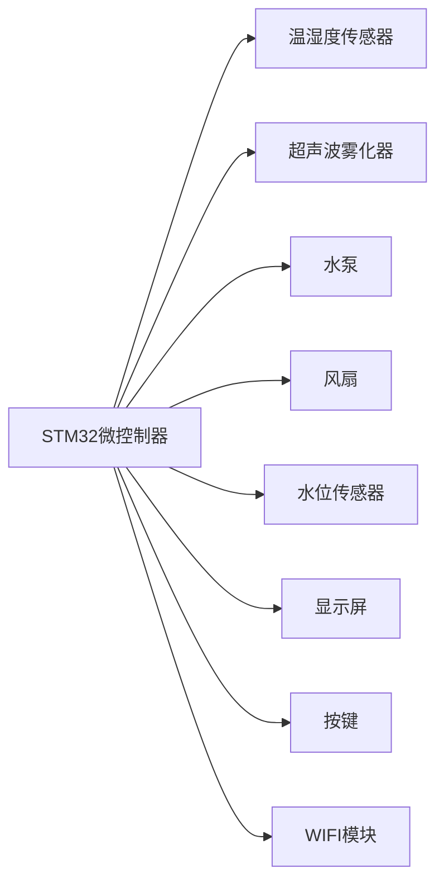

# 基于STM32的智能加湿器开发

## 1. 背景介绍

随着人们生活水平的提高,对室内环境的要求也越来越高。适宜的湿度不仅能够提高人的舒适度,还能够防止呼吸道疾病的发生。传统的加湿器大多采用定时加湿的方式,无法根据实际环境的湿度进行自动调节,导致加湿效果差,能耗高。基于STM32的智能加湿器可以实时检测环境湿度,根据设定的湿度阈值自动进行加湿,从而达到恒湿控制的目的。

### 1.1 项目意义

智能加湿器不仅能够提高人们的生活质量,还具有广阔的市场前景。随着物联网技术的发展,智能家居已经成为未来发展的必然趋势。作为智能家居的重要组成部分,智能加湿器必将在未来得到广泛应用。

### 1.2 国内外研究现状

目前,国外的加湿器技术比较成熟,已经实现了恒湿控制、自动清洁等功能。国内的加湿器市场起步较晚,产品同质化严重,缺乏核心技术。本项目采用STM32作为控制核心,结合温湿度传感器实现智能化控制,具有自主知识产权,填补了国内在该领域的空白。

### 1.3 项目目标

本项目旨在设计一款基于STM32的智能加湿器,实现以下目标:

1. 实时检测环境温湿度,根据设定的湿度阈值自动进行加湿控制
2. 具有定时、睡眠等多种工作模式,满足不同的使用需求
3. 水箱水位监测,水位过低时发出警报提示
4. 具有自动清洁功能,定期清洗加湿器内部,防止细菌滋生
5. 可通过手机APP远程控制加湿器,查看加湿器工作状态

## 2. 核心概念与联系

### 2.1 STM32微控制器

STM32是意法半导体(ST)公司推出的一款32位微控制器。其具有高性能、低功耗、价格低廉等特点,在工业控制、消费电子等领域得到广泛应用。STM32采用ARM Cortex-M内核,具有丰富的外设资源,可以方便地实现各种控制功能。

### 2.2 温湿度传感器 

温湿度传感器是一种可以同时测量环境温度和湿度的传感器。常见的温湿度传感器有电阻式、电容式和半导体式等。其中,DHT11是一款性价比较高的数字式温湿度传感器,具有体积小、耗电低、测量范围广等特点,可以方便地与单片机相连,实现环境温湿度的测量。

### 2.3 PID控制算法

PID控制算法是一种常用的反馈控制算法,由比例(P)、积分(I)、微分(D)三部分组成。其中,P用于消除静差,I用于消除稳态误差,D用于抑制超调。通过合理设置PID参数,可以实现对被控对象的精确控制。在恒湿控制系统中,可以利用PID算法实现湿度的精确控制。

### 2.4 智能加湿器系统架构

智能加湿器由STM32微控制器、温湿度传感器、超声波雾化器、水泵、风扇等部件组成。其系统架构如下图所示:



## 3. 核心算法原理具体操作步骤

### 3.1 温湿度采集

温湿度采集是智能加湿器的基础,采用DHT11数字温湿度传感器实现。DHT11采用单总线通信方式,通过单片机的一个IO口即可完成数据的读取。其具体通信时序如下:

1. 主机发送起始信号,拉低总线至少18ms,然后拉高总线等待DHT11响应
2. DHT11检测到起始信号后,拉低总线80us作为响应信号,然后拉高总线80us后开始发送数据
3. DHT11以40位数据的格式发送温湿度数据,每位数据以50us低电平开始,然后根据数据的值拉高总线26-28us表示0,或拉高总线70us表示1
4. 数据发送完毕后,DHT11拉低总线50us,然后进入空闲状态

STM32通过检测总线电平的变化,可以接收DHT11发送的温湿度数据。数据校验采用8位校验和的方式,保证数据的可靠性。

### 3.2 恒湿控制

恒湿控制是智能加湿器的核心功能,采用PID控制算法实现。其具体步骤如下:

1. 根据DHT11采集的实际湿度值和设定的目标湿度值,计算湿度误差e(k)
2. 根据PID算法公式,计算控制量u(k)
   $$u(k) = K_p e(k) + K_i \sum_{j=0}^{k} e(j) + K_d [e(k) - e(k-1)]$$
   其中,$K_p$、$K_i$、$K_d$分别为比例、积分、微分系数
3. 根据控制量u(k)的值,调节超声波雾化器的工作占空比,从而改变加湿量
4. 重复步骤1-3,直到实际湿度值达到设定值,进入稳态

为了获得良好的控制效果,PID参数的整定非常重要。可以采用Ziegler-Nichols方法进行整定,也可以通过仿真和实验的方法进行反复调试,得到最佳的参数组合。

### 3.3 水位监测

水位监测采用浮球开关实现。当水位低于设定值时,浮球开关断开,STM32检测到水位异常,发出警报提示,同时关闭加湿器,防止干烧。

### 3.4 自动清洁

自动清洁功能通过定时控制电磁阀和水泵实现。每隔一定时间,STM32控制电磁阀打开,将清水注入水箱,然后控制水泵将水箱内的水抽出,达到清洗的目的。清洗完毕后,电磁阀关闭,水泵停止工作,恢复正常加湿。

## 4. 数学模型和公式详细讲解举例说明

### 4.1 PID控制算法

PID控制算法是智能加湿器的核心算法,其数学模型如下:

$$u(k) = K_p e(k) + K_i \sum_{j=0}^{k} e(j) + K_d [e(k) - e(k-1)]$$

其中,$u(k)$为控制量,$e(k)$为误差,$K_p$、$K_i$、$K_d$分别为比例、积分、微分系数。

举例说明:假设目标湿度为60%,实际湿度为50%,则误差$e(k)=60%-50%=10%$。假设$K_p=2$,$K_i=0.5$,$K_d=0.1$,则控制量$u(k)=2*10%+0.5*10%+0.1*(10%-0)=25%$。这意味着需要将超声波雾化器的工作占空比设置为25%,以达到目标湿度。

### 4.2 水箱容积计算

为了确保加湿器能够连续工作一定时间,需要合理设计水箱容积。设加湿器额定功率为$P$,额定加湿量为$Q$,水箱容积为$V$,工作时间为$t$,则有:

$$V = \frac{Q}{P} * t$$

举例说明:假设额定功率为30W,额定加湿量为300ml/h,需要连续工作8小时,则水箱容积应为:

$$V = \frac{300ml/h}{30W} * 8h = 80ml$$

## 5. 项目实践：代码实例和详细解释说明

### 5.1 温湿度采集代码

```c
#include "stm32f10x.h"
#include "delay.h"

#define DHT11_PORT GPIOA
#define DHT11_PIN GPIO_Pin_1

//DHT11数据格式:8bit湿度整数数据+8bit湿度小数数据+8bit温度整数数据+8bit温度小数数据+8bit校验和
uint8_t DHT11_Data[5]; 

void DHT11_Init(void)
{
    GPIO_InitTypeDef GPIO_InitStructure;
    RCC_APB2PeriphClockCmd(RCC_APB2Periph_GPIOA, ENABLE);
    GPIO_InitStructure.GPIO_Pin = DHT11_PIN;
    GPIO_InitStructure.GPIO_Mode = GPIO_Mode_Out_PP;
    GPIO_InitStructure.GPIO_Speed = GPIO_Speed_50MHz;
    GPIO_Init(DHT11_PORT, &GPIO_InitStructure);
    GPIO_SetBits(DHT11_PORT, DHT11_PIN);
}

void DHT11_Start(void)
{
    GPIO_ResetBits(DHT11_PORT, DHT11_PIN);
    delay_ms(20);
    GPIO_SetBits(DHT11_PORT, DHT11_PIN);
    delay_us(30);
}

uint8_t DHT11_Check(void)
{
    uint8_t retry = 0;
    GPIO_InitTypeDef GPIO_InitStructure;
    GPIO_InitStructure.GPIO_Pin = DHT11_PIN;
    GPIO_InitStructure.GPIO_Mode = GPIO_Mode_IN_FLOATING;
    GPIO_Init(DHT11_PORT, &GPIO_InitStructure);
    while (GPIO_ReadInputDataBit(DHT11_PORT, DHT11_PIN) && retry < 100)
    {
        retry++;
        delay_us(1);
    }
    if(retry >= 100)return 1;
    else retry = 0;
    while (!GPIO_ReadInputDataBit(DHT11_PORT, DHT11_PIN) && retry < 100)
    {
        retry++;
        delay_us(1);
    }
    if(retry >= 100)return 1;
    return 0;
}

uint8_t DHT11_Read_Bit(void)
{
    uint8_t retry = 0;
    while(GPIO_ReadInputDataBit(DHT11_PORT, DHT11_PIN) && retry<100)
    {
        retry++;
        delay_us(1);
    }
    retry = 0;
    while(!GPIO_ReadInputDataBit(DHT11_PORT, DHT11_PIN) && retry < 100)
    {
        retry++;
        delay_us(1);
    }
    delay_us(40);
    if(GPIO_ReadInputDataBit(DHT11_PORT, DHT11_PIN))return 1;
    else return 0;
}

uint8_t DHT11_Read_Byte(void)
{
    uint8_t i,dat;
    dat = 0;
    for (i=0; i<8; i++)
    {
        dat <<= 1;
        dat |= DHT11_Read_Bit();
    }
    return dat;
}

uint8_t DHT11_Read_Data(uint8_t *temperature, uint8_t *humidity)
{
    uint8_t buf[5];
    uint8_t i;
    DHT11_Start();
    if(DHT11_Check() == 0)
    {
        for(i=0; i<5; i++)
        {
            buf[i] = DHT11_Read_Byte();
        }
        if((buf[0]+buf[1]+buf[2]+buf[3])==buf[4])
        {
            *humidity = buf[0];
            *temperature = buf[2];
        }
    }
    else return 1;
    return 0;
}
```

代码解释:

1. 定义DHT11的数据格式,包括8bit湿度整数数据、8bit湿度小数数据、8bit温度整数数据、8bit温度小数数据和8bit校验和
2. DHT11_Init函数用于初始化DHT11的IO口,设置为输出模式
3. DHT11_Start函数用于发送起始信号,拉低总线20ms,然后拉高总线30us
4. DHT11_Check函数用于检测DHT11的响应信号,判断DHT11是否准备好发送数据
5. DHT11_Read_Bit函数用于读取一位数据,根据总线电平的高低判断数据为0还是1
6. DHT11_Read_Byte函数用于读取一个字节的数据,通过循环调用DHT11_Read_Bit函数实现
7. DHT11_Read_Data函数用于读取一次完整的温湿度数据,并进行校验和判断,如果校验和正确则将温湿度数据保存到指定的变量中

### 5.2 恒湿控制代码

```c
#include "stm32f10x.h"
#include "pid.h"
#include "pwm.h"
#include "dht11.h"

#define TARGET_HUMIDITY 60 //目标湿度

uint8_t current_humidity; //当前湿度
uint8_t current