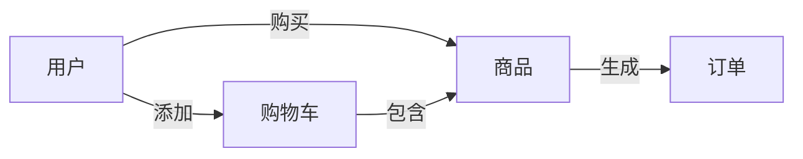
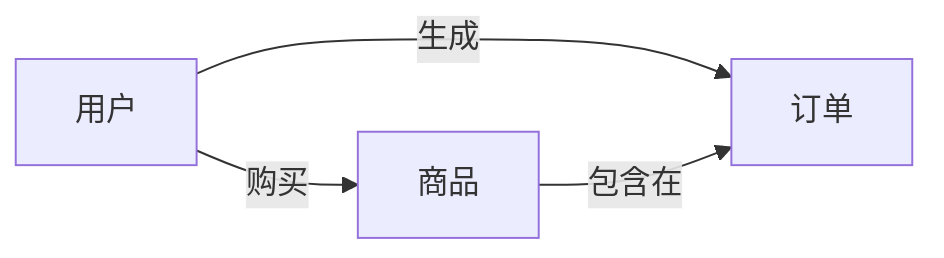

## 1.背景介绍

在现代社会，随着互联网的普及，网络购物已经成为了日常生活中无法或缺的一部分。网络购物系统不仅为消费者提供了方便快捷的购物方式，同时也为商家提供了一个广阔的市场。因此，如何设计并实现一个高效、安全、易用的网络购物系统，是现代软件工程的重要课题。

## 2.核心概念与联系

网络购物系统主要涉及到以下几个核心概念：

- 用户：包括买家和卖家，他们是系统的使用者。
- 商品：是买家购买和卖家出售的对象。
- 订单：是买家购买商品的记录，包含了商品信息、买家信息、卖家信息等。
- 购物车：是买家临时存放商品的地方。

这些核心概念之间的联系可以用以下的Mermaid流程图来表示：



## 3.核心算法原理具体操作步骤

在网络购物系统中，主要涉及到以下几个核心操作：

1. 用户注册与登录：用户需要在系统中注册并登录，才能进行购物操作。
2. 商品浏览与搜索：用户可以浏览系统中的商品，也可以通过搜索功能找到自己需要的商品。
3. 商品购买：用户可以将商品添加到购物车，然后通过购物车进行结算，生成订单。
4. 订单管理：用户可以查看自己的订单，进行支付、取消订单等操作。

这些操作的具体实现需要依赖于后端的数据库操作，包括对用户、商品、订单等数据的增删改查。

## 4.数学模型和公式详细讲解举例说明

在网络购物系统中，我们可以使用ER模型（实体-关系模型）来表示系统中的数据结构。在ER模型中，实体可以用矩形表示，关系可以用菱形表示。

例如，我们可以用以下的ER模型来表示用户、商品和订单的关系：



在这个模型中，用户、商品和订单都是实体，购买和包含在都是关系。

## 5.项目实践：代码实例和详细解释说明

在实际的项目实践中，我们可以使用Spring Boot框架来实现网络购物系统的后端，使用MySQL作为数据库，前端可以使用Vue.js框架。

以下是一个简单的用户注册功能的实现代码：

```java
@RestController
@RequestMapping("/user")
public class UserController {
    @Autowired
    private UserService userService;

    @PostMapping("/register")
    public Result register(@RequestBody User user) {
        userService.register(user);
        return Result.success();
    }
}
```

在这段代码中，我们定义了一个UserController类，这个类负责处理与用户相关的请求。其中，register方法用于处理用户注册的请求，这个方法接收一个User对象作为参数，然后调用UserService的register方法进行注册，最后返回注册成功的结果。

## 6.实际应用场景

网络购物系统广泛应用于各种电商平台，如亚马逊、淘宝、京东等。用户可以在这些平台上浏览和购买商品，商家可以在这些平台上出售商品，平台提供者通过提供平台服务获得收益。

## 7.工具和资源推荐

- 开发工具：IntelliJ IDEA、VS Code
- 框架：Spring Boot、Vue.js
- 数据库：MySQL
- 版本控制：Git

## 8.总结：未来发展趋势与挑战

随着互联网的发展，网络购物系统将面临更大的挑战，如如何提高系统的性能、如何保证系统的安全、如何提高用户的购物体验等。同时，网络购物系统也将有更多的发展机会，如利用AI技术进行商品推荐、利用大数据技术进行用户行为分析等。

## 9.附录：常见问题与解答

1. 问题：如何保证网络购物系统的安全？

答：可以通过以下几种方式来保证系统的安全：使用HTTPS协议进行数据传输，对敏感信息进行加密，对用户输入进行验证，使用安全的编程实践等。

2. 问题：如何提高网络购物系统的性能？

答：可以通过以下几种方式来提高系统的性能：使用高效的编程语言和框架，优化数据库操作，使用缓存，使用负载均衡等。

作者：禅与计算机程序设计艺术 / Zen and the Art of Computer Programming