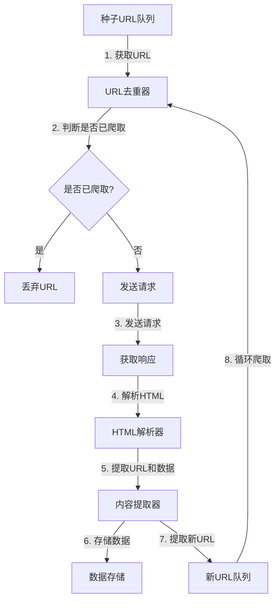

# 基于Python爬虫对大数据岗位的挖掘与分析

## 1. 背景介绍

### 1.1 大数据时代的到来

在当今时代,数据已经成为了一种新的资源和生产力。随着互联网、物联网、云计算等技术的快速发展,海量的数据正以前所未有的速度和规模被产生和积累。这些数据蕴含着巨大的价值,如果能够有效地挖掘和分析这些数据,将为企业带来新的商业机遇和竞争优势。

### 1.2 大数据人才需求旺盛

伴随着大数据时代的到来,对于具备大数据分析能力的人才需求也与日俱增。根据权威机构的统计数据,近年来大数据相关岗位一直位居热门招聘行列。企业对于大数据人才的渴求,推动了高校开设相关专业课程,催生了大量在线教育平台和培训机构,大数据人才培养已成为一股热潮。

### 1.3 本文研究目的

本文旨在通过爬取主流招聘网站的大数据相关岗位信息,对这些岗位的职责要求、技能要求、薪酬水平等进行分析,以期为求职者提供有价值的信息参考,也为企业的人才招聘决策提供依据。同时,本文也将探讨大数据领域的发展趋势和未来挑战,为读者拓展视野。

## 2. 核心概念与联系

### 2.1 Web爬虫概念

Web爬虫(Web Crawler)是一种自动遍历万维网上网页的程序,它可以自动地从互联网上下载网页、图片等数据资源。爬虫通常由以下几个部分组成:

1. **种子URL队列(Seed URLs)**: 初始要爬取的URL地址集合
2. **URL去重器(URL Deduplicator)**: 用于去除重复URL
3. **HTML解析器(HTML Parser)**: 解析HTML页面,提取URL和其他有用信息
4. **内容提取器(Content Extractor)**: 根据特定规则提取所需内容
5. **存储器(Data Storage)**: 存储爬取的数据

### 2.2 Python爬虫生态

Python凭借其简洁高效的特性,已成为Web爬虫开发的主流语言之一。Python爬虫生态非常丰富,拥有众多优秀的第三方库,可以极大地提高爬虫开发效率。

- **Requests**: 发送HTTP请求的库
- **lxml/BeautifulSoup**: HTML/XML解析库
- **Scrapy**: 一个强大的爬虫框架
- **Selenium**: 自动化测试工具,可用于爬取JavaScript渲染的页面
- **PyQuery**: 类jQuery语法的解析库
- **Pandas**: 数据分析处理库

### 2.3 大数据相关概念

大数据(Big Data)指无法在合理时间范围内用常规软件工具进行捕获、管理和处理的数据集合,需要新处理模式才能有更强的决策力、洞见和流程优化能力。大数据主要包括以下几个特征:

- 海量(Volume)
- 多样(Variety)
- 快速(Velocity)
- 价值(Value)

大数据相关岗位包括但不限于:数据分析师、数据工程师、数据架构师、数据科学家等。

## 3. 核心算法原理具体操作步骤 

### 3.1 爬虫工作流程

Python爬虫的基本工作流程如下:



该流程的核心步骤包括:

1. 获取种子URL,并去重
2. 发送HTTP请求,获取响应
3. 解析HTML,提取所需数据和新URL
4. 存储数据,新URL加入种子队列
5. 循环爬取,直至种子队列为空

### 3.2 请求和响应处理

Python的Requests库可以方便地发送HTTP请求并获取响应。以下是一个基本用例:

```python
import requests

url = "https://example.com"
headers = {"User-Agent": "Mozilla/5.0 ..."}
response = requests.get(url, headers=headers)

if response.status_code == 200:
    html = response.text
    # 处理HTML
else:
    print(f"请求失败, 状态码: {response.status_code}")
```

对于JavaScript渲染的页面,可以使用Selenium库模拟浏览器行为:

```python
from selenium import webdriver

driver = webdriver.Chrome()
driver.get(url)
html = driver.page_source
# 处理HTML
driver.quit()
```

### 3.3 HTML解析

Python中常用的HTML解析库有lxml和BeautifulSoup。以BeautifulSoup为例:

```python
from bs4 import BeautifulSoup

html = """
<div>
  <h1>Title</h1>
  <p>Content</p>
</div>
"""
soup = BeautifulSoup(html, "html.parser")

# 获取标签
title = soup.h1.text  # 'Title'
content = soup.p.text  # 'Content'

# 获取属性
link = soup.a["href"]

# 查找标签
divs = soup.find_all("div")
```

### 3.4 数据存储

根据需求,爬取的数据可以存储在不同的位置,如文件、数据库或内存中。以存储为CSV文件为例:

```python
import csv

data = [
    {"name": "Alice", "age": 25},
    {"name": "Bob", "age": 30}
]

with open("data.csv", "w", newline="") as csvfile:
    fieldnames = ["name", "age"]
    writer = csv.DictWriter(csvfile, fieldnames=fieldnames)
    writer.writeheader()
    writer.writerows(data)
```

## 4. 数学模型和公式详细讲解举例说明

在爬虫领域,数学模型和公式的应用主要体现在以下几个方面:

### 4.1 URL规范化

为了避免重复爬取相同页面,需要对URL进行规范化处理。常用的方法是通过正则表达式匹配URL中的参数部分,并按照特定规则对参数进行排序和规范化。

假设原始URL为:

```
https://example.com/path?b=2&a=1&c=3
```

可以使用正则表达式匹配查询参数部分:

$$
pattern = r'(\?|&)([^=&]+)=([^&]*)'
```

然后对参数进行排序和规范化:

```python
import re
from urllib.parse import urlparse, urlunparse, urlencode

def normalize_url(url):
    parsed = urlparse(url)
    query = parsed.query
    matched = re.findall(pattern, '?' + query)
    params = sorted([(k, v) for k, _, v in matched])
    new_query = urlencode(params)
    return urlunparse(parsed._replace(query=new_query))

original_url = "https://example.com/path?b=2&a=1&c=3"
normalized_url = normalize_url(original_url)
print(normalized_url)  # 'https://example.com/path?a=1&b=2&c=3'
```

### 4.2 网页相似度计算

在去重和内容提取过程中,可能需要计算两个网页的相似度。常用的方法包括:

1. **编辑距离(Edit Distance)**: 计算将一个字符串转换为另一个字符串所需的最小编辑操作数。

2. **Jaccard相似系数**: 计算两个集合的交集与并集的比值。

3. **TF-IDF + 余弦相似度**: 将网页表示为TF-IDF向量,计算两个向量的余弦相似度。

以Jaccard相似系数为例,计算两个集合A和B的相似度:

$$
J(A, B) = \frac{|A \cap B|}{|A \cup B|}
$$

Python实现:

```python
def jaccard_sim(A, B):
    intersection = len(set(A) & set(B))
    union = len(set(A) | set(B))
    return intersection / union

A = [1, 2, 3]
B = [2, 3, 4]
sim = jaccard_sim(A, B)
print(sim)  # 0.5
```

### 4.3 网页排名算法

在搜索引擎中,需要对网页进行排名,以便为用户提供最相关的搜索结果。著名的PageRank算法就是一种网页排名算法,它通过网页之间的链接关系计算每个网页的重要性分数。

PageRank算法的核心思想是:一个网页的重要性不仅取决于它被多少其他网页链接,还取决于链接它的网页的重要性。具体计算公式如下:

$$
PR(p_i) = (1 - d) + d \sum_{p_j \in M(p_i)} \frac{PR(p_j)}{L(p_j)}
$$

其中:

- $PR(p_i)$表示网页$p_i$的PageRank值
- $M(p_i)$表示链接到$p_i$的所有网页集合
- $L(p_j)$表示网页$p_j$的出链接数
- $d$是一个阻尼系数,通常取值0.85

该公式可以通过迭代计算得到每个网页的最终PageRank值。

## 5. 项目实践: 代码实例和详细解释说明

### 5.1 项目概述

本项目旨在通过爬取主流招聘网站的大数据相关岗位信息,对这些岗位的职责要求、技能要求、薪酬水平等进行分析,以期为求职者提供有价值的信息参考,也为企业的人才招聘决策提供依据。

项目主要包括以下几个步骤:

1. 确定爬取目标网站
2. 编写爬虫程序
3. 数据清洗和预处理
4. 数据分析和可视化

### 5.2 确定爬取目标网站

本项目选择了以下几个主流招聘网站作为爬取目标:

- 智联招聘(zhaopin.com)
- 前程无忧(51job.com)
- 拉勾网(lagou.com)
- 猎聘网(liepin.com)

这些网站都提供了大数据相关岗位的招聘信息,涵盖了不同城市、不同行业、不同公司规模的岗位需求。

### 5.3 编写爬虫程序

以智联招聘为例,我们使用Scrapy框架编写爬虫程序。首先定义项目结构:

```
zhaopin/
    zhaopin/
        __init__.py
        items.py
        middlewares.py
        pipelines.py
        settings.py
        spiders/
            __init__.py
            zhaopin_spider.py
    scrapy.cfg
```

在`items.py`中定义数据结构:

```python
import scrapy

class ZhaopinItem(scrapy.Item):
    job_name = scrapy.Field()
    company_name = scrapy.Field()
    job_desc = scrapy.Field()
    job_require = scrapy.Field()
    salary = scrapy.Field()
    city = scrapy.Field()
    industry = scrapy.Field()
    # 其他字段...
```

在`zhaopin_spider.py`中编写爬虫逻辑:

```python
import scrapy
from zhaopin.items import ZhaopinItem

class ZhaopinSpider(scrapy.Spider):
    name = "zhaopin"
    allowed_domains = ["zhaopin.com"]
    start_urls = [
        "https://sou.zhaopin.com/jobs/searchresult.ashx?jl=765&kw=大数据&isadv=0"
    ]

    def parse(self, response):
        job_list = response.css("div.newlist_list_content")
        for job in job_list:
            item = ZhaopinItem()
            item["job_name"] = job.css("a::text").get()
            item["company_name"] = job.css("a.company_name::text").get()
            item["job_desc"] = job.css("a::attr(data-promid-track)").get()
            item["job_require"] = job.css("ul.terminal_ul li::text").getall()
            item["salary"] = job.css("span.salary::text").get()
            item["city"] = job.css("span.newlist_span_yl::text").get()
            item["industry"] = job.css("span.newlist_span_yl2::text").get()
            yield item

        next_page = response.css("a.next-page::attr(href)").get()
        if next_page is not None:
            next_page = response.urljoin(next_page)
            yield scrapy.Request(next_page, callback=self.parse)
```

该爬虫程序会从种子URL开始,解析每个职位的详细信息,并自动跟进下一页,直到爬取完所有