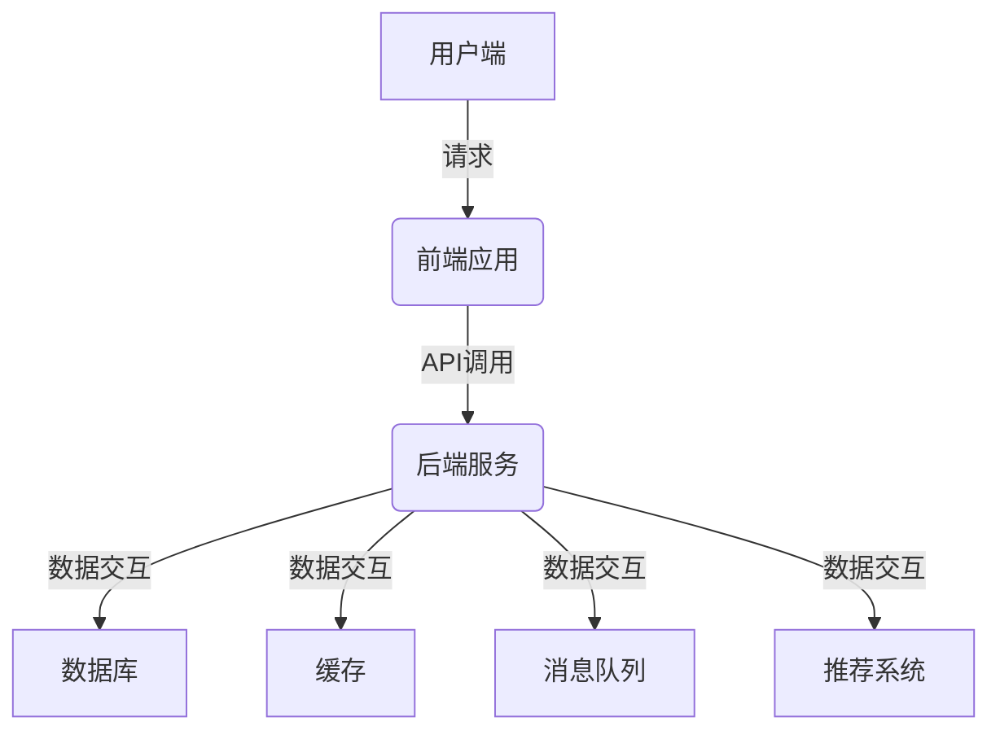

# 基于SpringBoot的多平台在线音乐系统

## 1. 背景介绍

### 1.1 音乐行业的发展趋势

随着互联网技术的不断发展和移动设备的普及,音乐行业正经历着前所未有的变革。传统的音乐消费模式已经无法满足用户的需求,人们更加追求便捷、个性化的音乐服务体验。在线音乐应用程序应运而生,为用户提供了随时随地欣赏音乐的机会。

### 1.2 在线音乐系统的重要性

在线音乐系统不仅为用户提供了丰富的音乐资源,还能够根据用户的喜好推荐个性化的音乐,增强用户体验。同时,它也为音乐创作者提供了一个展示和推广作品的平台,促进了音乐文化的传播和发展。

### 1.3 SpringBoot的优势

SpringBoot是一个基于Spring框架的快速应用程序开发框架,它提供了自动配置、嵌入式服务器等特性,大大简化了应用程序的开发和部署过程。借助SpringBoot,我们可以快速构建高效、可扩展的在线音乐系统。

## 2. 核心概念与联系

### 2.1 系统架构概览

基于SpringBoot的多平台在线音乐系统通常采用前后端分离的架构设计,前端负责用户界面和交互,后端负责数据处理和业务逻辑。系统主要包括以下核心模块:

- 用户模块: 负责用户注册、登录、个人信息管理等功能。
- 音乐模块: 负责音乐资源的上传、管理、搜索、播放等功能。
- 推荐模块: 基于用户行为数据,为用户推荐个性化的音乐内容。
- 社交模块: 提供用户之间的互动功能,如评论、分享、关注等。

### 2.2 关键技术概述

- SpringBoot: 提供了自动配置、嵌入式服务器等特性,加速应用程序的开发和部署。
- Spring MVC: 处理HTTP请求,实现RESTful API。
- Spring Data JPA: 简化数据持久化操作,支持多种数据库。
- Spring Security: 提供身份验证和授权功能,保护系统安全。
- Redis: 高性能的缓存系统,提高系统响应速度。
- RabbitMQ: 可靠的消息队列,实现系统解耦和异步处理。
- Elasticsearch: 分布式搜索引擎,支持音乐资源的全文搜索。
- Docker: 容器化技术,实现应用程序的快速部署和扩展。

## 3. 核心算法原理具体操作步骤  

### 3.1 音乐推荐算法

推荐系统是在线音乐系统的核心功能之一,它通过分析用户的历史行为数据,为用户推荐感兴趣的音乐内容。常见的音乐推荐算法包括:

#### 3.1.1 协同过滤算法

协同过滤算法是基于用户之间的相似性进行推荐的。它包括两种主要方法:

1. **基于用户的协同过滤算法**

该算法通过计算用户之间的相似度,找到与目标用户品味相近的用户群体,然后根据这些相似用户的喜好推荐音乐。相似度计算常用的方法有皮尔逊相关系数、余弦相似度等。

2. **基于项目的协同过滤算法**

该算法通过计算音乐之间的相似度,找到与目标音乐相似的音乐群组,然后根据用户对这些相似音乐的喜好程度进行推荐。相似度计算常用的方法有调整余弦相似度、Jaccard相似度等。

#### 3.1.2 基于内容的推荐算法

基于内容的推荐算法是根据音乐的元数据(如歌手、流派、风格等)和用户的历史偏好,推荐与用户喜好相似的音乐。常见的实现方式包括:

1. **TF-IDF算法**

TF-IDF算法通过计算音乐元数据中每个词项的权重,构建音乐向量。然后根据用户历史喜好计算用户向量,推荐与用户向量相似度高的音乐。

2. **主题模型算法**

主题模型算法(如LDA)通过对音乐元数据进行主题建模,发现音乐的潜在主题分布。然后根据用户历史喜好计算用户的主题分布,推荐与用户主题分布相似的音乐。

#### 3.1.3 混合推荐算法

混合推荐算法是将协同过滤算法和基于内容的算法相结合,综合两种算法的优点,提高推荐的准确性和多样性。常见的混合策略包括:

1. **加权混合**

对协同过滤算法和基于内容的算法分别赋予一定的权重,然后将两种算法的推荐结果加权求和。

2. **串行混合**

先使用基于内容的算法进行初步推荐,然后将推荐结果作为协同过滤算法的输入,进一步优化推荐列表。

3. **并行混合**

分别运行协同过滤算法和基于内容的算法,然后将两种算法的推荐结果进行合并和重新排序。

### 3.2 音乐搜索算法

音乐搜索是在线音乐系统的另一个核心功能,它允许用户根据关键词快速查找感兴趣的音乐。常见的音乐搜索算法包括:

#### 3.2.1 全文搜索算法

全文搜索算法通过建立倒排索引,实现对音乐元数据(如歌名、歌手、专辑等)的快速搜索。常用的全文搜索引擎包括Elasticsearch、Apache Lucene等。

1. **索引建立**

将音乐元数据按照特定的数据结构(如倒排索引)存储在搜索引擎中,方便快速查询。

2. **查询处理**

用户输入查询关键词,搜索引擎根据倒排索引快速找到与关键词相关的音乐文档。

3. **相关性计算**

搜索引擎根据相关性算分函数(如TF-IDF、BM25等)计算每个文档与查询的相关程度,并按照相关性排序返回结果。

#### 3.2.2 语义搜索算法

语义搜索算法通过自然语言处理技术,理解查询语句的语义,从而提高搜索的准确性和相关性。常见的语义搜索算法包括:

1. **词向量模型**

将音乐元数据和查询语句转换为向量表示,计算向量之间的相似度,实现语义级别的搜索。

2. **知识图谱**

构建音乐领域的知识图谱,将音乐实体及其关系形式化表示。根据查询语句在知识图谱中查找相关实体,实现准确的语义搜索。

3. **深度学习模型**

利用深度学习模型(如BERT、GPT等)对查询语句和音乐元数据进行语义编码,计算语义相似度,实现高质量的语义搜索。

## 4. 数学模型和公式详细讲解举例说明

在推荐系统和搜索系统中,常常需要使用数学模型和公式来量化相似度、相关性等指标,从而指导算法的实现。下面将详细介绍一些常用的数学模型和公式。

### 4.1 相似度计算

#### 4.1.1 皮尔逊相关系数

皮尔逊相关系数是衡量两个变量之间线性相关程度的常用指标,在协同过滤算法中常用于计算用户之间的相似度。公式如下:

$$r_{xy} = \frac{\sum_{i=1}^{n}(x_i - \overline{x})(y_i - \overline{y})}{\sqrt{\sum_{i=1}^{n}(x_i - \overline{x})^2}\sqrt{\sum_{i=1}^{n}(y_i - \overline{y})^2}}$$

其中,$ x_i $和$ y_i $分别表示第 i 个数据点的 x 值和 y 值,$ \overline{x} $和$ \overline{y} $分别表示 x 和 y 的均值。皮尔逊相关系数的取值范围为 [-1, 1],值越接近 1 表示两个变量的正相关性越强,值越接近 -1 表示两个变量的负相关性越强。

#### 4.1.2 余弦相似度

余弦相似度是计算两个向量之间夹角余弦值的常用方法,在基于项目的协同过滤算法和基于内容的推荐算法中均有应用。公式如下:

$$\text{sim}(A, B) = \cos(\theta) = \frac{A \cdot B}{\|A\| \|B\|} = \frac{\sum_{i=1}^{n}A_iB_i}{\sqrt{\sum_{i=1}^{n}A_i^2}\sqrt{\sum_{i=1}^{n}B_i^2}}$$

其中,$ A $和$ B $分别表示两个向量,$ \theta $表示它们之间的夹角。余弦相似度的取值范围为 [0, 1],值越接近 1 表示两个向量的方向越接近,即相似度越高。

#### 4.1.3 Jaccard相似度

Jaccard相似度是计算两个集合的交集和并集之比的一种方法,常用于计算项目之间的相似度。公式如下:

$$J(A, B) = \frac{|A \cap B|}{|A \cup B|}$$

其中,$ A $和$ B $分别表示两个集合,$ |A \cap B| $表示两个集合的交集元素个数,$ |A \cup B| $表示两个集合的并集元素个数。Jaccard相似度的取值范围为 [0, 1],值越大表示两个集合的相似度越高。

### 4.2 相关性计算

#### 4.2.1 TF-IDF

TF-IDF (Term Frequency-Inverse Document Frequency) 是一种常用的文本挖掘技术,用于计算词项在文档集合中的重要程度。在音乐搜索中,可以将音乐元数据视为文档,根据 TF-IDF 值计算关键词与音乐的相关性。公式如下:

$$\text{tfidf}(t, d, D) = \text{tf}(t, d) \times \text{idf}(t, D)$$

其中,$ \text{tf}(t, d) $表示词项 t 在文档 d 中出现的频率,$ \text{idf}(t, D) $表示词项 t 在文档集合 D 中的逆文档频率,用于衡量词项的区分能力。

$$\text{tf}(t, d) = \frac{n_{t,d}}{\sum_{t' \in d}n_{t',d}}$$

$$\text{idf}(t, D) = \log\frac{|D|}{|\{d \in D : t \in d\}|}$$

其中,$ n_{t,d} $表示词项 t 在文档 d 中出现的次数,$ |D| $表示文档集合 D 的总文档数,$ |\{d \in D : t \in d\}| $表示包含词项 t 的文档数量。

#### 4.2.2 BM25

BM25 是一种改进的 TF-IDF 算法,常用于文本相关性排序。在音乐搜索中,可以将音乐元数据视为文档,根据 BM25 分数计算音乐与查询的相关性。公式如下:

$$\text{BM25}(d, q) = \sum_{t \in q} \text{IDF}(t) \cdot \frac{f(t, d) \cdot (k_1 + 1)}{f(t, d) + k_1 \cdot (1 - b + b \cdot \frac{|d|}{avgdl})}$$

其中,$ d $表示音乐文档,$ q $表示查询,$ t $表示查询中的词项,$ f(t, d) $表示词项 t 在文档 d 中出现的次数,$ |d| $表示文档 d 的长度,$ avgdl $表示文档集合的平均长度,$ k_1 $和$ b $是调节因子。

$$\text{IDF}(t) = \log\frac{N - n(t) + 0.5}{n(t) + 0.5}$$

其中,$ N $表示文档集合的总文档数,$ n(t) $表示